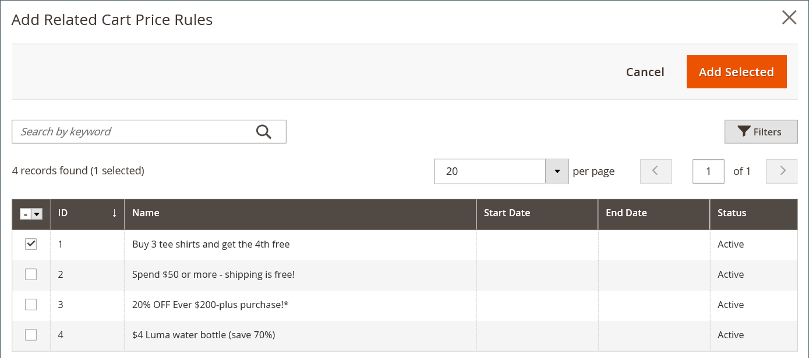
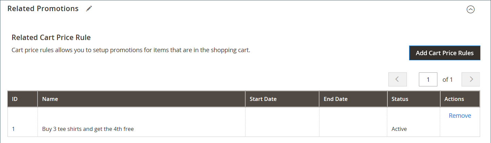
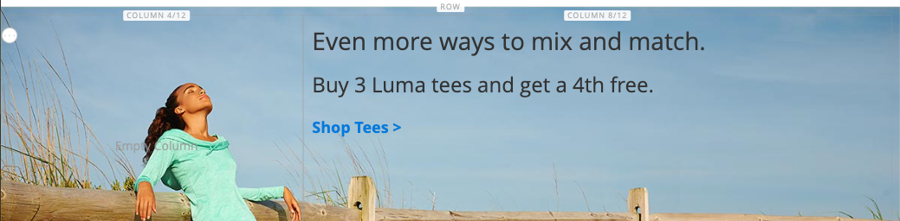

# [!DNL Page Builder]-Anleitung Teil 2: -Blöcke

Die folgende Übung veranschaulicht den Unterschied zwischen [einfachen Blöcken](../content-design/blocks.md) und [dynamischen Blöcken](dynamic-block.md) und die Verwendung von [!DNL Page Builder] zur Erstellung der einzelnen Blocktypen.

>[!NOTE]
>
>[!DNL Page Builder] hat einen neuen Inhaltstyp mit dem Namen _Banner_, der in der ersten exemplarischen Übung verwendet wird und nicht mit der vorherigen Bannerfunktion in Beziehung steht. Was zuvor die Banner-Option im [Inhaltsmenü](../content-design/content-menu.md) war, ist jetzt _Dynamischer Block_.

{width="700" zoomable="yes"}

Bei dieser Übung wird davon ausgegangen, dass Sie [Teil 1: Einfache Seite](1-simple-page.md) einschließlich der Voraussetzungen und [heruntergeladenen Beispieldateien) ](./assets/simple-page-assets.zip) haben. Befolgen Sie die Teile dieser exemplarischen Übung in der richtigen Reihenfolge.

>[!NOTE]
>
>Diese exemplarischen Übungen werden aktualisiert, um die jüngsten Änderungen am [!DNL Page Builder] Workspace in Version 2.4.1 widerzuspiegeln.

## Teil 1: Erstellen eines einfachen Blocks

In dieser exemplarischen Übung erstellen Sie einen einfachen Block mit Inhalten aus [!DNL Google Maps]. Einfache Blöcke werden manchmal als _CMS-_ oder _statische Blöcke_ bezeichnet, da sich der Inhalt nicht ändert. Ein einfacher Block eignet sich ideal für Inhalte, die Sie wiederverwenden möchten.

### Schritt 1: Erstellen eines Blocks

1. Navigieren Sie in _Admin_-Seitenleiste zu **[!UICONTROL Content]** > _[!UICONTROL Elements]_>**[!UICONTROL Blocks]**.

1. Klicken Sie oben rechts auf **[!UICONTROL Add New Block]**.

1. Geben Sie **[!UICONTROL Block Title]** `Google Map` ein.

1. Geben Sie **[!UICONTROL Identifier]** `google-map` ein.

1. Wählen Sie die **[!UICONTROL Store View]** aus, in der der Block verfügbar sein soll.

   {width="600" zoomable="yes"}

1. Klicken Sie oben rechts auf **[!UICONTROL Save]**.

### Schritt 2: [!DNL Google Map] hinzufügen

1. Scrollen Sie nach unten zur [!DNL Page Builder] Inhaltsvorschau (derzeit leer) und klicken Sie auf **[!UICONTROL Edit with Page Builder]**.

1. Erweitern Sie im [!DNL Page Builder] Bedienfeld **[!UICONTROL Media]** und ziehen Sie einen **[!UICONTROL Map]** Platzhalter auf das Bühnenbild.

   {width="600" zoomable="yes"}

   Eine Zuordnung zu Ihrem Store-Standort wird angezeigt, wenn [!DNL Google Maps] für Ihren Store konfiguriert ist.

   {width="600" zoomable="yes"}

   Eine Platzhalterzuordnung wird angezeigt, wenn [!DNL Google Maps] noch nicht für Ihren Store konfiguriert ist.

   ![[!DNL Google Maps] Platzhalter](./assets/pb-tutorial2-media-map-not-configured.png){width="600" zoomable="yes"}

1. Klicken Sie oben rechts im Stadium auf das Symbol _Vollbild schließen_ ().

   Wenn Sie auf dieses Symbol klicken, kehren Sie zum _[!UICONTROL Content]_&#x200B;für den Block mit der angezeigten Vorschau zurück.

1. Klicken Sie oben rechts auf den **[!UICONTROL Save]** und wählen Sie **[!UICONTROL Save & Close]** aus.

### Schritt 3: Konfigurieren von [!DNL Google Maps]

Wenn [!DNL Google Maps] bereits für Ihren Store konfiguriert ist, können Sie diesen Schritt überspringen und mit dem nächsten fortfahren.

1. Wechseln Sie zur [Google Cloud Platform-Konsole](https://console.cloud.google.com/google/maps-apis/overview).

1. Klicken Sie auf die Dropdown-Liste Projekt und wählen oder erstellen Sie das Projekt, für das Sie einen API-Schlüssel hinzufügen möchten.

1. Um Ihre API-Anmeldeinformationen zu konfigurieren, folgen Sie den [Anweisungen][1] in der [!DNL Google Maps].

1. Kopieren Sie Ihren API-Schlüssel in die Zwischenablage.

1. Kehren Sie zum [!DNL Commerce] Admin zurück und gehen Sie zu **[!UICONTROL Stores]** > _[!UICONTROL Settings]_>**[!UICONTROL Configuration]**.

1. Wählen Sie im linken Bedienfeld unter _[!UICONTROL General]_&#x200B;die Option **[!UICONTROL Content Management]**&#x200B;aus.

1. Erweitern Sie  **[!UICONTROL Advanced Content Tools]**.

   {width="600" zoomable="yes"}

   Weitere Informationen zu den [!UICONTROL Content Management Advanced Tools] Konfigurationsoptionen finden Sie im [_Konfigurationshandbuch_](../configuration-reference/general/content-management.md).

1. Fügen Sie **[!UICONTROL Google Maps API Key]** den kopierten Schlüssel ein.

1. Klicken Sie auf **[!UICONTROL Test Key]**.

   Wenn es ein Problem mit Ihrem Schlüssel gibt, kehren Sie zur [!DNL Google Maps] Platform-Site zurück, um das Problem zu beheben. Versuchen Sie es dann erneut.

1. Nachdem der Schlüssel überprüft wurde, klicken Sie auf **[!UICONTROL Save Config]**.

### Schritt 4: Block zu einer Seite hinzufügen

1. Navigieren Sie in _Admin_-Seitenleiste zu **[!UICONTROL Content]** > _[!UICONTROL Elements]_>**[!UICONTROL Pages]**.

1. Suchen Sie im Raster die _[!UICONTROL Simple Page]_, die Sie im ersten Tutorial erstellt haben, und wählen Sie **[!UICONTROL Edit]**&#x200B;in der Spalte&#x200B;_[!UICONTROL Action]_ aus.

1. Erweitern Sie  den Abschnitt **[!UICONTROL Content]** und klicken Sie auf **[!UICONTROL Edit with Page Builder]** oder in den Bereich für die Inhaltsvorschau.

1. Ziehen Sie im [!DNL Page Builder] Bedienfeld unter _[!UICONTROL Layout]_&#x200B;einen **[!UICONTROL Row]**&#x200B;Platzhalter an den Anfang des Stadiums.

   {width="600" zoomable="yes"}

1. Erweitern Sie im [!DNL Page Builder] Bedienfeld **[!UICONTROL Add Content]** und ziehen Sie einen **[!UICONTROL Block]** Platzhalter in die neue Zeile.

1. Bewegen Sie den Mauszeiger über den leeren Blockcontainer, um die Toolbox anzuzeigen, und wählen Sie das Symbol _Einstellungen_ ({width="20"} ) aus.

   {width="600" zoomable="yes"}

1. Klicken Sie auf der Seite Block bearbeiten auf **[!UICONTROL Select Block]**.

   {width="600" zoomable="yes"}

1. Geben Sie im Suchfeld `map` ein und drücken Sie die Eingabetaste, um den erstellten Block zu finden.

   {width="600" zoomable="yes"}

1. Klicken Sie im Raster auf **[!UICONTROL Select]** , um den [!DNL Google Maps] auszuwählen.

1. Klicken Sie oben rechts auf **[!UICONTROL Save]** , um die Einstellungen zu speichern und zum Arbeitsbereich [!DNL Page Builder] zurückzukehren.

1. Klicken Sie oben rechts im Stadium auf das Symbol _Vollbild schließen_ ().

   Wenn Sie auf dieses Symbol klicken, kehren Sie zum _[!UICONTROL Content]_&#x200B;Abschnitt für die Seite mit der angezeigten Vorschau zurück.

1. Klicken Sie oben rechts auf den **[!UICONTROL Save]** und wählen Sie **[!UICONTROL Save & Close]** aus.

**Herzlichen Glückwunsch!** Sie haben den ersten Teil der Blockübung abgeschlossen. Denken Sie daran, Ihre Arbeit als Referenz beizubehalten.

## Teil 2: Dynamischen Block erstellen

Ein dynamischer Block umfasst eine Logik, die bestimmt, wo, wann und für wen er angezeigt wird. In dieser exemplarischen Übung erstellen Sie einen dynamischen Block für eine Promotion, die ausgelöst wird, wenn Preisregelbedingungen erfüllt sind, und die nur für ein bestimmtes Kundensegment angezeigt wird. Das Ergebnis in diesem Beispiel ähnelt dem Banner, das in der ersten Übung erstellt wurde, jedoch mit einer Logik, die steuert, wann es in der Storefront angezeigt wird.

{width="600" zoomable="yes"}

### Schritt 1: Neuen dynamischen Block erstellen

1. Navigieren Sie in _Admin_-Seitenleiste zu **[!UICONTROL Content]** > _[!UICONTROL Elements]_>**[!UICONTROL Dynamic Blocks]**.

   {width="700" zoomable="yes"}

1. Klicken Sie oben rechts auf **[!UICONTROL Add Dynamic Block]**.

   {width="600" zoomable="yes"}

1. Vervollständigen Sie die Grundeinstellungen für den neuen dynamischen Block:

   - Legen Sie **[!UICONTROL Enable Dynamic Block]** auf `Yes` fest.

   - Geben Sie **[!UICONTROL Dynamic Block Name]** `Tee Shirt Promo` ein.

   - Legen Sie **[!UICONTROL Dynamic Block Type]** auf `Content Area` fest und klicken Sie auf **[!UICONTROL Done]**.

     Der dynamische Blocktyp bestimmt, wo im [Seiten-Layout](../content-design/page-layout.md) der Block platziert wird. Berücksichtigen Sie beim Einrichten eines dynamischen Blocks für Ihren Store sowohl das Seitenlayout als auch das [Design](../content-design/themes.md), damit Sie den verfügbaren Platz sinnvoll nutzen können. Einige Stores verfügen über einen aktiven Inhaltsbereich, der auf eine feste Breite beschränkt ist, während andere die gesamte Breite des Bildschirms erweitern.

     {width="600" zoomable="yes"}

   - Aktivieren Sie **[!UICONTROL Customer Segment]** das Kontrollkästchen jedes Segments, das Sie auf den dynamischen Block anwenden möchten, und klicken Sie auf **Fertig**, um die Liste der Segmente zu speichern.

     Im folgenden Beispiel gibt es zwei „Kundensegmente[ die registrierte ](../customers/customer-segments.md) nach Geschlecht identifizieren. Dieser dynamische Block wird nur für registrierte weibliche Kunden angezeigt, die bei ihren Konten angemeldet sind, während sie in Ihrem Geschäft einkaufen.

     {width="600" zoomable="yes"}

### Schritt 2: Abschließen der Einstellungen

Scrollen Sie nach unten zum Abschnitt _[!UICONTROL Content]_, der eine leere Inhaltsvorschau [!DNL Page Builder], und klicken Sie auf **[!UICONTROL Edit with Page Builder]**. Führen Sie dann die folgenden Aufgaben aus:

**Aufgabe 1:** Ein Hintergrundbild hinzufügen

1. Bewegen Sie den Mauszeiger über den Zeilen-Container, um die Toolbox anzuzeigen, und wählen _das Symbol_ Einstellungen{width="20"}) aus.

1. Wählen Sie unter _[!UICONTROL Appearance]_&#x200B;die Option **[!UICONTROL Full Bleed]**&#x200B;aus.

1. Geben Sie **[!UICONTROL Minimum Height]** `400px` ein.

1. Scrollen Sie zum Abschnitt _[!UICONTROL Background]_&#x200B;und legen Sie die **[!UICONTROL Background Image]**&#x200B;fest, indem Sie auf **[!UICONTROL Select from Gallery]**&#x200B;klicken und das im ersten Tutorial hochgeladene `wide-banner-background.png` auswählen.

1. Klicken Sie oben rechts auf **[!UICONTROL Save]** , um die Einstellungen anzuwenden und zum Arbeitsbereich [!DNL Page Builder] zurückzukehren.

   {width="600" zoomable="yes"}

**Aufgabe 2:** Spalten hinzufügen

Ziehen Sie im [!DNL Page Builder] unter _[!UICONTROL Layout]_&#x200B;einen **[!UICONTROL Column]**&#x200B;Platzhalter auf die Zeile.

{width="600" zoomable="yes"}

Die Zeile ist jetzt in zwei Spalten gleicher Breite unterteilt.

**Aufgabe 3:** Text hinzufügen

1. Erweitern Sie im [!DNL Page Builder] Bedienfeld **[!UICONTROL Elements]** und ziehen Sie einen **Text**-Platzhalter in die zweite Spalte.

   {width="600" zoomable="yes"}

1. Geben Sie die folgenden drei Textzeilen in den Editor ein:

   `Even more ways to mix and match.`

   `Buy 3 Luma tees and get a 4th free.`

   `Shop Tees >`

   {width="600" zoomable="yes"}

1. Wählen Sie alle drei Textzeilen aus und legen Sie in der Symbolleiste „Zeilenhöhe **auf `40px`**.

   {width="600" zoomable="yes"}

1. Stellen Sie die **[!UICONTROL Font Size]** für jede Zeile wie folgt ein:

   | Zeile | Schriftgröße |
   |-----| ---------- |
   | Zeile 1: | `28px` |
   | Zeile 2: | `24px` |
   | Zeile 3: | `18px` |

   Da dieser Block an einer beliebigen Stelle auf der Seite platziert werden kann, sollten Sie anstelle der Überschriftenebenen das standardmäßige Absatzformat verwenden. Machen Sie sich außerdem keine Sorgen, dass der Text noch nicht korrekt in der Spalte umgebrochen wird.  

   {width="600" zoomable="yes"}

**Aufgabe 4:** Link hinzufügen

In der ersten Übung haben Sie gelernt, wie Sie mit dem Inhaltstyp [Schaltfläche](buttons.md) einen Link erstellen können. Dieses Beispiel zeigt, wie ein Link von der Editor-Symbolleiste eingefügt wird.

1. Öffnen Sie in einer anderen Browser-Registerkarte die Storefront und navigieren Sie zur Seite, die das Ziel des Links sein soll.

   Sie können die vollqualifizierte URL oder eine relative URL verwenden, bei der der Verweis auf Ihre Store-Domain weggelassen wird.

   Vollständige URL
: `https://mystore.com/women/tops-women/tees-women.html`

   Relative URL
: `../women/tops-women/tees-women.html`

1. Kehren Sie zur Registerkarte [!DNL Page Builder] Workspace und zum Texteditor zurück, wählen Sie den `Shop Tees >` Text in der dritten Zeile aus und wählen Sie **Fett** () in der Editor-Symbolleiste.

1. Während der `Shop Tees >` Text in der dritten Zeile noch ausgewählt ist, wählen Sie **Link einfügen/bearbeiten** () in der Editor-Symbolleiste aus.

   {width="600" zoomable="yes"}

1. Geben Sie **[!UICONTROL URL]** den relativen Link ein, den Sie vorbereitet haben.

1. Legen Sie **[!UICONTROL Target]** auf `None` fest.

   Bei dieser Einstellung wird die Seite im selben Browser-Fenster geöffnet, anstatt eine neue Registerkarte zu öffnen.

1. Geben Sie **[!UICONTROL Title]** `Shop Tees` ein.

   Das Link-Attribut Titel wird von einigen Browsern als QuickInfo verwendet.

1. Um den Link zu speichern und zum [!DNL Page Builder] Workspace zurückzukehren, klicken Sie auf **[!UICONTROL OK]**.

   {width="600" zoomable="yes"}

1. Klicken Sie oben rechts im Stadium auf das Symbol _Vollbild schließen_ ().

   Wenn Sie auf dieses Symbol klicken, kehren Sie zum Abschnitt _[!UICONTROL Content]_&#x200B;für den dynamischen Block mit der angezeigten Vorschau zurück.

1. Klicken Sie oben rechts auf **[!UICONTROL Save]**.

### Schritt 3: Preisregel hinzufügen

1. Öffnen Sie den _T-Shirt Promo_ dynamischen Block im Bearbeitungsmodus erneut.

1. Erweitern Sie  den Abschnitt **[!UICONTROL Related Promotions]** und klicken Sie auf **[!UICONTROL Add Cart Price Rules]**.

   {width="600" zoomable="yes"}

1. Aktivieren _auf der Seite „Zugehörige_ zum Warenkorb hinzufügen“ das Kontrollkästchen für die Preisregel _3 T-Shirts kaufen und erhalten Sie die 4._-Preisregel und klicken Sie auf **[!UICONTROL Add Selected]**.

   {width="600" zoomable="yes"}

   Die Preisregel wird im Abschnitt _Zugehörige Promotions_ unter „Zugehörige _-Preisregel“_. Sie können mehrere Preisregeln mit einem dynamischen Block verknüpfen. In diesem einfachen Beispiel wird jedoch nur ein Beispiel verwendet.

   {width="600" zoomable="yes"}

1. Klicken Sie oben rechts auf **[!UICONTROL Save]**.

### Schritt 4: Dynamischen Block zu einer Seite hinzufügen

1. Navigieren Sie in _Admin_-Seitenleiste zu **[!UICONTROL Content]** > _[!UICONTROL Elements]_>**[!UICONTROL Pages]**

1. Suchen Sie die _Einfache Seite_ die Sie in der [ersten exemplarischen Übung](1-simple-page.md) erstellt haben, und öffnen Sie sie im Bearbeitungsmodus.

1. Erweitern Sie  den Abschnitt **[!UICONTROL Content]** und klicken Sie auf **[!UICONTROL Edit with Page Builder]**.

1. Bewegen Sie den Mauszeiger über die oberste Zeile mit demselben Bild wie der dynamische Block, um die Toolbox und das _Entfernen_-Symbol ({width="20"} anzuzeigen.

   Um das Entfernen der Zeile auf der Seite zu bestätigen, klicken Sie auf **[!UICONTROL OK]** .

1. Ziehen Sie im [!DNL Page Builder] Bedienfeld unter _[!UICONTROL Layout]_&#x200B;einen neuen **[!UICONTROL Row]**&#x200B;Platzhalter an den Anfang des Stadiums.

1. Erweitern Sie im [!DNL Page Builder] Bedienfeld **[!UICONTROL Add Content]** und ziehen Sie einen **[!UICONTROL Dynamic Block]** Platzhalter in die neue Zeile.

   {width="600" zoomable="yes"}

1. Bewegen Sie den Mauszeiger über den Container mit den dynamischen Blöcken, um die Toolbox anzuzeigen, und wählen Sie _Symbol_ Einstellungen{width="20"}) aus.

   {width="600" zoomable="yes"}

1. Klicken Sie auf der _[!UICONTROL Edit Dynamic Block]_&#x200B;Seite auf **[!UICONTROL Select Dynamic Block]**.

   {width="600" zoomable="yes"}

1. Suchen Sie den erstellten dynamischen _[!DNL Tee Shirt Promo]_&#x200B;und klicken Sie auf **[!UICONTROL Select]**.

   Eine Zusammenfassung der Informationen zu dynamischen Blöcken wird unten angezeigt.

   {width="600" zoomable="yes"}

1. Akzeptieren Sie die **[!UICONTROL Template]**, `Dynamic Block Block Template`.

1. Klicken Sie abschließend auf **[!UICONTROL Save]** , um die Einstellungen zu speichern und zum Arbeitsbereich [!DNL Page Builder] zurückzukehren.

   {width="600" zoomable="yes"}

1. Klicken Sie oben rechts im Stadium auf das Symbol _Vollbild schließen_ ().

   Wenn Sie auf dieses Symbol klicken, kehren Sie zum _[!UICONTROL Content]_&#x200B;Abschnitt für die Seite mit der angezeigten Vorschau zurück.

1. Klicken Sie oben rechts auf den **[!UICONTROL Save]** und wählen Sie **[!UICONTROL Save & Close]** aus.

Sie haben den zweiten Teil der Blockübung abgeschlossen. Denken Sie daran, Ihre Arbeit als Referenz beizubehalten.

## Teil 3: Dynamischen Block aktualisieren

In diesem letzten Teil der Übung bearbeiten Sie einen dynamischen Block, während die Seite in Ihrem Store live ist. Melden Sie sich dann beim Store als Mitglied des Kundensegments an, damit der Block angezeigt wird.

{width="600" zoomable="yes"}

### Schritt 1: Dynamischen Block bearbeiten

1. Navigieren Sie in _Admin_-Seitenleiste zu **[!UICONTROL Content]** > _[!UICONTROL Elements]_>**[!UICONTROL Dynamic Blocks]**.

1. Suchen Sie den _[!DNL Tee Shirt Promo]_&#x200B;dynamischen Block im Raster und öffnen Sie ihn im Bearbeitungsmodus.

1. Erweitern Sie  den Abschnitt **[!UICONTROL Content]** und klicken Sie auf **[!UICONTROL Edit with Page Builder]**.

1. Spaltenbreite ändern:

   - Bewegen Sie den Mauszeiger über den Rahmen zwischen den beiden Spalten.

   - Halten Sie die Maustaste gedrückt, und ziehen Sie den Rahmen um zwei Unterteilungen nach links.

     {width="600" zoomable="yes"}

     Die erste Spalte ist nun vier von zwölf (4/12) Rastereinteilungen breit, die zweite Spalte acht von zwölf (8/12) Einteilungen breit.

     {width="600" zoomable="yes"}

1. Textfarbe ändern:

   - Wählen Sie die ersten beiden Textzeilen aus.

   - Wählen Sie in der Editor-Symbolleiste **[!UICONTROL Text Color]** und klicken Sie auf das **[!UICONTROL White]**.

   {width="600" zoomable="yes"}

1. Klicken Sie oben rechts im Stadium auf das Symbol _Vollbild schließen_ ().

   Wenn Sie auf dieses Symbol klicken, kehren Sie zum Abschnitt _[!UICONTROL Content]_&#x200B;für den dynamischen Block mit der angezeigten Vorschau zurück.

1. Klicken Sie oben rechts auf **[!UICONTROL Save]**.

### Schritt 2: Dynamischen Block anzeigen

Da dieser dynamische Block nur für Mitglieder eines bestimmten Kundensegments sichtbar ist, müssen Sie sich als Kunde anmelden, der Mitglied des Kundensegments ist, um die Promotion zu sehen. In diesem Beispiel wird der Block nur weiblichen Kunden angezeigt.

1. Öffnen Sie ein Browser-Fenster zu Ihrer Storefront.

1. Um Ihre Beispielseite anzuzeigen, ändern Sie die URL in der Adressleiste wie folgt:

   mystore.com/sample-page

   Wenn Ihr Store so konfiguriert ist, dass es das HTML-Suffix enthält, schließen Sie das Suffix wie folgt ein:

   mystore.com/sample-page.html

1. Melden Sie sich als Kundin oder Kunde an:

   - Klicken Sie oben rechts auf der Startseite auf **[!UICONTROL Sign In]**.

   - Wenn die Beispiel-Luma-Daten auf Ihrem System installiert sind, verwenden Sie die folgenden Anmeldeinformationen:

     **[!UICONTROL Email]** - `roni_cost@example.com`

     **[!UICONTROL Password]** - `roni_cost3@example.com`

   - Klicken Sie auf **[!UICONTROL Sign In]**.

   - Kehren Sie zur Beispielseite zurück, um den dynamischen Block anzuzeigen, den Sie mit der T-Shirt-Aktion erstellt haben.

   {width="700" zoomable="yes"}

Sie haben die Blockübung abgeschlossen. Denken Sie daran, Ihre Arbeit als Referenz beizubehalten.

Wenn Sie fertig sind, fahren Sie mit [Teil 3: Kataloginhalt](3-catalog-content.md)

[1]: https://developers.google.com/maps/documentation/javascript/get-api-key
