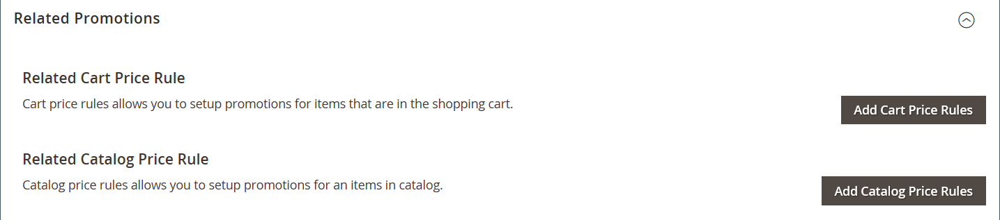

# [!DNL Page Builder] Durchgehender Teil 2: Blöcke

Die folgende Übung zeigt den Unterschied zwischen [einfachen Bausteinen](../content-design/blocks.md) und [dynamischen Bausteinen](dynamic-block.md) und der Verwendung von [!DNL Page Builder] zur Erstellung der einzelnen Bausteine.

>[!NOTE]
>
>[!DNL Page Builder] hat einen neuen Inhaltstyp namens _Banner_, der in der ersten exemplarischen Vorgehensweise vorgestellt wird und nicht mit der vorherigen Bannerfunktion in Zusammenhang steht. Zuvor war die Banneroption im Menü [Inhalt](../content-design/content-menu.md) jetzt _Dynamischer Block_.

{width="700" zoomable="yes"}

Bei dieser Übung wird davon ausgegangen, dass Sie [Teil 1: Einfache Seite](1-simple-page.md) abgeschlossen haben, einschließlich der Voraussetzungen und der [heruntergeladenen Beispieldateien](./assets/simple-page-assets.zip). Befolgen Sie die Teile dieser exemplarischen Vorgehensweise in der richtigen Reihenfolge.

>[!NOTE]
>
>Diese exemplarischen Vorgehensweisen werden aktualisiert, um die jüngsten Änderungen am Arbeitsbereich [!DNL Page Builder] in Version 2.4.1 widerzuspiegeln.

## Teil 1: Erstellen eines einfachen Blocks

In dieser exemplarischen Vorgehensweise erstellen Sie einen einfachen Block mit Inhalt von [!DNL Google Maps]. Einfache Blöcke werden manchmal als _CMS-Blöcke_ oder _statische Blöcke_ bezeichnet, da sich der Inhalt nicht ändert. Ein einfacher Block eignet sich ideal für Inhalte, die Sie wiederverwenden möchten.

### 1. Schritt: Baustein erstellen

1. Wechseln Sie in der Seitenleiste _Admin_ zu **[!UICONTROL Content]** > _[!UICONTROL Elements]_>**[!UICONTROL Blocks]**.

1. Klicken Sie in der oberen rechten Ecke auf **[!UICONTROL Add New Block]**.

1. Geben Sie für **[!UICONTROL Block Title]** den Wert `Google Map` ein.

1. Geben Sie für **[!UICONTROL Identifier]** den Wert `google-map` ein.

1. Wählen Sie die **[!UICONTROL Store View]** aus, wo der Block verfügbar sein soll.

   {width="600" zoomable="yes"}

1. Klicken Sie in der oberen rechten Ecke auf **[!UICONTROL Save]**.

### Schritt 2: Hinzufügen eines [!DNL Google Map]

1. Scrollen Sie nach unten zur Inhaltsvorschau [!DNL Page Builder] (derzeit leer) und klicken Sie auf **[!UICONTROL Edit with Page Builder]**.

1. Erweitern Sie im Bedienfeld [!DNL Page Builder] den Wert **[!UICONTROL Media]** und ziehen Sie einen Platzhalter **[!UICONTROL Map]** auf die Bühne.

   {width="600" zoomable="yes"}

   Eine Zuordnung zu Ihrem Speicherort wird angezeigt, wenn [!DNL Google Maps] für Ihren Store konfiguriert ist.

   {width="600" zoomable="yes"}

   Eine Platzhalterzuordnung wird angezeigt, wenn [!DNL Google Maps] noch nicht für Ihren Store konfiguriert ist.

   ![[!DNL Google Maps] Platzhalter](./assets/pb-tutorial2-media-map-not-configured.png){width="600" zoomable="yes"}

1. Klicken Sie in der oberen rechten Ecke der Bühne auf das Symbol _Vollbild schließen_ ().

   Wenn Sie auf dieses Symbol klicken, gelangen Sie zum Abschnitt &quot;_[!UICONTROL Content]_&quot;für den Block mit der Vorschau.

1. Klicken Sie in der oberen rechten Ecke auf den Pfeil **[!UICONTROL Save]** und wählen Sie **[!UICONTROL Save & Close]**.

### Schritt 3: Konfigurieren Sie [!DNL Google Maps]

Wenn [!DNL Google Maps] bereits für Ihren Store konfiguriert ist, können Sie diesen Schritt überspringen und mit dem nächsten fortfahren.

1. Wechseln Sie zur [Google Cloud Platform Console](https://console.cloud.google.com/google/maps-apis/overview).

1. Klicken Sie auf das Projekt-Dropdown-Menü und wählen oder erstellen Sie das Projekt, für das Sie einen API-Schlüssel hinzufügen möchten.

1. Um Ihre API-Anmeldeinformationen zu konfigurieren, befolgen Sie die [Anweisungen][1] in der [!DNL Google Maps] -Dokumentation.

1. Kopieren Sie Ihren API-Schlüssel in die Zwischenablage.

1. Kehren Sie zum [!DNL Commerce] Admin zurück und gehen Sie zu **[!UICONTROL Stores]** > _[!UICONTROL Settings]_>**[!UICONTROL Configuration]**.

1. Wählen Sie im linken Bereich unter _[!UICONTROL General]_die Option **[!UICONTROL Content Management]**.

1. Erweitern Sie  **[!UICONTROL Advanced Content Tools]**.

   {width="600" zoomable="yes"}

   Weitere Informationen zu den [!UICONTROL Content Management Advanced Tools] -Konfigurationsoptionen finden Sie im [_Konfigurationshandbuch_](../configuration-reference/general/content-management.md).

1. Fügen Sie für **[!UICONTROL Google Maps API Key]** den kopierten Schlüssel ein.

1. Klicken Sie auf **[!UICONTROL Test Key]**.

   Wenn ein Problem mit Ihrem Schlüssel auftritt, kehren Sie zur Platform-Site &quot;[!DNL Google Maps]&quot;zurück, um das Problem zu beheben. Versuchen Sie es dann erneut.

1. Nachdem Ihr Schlüssel verifiziert wurde, klicken Sie auf **[!UICONTROL Save Config]**.

### Schritt 4: Baustein zu einer Seite hinzufügen

1. Wechseln Sie in der Seitenleiste _Admin_ zu **[!UICONTROL Content]** > _[!UICONTROL Elements]_>**[!UICONTROL Pages]**.

1. Suchen Sie im Raster nach dem im ersten Tutorial erstellten _[!UICONTROL Simple Page]_und wählen Sie **[!UICONTROL Edit]**in der Spalte_[!UICONTROL Action]_ aus.

1. Erweitern Sie  im Abschnitt **[!UICONTROL Content]** und klicken Sie auf **[!UICONTROL Edit with Page Builder]** oder innerhalb des Inhaltsvorschaubereichs.

1. Ziehen Sie im Bedienfeld [!DNL Page Builder] unter _[!UICONTROL Layout]_einen Platzhalter **[!UICONTROL Row]**an den Anfang der Bühne.

   {width="600" zoomable="yes"}

1. Erweitern Sie im Bedienfeld [!DNL Page Builder] den Wert **[!UICONTROL Add Content]** und ziehen Sie einen Platzhalter **[!UICONTROL Block]** in die neue Zeile.

1. Bewegen Sie den Mauszeiger über den leeren Block-Container, um die Toolbox anzuzeigen und das Symbol _Einstellungen_ ({width="20"} ) zu wählen.

   {width="600" zoomable="yes"}

1. Klicken Sie auf der Seite Block bearbeiten auf **[!UICONTROL Select Block]**.

   {width="600" zoomable="yes"}

1. Geben Sie im Suchfeld `map` ein und drücken Sie die Eingabetaste, um den von Ihnen erstellten Block zu suchen.

   {width="600" zoomable="yes"}

1. Klicken Sie im Raster auf **[!UICONTROL Select]** , um den Block [!DNL Google Maps] auszuwählen.

1. Klicken Sie oben rechts auf **[!UICONTROL Save]** , um die Einstellungen zu speichern und zum Arbeitsbereich [!DNL Page Builder] zurückzukehren.

1. Klicken Sie in der oberen rechten Ecke der Bühne auf das Symbol _Vollbild schließen_ ().

   Wenn Sie auf dieses Symbol klicken, gelangen Sie zum Abschnitt &quot;_[!UICONTROL Content]_&quot;für die Seite, in der die Vorschau angezeigt wird.

1. Klicken Sie in der oberen rechten Ecke auf den Pfeil **[!UICONTROL Save]** und wählen Sie **[!UICONTROL Save & Close]**.

**Herzlichen Glückwunsch!** Sie haben den ersten Teil der Gruppenübung abgeschlossen. Achten Sie darauf, dass Sie Ihre Arbeit zur Referenz behalten.

## Teil 2: Dynamischen Baustein erstellen

Ein dynamischer Block umfasst eine Logik, die bestimmt, wo, wann und wem er angezeigt wird. In dieser exemplarischen Vorgehensweise erstellen Sie einen dynamischen Block für eine Promotion, der ausgelöst wird, wenn die Bedingungen für Preisregeln erfüllt sind, und der nur einem bestimmten Kundensegment angezeigt wird. Das Ergebnis dieses Beispiels ähnelt dem Banner, das in der ersten Übung erstellt wurde, jedoch mit einer Logik, die steuert, wann es in der Storefront angezeigt wird.

{width="600" zoomable="yes"}

### Schritt 1: Erstellen eines neuen dynamischen Blocks

1. Wechseln Sie in der Seitenleiste _Admin_ zu **[!UICONTROL Content]** > _[!UICONTROL Elements]_>**[!UICONTROL Dynamic Blocks]**.

   {width="700" zoomable="yes"}

1. Klicken Sie in der oberen rechten Ecke auf **[!UICONTROL Add Dynamic Block]**.

   {width="600" zoomable="yes"}

1. Konfigurieren Sie die grundlegenden Einstellungen für den neuen dynamischen Block:

   - Setzen Sie **[!UICONTROL Enable Dynamic Block]** auf `Yes`.

   - Geben Sie für **[!UICONTROL Dynamic Block Name]** den Wert `Tee Shirt Promo` ein.

   - Setzen Sie **[!UICONTROL Dynamic Block Type]** auf `Content Area` und klicken Sie auf **[!UICONTROL Done]**.

     Der dynamische Blocktyp bestimmt, wo der Block im [Seitenlayout](../content-design/page-layout.md) platziert wird. Beim Einrichten eines dynamischen Blocks für Ihren Store sollten Sie sowohl das Seitenlayout als auch das [Design](../content-design/themes.md) berücksichtigen, damit Sie den verfügbaren Platz sinnvoll einsetzen können. Einige Stores haben einen aktiven Inhaltsbereich, der auf eine feste Breite beschränkt ist, während andere die volle Breite des Bildschirms erweitern.

     {width="600" zoomable="yes"}

   - Aktivieren Sie für &quot;**[!UICONTROL Customer Segment]**&quot;das Kontrollkästchen jedes Segments, das Sie auf den dynamischen Block anwenden möchten, und klicken Sie auf &quot;**Fertig**&quot;, um die Segmentliste zu speichern.

     Im folgenden Beispiel gibt es zwei [Kundensegmente](../customers/customer-segments.md), die registrierte Kunden nach Geschlecht identifizieren. Dieser dynamische Block erscheint nur registrierten weiblichen Kunden, die bei ihrem Einkauf in Ihrem Geschäft bei ihren Konten angemeldet sind.

     {width="600" zoomable="yes"}

### Schritt 2: Einstellungen abschließen

Scrollen Sie nach unten zum Abschnitt &quot;_[!UICONTROL Content]_&quot;, in dem eine leere &quot;[!DNL Page Builder]&quot;-Inhaltsvorschau angezeigt wird, und klicken Sie auf &quot;**[!UICONTROL Edit with Page Builder]**&quot;. Führen Sie dann die folgenden Aufgaben aus:

**Aufgabe 1:** Hintergrundbild hinzufügen

1. Bewegen Sie den Mauszeiger über den Zeilencontainer, um die Symbolleiste anzuzeigen und das Symbol _Einstellungen_ ({width="20"} ) zu wählen.

1. Wählen Sie unter &quot;_[!UICONTROL Appearance]_&quot;die Option &quot;**[!UICONTROL Full Bleed]**&quot;.

1. Geben Sie für **[!UICONTROL Minimum Height]** den Wert `400px` ein.

1. Scrollen Sie zum Abschnitt &quot;_[!UICONTROL Background]_&quot;und legen Sie den Wert &quot;**[!UICONTROL Background Image]**&quot;fest, indem Sie auf &quot;**[!UICONTROL Select from Gallery]**&quot;klicken und das im ersten Tutorial hochgeladene Bild &quot;`wide-banner-background.png`&quot;auswählen.

1. Klicken Sie oben rechts auf **[!UICONTROL Save]** , um die Einstellungen anzuwenden und zum Arbeitsbereich [!DNL Page Builder] zurückzukehren.

   {width="600" zoomable="yes"}

**Aufgabe 2:** Spalten hinzufügen

Ziehen Sie im Bedienfeld [!DNL Page Builder] unter _[!UICONTROL Layout]_einen Platzhalter **[!UICONTROL Column]**auf die Zeile.

{width="600" zoomable="yes"}

Die Zeile ist nun in zwei Spalten mit gleicher Breite unterteilt.

**Aufgabe 3:** Text hinzufügen

1. Erweitern Sie im Bedienfeld [!DNL Page Builder] den Eintrag **[!UICONTROL Elements]** und ziehen Sie einen Platzhalter **Text** in die zweite Spalte.

   {width="600" zoomable="yes"}

1. Geben Sie die folgenden drei Textzeilen in den Editor ein:

   `Even more ways to mix and match.`

   `Buy 3 Luma tees and get a 4th free.`

   `Shop Tees >`

   {width="600" zoomable="yes"}

1. Wählen Sie alle drei Textzeilen aus und legen Sie mithilfe der Symbolleiste die **Zeilenhöhe** auf `40px` fest.

   {width="600" zoomable="yes"}

1. Legen Sie für jede Zeile den Wert **[!UICONTROL Font Size]** wie folgt fest:

   | Linie | Schriftgröße |
   |-----| ---------- |
   | Zeile 1: | `28px` |
   | Zeile 2: | `24px` |
   | Zeile 3: | `18px` |

   Da dieser Block an einer beliebigen Stelle auf der Seite platziert werden kann, verwenden Sie anstelle der Überschriftenebenen den standardmäßigen Absatzstil. Beachten Sie außerdem, dass der Text noch nicht korrekt in die Spalte eingeschlossen ist.  

   {width="600" zoomable="yes"}

**Aufgabe 4:** Link hinzufügen

In der ersten Übung haben Sie erfahren, wie Sie mit dem Inhaltstyp [Schaltfläche](buttons.md) einen Link erstellen können. In diesem Beispiel wird gezeigt, wie ein Link aus der Editor-Symbolleiste eingefügt wird.

1. Öffnen Sie auf einer anderen Browser-Registerkarte die Storefront und navigieren Sie zu der Seite, die das Ziel des Links sein soll.

   Sie können die vollständig qualifizierte URL oder eine relative URL verwenden, die den Verweis auf Ihre Store-Domäne weglässt.

   Vollständige URL
: `https://mystore.com/women/tops-women/tees-women.html`

   Relative URL
: `../women/tops-women/tees-women.html`

1. Kehren Sie zur Registerkarte &quot;[!DNL Page Builder] Arbeitsbereich&quot;und zum Texteditor zurück, wählen Sie den Text &quot;`Shop Tees >`&quot;in der dritten Zeile aus und wählen Sie in der Editor-Symbolleiste die Option &quot;**Fett**&quot;().

1. Wählen Sie bei ausgewähltem Text `Shop Tees >` in der dritten Zeile **Link einfügen/bearbeiten** () in der Editor-Symbolleiste.

   {width="600" zoomable="yes"}

1. Geben Sie für &quot;**[!UICONTROL URL]**&quot;den relativen Link ein, den Sie vorbereitet haben.

1. Setzen Sie **[!UICONTROL Target]** auf `None`.

   Mit dieser Einstellung wird die Seite im selben Browserfenster geöffnet, anstatt eine neue Registerkarte zu öffnen.

1. Geben Sie für **[!UICONTROL Title]** den Wert `Shop Tees` ein.

   Das Attribut Titel-Link wird von einigen Browsern als QuickInfo verwendet.

1. Um den Link zu speichern und zum Arbeitsbereich [!DNL Page Builder] zurückzukehren, klicken Sie auf **[!UICONTROL OK]**.

   {width="600" zoomable="yes"}

1. Klicken Sie in der oberen rechten Ecke der Bühne auf das Symbol _Vollbild schließen_ ().

   Wenn Sie auf dieses Symbol klicken, gelangen Sie zum Abschnitt &quot;_[!UICONTROL Content]_&quot; des dynamischen Blocks mit der Vorschau.

1. Klicken Sie in der oberen rechten Ecke auf **[!UICONTROL Save]**.

### Schritt 3: Hinzufügen einer Preisregel

1. Öffnen Sie den dynamischen Block _Tee Shirt Promo_ erneut im Bearbeitungsmodus.

1. Erweitern Sie  im Abschnitt **[!UICONTROL Related Promotions]** und klicken Sie auf **[!UICONTROL Add Cart Price Rules]**.

   {width="600" zoomable="yes"}

1. Aktivieren Sie auf der Seite _Zugehörige Warenkorbpreisregeln hinzufügen_ das Kontrollkästchen für die Shirts vom Typ _Kauf 3 , erhalten Sie die 4. Preisregel von free_ und klicken Sie auf **[!UICONTROL Add Selected]**.

   {width="600" zoomable="yes"}

   Die Preisregel wird im Abschnitt _Zugehörige Promotions_ unter der Regel _Zugehörige Warenkorbpreise_ angezeigt. Sie können mehrere Preisregeln mit einem dynamischen Block verknüpfen. In diesem einfachen Beispiel wird jedoch nur eine verwendet.

   {width="600" zoomable="yes"}

1. Klicken Sie in der oberen rechten Ecke auf **[!UICONTROL Save]**.

### Schritt 4: Dynamischen Baustein zu einer Seite hinzufügen

1. Wechseln Sie in der Seitenleiste _Admin_ zu **[!UICONTROL Content]** > _[!UICONTROL Elements]_>**[!UICONTROL Pages]**

1. Suchen Sie die _einfache Seite_, die Sie in der ersten exemplarischen Vorgehensweise ](1-simple-page.md) erstellt haben, und öffnen Sie sie im Bearbeitungsmodus.[

1. Erweitern Sie  im Abschnitt **[!UICONTROL Content]** und klicken Sie auf **[!UICONTROL Edit with Page Builder]**.

1. Bewegen Sie den Mauszeiger über die oberste Zeile mit demselben Bild wie der dynamische Block, um die Toolbox und das Symbol _Entfernen_ ( {width="20"} ) anzuzeigen.

   Um das Entfernen der Zeile von der Seite zu bestätigen, klicken Sie auf **[!UICONTROL OK]** .

1. Ziehen Sie im Bedienfeld [!DNL Page Builder] unter _[!UICONTROL Layout]_einen neuen **[!UICONTROL Row]**Platzhalter an den Anfang der Bühne.

1. Erweitern Sie im Bedienfeld [!DNL Page Builder] den Wert **[!UICONTROL Add Content]** und ziehen Sie einen Platzhalter **[!UICONTROL Dynamic Block]** in die neue Zeile.

   {width="600" zoomable="yes"}

1. Bewegen Sie den Mauszeiger über den dynamischen Block-Container, um die Toolbox anzuzeigen und das Symbol _Einstellungen_ ( {width="20"} ) zu wählen.

   {width="600" zoomable="yes"}

1. Klicken Sie auf der Seite _[!UICONTROL Edit Dynamic Block]_auf **[!UICONTROL Select Dynamic Block]**.

   {width="600" zoomable="yes"}

1. Suchen Sie den von Ihnen erstellten dynamischen Block _[!DNL Tee Shirt Promo]_und klicken Sie auf **[!UICONTROL Select]**.

   Nachfolgend finden Sie eine Zusammenfassung der dynamischen Blockinformationen.

   {width="600" zoomable="yes"}

1. Nehmen Sie die standardmäßigen **[!UICONTROL Template]**, `Dynamic Block Block Template` an.

1. Klicken Sie nach Abschluss des Vorgangs auf **[!UICONTROL Save]** , um die Einstellungen zu speichern und zum Arbeitsbereich [!DNL Page Builder] zurückzukehren.

   {width="600" zoomable="yes"}

1. Klicken Sie in der oberen rechten Ecke der Bühne auf das Symbol _Vollbild schließen_ ().

   Wenn Sie auf dieses Symbol klicken, gelangen Sie zum Abschnitt &quot;_[!UICONTROL Content]_&quot;für die Seite, in der die Vorschau angezeigt wird.

1. Klicken Sie in der oberen rechten Ecke auf den Pfeil **[!UICONTROL Save]** und wählen Sie **[!UICONTROL Save & Close]**.

Sie haben den zweiten Teil der Gruppenübung abgeschlossen. Achten Sie darauf, dass Sie Ihre Arbeit zur Referenz behalten.

## Teil 3: Dynamischen Baustein aktualisieren

In diesem letzten Teil der Übung bearbeiten Sie einen dynamischen Block, während die Seite in Ihrem Store live ist. Melden Sie sich dann beim Store als Mitglied des Kundensegments an, damit der Block angezeigt wird.

{width="600" zoomable="yes"}

### Schritt 1: Dynamischen Baustein bearbeiten

1. Wechseln Sie in der Seitenleiste _Admin_ zu **[!UICONTROL Content]** > _[!UICONTROL Elements]_>**[!UICONTROL Dynamic Blocks]**.

1. Suchen Sie den dynamischen Block _[!DNL Tee Shirt Promo]_im Raster und öffnen Sie ihn im Bearbeitungsmodus.

1. Erweitern Sie  im Abschnitt **[!UICONTROL Content]** und klicken Sie auf **[!UICONTROL Edit with Page Builder]**.

1. Spaltenbreite ändern:

   - Bewegen Sie den Mauszeiger über den Rahmen zwischen den beiden Spalten.

   - Halten Sie die Maustaste gedrückt und ziehen Sie den Rahmen zwei Trennlinien nach links.

     {width="600" zoomable="yes"}

     Die erste Spalte ist nun vier von 12 (4/12) Rasterabteilungen breit, die zweite Spalte ist acht von 12 (8/12) Divisionen breit.

     {width="600" zoomable="yes"}

1. Textfarbe ändern:

   - Wählen Sie die ersten beiden Textzeilen aus.

   - Wählen Sie in der Editor-Symbolleiste **[!UICONTROL Text Color]** und klicken Sie auf das Muster **[!UICONTROL White]**.

   {width="600" zoomable="yes"}

1. Klicken Sie in der oberen rechten Ecke der Bühne auf das Symbol _Vollbild schließen_ ().

   Wenn Sie auf dieses Symbol klicken, gelangen Sie zum Abschnitt &quot;_[!UICONTROL Content]_&quot; des dynamischen Blocks mit der Vorschau.

1. Klicken Sie in der oberen rechten Ecke auf **[!UICONTROL Save]**.

### Schritt 2: Anzeigen des dynamischen Blocks

Da dieser dynamische Block nur für Mitglieder eines bestimmten Kundensegments sichtbar ist, müssen Sie sich als Kunde anmelden, der Mitglied des Kundensegments ist, um die Promotion zu sehen. In diesem Beispiel erscheint der Block nur weiblichen Kunden.

1. Öffnen Sie ein Browser-Fenster in Ihrer Storefront.

1. Um Ihre Beispielseite anzuzeigen, ändern Sie die URL in der Adressleiste wie folgt:

   mystore.com/sample-page

   Wenn Ihr Store so konfiguriert ist, dass er das HTML-Suffix enthält, schließen Sie das Suffix wie folgt ein:

   mystore.com/sample-page.html

1. Melden Sie sich als weiblicher Kunde an:

   - Klicken Sie in der rechten oberen Ecke Ihrer Startseite auf **[!UICONTROL Sign In]**.

   - Wenn die Luma-Beispieldaten auf Ihrem System installiert sind, verwenden Sie die folgenden Anmeldeinformationen:

     **[!UICONTROL Email]** - `roni_cost@example.com`

     **[!UICONTROL Password]** - `roni_cost3@example.com`

   - Klicken Sie auf **[!UICONTROL Sign In]**.

   - Kehren Sie zur Beispielseite zurück, um den dynamischen Baustein anzuzeigen, den Sie mit der Tee Shirt-Promo erstellt haben.

   {width="700" zoomable="yes"}

Sie haben die Gruppenübung abgeschlossen. Achten Sie darauf, dass Sie Ihre Arbeit zur Referenz behalten.

Wenn Sie bereit sind, fahren Sie mit [Teil 3: Kataloginhalt](3-catalog-content.md) fort.

[1]: https://developers.google.com/maps/documentation/javascript/get-api-key
