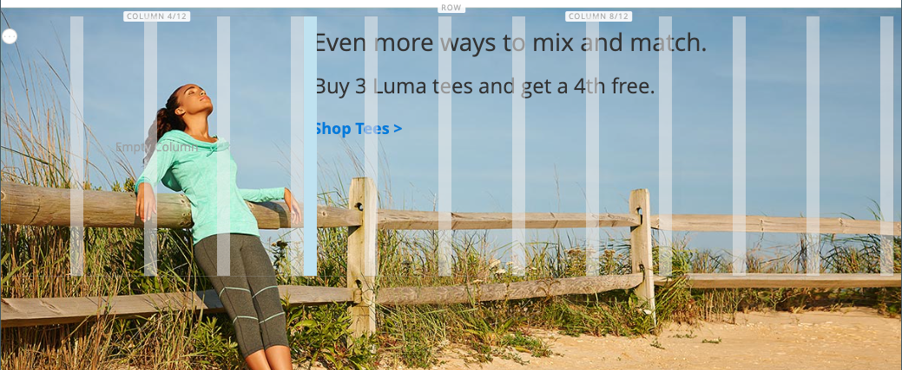

# [!DNL Page Builder] Exemplarische Vorgehensweise: Teil 2: Blöcke

Die folgende Übung zeigt den Unterschied zwischen [einfache Blöcke](../content-design/blocks.md) und [dynamische Blöcke](dynamic-block.md)und Verwendung [!DNL Page Builder] um jeden Block-Typ zu erstellen.

>[!NOTE]
>
>[!DNL Page Builder] hat einen neuen Inhaltstyp namens _Banner_, das in der ersten exemplarischen Vorgehensweise vorgestellt wird und nicht mit der vorherigen Bannerfunktion in Zusammenhang steht. Was war zuvor die Banneroption im [Inhaltsmenü](../content-design/content-menu.md), ist jetzt _Dynamischer Block_.

{width="700" zoomable="yes"}

Bei dieser Übung wird davon ausgegangen, dass Sie [Teil 1: Einfache Seite](1-simple-page.md), einschließlich der Voraussetzungen und [heruntergeladene Beispieldateien](./assets/simple-page-assets.zip). Befolgen Sie die Teile dieser exemplarischen Vorgehensweise in der richtigen Reihenfolge.

>[!NOTE]
>
>Diese exemplarischen Vorgehensweisen werden aktualisiert, um die jüngsten Änderungen an der [!DNL Page Builder] Arbeitsbereich in Version 2.4.1. Wenn Sie eine frühere Adobe Commerce-Version verwenden, verwenden Sie die [!DNL Page Builder] Übungen im [[!DNL Commerce] 2.3 Benutzerhandbuch](https://docs.magento.com/user-guide/v2.3/cms/page-builder-learn.html).

## Teil 1: Erstellen eines einfachen Blocks

In dieser exemplarischen Vorgehensweise erstellen Sie einen einfachen Block mit Inhalt aus [!DNL Google Maps]. Einfache Blöcke werden manchmal als _CMS-Blöcke_ oder _statische Bausteine_, da sich der Inhalt nicht ändert. Ein einfacher Block eignet sich ideal für Inhalte, die Sie wiederverwenden möchten.

### 1. Schritt: Baustein erstellen

1. Im _Admin_ Seitenleiste, navigieren Sie zu **[!UICONTROL Content]** > _[!UICONTROL Elements]_>**[!UICONTROL Blocks]**.

1. Klicken Sie oben rechts auf **[!UICONTROL Add New Block]**.

1. Für **[!UICONTROL Block Title]**, eingeben `Google Map`.

1. Für **[!UICONTROL Identifier]**, eingeben `google-map`.

1. Wählen Sie die **[!UICONTROL Store View]** wo der Block verfügbar sein soll.

   {width="600" zoomable="yes"}

1. Klicken Sie oben rechts auf **[!UICONTROL Save]**.

### Schritt 2: Hinzufügen einer [!DNL Google Map]

1. Scrollen Sie nach unten zum [!DNL Page Builder] Inhaltsvorschau (derzeit leer) und klicken Sie auf **[!UICONTROL Edit with Page Builder]**.

1. Im [!DNL Page Builder] Bedienfeld, erweitern **[!UICONTROL Media]** und ziehen Sie eine **[!UICONTROL Map]** Platzhalter zur Bühne.

   {width="600" zoomable="yes"}

   Eine Zuordnung zu Ihrem Speicherort wird angezeigt, wenn [!DNL Google Maps] für Ihren Store konfiguriert ist.

   {width="600" zoomable="yes"}

   Eine Platzhalterzuordnung wird angezeigt, wenn [!DNL Google Maps] noch nicht für Ihren Store konfiguriert ist.

   ![[!DNL Google Maps] Platzhalter](./assets/pb-tutorial2-media-map-not-configured.png){width="600" zoomable="yes"}

1. Klicken Sie in der rechten oberen Ecke der Bühne auf die _Vollbild schließen_ ().

   Wenn Sie auf dieses Symbol klicken, kehren Sie zum _[!UICONTROL Content]_für den Baustein, in dem die Vorschau angezeigt wird.

1. Klicken Sie oben rechts auf die **[!UICONTROL Save]** Pfeil und Auswahl **[!UICONTROL Save & Close]**.

### Schritt 3: Konfigurieren [!DNL Google Maps]

Wenn [!DNL Google Maps] für Ihren Store bereits konfiguriert ist, können Sie diesen Schritt überspringen und mit dem nächsten fortfahren.

1. Navigieren Sie zu [Google Cloud Platform-Konsole](https://console.cloud.google.com/google/maps-apis/overview).

1. Klicken Sie auf das Projekt-Dropdown-Menü und wählen oder erstellen Sie das Projekt, für das Sie einen API-Schlüssel hinzufügen möchten.

1. Um Ihre API-Anmeldeinformationen zu konfigurieren, folgen Sie dem [instructions][1] im [!DNL Google Maps] Dokumentation.

1. Kopieren Sie Ihren API-Schlüssel in die Zwischenablage.

1. Kehren Sie zu [!DNL Commerce] Admin und gehen Sie zu **[!UICONTROL Stores]** > _[!UICONTROL Settings]_>**[!UICONTROL Configuration]**.

1. Im linken Bereich unter _[!UICONTROL General]_auswählen **[!UICONTROL Content Management]**.

1. Erweitern  **[!UICONTROL Advanced Content Tools]**.

   {width="600" zoomable="yes"}

   Weitere Informationen zum [!UICONTROL Content Management Advanced Tools] Konfigurationsoptionen, siehe [_Konfigurationshandbuch_](../configuration-reference/general/content-management.md).

1. Für **[!UICONTROL Google Maps API Key]**, fügen Sie den kopierten Schlüssel ein.

1. Klicken **[!UICONTROL Test Key]**.

   Wenn ein Problem mit Ihrem Schlüssel vorliegt, kehren Sie zum [!DNL Google Maps] Plattform-Site zur Lösung des Problems. Versuchen Sie es dann erneut.

1. Nachdem Ihr Schlüssel verifiziert wurde, klicken Sie auf **[!UICONTROL Save Config]**.

### Schritt 4: Baustein zu einer Seite hinzufügen

1. Im _Admin_ Seitenleiste, navigieren Sie zu **[!UICONTROL Content]** > _[!UICONTROL Elements]_>**[!UICONTROL Pages]**.

1. Suchen Sie im Raster die _[!UICONTROL Simple Page]_, die Sie im ersten Tutorial erstellt haben, und wählen Sie **[!UICONTROL Edit]**im_[!UICONTROL Action]_ Spalte.

1. Erweitern  die **[!UICONTROL Content]** und klicken Sie auf **[!UICONTROL Edit with Page Builder]** oder innerhalb des Inhaltsvorschaubereichs.

1. Im [!DNL Page Builder] Bereich unter _[!UICONTROL Layout]_, ziehen Sie eine **[!UICONTROL Row]**-Platzhalter an den Anfang der Bühne.

   {width="600" zoomable="yes"}

1. Im [!DNL Page Builder] Bedienfeld, erweitern **[!UICONTROL Add Content]** und ziehen Sie eine **[!UICONTROL Block]** Platzhalter für die neue Zeile.

1. Bewegen Sie den Mauszeiger über den leeren Block-Container, um die Symbolleiste anzuzeigen und die _Einstellungen_ ({width="20"} ).

   {width="600" zoomable="yes"}

1. Klicken Sie auf der Seite Block bearbeiten auf **[!UICONTROL Select Block]**.

   {width="600" zoomable="yes"}

1. Geben Sie in das Suchfeld `map` und drücken Sie die Eingabetaste, um den von Ihnen erstellten Baustein zu finden.

   {width="600" zoomable="yes"}

1. Klicken Sie im Raster auf **[!UICONTROL Select]** zur Auswahl der [!DNL Google Maps] blockieren.

1. Klicken Sie oben rechts auf **[!UICONTROL Save]** , um die Einstellungen zu speichern und zum [!DNL Page Builder] Arbeitsbereich.

1. Klicken Sie in der rechten oberen Ecke der Bühne auf die _Vollbild schließen_ ().

   Wenn Sie auf dieses Symbol klicken, kehren Sie zum _[!UICONTROL Content]_für die Seite, in der die Vorschau angezeigt wird.

1. Klicken Sie oben rechts auf die **[!UICONTROL Save]** Pfeil und Auswahl **[!UICONTROL Save & Close]**.

**Herzlichen Glückwunsch!** Sie haben den ersten Teil der Gruppenübung abgeschlossen. Achten Sie darauf, dass Sie Ihre Arbeit zur Referenz behalten.

## Teil 2: Dynamischen Baustein erstellen

Ein dynamischer Block umfasst eine Logik, die bestimmt, wo, wann und wem er angezeigt wird. In dieser exemplarischen Vorgehensweise erstellen Sie einen dynamischen Block für eine Promotion, der ausgelöst wird, wenn die Bedingungen für Preisregeln erfüllt sind, und der nur einem bestimmten Kundensegment angezeigt wird. Das Ergebnis dieses Beispiels ähnelt dem Banner, das in der ersten Übung erstellt wurde, jedoch mit einer Logik, die steuert, wann es in der Storefront angezeigt wird.

{width="600" zoomable="yes"}

### Schritt 1: Erstellen eines neuen dynamischen Blocks

1. Im _Admin_ Seitenleiste, navigieren Sie zu **[!UICONTROL Content]** > _[!UICONTROL Elements]_>**[!UICONTROL Dynamic Blocks]**.

   {width="700" zoomable="yes"}

1. Klicken Sie oben rechts auf **[!UICONTROL Add Dynamic Block]**.

   {width="600" zoomable="yes"}

1. Konfigurieren Sie die grundlegenden Einstellungen für den neuen dynamischen Block:

   - Satz **[!UICONTROL Enable Dynamic Block]** nach `Yes`.

   - Für **[!UICONTROL Dynamic Block Name]**, eingeben `Tee Shirt Promo`.

   - Satz **[!UICONTROL Dynamic Block Type]** nach `Content Area` und klicken **[!UICONTROL Done]**.

     Der dynamische Blocktyp legt fest, wo im [Seitenlayout](../content-design/page-layout.md) dass der Block platziert ist. Beim Einrichten eines dynamischen Blocks für Ihren Store sollten Sie sowohl das Seitenlayout als auch die [Design](../content-design/themes.md), damit Sie den verfügbaren Platz optimal nutzen können. Einige Stores haben einen aktiven Inhaltsbereich, der auf eine feste Breite beschränkt ist, während andere die volle Breite des Bildschirms erweitern.

     {width="600" zoomable="yes"}

   - Für **[!UICONTROL Customer Segment]** aktivieren Sie die Kontrollkästchen der einzelnen Segmente, die Sie auf den dynamischen Block anwenden möchten, und klicken Sie auf **Fertig** , um die Segmentliste zu speichern.

     Im folgenden Beispiel gibt es zwei [Kundensegmente](../customers/customer-segments.md) die registrierte Kunden nach Geschlecht identifizieren. Dieser dynamische Block erscheint nur registrierten weiblichen Kunden, die bei ihrem Einkauf in Ihrem Geschäft bei ihren Konten angemeldet sind.

     {width="600" zoomable="yes"}

### Schritt 2: Einstellungen abschließen

Scrollen Sie nach unten zum _[!UICONTROL Content]_-Abschnitt, der ein leeres [!DNL Page Builder] Inhaltsvorschau und klicken Sie auf **[!UICONTROL Edit with Page Builder]**. Führen Sie dann die folgenden Aufgaben aus:

**Aufgabe 1:** Hintergrundbild hinzufügen

1. Bewegen Sie den Mauszeiger über den Zeilencontainer, um die Symbolleiste anzuzeigen und die _Einstellungen_ ({width="20"} ).

1. under _[!UICONTROL Appearance]_auswählen **[!UICONTROL Full Bleed]**.

1. Für **[!UICONTROL Minimum Height]**, eingeben `400px`.

1. Scrollen Sie zum _[!UICONTROL Background]_und legen Sie die **[!UICONTROL Background Image]**durch Klicken auf **[!UICONTROL Select from Gallery]**und wählen Sie `wide-banner-background.png` Bild, das im ersten Tutorial hochgeladen wurde.

1. Klicken Sie oben rechts auf **[!UICONTROL Save]** , um die Einstellungen anzuwenden und zum [!DNL Page Builder] Arbeitsbereich.

   {width="600" zoomable="yes"}

**Aufgabe 2:** Spalten hinzufügen

Im [!DNL Page Builder] Bereich unter _[!UICONTROL Layout]_, ziehen Sie eine **[!UICONTROL Column]**Platzhalter in der Zeile.

{width="600" zoomable="yes"}

Die Zeile ist nun in zwei Spalten mit gleicher Breite unterteilt.

**Aufgabe 3:** Text hinzufügen

1. Im [!DNL Page Builder] Bedienfeld, erweitern **[!UICONTROL Elements]** und ziehen Sie eine **Text** Platzhalter zur zweiten Spalte.

   {width="600" zoomable="yes"}

1. Geben Sie die folgenden drei Textzeilen in den Editor ein:

   `Even more ways to mix and match.`

   `Buy 3 Luma tees and get a 4th free.`

   `Shop Tees >`

   {width="600" zoomable="yes"}

1. Wählen Sie alle drei Textzeilen aus und legen Sie über die Symbolleiste **Zeilenhöhe** nach `40px`.

   {width="600" zoomable="yes"}

1. Legen Sie die **[!UICONTROL Font Size]** für jede Zeile wie folgt:

   | Linie | Schriftgröße |
   |-----| ---------- |
   | Zeile 1: | `28px` |
   | Zeile 2: | `24px` |
   | Zeile 3: | `18px` |

   Da dieser Block an einer beliebigen Stelle auf der Seite platziert werden kann, verwenden Sie anstelle der Überschriftenebenen den standardmäßigen Absatzstil. Beachten Sie außerdem, dass der Text noch nicht korrekt in die Spalte eingeschlossen ist.  

   {width="600" zoomable="yes"}

**Aufgabe 4:** Link hinzufügen

In der ersten Übung haben Sie gelernt, wie Sie die [Schaltfläche](buttons.md) Inhaltstyp , um einen Link zu erstellen. In diesem Beispiel wird gezeigt, wie ein Link aus der Editor-Symbolleiste eingefügt wird.

1. Öffnen Sie auf einer anderen Browser-Registerkarte die Storefront und navigieren Sie zu der Seite, die das Ziel des Links sein soll.

   Sie können die vollständig qualifizierte URL oder eine relative URL verwenden, die den Verweis auf Ihre Store-Domäne weglässt.

   Vollständige URL : `https://mystore.com/women/tops-women/tees-women.html`

   Relative URL : `../women/tops-women/tees-women.html`

1. Kehren Sie zu [!DNL Page Builder] Registerkarte &quot;Arbeitsbereich&quot;und Texteditor auswählen `Shop Tees >` Text in der dritten Zeile und wählen Sie **Fett** () in der Editor-Symbolleiste.

1. Mit dem `Shop Tees >` Text in der dritten, noch ausgewählten Zeile, wählen Sie **Link einfügen/bearbeiten** () in der Editor-Symbolleiste.

   {width="600" zoomable="yes"}

1. Für **[!UICONTROL URL]**, geben Sie den von Ihnen vorbereiteten relativen Link ein.

1. Satz **[!UICONTROL Target]** nach `None`.

   Mit dieser Einstellung wird die Seite im selben Browserfenster geöffnet, anstatt eine neue Registerkarte zu öffnen.

1. Für **[!UICONTROL Title]**, eingeben `Shop Tees`.

   Das Attribut Titel-Link wird von einigen Browsern als QuickInfo verwendet.

1. So speichern Sie den Link und kehren zur [!DNL Page Builder] Arbeitsbereich, klicken Sie auf **[!UICONTROL OK]**.

   {width="600" zoomable="yes"}

1. Klicken Sie in der rechten oberen Ecke der Bühne auf die _Vollbild schließen_ ().

   Wenn Sie auf dieses Symbol klicken, kehren Sie zum _[!UICONTROL Content]_für den dynamischen Baustein mit der Vorschau angezeigt.

1. Klicken Sie oben rechts auf **[!UICONTROL Save]**.

### Schritt 3: Hinzufügen einer Preisregel

1. Öffnen Sie die _Tee Shirt Promo_ dynamischer Baustein erneut im Bearbeitungsmodus.

1. Erweitern  die **[!UICONTROL Related Promotions]** und klicken Sie auf **[!UICONTROL Add Cart Price Rules]**.

   {width="600" zoomable="yes"}

1. Im _Hinzufügen verwandter Preisregeln für Warenkorb_ Seite, aktivieren Sie das Kontrollkästchen für die _Kaufen Sie 3 T-Shirts und erhalten Sie die 4. gratis_ Preisregel und Klick **[!UICONTROL Add Selected]**.

   {width="600" zoomable="yes"}

   Die Preisregel wird im _Verwandte Promotions_ Abschnitt _Preisregel für verwandten Warenkorb_. Sie können mehrere Preisregeln mit einem dynamischen Block verknüpfen. In diesem einfachen Beispiel wird jedoch nur eine verwendet.

   {width="600" zoomable="yes"}

1. Klicken Sie oben rechts auf **[!UICONTROL Save]**.

### Schritt 4: Dynamischen Baustein zu einer Seite hinzufügen

1. Im _Admin_ Seitenleiste, navigieren Sie zu **[!UICONTROL Content]** > _[!UICONTROL Elements]_>**[!UICONTROL Pages]**

1. Suchen Sie die _Einfache Seite_ , die Sie in der [Erste exemplarische Vorgehensweise](1-simple-page.md) und öffnen Sie sie im Bearbeitungsmodus.

1. Erweitern  die **[!UICONTROL Content]** und klicken Sie auf **[!UICONTROL Edit with Page Builder]**.

1. Bewegen Sie den Mauszeiger über die oberste Zeile mit demselben Bild wie der dynamische Block, um die Symbolleiste und die _Entfernen_ ( {width="20"} ).

   Um das Entfernen der Zeile von der Seite zu bestätigen, klicken Sie auf  **[!UICONTROL OK]** .

1. Im [!DNL Page Builder] Bereich unter _[!UICONTROL Layout]_, ziehen Sie eine neue **[!UICONTROL Row]**-Platzhalter an den Anfang der Bühne.

1. Im [!DNL Page Builder] Bedienfeld, erweitern **[!UICONTROL Add Content]** und ziehen Sie eine **[!UICONTROL Dynamic Block]** Platzhalter für die neue Zeile.

   {width="600" zoomable="yes"}

1. Bewegen Sie den Mauszeiger über den dynamischen Block-Container, um die Symbolleiste anzuzeigen und die _Einstellungen_ ( {width="20"} ).

   {width="600" zoomable="yes"}

1. Im _[!UICONTROL Edit Dynamic Block]_Seite, klicken **[!UICONTROL Select Dynamic Block]**.

   {width="600" zoomable="yes"}

1. Suchen Sie die _[!DNL Tee Shirt Promo]_dynamischer Block, den Sie erstellt haben, und klicken Sie auf **[!UICONTROL Select]**.

   Nachfolgend finden Sie eine Zusammenfassung der dynamischen Blockinformationen.

   {width="600" zoomable="yes"}

1. Standard akzeptieren **[!UICONTROL Template]**, `Dynamic Block Block Template`.

1. Wenn Sie fertig sind, klicken Sie auf **[!UICONTROL Save]** , um die Einstellungen zu speichern und zum [!DNL Page Builder] Arbeitsbereich.

   {width="600" zoomable="yes"}

1. Klicken Sie in der rechten oberen Ecke der Bühne auf die _Vollbild schließen_ ().

   Wenn Sie auf dieses Symbol klicken, kehren Sie zum _[!UICONTROL Content]_für die Seite, in der die Vorschau angezeigt wird.

1. Klicken Sie oben rechts auf die **[!UICONTROL Save]** Pfeil und Auswahl **[!UICONTROL Save & Close]**.

Sie haben den zweiten Teil der Gruppenübung abgeschlossen. Achten Sie darauf, dass Sie Ihre Arbeit zur Referenz behalten.

## Teil 3: Dynamischen Baustein aktualisieren

In diesem letzten Teil der Übung bearbeiten Sie einen dynamischen Block, während die Seite in Ihrem Store live ist. Melden Sie sich dann beim Store als Mitglied des Kundensegments an, damit der Block angezeigt wird.

{width="600" zoomable="yes"}

### Schritt 1: Dynamischen Baustein bearbeiten

1. Im _Admin_ Seitenleiste, navigieren Sie zu **[!UICONTROL Content]** > _[!UICONTROL Elements]_>**[!UICONTROL Dynamic Blocks]**.

1. Suchen Sie Ihre _[!DNL Tee Shirt Promo]_dynamischer Baustein im Raster und öffnen Sie ihn im Bearbeitungsmodus.

1. Erweitern  die **[!UICONTROL Content]** und klicken Sie auf **[!UICONTROL Edit with Page Builder]**.

1. Spaltenbreite ändern:

   - Bewegen Sie den Mauszeiger über den Rahmen zwischen den beiden Spalten.

   - Halten Sie die Maustaste gedrückt und ziehen Sie den Rahmen zwei Trennlinien nach links.

     {width="600" zoomable="yes"}

     Die erste Spalte ist nun vier von 12 (4/12) Rasterabteilungen breit, die zweite Spalte ist acht von 12 (8/12) Divisionen breit.

     {width="600" zoomable="yes"}

1. Textfarbe ändern:

   - Wählen Sie die ersten beiden Textzeilen aus.

   - Wählen Sie in der Editor-Symbolleiste **[!UICONTROL Text Color]** und klicken Sie auf **[!UICONTROL White]** Muster.

   {width="600" zoomable="yes"}

1. Klicken Sie in der rechten oberen Ecke der Bühne auf die _Vollbild schließen_ ().

   Wenn Sie auf dieses Symbol klicken, kehren Sie zum _[!UICONTROL Content]_für den dynamischen Baustein mit der Vorschau angezeigt.

1. Klicken Sie oben rechts auf **[!UICONTROL Save]**.

### Schritt 2: Anzeigen des dynamischen Blocks

Da dieser dynamische Block nur für Mitglieder eines bestimmten Kundensegments sichtbar ist, müssen Sie sich als Kunde anmelden, der Mitglied des Kundensegments ist, um die Promotion zu sehen. In diesem Beispiel erscheint der Block nur weiblichen Kunden.

1. Öffnen Sie ein Browser-Fenster in Ihrer Storefront.

1. Um Ihre Beispielseite anzuzeigen, ändern Sie die URL in der Adressleiste wie folgt:

   mystore.com/sample-page

   Wenn Ihr Store so konfiguriert ist, dass er das HTML-Suffix enthält, schließen Sie das Suffix wie folgt ein:

   mystore.com/sample-page.html

1. Melden Sie sich als weiblicher Kunde an:

   - Klicken Sie oben rechts auf Ihrer Startseite auf **[!UICONTROL Sign In]**.

   - Wenn die Luma-Beispieldaten auf Ihrem System installiert sind, verwenden Sie die folgenden Anmeldeinformationen:

     **[!UICONTROL Email]** - `roni_cost@example.com`

     **[!UICONTROL Password]** -  `roni_cost3@example.com`

   - Klicken **[!UICONTROL Sign In]**.

   - Kehren Sie zur Beispielseite zurück, um den dynamischen Baustein anzuzeigen, den Sie mit der Tee Shirt-Promo erstellt haben.

   {width="700" zoomable="yes"}

Sie haben die Gruppenübung abgeschlossen. Achten Sie darauf, dass Sie Ihre Arbeit zur Referenz behalten.

Wenn Sie bereit sind, fahren Sie mit [Teil 3: Kataloginhalt](3-catalog-content.md)

[1]: https://developers.google.com/maps/documentation/javascript/get-api-key
