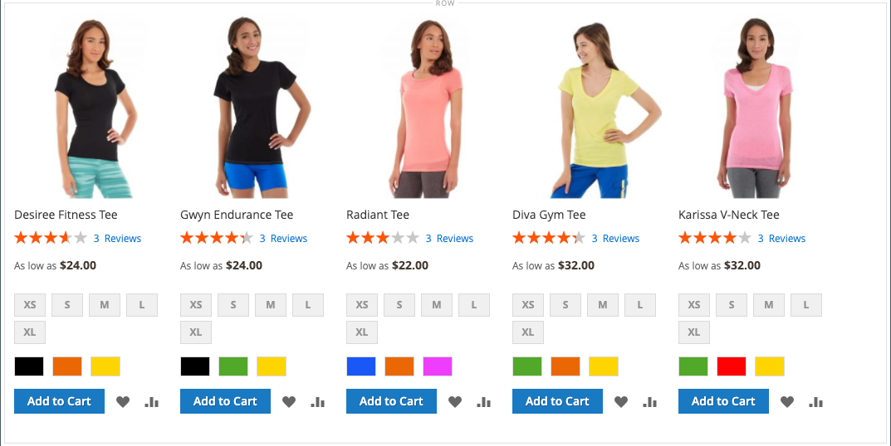

# [!DNL Page Builder] Anleitung Teil 3: Kataloginhalt

In dieser Übung wird gezeigt, wie einfach es ist, einer Seite eine Produktliste hinzuzufügen, Produktseiten anzupassen und ein benutzerdefiniertes Attribut zu erstellen, das den [!DNL Page Builder] Arbeitsbereich zu einem Produktattributsatz hinzufügt.

{width="600" zoomable="yes"}

Bei dieser Übung wird davon ausgegangen, dass Sie [Teil 1: Einfache Seite](1-simple-page.md) und [Teil 2: ](2-blocks.md)), einschließlich der Voraussetzungen und heruntergeladener Beispieldateien, abgeschlossen haben. Folgen Sie den drei Teilen dieser Übung in der richtigen Reihenfolge.

## Teil 1: Hinzufügen einer Produktliste

[!DNL Page Builder] erleichtert das Hinzufügen einer Produktliste zur Staging-Umgebung. In diesem Beispiel wird die Produktliste direkt zu einer Seite hinzugefügt.

### Schritt 1: Hinzufügen einer Produktliste zum Schritt

1. Navigieren Sie in _Admin_-Seitenleiste zu **[!UICONTROL Content]** > _[!UICONTROL Elements]_>**[!UICONTROL Pages]**.

1. Suchen Sie die _Einfache Seite_ die Sie in der ersten Übung erstellt und in der zweiten geändert haben, und wählen Sie **[!UICONTROL Edit]** in der Spalte _[!UICONTROL Action]_aus.

1. Erweitern Sie  den Abschnitt **[!UICONTROL Content]** und klicken Sie auf **[!UICONTROL Edit with Page Builder]** oder in den Bereich für die Inhaltsvorschau.

1. Ziehen Sie im [!DNL Page Builder] Bedienfeld unter _[!UICONTROL Layout]_eine **[!UICONTROL Row]**an den Anfang der Bühne.

1. Erweitern Sie im [!DNL Page Builder] Bedienfeld **[!UICONTROL Add Content]** und ziehen Sie einen **[!UICONTROL Products]** Platzhalter in die neue Zeile.

   {width="600" zoomable="yes"}

### Schritt 2: Bedingung erstellen

1. Bewegen Sie den Mauszeiger über den leeren Produkt-Container, um die Toolbox anzuzeigen, und wählen Sie _Symbol_ Einstellungen{width="20"}) aus.

   {width="600" zoomable="yes"}

1. Wählen Sie **[!UICONTROL Select Products By]** &quot;`Condition`&quot;.

1. Bedingung hinzufügen:

   - Klicken Sie auf _Symbol_ Hinzufügen).

   - Wählen Sie unter _[!UICONTROL Product Attribute]_die Option **[!UICONTROL Category]**aus.

     {width="600" zoomable="yes"}

   - Schließen Sie den _[!UICONTROL Category is]…_ Teil der Bedingung ab, indem Sie auf das Symbol Mehr (…) und dann auf das Symbol _Auswahl_ () klicken.

     {width="600" zoomable="yes"}

   - Gehen Sie in der Kategoriestruktur zur Kategorie **Damen >**&quot; und aktivieren Sie das Kontrollkästchen **T-**.

     {width="600" zoomable="yes"}

   - Klicken Sie auf das Häkchen .

     Die entsprechende Kategorie-ID wird im Feld angezeigt, um die Bedingung abzuschließen.

### Schritt 3: Abschließen der Einstellungen

1. Geben Sie die **[!UICONTROL Number of Products to Display]** ein.

   Standardmäßig werden in der Liste fünf Produkte angezeigt.

1. Füllen Sie die restlichen Einstellungen nach Bedarf aus.

   Verwenden Sie bei Bedarf die Feldbeschreibungen am Ende der Seite [Inhalt hinzufügen - Produkte](products.md) als Referenz.

1. Klicken Sie abschließend auf **[!UICONTROL Save]** , um die Einstellungen zu speichern und zum Arbeitsbereich [!DNL Page Builder] zurückzukehren.

   {width="600" zoomable="yes"}

1. Klicken Sie oben rechts im Stadium auf das Symbol _Vollbild schließen_ ( {width="20"} ).

   Wenn Sie auf dieses Symbol klicken, kehren Sie zum _[!UICONTROL Content]_Abschnitt für die Seite mit der angezeigten Vorschau zurück.

1. Klicken Sie oben rechts auf den **[!UICONTROL Save]** und wählen Sie **[!UICONTROL Save & Close]** aus.

## Teil 2: Anpassen der Produktseite

>[!NOTE]
>
>Ein Administrator bzw. eine Administratorin muss über [!UICONTROL Content] Berechtigungen für den [Rollenbereich](../systems/permissions-user-roles.md) verfügen, um [!UICONTROL Edit with Page Builder] Schaltflächen sehen und Page Builder verwenden zu können.

In diesem Teil der Übung erfahren Sie, wie einfach es ist, eine Produktseite anzupassen, indem Sie ein Video unter den Registerkarten auf der Produktseite platzieren. Der Prozess zum Aktualisieren [ Inhalts ](../catalog/categories-content-settings.md) Kategorieseite ist im Wesentlichen identisch.

1. Navigieren Sie in der _Admin_-Seitenleiste zu **[!UICONTROL Catalog]** > **[!UICONTROL Products]**.

1. Suchen Sie ein einfaches Produkt, das Sie für dieses Beispiel verwenden können, und öffnen Sie es im Bearbeitungsmodus.

1. Scrollen Sie nach unten und erweitern Sie  den Abschnitt **[!UICONTROL Content]** .

1. Klicken Sie neben _[!UICONTROL Description]_auf **[!UICONTROL Edit with Page Builder]**.

   {width="600" zoomable="yes"}

   Wenn die Produktbeschreibung zuvor ohne [!DNL Page Builder] eingegeben wurde, wird die aktuelle Beschreibung als HTML in einem [HTML-Code](html-code.md)-Container angezeigt. Beim Luma-Design wird die Produktbeschreibung auf der Registerkarte Detail angezeigt.

1. Ziehen Sie im [!DNL Page Builder] unter _[!UICONTROL Layout]_einen **[!UICONTROL Row]**auf den Schritt und legen Sie ihn unter dem HTML-Code-Container ab.

   Suchen Sie nach der roten Richtlinie, die angezeigt wird, wenn sich die Zeile an der richtigen Position befindet.

   {width="600" zoomable="yes"}

1. Erweitern Sie im [!DNL Page Builder] Bedienfeld **[!UICONTROL Media]** und ziehen Sie einen **[!UICONTROL Video]** Platzhalter in die neue Zeile.

   {width="600" zoomable="yes"}

1. Bewegen Sie den Mauszeiger über den leeren Video-Container, um die Toolbox anzuzeigen, und wählen _das Symbol_ Einstellungen{width="20"}) aus.

   {width="500" zoomable="yes"}

1. Geben Sie die **[!UICONTROL Video URL]** ein.

   Das Video kann entweder auf [YouTube oder ][1]Vimeo[ gehostet ][2]. Das Video zu diesem Beispiel finden Sie auf YouTube unter folgender URL:

   `https://www.youtube.com/watch?v=ZpFrNyD4100`

   {width="500" zoomable="yes"}

1. Geben Sie die **[!UICONTROL Maximum Width]** in Pixeln für die Videoanzeige ein.

   Wenn Sie diese Option leer lassen, füllt das Video den verfügbaren Platz aus.

1. Klicken Sie auf **[!UICONTROL Save]** , um die Einstellungen zu speichern und zum Arbeitsbereich [!DNL Page Builder] zurückzukehren.

   {width="600" zoomable="yes"}

1. Klicken Sie oben rechts im Stadium auf das Symbol _Vollbild schließen_ ( {width="20"} ).

   Wenn Sie auf dieses Symbol klicken, kehren Sie zum _[!UICONTROL Content]_Abschnitt für die Seite mit der angezeigten Vorschau zurück.

1. Klicken Sie oben rechts auf den **[!UICONTROL Save]** und wählen Sie **[!UICONTROL Save & Close]** aus.

In der Storefront wird das Video unter den Registerkarten angezeigt. Um zu sehen, wie die Seite auf einem Mobilgerät aussieht, können Sie die Größe des Fensters ändern.

{width="600" zoomable="yes"}

**Herzlichen Glückwunsch!** Sie haben den zweiten Teil des Kataloginhalt-Tutorials abgeschlossen. Behalten Sie das von Ihnen erstellte Werk bei, damit Sie später darauf verweisen können.

## Teil 3: Hinzufügen benutzerdefinierter Attribute

Verwenden Sie das benutzerdefinierte Attribut [!DNL Page Builder] , um einer Produktseite einen voll funktionsfähigen [!DNL Page Builder]-Arbeitsbereich hinzuzufügen, mit dem Sie ansprechende Inhalte erstellen können. In diesem Teil der Übung erfahren Sie, wie Sie ein benutzerdefiniertes Attribut mithilfe des [!DNL Page Builder] Eingabetyps erstellen und es auf Produktseiten in Ihrem Katalog anwenden. Weitere Informationen zu diesen Attributen finden Sie unter [Produktattribute](../catalog/product-attributes.md).

### Schritt 1: Erstellen eines Produkts

Um Änderungen an Ihrem Live Store zu vermeiden, erstellen Sie ein Produkt mit den beschriebenen Eigenschaften.

1. Navigieren Sie in der _Admin_-Seitenleiste zu **[!UICONTROL Catalog]** > **[!UICONTROL Products]**.

1. Klicken Sie oben rechts auf **[!UICONTROL Add Product]**.

1. Erstellen Sie das Produkt mit den folgenden Eigenschaften:

   - 
     [!UICONTROL Attributsatz]: Default
   - [!UICONTROL Product Name]: Mein Produkt
   - 
     [!UICONTROL SKU]: Tutorial
   - 
     [!UICONTROL Price]: 75.00
   - 
     [!UICONTROL Quantity]: 100
   - [!UICONTROL Stock Status]: Auf Lager
   - 
     [!UICONTROL Weight]: 1
   - [!UICONTROL Categories]: Damen > Tops > T-Shirts

1. Klicken Sie oben rechts auf den **[!UICONTROL Save]** und wählen Sie **[!UICONTROL Save & Close]** aus.

### Schritt 2: Benutzerdefinierte Attribute erstellen

In diesem Schritt erstellen Sie zwei neue benutzerdefinierte Attribute, um zu zeigen, wie die Eingabetypen &quot;[!DNL Page Builder]&quot; und „Texteditor“ verwendet werden können.

1. Navigieren Sie in _Admin_-Seitenleiste zu **[!UICONTROL Stores]** > _[!UICONTROL Attributes]_>**[!UICONTROL Product]**.

1. Klicken Sie oben rechts auf **[!UICONTROL Add New Attribute]**.

1. Geben Sie einen **[!UICONTROL Default Label]** für das Attribut ein.

   Verwenden Sie für dieses Beispiel `My Page Builder Attribute` für die Bezeichnung .

1. Legen Sie **[!UICONTROL Catalog Input Type for Store Owner]** auf `Page Builder` fest.

   Beim Erstellen eines benutzerdefinierten Attributs können Sie den Editor, der für das Programm am besten geeignet ist, entweder als `Page Builder` oder als standardmäßige WYSIWYG-`Text Editor` angeben.

   ![[!DNL Page Builder] Eingabetyp](./assets/pb-attribute-page-builder.png){width="600" zoomable="yes"}

1. Erweitern Sie  den Abschnitt **[!UICONTROL Advanced Attribute Properties]** und nehmen Sie die folgenden Einstellungen vor:

   - [!UICONTROL Attribute Code]: Geben Sie einen Attributcode in Kleinbuchstaben ein, indem Sie Bindestriche anstelle von Leerzeichen verwenden. Verwenden Sie für dieses Beispiel `my_page_builder_attribute`.
   - [!UICONTROL Scope]: Akzeptieren Sie den Standardwert `Store View`.
   - [!UICONTROL Default Value]: Geben Sie einen Standardwert für das Attribut ein.
   - 
     [!UICONTROL Unique Value]: `No`
   - 
     [!UICONTROL Add to Column Options]: `No`
   - 
     [!UICONTROL Use in Filter Options]: `Yes`

1. Wählen Sie im Bedienfeld _[!UICONTROL Attribute Information]_auf der linken Seite **[!UICONTROL Storefront Properties]**und nehmen Sie die folgenden Einstellungen vor:

   - 
     [!UICONTROL Use for Promo Rule Conditions]: `Yes`
   - 
     [!UICONTROL Visible on Catalog Pages on Storefront]: `Yes`
   - 
     [!UICONTROL Used in Product Listing]: `Yes`

1. Klicken Sie abschließend auf **[!UICONTROL Save Attribute]**.

1. Wiederholen Sie die vorherigen Schritte, um ein zweites Attribut mit denselben grundlegenden Eigenschaften, aber mit dem Eingabetyp Texteditor wie folgt zu erstellen:

   - [!UICONTROL Default Label]: Mein Texteditor-Attribut
   - [!UICONTROL Catalog Input Type for Store Owner]: Texteditor
   - 
     [!UICONTROL Attributcode]: `my_text_editor_attribute`

### Schritt 3: Aktualisieren des Produktattributsatzes

1. Navigieren Sie in _Admin_-Seitenleiste zu **[!UICONTROL Stores]** > _[!UICONTROL Attributes]_>**[!UICONTROL Attribute Set]**.

   In diesem Beispiel fügen Sie die neuen Attribute vorübergehend zum `default` Attributsatz hinzu. Entfernen Sie am Ende dieser Übung die Attribute aus dem Attributsatz, sodass sich dies nicht auf Ihren Katalog auswirkt.

   >[!NOTE]
   >
   >Wenn Sie Ihren Live Store nicht ändern möchten, können Sie dem folgen, ohne das eingestellte Attribut zu aktualisieren.

1. Suchen Sie das in der Liste festgelegte _[!UICONTROL Default]_Attribut und doppelklicken Sie darauf, um es im Bearbeitungsmodus zu öffnen.

1. Suchen Sie in _Liste „Nicht_ Attribute“ die neu erstellten Attribute und ziehen Sie die einzelnen Attribute in die Spalte _[!UICONTROL Groups]_unter **[!UICONTROL Content]**.

   Die Position des Attributs in der Spalte [!UICONTROL Groups] bestimmt, wo es auf der Seite angezeigt wird.

   {width="600" zoomable="yes"}

1. Klicken Sie auf **[!UICONTROL Save]** , um zur Liste der Attributsätze zurückzukehren.

1. Wenn Sie dazu aufgefordert werden, klicken Sie oben auf der Seite auf den Link **[!UICONTROL Cache Management]** und aktualisieren Sie alle ungültigen Cache-Einträge.

### Schritt 4: Produkt aktualisieren

1. Navigieren Sie in der _Admin_-Seitenleiste zu **[!UICONTROL Catalog]** > **[!UICONTROL Products]**.

1. Suchen Sie im Produktraster nach &quot;_Produkt_ und öffnen Sie es im Bearbeitungsmodus.

1. Scrollen Sie nach unten und erweitern Sie  den Abschnitt **[!UICONTROL Content]** .

   Oben im Abschnitt gibt es zwei Standardattribute für Produktinhalte:

   - _Kurzbeschreibung_ verwendet den standardmäßigen WYSIWYG [Editor](../content-design/editor.md).
   - _Beschreibung_, die die [!DNL Page Builder]-Vorschau anzeigt.

   {width="600" zoomable="yes"}

   Wenn Sie zur unteren Hälfte des Abschnitts scrollen, gibt es die beiden Attribute, die Sie erstellt und zugewiesen haben:

   - _Mein [!DNL Page Builder]-Attribut_, das die [!DNL Page Builder]-Vorschau anzeigt.
   - _Mein Texteditor-Attribut_ das den standardmäßigen WYSIWYG-Editor verwendet.

   {width="600" zoomable="yes"}

1. Geben **im Editor „Mein Texteditorattribut** &quot;`Text Editor Attribute placeholder text` ein.

   - Klicken Sie oben rechts auf den **[!UICONTROL Save]** und wählen Sie **[!UICONTROL Save & Close]** aus.

1. Klicken **für „Mein Page Builder** Attribut auf **[!UICONTROL Edit with Page Builder]** und fügen Sie den Beschreibungstext hinzu:

   - Erweitern Sie im [!DNL Page Builder] Bedienfeld **[!UICONTROL Elements]** und ziehen Sie eine **[!UICONTROL Text object]** auf die Bühne.

   - `Page Builder attribute placeholder text` eingeben.

   - Klicken Sie oben rechts im Stadium auf das Symbol _Vollbild schließen_ ( {width="20"} ).

     {width="600" zoomable="yes"}

1. Scrollen Sie nach oben zu **[!UICONTROL Description]**, klicken Sie auf **[!UICONTROL Edit with Page Builder]** und fügen Sie Text hinzu, den Sie wie im vorherigen Schritt verwenden möchten.

1. Klicken Sie oben rechts auf der Produktseite auf den **[!UICONTROL Save]** und wählen Sie **[!UICONTROL Save & Close]** aus.

1. Wenn Sie dazu aufgefordert werden, klicken Sie auf den Link **[!UICONTROL Cache Management]** in der Nachricht oben auf der Seite und aktualisieren Sie alle ungültigen Caches.

### Schritt 5: Ergebnis anzeigen

1. Navigieren Sie zu Ihrer Beispiel-Produktseite in der Storefront.

   In diesem Beispiel befindet sich das Produkt in der oberen Navigationsleiste unter Damen > Oberteile > T-Shirts.

1. Scrollen Sie nach unten zu den _My Page Builder-Attribut_-Informationen.

   Die Position der Attribute auf der Produktseite wird durch das Design bestimmt. Im Luma-Design befinden sich die neuen Attribute direkt nach der Produktbeschreibung.

   ![[!DNL Page Builder]- und Texteditor-Attribute in der Storefront](./assets/pb-storefront-product-attribute.png){width="600" zoomable="yes"}

Sie haben die Übung [!DNL Page Builder] Kataloginhalt abgeschlossen. Behalten Sie das von Ihnen erstellte Werk bei, damit Sie später darauf verweisen können.

[1]: https://www.youtube.com/
[2]: https://vimeo.com/
