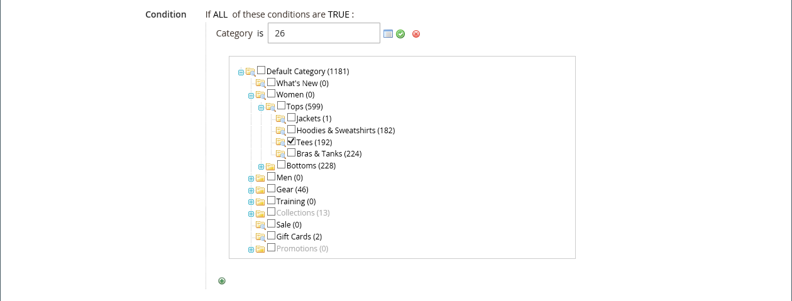
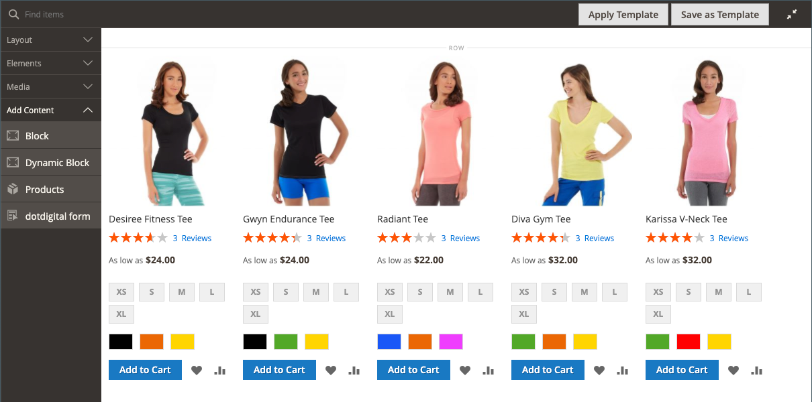

# [!DNL Page Builder] Exemplarische Vorgehensweise: Teil 3: Kataloginhalt

Diese Übung zeigt, wie einfach es ist, einer Seite eine Produktliste hinzuzufügen, Produktseiten anzupassen und ein benutzerdefiniertes Attribut zu erstellen, das die [!DNL Page Builder] Arbeitsbereich zu einem Produktattributsatz.

{width="600" zoomable="yes"}

Bei dieser Übung wird davon ausgegangen, dass Sie [Teil 1: Einfache Seite](1-simple-page.md) und [Teil 2: Blöcke](2-blocks.md), einschließlich der Voraussetzungen und heruntergeladener Beispieldateien. Folgen Sie den drei Teilen dieser Übung in der richtigen Reihenfolge.

## Teil 1: Produktliste hinzufügen

[!DNL Page Builder] erleichtert das Hinzufügen einer Produktliste zur Bühne. In diesem Beispiel wird die Produktliste direkt zu einer Seite hinzugefügt.

### Schritt 1: Hinzufügen einer Produktliste zur Phase

1. Im _Admin_ Seitenleiste, navigieren Sie zu **[!UICONTROL Content]** > _[!UICONTROL Elements]_>**[!UICONTROL Pages]**.

1. Suchen Sie die _Einfache Seite_ die Sie in der ersten Übung erstellt und in der zweiten geändert haben, und wählen Sie **[!UICONTROL Edit]** im _[!UICONTROL Action]_Spalte.

1. Erweitern  die **[!UICONTROL Content]** und klicken Sie auf **[!UICONTROL Edit with Page Builder]** oder innerhalb des Inhaltsvorschaubereichs.

1. Im [!DNL Page Builder] Bereich unter _[!UICONTROL Layout]_, ziehen Sie eine **[!UICONTROL Row]**oben auf der Bühne.

1. Im [!DNL Page Builder] Bedienfeld, erweitern **[!UICONTROL Add Content]** und ziehen Sie eine **[!UICONTROL Products]** Platzhalter für die neue Zeile.

   {width="600" zoomable="yes"}

### Schritt 2: Bedingung erstellen

1. Bewegen Sie den Mauszeiger über den leeren Container, um die Toolbox anzuzeigen und die _Einstellungen_ ( {width="20"} ).

   {width="600" zoomable="yes"}

1. Für **[!UICONTROL Select Products By]** auswählen `Condition`.

1. Hinzufügen einer Bedingung:

   - Klicken Sie auf _Hinzufügen_ ().

   - under _[!UICONTROL Product Attribute]_auswählen **[!UICONTROL Category]**.

     {width="600" zoomable="yes"}

   - Führen Sie die _[!UICONTROL Category is]..._ Teil der Bedingung durch Klicken auf das Symbol Mehr (..) und anschließend auf die Schaltfläche _Auswahl_ ().

     {width="600" zoomable="yes"}

   - Führen Sie im Kategoriebaum einen Drilldown zum **Frauen > Tops** und wählen Sie die **Tees** aktivieren.

     {width="600" zoomable="yes"}

   - Klicken Sie auf das Häkchen ().

     Die entsprechende Kategorie-ID wird im Feld angezeigt, um die Bedingung abzuschließen.

### Schritt 3: Ausführen der Einstellungen

1. Geben Sie die **[!UICONTROL Number of Products to Display]**.

   Standardmäßig werden in der Liste fünf Produkte angezeigt.

1. Nehmen Sie die restlichen Einstellungen nach Bedarf vor.

   Verwenden Sie bei Bedarf die Feldbeschreibungen am Ende der [Inhalt hinzufügen - Produkte](products.md) zur Referenz.

1. Wenn Sie fertig sind, klicken Sie auf **[!UICONTROL Save]** , um die Einstellungen zu speichern und zum [!DNL Page Builder] Arbeitsbereich.

   {width="600" zoomable="yes"}

1. Klicken Sie in der rechten oberen Ecke der Bühne auf die _Vollbild schließen_ ( {width="20"} ).

   Wenn Sie auf dieses Symbol klicken, kehren Sie zum _[!UICONTROL Content]_für die Seite, in der die Vorschau angezeigt wird.

1. Klicken Sie oben rechts auf die **[!UICONTROL Save]** Pfeil und Auswahl **[!UICONTROL Save & Close]**.

## Teil 2: Anpassen der Produktseite

>[!NOTE]
>
>Ein Admin-Benutzer muss [!UICONTROL Content] Berechtigungen für die [Rollenumfang](../systems/permissions-user-roles.md) anzeigen [!UICONTROL Edit with Page Builder] -Schaltflächen und können den Seitenaufbau verwenden.

In diesem Teil der Übung erfahren Sie, wie einfach es ist, eine Produktseite anzupassen, indem Sie ein Video unter den Satz von Registerkarten auf der Produktseite platzieren. Der zu aktualisierende Prozess [Kategorieseite](../catalog/categories-content-settings.md) -Inhalt ist im Grunde identisch.

1. Im _Admin_ Seitenleiste, navigieren Sie zu **[!UICONTROL Catalog]** > **[!UICONTROL Products]**.

1. Suchen Sie ein einfaches Produkt, das Sie für dieses Beispiel verwenden können, und öffnen Sie es im Bearbeitungsmodus.

1. Hinunter scrollen und erweitern  die **[!UICONTROL Content]** Abschnitt.

1. Weiter zu _[!UICONTROL Description]_klicken **[!UICONTROL Edit with Page Builder]**.

   {width="600" zoomable="yes"}

   Wenn die Produktbeschreibung zuvor ohne [!DNL Page Builder], wird die aktuelle Beschreibung als HTML in einer [HTML-Code](html-code.md) Container. Beim Thema &quot;Luma&quot;wird die Produktbeschreibung auf der Registerkarte &quot;Details&quot;angezeigt.

1. Im [!DNL Page Builder] Bereich unter _[!UICONTROL Layout]_, ziehen Sie eine **[!UICONTROL Row]**in die Bühne hinein und platzieren sie unter dem HTML-Code-Container.

   Die rote Führungslinie wird angezeigt, wenn sich die Zeile an der richtigen Position befindet.

   {width="600" zoomable="yes"}

1. Im [!DNL Page Builder] Bedienfeld, erweitern **[!UICONTROL Media]** und ziehen Sie eine **[!UICONTROL Video]** Platzhalter für die neue Zeile.

   {width="600" zoomable="yes"}

1. Bewegen Sie den Mauszeiger über den leeren Video-Container, um die Toolbox anzuzeigen und die _Einstellungen_ ( {width="20"} ).

   {width="500" zoomable="yes"}

1. Geben Sie die **[!UICONTROL Video URL]**.

   Das Video kann auf einer der folgenden Arten gehostet werden: [YouTube][1] oder [Vimeo][2]. Das Video in diesem Beispiel finden Sie in YouTube unter der folgenden URL:

   `https://www.youtube.com/watch?v=ZpFrNyD4100`

   {width="500" zoomable="yes"}

1. Geben Sie die **[!UICONTROL Maximum Width]** in Pixel für die Videoanzeige.

   Wenn Sie diese Option leer lassen, füllt das Video den verfügbaren Platz aus.

1. Klicks **[!UICONTROL Save]** , um die Einstellungen zu speichern und zum [!DNL Page Builder] Arbeitsbereich.

   {width="600" zoomable="yes"}

1. Klicken Sie in der rechten oberen Ecke der Bühne auf die _Vollbild schließen_ ( {width="20"} ).

   Wenn Sie auf dieses Symbol klicken, kehren Sie zum _[!UICONTROL Content]_für die Seite, in der die Vorschau angezeigt wird.

1. Klicken Sie oben rechts auf die **[!UICONTROL Save]** Pfeil und Auswahl **[!UICONTROL Save & Close]**.

In der Storefront wird das Video unter dem Satz von Registerkarten angezeigt. Um zu sehen, wie die Seite auf einem Mobilgerät aussieht, können Sie die Größe des Fensters ändern.

{width="600" zoomable="yes"}

**Herzlichen Glückwunsch!** Sie haben den zweiten Teil des Tutorials zum Kataloginhalt abgeschlossen. Behalten Sie die von Ihnen erstellte Arbeit bei, damit Sie später darauf verweisen können.

## Teil 3: Hinzufügen benutzerdefinierter Attribute

Verwenden Sie die [!DNL Page Builder] benutzerdefiniertes Attribut zum Hinzufügen einer voll funktionsfähigen [!DNL Page Builder] Arbeitsbereich zu einer Produktseite, mit der Sie ansprechende Inhalte erstellen können. In diesem Teil der Übung erfahren Sie, wie Sie ein benutzerdefiniertes Attribut mit der [!DNL Page Builder] Eingabetyp verwenden und auf Produktseiten in Ihrem Katalog anwenden. Weitere Informationen zu diesen Attributen finden Sie unter [Produktattribute](../catalog/product-attributes.md).

### Schritt 1: Produkt erstellen

Um Änderungen an Ihrem Live Store zu vermeiden, erstellen Sie ein Produkt mit den beschriebenen Eigenschaften.

1. Im _Admin_ Seitenleiste, navigieren Sie zu **[!UICONTROL Catalog]** > **[!UICONTROL Products]**.

1. Klicken Sie oben rechts auf **[!UICONTROL Add Product]**.

1. Erstellen Sie das Produkt mit den folgenden Eigenschaften:

   - 
     [!UICONTROL Attributsatz]: Default
   - [!UICONTROL Product Name]: Mein Produkt
   - 
     [!UICONTROL SKU]: Tutorial
   - 
     [!UICONTROL Price]: 75.00
   - 
     [!UICONTROL Quantity]: 100
   - [!UICONTROL Stock Status]: Auf Lager
   - 
     [!UICONTROL Weight]: 1
   - [!UICONTROL Categories]: Frauen > Tops > Tees

1. Klicken Sie oben rechts auf die **[!UICONTROL Save]** Pfeil und Auswahl **[!UICONTROL Save & Close]**.

### Schritt 2: Erstellen benutzerdefinierter Attribute

In diesem Schritt erstellen Sie zwei neue benutzerdefinierte Attribute, die zeigen, wie die [!DNL Page Builder] und Texteditor-Eingabetypen können verwendet werden.

1. Im _Admin_ Seitenleiste, navigieren Sie zu **[!UICONTROL Stores]** > _[!UICONTROL Attributes]_>**[!UICONTROL Product]**.

1. Klicken Sie oben rechts auf **[!UICONTROL Add New Attribute]**.

1. Geben Sie einen **[!UICONTROL Default Label]** für das -Attribut.

   Verwenden Sie für dieses Beispiel `My Page Builder Attribute` für den Titel.

1. Satz **[!UICONTROL Catalog Input Type for Store Owner]** nach `Page Builder`.

   Beim Erstellen eines benutzerdefinierten Attributs können Sie den Editor, der für die Anwendung am besten geeignet ist, als `Page Builder` oder der Standard, WYSIWYG `Text Editor`.

   ![[!DNL Page Builder] Eingabetyp](./assets/pb-attribute-page-builder.png){width="600" zoomable="yes"}

1. Erweitern  die **[!UICONTROL Advanced Attribute Properties]** und nehmen Sie die folgenden Einstellungen vor:

   - [!UICONTROL Attribute Code]: Geben Sie einen Attributcode in Kleinbuchstaben ein und verwenden Sie Bindestriche anstelle von Leerzeichen. Verwenden Sie für dieses Beispiel `my_page_builder_attribute`.
   - [!UICONTROL Scope]: Den Standardwert akzeptieren, `Store View`.
   - [!UICONTROL Default Value]: Geben Sie einen Standardwert für das Attribut ein.
   - 
     [!UICONTROL Unique Value]: `No`
   - 
     [!UICONTROL Add to Column Options]: `No`
   - 
     [!UICONTROL Use in Filter Options]: `Yes`

1. Im _[!UICONTROL Attribute Information]_links, wählen Sie **[!UICONTROL Storefront Properties]**und nehmen Sie die folgenden Einstellungen vor:

   - 
     [!UICONTROL Use for Promo Rule Conditions]: `Yes`
   - 
     [!UICONTROL Visible on Catalog Pages on Storefront]: `Yes`
   - 
     [!UICONTROL Used in Product Listing]: `Yes`

1. Wenn Sie fertig sind, klicken Sie auf **[!UICONTROL Save Attribute]**.

1. Wiederholen Sie die vorherigen Schritte, um ein zweites Attribut mit denselben grundlegenden Eigenschaften, jedoch mit dem Eingabetyp Text-Editor wie folgt zu erstellen:

   - [!UICONTROL Default Label]: My Text Editor-Attribut
   - [!UICONTROL Catalog Input Type for Store Owner]: Texteditor
   - 
     [!UICONTROL Attributcode]: `my_text_editor_attribute`

### Schritt 3: Aktualisieren des Produktattributsatzes

1. Im _Admin_ Seitenleiste, navigieren Sie zu **[!UICONTROL Stores]** > _[!UICONTROL Attributes]_>**[!UICONTROL Attribute Set]**.

   In diesem Beispiel fügen Sie die neuen Attribute vorübergehend zum `default` -Attributsatz. Entfernen Sie am Ende dieser Übung die Attribute aus dem Attributsatz, sodass sich dies nicht auf Ihren Katalog auswirkt.

   >[!NOTE]
   >
   >Wenn Sie Ihren Live Store nicht ändern möchten, können Sie dies auch tun, ohne den Attributsatz zu aktualisieren.

1. Suchen Sie die _[!UICONTROL Default]_-Attribut in der Liste festgelegt ist, und doppelklicken Sie darauf, um es im Bearbeitungsmodus zu öffnen.

1. Im _Nicht zugewiesene Attribute_ Liste: Suchen Sie die neu erstellten Attribute und ziehen Sie sie in die _[!UICONTROL Groups]_Spalte, unter **[!UICONTROL Content]**.

   Die Position des Attributs im [!UICONTROL Groups] bestimmt, wo sie auf der Seite angezeigt wird.

   {width="600" zoomable="yes"}

1. Klicks **[!UICONTROL Save]** , um zur Liste der Attributsätze zurückzukehren.

1. Klicken Sie bei Aufforderung auf das **[!UICONTROL Cache Management]** -Link oben auf der Seite platzieren und ungültigen Cache aktualisieren.

### Schritt 4: Produkt aktualisieren

1. Im _Admin_ Seitenleiste, navigieren Sie zu **[!UICONTROL Catalog]** > **[!UICONTROL Products]**.

1. Suchen Sie im Raster Produkte nach _Mein Produkt_ und öffnen Sie sie im Bearbeitungsmodus.

1. Hinunter scrollen und erweitern  die **[!UICONTROL Content]** Abschnitt.

   Oben im Abschnitt befinden sich zwei Standardattribute für Produktinhalte:

   - _Kurzbeschreibung_, das die standardmäßige WYSIWYG-Version verwendet [editor](../content-design/editor.md).
   - _Beschreibung_, der die [!DNL Page Builder] Vorschau anzeigen.

   {width="600" zoomable="yes"}

   Beim Scrollen zur unteren Hälfte des Abschnitts gibt es die beiden Attribute, die Sie erstellt und zugewiesen haben:

   - _My [!DNL Page Builder] Attribut_, der die [!DNL Page Builder] Vorschau anzeigen.
   - _My Text Editor-Attribut_, der den standardmäßigen WYSIWYG-Editor verwendet.

   {width="600" zoomable="yes"}

1. Im **My Text Editor-Attribut** Editor, eingeben `Text Editor Attribute placeholder text`.

   - Klicken Sie oben rechts auf die **[!UICONTROL Save]** Pfeil und Auswahl **[!UICONTROL Save & Close]**.

1. Für **Mein Seitenerstellungsattribut** klicken **[!UICONTROL Edit with Page Builder]** und fügen Sie den Beschreibungstext hinzu:

   - Im [!DNL Page Builder] Bedienfeld, erweitern **[!UICONTROL Elements]** und ziehen Sie eine **[!UICONTROL Text object]** auf die Bühne.

   - Eingabe `Page Builder attribute placeholder text`.

   - Klicken Sie in der rechten oberen Ecke der Bühne auf die _Vollbild schließen_ ( {width="20"} ).

     {width="600" zoomable="yes"}

1. Scrollen Sie nach oben bis **[!UICONTROL Description]** klicken **[!UICONTROL Edit with Page Builder]** und fügen Sie Text hinzu, den Sie mit der gleichen Methode wie im vorherigen Schritt verwenden möchten.

1. Klicken Sie in der rechten oberen Ecke der Produktseite auf die **[!UICONTROL Save]** Pfeil und Auswahl **[!UICONTROL Save & Close]**.

1. Klicken Sie bei entsprechender Aufforderung auf das **[!UICONTROL Cache Management]** in der Nachricht oben auf der Seite ein und aktualisieren Sie alle ungültigen Zwischenspeicher.

### Schritt 5: Ergebnis anzeigen

1. Navigieren Sie in der Storefront zu Ihrer Beispielproduktseite.

   In diesem Beispiel befindet sich das Produkt in der oberen Navigation unter Frauen > Tops > Tees.

1. Scrollen Sie nach unten zum _Mein Seitenerstellungsattribut_ Informationen.

   Die Position der Attribute auf der Produktseite wird durch das Design bestimmt. Im Design &quot;Luma&quot;befinden sich die neuen Attribute direkt nach der Produktbeschreibung.

   ![[!DNL Page Builder] und Text-Editor-Attribute in der Storefront](./assets/pb-storefront-product-attribute.png){width="600" zoomable="yes"}

Sie haben die [!DNL Page Builder] Übung zum Kataloginhalt. Behalten Sie die von Ihnen erstellte Arbeit bei, damit Sie später darauf verweisen können.

[1]: https://www.youtube.com/
[2]: https://vimeo.com/
