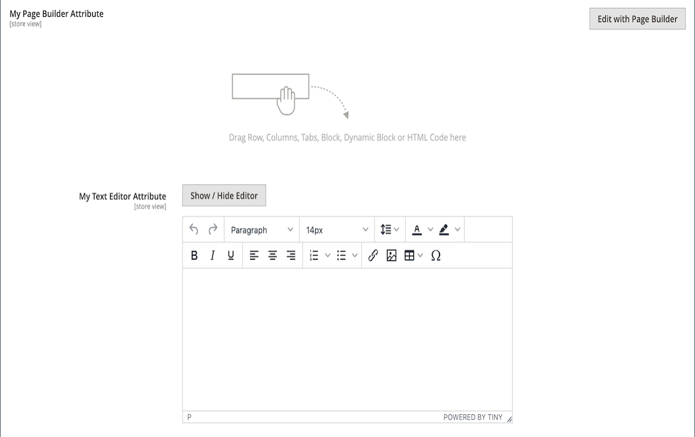

# [!DNL Page Builder] Exemplarische Vorgehensweise: Teil 3: Kataloginhalt

Diese Übung zeigt, wie einfach es ist, einer Seite eine Produktliste hinzuzufügen, Produktseiten anzupassen und ein benutzerdefiniertes Attribut zu erstellen, das den Arbeitsbereich [!DNL Page Builder] zu einem Produktattributsatz hinzufügt.

{width="600" zoomable="yes"}

Bei dieser Übung wird davon ausgegangen, dass Sie [Teil 1: Einfache Seite](1-simple-page.md) und [Teil 2: Blöcke](2-blocks.md) abgeschlossen haben, einschließlich der Voraussetzungen und heruntergeladenen Beispieldateien. Folgen Sie den drei Teilen dieser Übung in der richtigen Reihenfolge.

## Teil 1: Produktliste hinzufügen

[!DNL Page Builder] erleichtert das Hinzufügen einer Produktliste zur Bühne. In diesem Beispiel wird die Produktliste direkt zu einer Seite hinzugefügt.

### Schritt 1: Hinzufügen einer Produktliste zur Phase

1. Wechseln Sie in der Seitenleiste _Admin_ zu **[!UICONTROL Content]** > _[!UICONTROL Elements]_>**[!UICONTROL Pages]**.

1. Suchen Sie die _einfache Seite_ , die Sie in der ersten Übung erstellt und in der zweiten geändert haben, und wählen Sie **[!UICONTROL Edit]** in der Spalte _[!UICONTROL Action]_aus.

1. Erweitern Sie  im Abschnitt **[!UICONTROL Content]** und klicken Sie auf **[!UICONTROL Edit with Page Builder]** oder innerhalb des Inhaltsvorschaubereichs.

1. Ziehen Sie im Bedienfeld [!DNL Page Builder] unter _[!UICONTROL Layout]_eine **[!UICONTROL Row]**an den oberen Rand der Bühne.

1. Erweitern Sie im Bedienfeld [!DNL Page Builder] den Wert **[!UICONTROL Add Content]** und ziehen Sie einen Platzhalter **[!UICONTROL Products]** in die neue Zeile.

   {width="600" zoomable="yes"}

### Schritt 2: Bedingung erstellen

1. Bewegen Sie den Mauszeiger über den leeren Produktebehälter, um die Toolbox anzuzeigen, und wählen Sie das Symbol _Einstellungen_ ( {width="20"} ).

   {width="600" zoomable="yes"}

1. Wählen Sie für **[!UICONTROL Select Products By]** `Condition` aus.

1. Hinzufügen einer Bedingung:

   - Klicken Sie auf das Symbol _Hinzufügen_ ().

   - Wählen Sie unter &quot;_[!UICONTROL Product Attribute]_&quot;die Option &quot;**[!UICONTROL Category]**&quot;.

     {width="600" zoomable="yes"}

   - Vervollständigen Sie den Teil _[!UICONTROL Category is]..._ der Bedingung, indem Sie auf das Symbol Mehr (...) klicken und dann auf das Symbol _Auswahl_ () klicken.

     {width="600" zoomable="yes"}

   - Führen Sie im Kategoriebaum einen Drilldown zur Kategorie **Frauen > Tops** durch und aktivieren Sie das Kontrollkästchen **Tees** .

     {width="600" zoomable="yes"}

   - Klicken Sie auf das Häkchen-Symbol ().

     Die entsprechende Kategorie-ID wird im Feld angezeigt, um die Bedingung abzuschließen.

### Schritt 3: Ausführen der Einstellungen

1. Geben Sie den Wert **[!UICONTROL Number of Products to Display]** ein.

   Standardmäßig werden in der Liste fünf Produkte angezeigt.

1. Nehmen Sie die restlichen Einstellungen nach Bedarf vor.

   Verwenden Sie bei Bedarf die Feldbeschreibungen am Ende der Seite [Inhalt hinzufügen - Produkte](products.md) als Referenz.

1. Klicken Sie nach Abschluss des Vorgangs auf **[!UICONTROL Save]** , um die Einstellungen zu speichern und zum Arbeitsbereich [!DNL Page Builder] zurückzukehren.

   {width="600" zoomable="yes"}

1. Klicken Sie in der oberen rechten Ecke der Bühne auf das Symbol _Vollbild schließen_ ( {width="20"} ).

   Wenn Sie auf dieses Symbol klicken, gelangen Sie zum Abschnitt &quot;_[!UICONTROL Content]_&quot;für die Seite, in der die Vorschau angezeigt wird.

1. Klicken Sie in der oberen rechten Ecke auf den Pfeil **[!UICONTROL Save]** und wählen Sie **[!UICONTROL Save & Close]**.

## Teil 2: Anpassen der Produktseite

>[!NOTE]
>
>Ein Admin-Benutzer muss über [!UICONTROL Content] -Berechtigungen für seinen [Rollenbereich](../systems/permissions-user-roles.md) verfügen, um die [!UICONTROL Edit with Page Builder] -Schaltflächen anzuzeigen und den Seitenaufbau verwenden zu können.

In diesem Teil der Übung erfahren Sie, wie einfach es ist, eine Produktseite anzupassen, indem Sie ein Video unter den Satz von Registerkarten auf der Produktseite platzieren. Der Prozess zum Aktualisieren des Inhalts der [Kategorieseite](../catalog/categories-content-settings.md) ist im Wesentlichen identisch.

1. Wechseln Sie in der Seitenleiste _Admin_ zu **[!UICONTROL Catalog]** > **[!UICONTROL Products]**.

1. Suchen Sie ein einfaches Produkt, das Sie für dieses Beispiel verwenden können, und öffnen Sie es im Bearbeitungsmodus.

1. Scrollen Sie nach unten und erweitern Sie den Abschnitt **[!UICONTROL Content]** um den .

1. Klicken Sie neben _[!UICONTROL Description]_auf **[!UICONTROL Edit with Page Builder]**.

   {width="600" zoomable="yes"}

   Wenn die Produktbeschreibung zuvor ohne [!DNL Page Builder] eingegeben wurde, wird die aktuelle Beschreibung in einem [HTML-Code](html-code.md) -Container als HTML angezeigt. Beim Thema &quot;Luma&quot;wird die Produktbeschreibung auf der Registerkarte &quot;Details&quot;angezeigt.

1. Ziehen Sie im Bedienfeld [!DNL Page Builder] unter _[!UICONTROL Layout]_eine **[!UICONTROL Row]**auf die Bühne und platzieren Sie sie unter dem HTML-Code-Container.

   Die rote Führungslinie wird angezeigt, wenn sich die Zeile an der richtigen Position befindet.

   {width="600" zoomable="yes"}

1. Erweitern Sie im Bedienfeld [!DNL Page Builder] den Wert **[!UICONTROL Media]** und ziehen Sie einen Platzhalter **[!UICONTROL Video]** in die neue Zeile.

   {width="600" zoomable="yes"}

1. Bewegen Sie den Mauszeiger über den leeren Video-Container, um die Toolbox anzuzeigen und das Symbol _Einstellungen_ ( {width="20"} ) zu wählen.

   {width="500" zoomable="yes"}

1. Geben Sie den Wert **[!UICONTROL Video URL]** ein.

   Das Video kann auf [YouTube][1] oder [Vimeo][2] gehostet werden. Das Video in diesem Beispiel finden Sie in YouTube unter der folgenden URL:

   `https://www.youtube.com/watch?v=ZpFrNyD4100`

   {width="500" zoomable="yes"}

1. Geben Sie die **[!UICONTROL Maximum Width]** in Pixel für die Videoanzeige ein.

   Wenn Sie diese Option leer lassen, füllt das Video den verfügbaren Platz aus.

1. Klicken Sie auf **[!UICONTROL Save]** , um die Einstellungen zu speichern und zum Arbeitsbereich [!DNL Page Builder] zurückzukehren.

   {width="600" zoomable="yes"}

1. Klicken Sie in der oberen rechten Ecke der Bühne auf das Symbol _Vollbild schließen_ ( {width="20"} ).

   Wenn Sie auf dieses Symbol klicken, gelangen Sie zum Abschnitt &quot;_[!UICONTROL Content]_&quot;für die Seite, in der die Vorschau angezeigt wird.

1. Klicken Sie in der oberen rechten Ecke auf den Pfeil **[!UICONTROL Save]** und wählen Sie **[!UICONTROL Save & Close]**.

In der Storefront wird das Video unter dem Satz von Registerkarten angezeigt. Um zu sehen, wie die Seite auf einem Mobilgerät aussieht, können Sie die Größe des Fensters ändern.

{width="600" zoomable="yes"}

**Herzlichen Glückwunsch!** Sie haben den zweiten Teil des Tutorials zum Kataloginhalt abgeschlossen. Behalten Sie die von Ihnen erstellte Arbeit bei, damit Sie später darauf verweisen können.

## Teil 3: Hinzufügen benutzerdefinierter Attribute

Verwenden Sie das benutzerdefinierte Attribut [!DNL Page Builder] , um einer Produktseite einen voll funktionsfähigen Arbeitsbereich vom Typ [!DNL Page Builder] hinzuzufügen, mit dem Sie ansprechende Inhalte erstellen können. In diesem Teil der Übung erfahren Sie, wie Sie ein benutzerdefiniertes Attribut mithilfe des Eingabetyps [!DNL Page Builder] erstellen und es auf Produktseiten in Ihrem Katalog anwenden. Weitere Informationen zu diesen Attributen finden Sie unter [Produktattribute](../catalog/product-attributes.md).

### Schritt 1: Produkt erstellen

Um Änderungen an Ihrem Live Store zu vermeiden, erstellen Sie ein Produkt mit den beschriebenen Eigenschaften.

1. Wechseln Sie in der Seitenleiste _Admin_ zu **[!UICONTROL Catalog]** > **[!UICONTROL Products]**.

1. Klicken Sie in der oberen rechten Ecke auf **[!UICONTROL Add Product]**.

1. Erstellen Sie das Produkt mit den folgenden Eigenschaften:

   - 
     [!UICONTROL Attributsatz]: Default
   - [!UICONTROL Product Name]: Mein Produkt
   - 
     [!UICONTROL SKU]: Tutorial
   - 
     [!UICONTROL Price]: 75.00
   - 
     [!UICONTROL Quantity]: 100
   - [!UICONTROL Stock Status]: Auf Lager
   - 
     [!UICONTROL Weight]: 1
   - [!UICONTROL Categories]: Women > Tops > Tees

1. Klicken Sie in der oberen rechten Ecke auf den Pfeil **[!UICONTROL Save]** und wählen Sie **[!UICONTROL Save & Close]**.

### Schritt 2: Erstellen benutzerdefinierter Attribute

In diesem Schritt erstellen Sie zwei neue benutzerdefinierte Attribute, die zeigen, wie die Eingabetypen [!DNL Page Builder] und &quot;Texteditor&quot;verwendet werden können.

1. Wechseln Sie in der Seitenleiste _Admin_ zu **[!UICONTROL Stores]** > _[!UICONTROL Attributes]_>**[!UICONTROL Product]**.

1. Klicken Sie in der oberen rechten Ecke auf **[!UICONTROL Add New Attribute]**.

1. Geben Sie einen **[!UICONTROL Default Label]** für das Attribut ein.

   Verwenden Sie für dieses Beispiel `My Page Builder Attribute` als Beschriftung.

1. Setzen Sie **[!UICONTROL Catalog Input Type for Store Owner]** auf `Page Builder`.

   Beim Erstellen eines benutzerdefinierten Attributs können Sie den Editor, der für die Anwendung am besten geeignet ist, entweder als `Page Builder` oder als Standard, WYSIWYG `Text Editor` angeben.

   ![[!DNL Page Builder] Eingabetyp](./assets/pb-attribute-page-builder.png){width="600" zoomable="yes"}

1. Erweitern Sie  den Abschnitt **[!UICONTROL Advanced Attribute Properties]** und nehmen Sie die folgenden Einstellungen vor:

   - [!UICONTROL Attribute Code]: Geben Sie einen Attributcode in Kleinbuchstaben ein und verwenden Sie Bindestriche anstelle von Leerzeichen. Verwenden Sie für dieses Beispiel `my_page_builder_attribute`.
   - [!UICONTROL Scope]: Akzeptieren Sie den Standardwert `Store View`.
   - [!UICONTROL Default Value]: Geben Sie einen Standardwert für das Attribut ein.
   - 
     [!UICONTROL Unique Value]: `No`
   - 
     [!UICONTROL Add to Column Options]: `No`
   - 
     [!UICONTROL Use in Filter Options]: `Yes`

1. Wählen Sie im Bereich _[!UICONTROL Attribute Information]_auf der linken Seite **[!UICONTROL Storefront Properties]**aus und nehmen Sie die folgenden Einstellungen vor:

   - 
     [!UICONTROL Use for Promo Rule Conditions]: `Yes`
   - 
     [!UICONTROL Visible on Catalog Pages on Storefront]: `Yes`
   - 
     [!UICONTROL Used in Product Listing]: `Yes`

1. Klicken Sie nach Abschluss des Vorgangs auf **[!UICONTROL Save Attribute]**.

1. Wiederholen Sie die vorherigen Schritte, um ein zweites Attribut mit denselben grundlegenden Eigenschaften, jedoch mit dem Eingabetyp Text-Editor wie folgt zu erstellen:

   - [!UICONTROL Default Label]: My Text Editor-Attribut
   - [!UICONTROL Catalog Input Type for Store Owner]: Texteditor
   - 
     [!UICONTROL Attributcode]: `my_text_editor_attribute`

### Schritt 3: Aktualisieren des Produktattributsatzes

1. Wechseln Sie in der Seitenleiste _Admin_ zu **[!UICONTROL Stores]** > _[!UICONTROL Attributes]_>**[!UICONTROL Attribute Set]**.

   In diesem Beispiel fügen Sie dem Attributsatz `default` vorübergehend die neuen Attribute hinzu. Entfernen Sie am Ende dieser Übung die Attribute aus dem Attributsatz, sodass sich dies nicht auf Ihren Katalog auswirkt.

   >[!NOTE]
   >
   >Wenn Sie Ihren Live Store nicht ändern möchten, können Sie dies auch tun, ohne den Attributsatz zu aktualisieren.

1. Suchen Sie das Attribut _[!UICONTROL Default]_in der Liste und doppelklicken Sie darauf, um es im Bearbeitungsmodus zu öffnen.

1. Suchen Sie in der Liste _Nicht zugewiesene Attribute_ die neu erstellten Attribute und ziehen Sie die einzelnen Attribute in die Spalte _[!UICONTROL Groups]_unter **[!UICONTROL Content]**.

   Die Position des Attributs in der Spalte [!UICONTROL Groups] bestimmt, wo es auf der Seite angezeigt wird.

   {width="600" zoomable="yes"}

1. Klicken Sie auf **[!UICONTROL Save]** , um zur Liste der Attributsätze zurückzukehren.

1. Wenn Sie dazu aufgefordert werden, klicken Sie oben auf der Seite auf den Link **[!UICONTROL Cache Management]** und aktualisieren Sie alle ungültigen Zwischenspeicher.

### Schritt 4: Produkt aktualisieren

1. Wechseln Sie in der Seitenleiste _Admin_ zu **[!UICONTROL Catalog]** > **[!UICONTROL Products]**.

1. Suchen Sie im Raster &quot;Products&quot;nach _My Product_ und öffnen Sie es im Bearbeitungsmodus.

1. Scrollen Sie nach unten und erweitern Sie den Abschnitt **[!UICONTROL Content]** um den .

   Oben im Abschnitt befinden sich zwei Standardattribute für Produktinhalte:

   - _Kurze Beschreibung_, die den standardmäßigen WYSIWYG [editor](../content-design/editor.md) verwendet.
   - _Beschreibung_, die die Vorschau [!DNL Page Builder] anzeigt.

   {width="600" zoomable="yes"}

   Beim Scrollen zur unteren Hälfte des Abschnitts gibt es die beiden Attribute, die Sie erstellt und zugewiesen haben:

   - _Mein [!DNL Page Builder] Attribut_, das die Vorschau für [!DNL Page Builder] anzeigt.
   - _My Text Editor-Attribut_, das den standardmäßigen WYSIWYG-Editor verwendet.

   {width="600" zoomable="yes"}

1. Geben Sie im Editor **My Text Editor Attribute** den Wert `Text Editor Attribute placeholder text` ein.

   - Klicken Sie in der oberen rechten Ecke auf den Pfeil **[!UICONTROL Save]** und wählen Sie **[!UICONTROL Save & Close]**.

1. Klicken Sie für **My Page Builder Attribute** auf **[!UICONTROL Edit with Page Builder]** und fügen Sie den Beschreibungstext hinzu:

   - Erweitern Sie im Bedienfeld [!DNL Page Builder] den Wert **[!UICONTROL Elements]** und ziehen Sie eine **[!UICONTROL Text object]** auf die Bühne.

   - Geben Sie `Page Builder attribute placeholder text` ein.

   - Klicken Sie in der oberen rechten Ecke der Bühne auf das Symbol _Vollbild schließen_ ( {width="20"} ).

     {width="600" zoomable="yes"}

1. Scrollen Sie nach oben zu &quot;**[!UICONTROL Description]**&quot;, klicken Sie auf &quot;**[!UICONTROL Edit with Page Builder]**&quot;und fügen Sie Text hinzu, den Sie mit der gleichen Methode wie im vorherigen Schritt verwenden möchten.

1. Klicken Sie in der rechten oberen Ecke der Produktseite auf den Pfeil **[!UICONTROL Save]** und wählen Sie **[!UICONTROL Save & Close]**.

1. Wenn Sie dazu aufgefordert werden, klicken Sie in der Meldung oben auf der Seite auf den Link **[!UICONTROL Cache Management]** und aktualisieren Sie den ungültigen Cache.

### Schritt 5: Ergebnis anzeigen

1. Navigieren Sie in der Storefront zu Ihrer Beispielproduktseite.

   In diesem Beispiel befindet sich das Produkt in der oberen Navigation unter Frauen > Tops > Tees.

1. Scrollen Sie nach unten zu den Informationen _My Page Builder Attribute_.

   Die Position der Attribute auf der Produktseite wird durch das Design bestimmt. Im Design &quot;Luma&quot;befinden sich die neuen Attribute direkt nach der Produktbeschreibung.

   ![[!DNL Page Builder] und Text-Editor-Attribute in der Storefront](./assets/pb-storefront-product-attribute.png){width="600" zoomable="yes"}

Sie haben die Aktivität [!DNL Page Builder] Kataloginhalt abgeschlossen. Behalten Sie die von Ihnen erstellte Arbeit bei, damit Sie später darauf verweisen können.

[1]: https://www.youtube.com/
[2]: https://vimeo.com/
