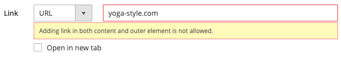

# Medien - Banner

Verwenden Sie den _Banner_-Inhaltstyp, um eine illustrierte, interaktive Komponente hinzuzufügen, die Benutzende mit einer call to action und einer Schaltfläche in der [[!DNL Page Builder] Phase](workspace.md#stage) interagiert.

>[!NOTE]
>
>Was zuvor die Option _Banner_ im Menü Inhalt war, ist jetzt [Dynamischer Block](../content-design/dynamic-blocks.md).

{width="700" zoomable="yes"}

{{$include /help/_includes/page-builder-save-timeout.md}}

## Banner-Toolbox

Die Banner-Toolbox wird angezeigt, wenn Sie den Mauszeiger über den Banner-Container bewegen.

{width="600" zoomable="yes"}

| Tool | Symbol | Beschreibung |
|--- |--- |--- |
| Verschieben | {width="25"} | Verschiebt das Banner an eine andere Position auf der Bühne. |
| (Bezeichnung) | Banner | Identifiziert den aktuellen Inhalts-Container als Banner. Bewegen Sie den Mauszeiger über den Container, um die Toolbox anzuzeigen. |
| Einstellungen | {width="25"} | Öffnet die Seite Banner bearbeiten , auf der Sie die Eigenschaften des Banners und des Containers ändern können. |
| Ausblenden | {width="25"} | Blendet das aktuelle Banner aus. |
| Anzeigen | {width="25"} | Zeigt das ausgeblendete Banner an. |
| Duplikat | {width="25"} | Erstellt eine Kopie des Banners. |
| entfernen | {width="25"} | Löscht das Banner aus der Phase. |
| [!UICONTROL Upload New Image] |  | Lädt ein Bild aus Ihrem lokalen Dateisystem in die Galerie für den Bannerhintergrund hoch. |
| [!UICONTROL Select from Gallery] |  | Verwendet ein vorhandenes Bild aus der Galerie für den Bannerhintergrund. |

{style="table-layout:auto"}

{{$include /help/_includes/page-builder-hidden-element-note.md}}

## Banner hinzufügen

1. Erweitern Sie im [!DNL Page Builder] Bedienfeld **[!UICONTROL Media]** und ziehen Sie einen **[!UICONTROL Banner]** Platzhalter auf das Bühnenbild.

   {width="600" zoomable="yes"}

   Die Schaltflächen _[!UICONTROL Upload Image]_und_[!UICONTROL Select from Gallery]_ sind enthalten, sodass Sie direkt auf der Bühne schnelle Änderungen am Bannerinhalt vornehmen können. Sie können auch den Inhalt der _[!UICONTROL Edit Banner]_ändern.

1. Klicken Sie auf den Platzhalter für das Banner, um den [Texteditor](../content-design/editor.md) anzuzeigen, und geben Sie den Inhalt für das Banner ein.

   Sie können auch komplexere Bannerinhalte mit den Einstellungen [Inhalt](#content) einfügen.

## Ändern von Bannereinstellungen

1. Bewegen Sie den Mauszeiger über den Banner-Container, um die Toolbox anzuzeigen, und wählen _das Symbol_ Einstellungen) aus.

1. In den folgenden Abschnitten finden Sie detaillierte Informationen zum Aktualisieren der verfügbaren Einstellungen:

   - [[!UICONTROL Appearance]](#appearance)
   - [[!UICONTROL Content]](#content)
   - [[!UICONTROL Background]](#background)
   - [[!UICONTROL Advanced]](#advanced)

1. Wenn Sie fertig sind, klicken Sie oben rechts auf **[!UICONTROL Save]** , um die _[!UICONTROL Edit Banner]_zu schließen.

1. Klicken Sie oben rechts auf **[!UICONTROL Save]** , um die Einstellungen anzuwenden und zum Arbeitsbereich [!DNL Page Builder] zurückzukehren.

## [!UICONTROL Appearance]

Banner sind einfach einzurichten und zu verwalten, da sie auf einer von vier vordefinierten Vorlagen basieren.

- Wählen Sie einen der folgenden Platzierungstypen für Banner aus:

  | Platzierung | Beschreibung |
  | --------- | ----------- |
  | [!UICONTROL Poster] | Zentriert Inhalt und Schaltfläche auf dem Banner. Die Überlagerung weitet sich bei Verwendung der Überlagerung über die gesamte Breite des Banners aus. |
  | [!UICONTROL Collage Left] | Platziert Inhalt und Schaltfläche in einem definierten Bereich links im Banner. Die Überlagerung deckt bei Verwendung nur den definierten Bereich ab. |
  | [!UICONTROL Collage Center] | Platziert Inhalt und Schaltfläche in einem definierten Bereich, der auf dem Banner zentriert ist. Die Überlagerung deckt bei Verwendung nur den definierten Bereich ab. |
  | [!UICONTROL Collage Right] | Platziert Inhalt und Schaltfläche in einem definierten Bereich rechts neben dem Banner. Die Überlagerung deckt bei Verwendung nur den definierten Bereich ab. |

  {style="table-layout:auto"}

  {width="600" zoomable="yes"}

- (Optional) Geben Sie die **[!UICONTROL Minimum Height]** für die Zeile ein.

  Die Mindesthöhe kann eine Zahl mit einer beliebigen gültigen CSS-Einheit (z. B. `100px`, `50%`, `50em`, `100vh`) oder eine Berechnung (z. B. `100vh - 237px`) sein.

  Sie können beispielsweise die Mindesthöhe eines Banners so einstellen, dass die gesamte Seitenhöhe gedehnt wird, sodass Sie überzeugende Optionen für Hintergrundbilder und Videos auf der gesamten Seite erhalten.

## [!UICONTROL Background]

Es gibt viele Optionen zum Definieren der Hintergrundanzeige eines Banners. Sie können ein einfaches Farb- oder Hintergrundbild anwenden und komplexere Effekte verwalten.

### [!UICONTROL Background Color]

Geben Sie die Hintergrundfarbe an, indem Sie ein Muster auswählen, auf die Farbauswahl klicken oder einen gültigen Farbnamen oder einen entsprechenden Hexadezimalwert eingeben. Diese Einstellung bestimmt die Hintergrundfarbe der Zeile. Sie können auch die Deckkraft der Farbe anpassen.

{width="200"}

Sie haben drei Möglichkeiten, den Wert festzulegen:

- Ein vordefinierter Farbname, z. B. `White`
- Der hexadezimale Farbwert für die Farbe, z. B. `#ffffff`
- Der RGBA-Wert für die Farbe mit Prozentsatz für die Deckkraft, z. B. `rgba(255, 255, 255, 0.75)`

Wenn Sie eine Farbe auswählen möchten, klicken Sie auf das Farbfeld links neben dem Feld _Keine Farbe_.

{width="600" zoomable="yes"}

Wenn Sie auf das Farbfeld klicken, um die Farbauswahl erneut zu öffnen, werden im Feld unter dem Schieberegler die aktuellen Rot-, Grün-, Blau- und Alpha-Werte (RGBA) angezeigt. Die letzte Zahl gibt den aktuellen Prozentsatz der Deckkraft als Dezimalzahl an. Sie können den Schieberegler verwenden, um die Deckkraft anzupassen, oder den gewünschten Dezimalwert eingeben.

{width="600" zoomable="yes"}

>[!NOTE]
>
>[!DNL Page Builder] unterstützt auch eine Transparenzschicht (_Alphakanal_ in Hintergrundbildern, die verwendet werden können, um Hintergründe mit unterschiedlichem Grad der Deckkraft zu erstellen.

### [!UICONTROL Background Type]

Ein Hintergrundtyp kann ein Bild oder ein Video sein. [!DNL Page Builder] ist standardmäßig `Image` und zeigt verschiedene Bildeinstellungen an. Wenn Sie `Video` auswählen, tauscht [!DNL Page Builder] die Bildeinstellungen durch die Videoeinstellungen aus. Beide Einstellungen für den Hintergrundtyp werden in den folgenden Abschnitten beschrieben.

{width="200"}

### Einstellungen für Bildtyp

Wenn Sie den _Hintergrundtyp_ auf `Image` setzen, verwenden Sie die folgenden Einstellungen, um die Hintergrundbildanzeige zu definieren.

{width="600" zoomable="yes"}

- **[!UICONTROL Background Image]** - Verwenden Sie bei Bedarf die bereitgestellten Tools, um ein Hintergrundbild auszuwählen, das auf das Banner angewendet werden soll:

  | Tool | Beschreibung |
  | ---- | ----------- |
  | [!UICONTROL Upload] | Lädt eine Bilddatei von Ihrem lokalen Computer in die Galerie und wendet sie als Hintergrundbild für das Banner an. |
  | [!UICONTROL Select from Gallery] | Fordert Sie auf, ein vorhandenes Bild aus der Galerie als Hintergrundbild für das Banner auszuwählen. |
  | {width="25"} | Hiermit können Sie das Bild entweder auf die Kamerakachel ziehen oder zum Bild in Ihrem lokalen Dateisystem navigieren. |

  {style="table-layout:auto"}

- **[!UICONTROL Background Mobile Image]** - Verwenden Sie bei Bedarf dieselben Tools, um ein anderes Hintergrundbild für die Anzeige auf Mobilgeräten auszuwählen.

- **[!UICONTROL Background Size]** - Legen Sie diese Option fest, um festzulegen, wie das Hintergrundbild in Bezug auf die Breite des Banners skaliert wird:

  | Option | Beschreibung |
  | ------ | ----------- |
  | `Cover` | Das Hintergrundbild deckt die gesamte Breite des Banners ab. |
  | `Contain` | Das Hintergrundbild ist auf die Breite des Inhaltsbereichs beschränkt. |
  | `Auto` | Wendet die Größe aus dem aktuellen Stylesheet an. |

  {style="table-layout:auto"}

  {width="200"}

- **[!UICONTROL Background Position]** - Legen Sie diese Option fest, um festzulegen, wie das Hintergrundbild in Bezug auf das Banner verankert wird:

  | Anker | Positionen |
  | ------ | ----------- |
  | `Top` | Links/Mitte/Rechts |
  | `Center` | Links/Mitte/Rechts |
  | `Bottom` | Links/Mitte/Rechts |

  {style="table-layout:auto"}

  Der Ankerpunkt ist wie ein Push-Pin, mit dem das Bild an der angegebenen Hintergrundposition an das Banner angehängt wird.

- **[!UICONTROL Background Attachment]** : Legen Sie den Anlagentyp fest, um zu bestimmen, wie sich das Hintergrundbild in Bezug auf die Bildlaufseite bewegt:

  | Option | Beschreibung |
  | ------ | ----------- |
  | `Scroll` | Das angehängte Hintergrundbild wird synchronisiert, sodass es beim Bildlauf auf der Seite nach unten verschoben wird. |
  | `Fixed` | (Nicht für Mobilgeräte verfügbar) Das Hintergrundbild wird nicht verschoben, wenn der Container über das Bild scrollt und an der angegebenen Hintergrundposition fixiert ist. |

  {style="table-layout:auto"}

- **[!UICONTROL Background Repeat]** : Wenn Sie das Hintergrundbild wiederholen möchten, um den Bereich zu füllen, ändern Sie diese Einstellung `Yes`.

### Einstellungen für Videotyp

Wenn Sie die _[!UICONTROL Background Type]_auf `Video` setzen, verwenden Sie die folgenden Einstellungen, um die Hintergrundbildanzeige zu definieren.

- **[!UICONTROL Video URL]** : Geben Sie eine gültige Video-URL ein. Gültige Video-URLs können Links sein zu:

   - Videos zu YouTube: `https://youtu.be/CoDhMRUUjeI`
   - Videos zu Vimeo: `https://vimeo.com/190156113`
   - Gültige Videodateien (`.mp4` wird empfohlen): `https://myvideos.com/spiral.mp4`

  {width="200"}

- **[!UICONTROL Overlay Color]** - Wählen Sie eine Farbe aus, um einen transparenten Farbton auf das Video anzuwenden.

- **[!UICONTROL Infinite Loop]** : Stellen Sie diese Option auf `No` ein, damit das Video einmal abgespielt und dann angehalten wird. Wenn er auf `Yes` (Standard) gesetzt ist, wiederholt sich das Video in einer Endlosschleife.

- **[!UICONTROL Lazy Load]** : Wählen Sie `No` aus, damit das Video mit der Seite geladen wird, auch wenn es nicht sichtbar ist. Wenn er auf `Yes` (Standard) gesetzt ist, wird das Video nur von der Quelle geladen, wenn es auf dem Bildschirm sichtbar ist.

- **[!UICONTROL Play Only When Visible]** : Wählen Sie `No` aus, damit das Video sofort nach dem Laden wiedergegeben wird, unabhängig davon, ob es sichtbar ist. Wenn er auf `Yes` (Standard) gesetzt ist, beginnt die Wiedergabe des Videos nur, wenn es sichtbar ist.

- **[!UICONTROL Fallback Image]** : Geben Sie bei Bedarf ein Bild an, das auf dem Bildschirm angezeigt werden soll, bevor das Video geladen wird, und geben Sie an, ob das Video aus irgendeinem Grund nicht geladen wird.

## [!UICONTROL Content]

Sie können den Bannerinhalt direkt auf der Bühne oder beim Ändern der Einstellungen ändern. Die Einstellungen bieten komplexere Inhaltsfunktionen wie Banner-Links und Schaltflächen sowie Überlagerungen. Die Position des Inhalts spiegelt die Platzierungseinstellung [Erscheinungsbild](#appearance) wider.

### Einfacher Inhalt auf der Bühne

1. Klicken Sie auf den Platzhaltertext, und geben Sie den Text ein, der im Banner angezeigt werden soll.

   Die Editor-Symbolleiste wird über dem Textfeld angezeigt.

   {width="600" zoomable="yes"}

1. Verwenden Sie die Editor-Symbolleiste, um Text einzugeben und zu formatieren sowie Elemente wie Links, Bilder und Widgets einzufügen.

   {width="600" zoomable="yes"}

### Komplexe Inhalte in den Einstellungen

1. Bewegen Sie den Mauszeiger über den Banner-Container, um die Toolbox anzuzeigen, und wählen _das Symbol_ Einstellungen{width="25"}) aus.

1. Scrollen Sie nach unten zum Abschnitt _[!UICONTROL Content]_und verwenden Sie den **[!UICONTROL Message Text]**-Editor, um Bannertext einzugeben und zu formatieren.

   Sie können auch Elemente wie Text-Links, Bilder und Widgets einfügen.

   {width="600" zoomable="yes"}

1. Geben Sie bei Bedarf einen **[!UICONTROL Link]** für das Banner an.

   Der Link ist die Zielseite, die angezeigt wird, wenn der Kunde auf die Banner-Schaltfläche oder den Bereich klickt. Sie können einen von drei Link-Typen verwenden:

   - **[!UICONTROL URL]** - Links zu einer relativen oder vollständig qualifizierten URL.
   - **[!UICONTROL Product]** - Identifiziert die Zielseite anhand des Produktnamens oder der SKU. Suchen Sie nach dem Produkt anhand eines Namens, der entweder auf einem Teil- oder einem vollständigen Namen basiert. Wählen Sie das Produkt aus der Suchergebnisliste aus.
   - **[!UICONTROL Category]** - Identifiziert die Zielseite als eine bestimmte Kategorie oder Unterkategorie in der Kategoriestruktur. Suche nach der Kategorie basierend auf einem Teil- oder Vollnamen. Wählen Sie die Kategorie aus dem erweiterten Abschnitt der angezeigten Baumstruktur aus.
   - **[!UICONTROL Page]** - Identifiziert die Zielseite als eine bestimmte Inhaltsseite. Suche nach der Seite basierend auf einem Teil- oder vollständigen Namen. Wählen Sie die Seite aus der Liste Suchergebnisse aus.

   >[!NOTE]
   >
   >Ab Version 2.4.1 unterstützt [!DNL Page Builder] aufgrund von Problemen mit der Anzeige in der Storefront nicht mehr die Verknüpfung von Banner und Links innerhalb des verschachtelten Texts. Wenn Sie einen Link im _[!UICONTROL Message Text]_verwenden, können Sie die Option_[!UICONTROL Link]_ nicht konfigurieren. Wenn Sie es vorziehen, einen einzelnen Link für das gesamte Banner zu verwenden, können Sie alle Links aus dem Text entfernen. 
   >
   >{width="200"}

1. Fügen Sie bei Bedarf eine Schaltfläche hinzu, um Kunden aufzufordern, dem Link zu folgen.

   Mit der Einstellung Bannerdarstellung wird ein einzelner Link oder eine einzelne Schaltfläche unter dem Text platziert. Füllen Sie die Eigenschaften des Links oder der Schaltfläche aus, den bzw. die Sie hinzufügen möchten.

   {width="600" zoomable="yes"}

   >[!NOTE]
   >
   >Sie können auch mehrere Schaltflächen oder Links verwenden, indem Sie dem Banner einen [Block](block.md) hinzufügen. Um Konflikte zu vermeiden, behalten Sie alle Links oder Schaltflächen im separaten Block bei und fügen Sie keine Links oder Schaltflächen direkt zum Banner hinzu.

   - Legen Sie **[!UICONTROL Show Button]** auf eine der folgenden Einstellungen fest:

     | Option | Beschreibung |
     | ------ | ----------- |
     | `Always` | Eine Schaltfläche wird immer auf dem Banner angezeigt. |
     | `On Hover` | Eine Schaltfläche wird nur beim Bewegen des Mauszeigers auf dem Banner angezeigt. |
     | `Never Show` | Eine Schaltfläche wird nie auf dem Banner angezeigt. |

     {style="table-layout:auto"}

   - Geben Sie die **[!UICONTROL Button Text]** ein, die auf der Schaltfläche angezeigt werden soll.

   - Legen Sie **[!UICONTROL Button Type]** auf eine der folgenden Einstellungen fest:

     | Option | Beschreibung |
     | ------ | ----------- |
     | `Primary` | Wendet die primäre Schaltflächenformatvorlage aus dem aktuellen Stylesheet an. |
     | `Secondary` | Wendet ggf. die sekundäre Schaltflächenformatvorlage aus dem aktuellen Stylesheet an. |
     | `Link` | Erstellt statt einer Schaltfläche einen Hyperlink. |

     {style="table-layout:auto"}

     Der Schaltflächenstil des aktuellen Designs bestimmt das Schaltflächenformat. In der Regel weist eine primäre Schaltfläche eine auffälligere Hintergrundfarbe auf als eine sekundäre Schaltfläche.

1. Legen Sie **[!UICONTROL Show Overlay]** auf eine der folgenden Einstellungen fest:

   | Option | Beschreibung |
   | ------ | ----------- |
   | `Always` | Die Überlagerung ist immer sichtbar. |
   | `On Hover` | Die Überlagerung wird nur beim Bewegen des Mauszeigers angezeigt. |
   | `Never Show` | Die Überlagerung ist nicht sichtbar. |

   {style="table-layout:auto"}

   Sie können eine Überlagerung verwenden, um eine Hintergrundfarbe auf den aktiven Inhaltsbereich anzuwenden, der durch die [!UICONTROL Appearance] definiert wird. Das Hintergrundbild des Banners bleibt für die gesamte Breite des Banners sichtbar.

   Wenn Sie eine Überlagerung anzeigen möchten, legen Sie die **[!UICONTROL Overlay Color]** fest:

   - Klicken Sie auf **Keine Farbe** und wählen Sie ein Farbfeld aus.
   - Geben **im Feld „Keine**&quot; entweder einen gültigen Farbnamen oder einen Hexadezimalwert ein.

   {width="600" zoomable="yes"}

1. Klicken Sie oben rechts auf **[!UICONTROL Save]** , um die Einstellungen anzuwenden und zum Arbeitsbereich [!DNL Page Builder] zurückzukehren.

   {width="600" zoomable="yes"}

## [!UICONTROL Search Engine Optimization] {#seo}

Der Text für diese Einstellungen ist für Suchmaschinen sichtbar und verbessert die Indizierung der Seite.

- Geben Sie **[!UICONTROL Alternative Text]** eine _Alt_-Textbeschreibung für die anzuzeigenden digitalen Barrierefreiheits-Tools ein.

  Die Verwendung von Alternativtext ist eine Best Practice für die Barrierefreiheit und wird in einigen Gebietsschemata gesetzlich vorgeschrieben. In HTML ist das `alt`-Attribut eine Teilmenge des `image`-Tags: `<image title="tooltip" alt="description" src="image.jpg">`.

- Geben Sie **[!UICONTROL Title Attribute]** den Text ein, der beim Bewegen des Mauszeigers als QuickInfo angezeigt werden soll.

  Wählen Sie als Best Practice einen beschreibenden, schlüsselwortreichen Titel aus, um die Art und Weise zu verbessern, wie das Bild von Suchmaschinen indiziert wird. In HTML ist das `title`-Attribut eine Teilmenge des `image`-Tags: `<image title="tooltip" alt="description" src="image.jpg">`.

## [!UICONTROL Advanced]

1. Um die horizontale Positionierung von Inhalts-Containern zu steuern, die dem Banner hinzugefügt werden, wählen Sie eine **[!UICONTROL Alignment]** aus:

   | Option | Beschreibung |
   | ------ | ----------- |
   | `Default` | Wendet die Standardeinstellung für die Ausrichtung an, die im Stylesheet des aktuellen Designs angegeben ist. |
   | `Left` | Richtet die Inhalts-Container am linken Rand des Banner-Containers aus, wobei ein etwaiger Abstand berücksichtigt wird. |
   | `Center` | Richtet den Inhalts-Container in der Mitte des Banner-Containers aus, wobei alle angegebenen Auffüllungen berücksichtigt werden. |
   | `Right` | Richtet den Inhalts-Container am rechten Rand des Banner-Containers aus, wobei für jeden angegebenen Abstand berücksichtigt wird. |

   {style="table-layout:auto"}

1. Legen Sie den **[!UICONTROL Border]** fest, der auf alle vier Seiten des Banner-Containers angewendet werden soll:

   | Option | Beschreibung |
   | ------ | ----------- |
   | `Default` | Wendet die Standardformatvorlage für Rahmen an, die im zugehörigen Stylesheet angegeben ist. |
   | `None` | Zeigt keine sichtbaren Begrenzungen des Containers an. |
   | `Dotted` | Der Container-Rahmen wird als gepunktete Linie angezeigt. |
   | `Dashed` | Der Container-Rahmen wird als gestrichelte Linie angezeigt. |
   | `Solid` | Der Container-Rahmen wird als durchgezogene Linie angezeigt. |
   | `Double` | Der Container-Rahmen wird als doppelte Linie angezeigt. |
   | `Groove` | Der Container-Rahmen wird als gerillte Linie angezeigt. |
   | `Ridge` | Der Container-Rahmen wird als geriffelte Linie angezeigt. |
   | `Inset` | Der Container-Rahmen wird als Einfügelinie angezeigt. |
   | `Outset` | Der Container-Rahmen wird als Ausgangslinie angezeigt. |

   {style="table-layout:auto"}

1. Wenn Sie einen anderen Rahmenstil als `None` festlegen, müssen Sie die Anzeigeoptionen für den Rahmen vervollständigen:

   - **[!UICONTROL Border Color]** : Geben Sie die Farbe an, indem Sie ein Muster auswählen, auf die Farbauswahl klicken oder einen gültigen Farbnamen oder einen entsprechenden Hexadezimalwert eingeben.

     {width="600" zoomable="yes"}

   - **[!UICONTROL Border Width]** - Geben Sie die Anzahl der Pixel für die Rahmenlinienbreite ein.

   - **[!UICONTROL Border Radius]** - Geben Sie die Anzahl der Pixel ein, um die Größe des Radius festzulegen, mit dem jede Ecke des Rahmens gerundet werden soll.

1. (Optional) Geben Sie die Namen der **[!UICONTROL CSS classes]** aus dem aktuellen Stylesheet an, die auf den Banner-Container angewendet werden sollen.

   Trennen Sie mehrere Klassennamen durch ein Leerzeichen.

1. Geben Sie Werte in Pixeln für die **[!UICONTROL Margins and Padding]** ein, um die äußeren Ränder und den inneren Abstand des Banners anzugeben.

   Geben Sie jeden entsprechenden Wert in das Banner-Container-Diagramm ein.

   | Option | Beschreibung |
   | ------ | ----------- |
   | [!UICONTROL Margins] | Die Menge des Leerraums, der auf die Außenkante aller Seiten des Containers angewendet wird. |
   | [!UICONTROL Padding] | Die Menge des Leerraums, der auf die Innenkante aller Seiten des Containers angewendet wird. |

   {style="table-layout:auto"}

<!-- Last updated from includes: 2023-09-11 14:30:19 -->
