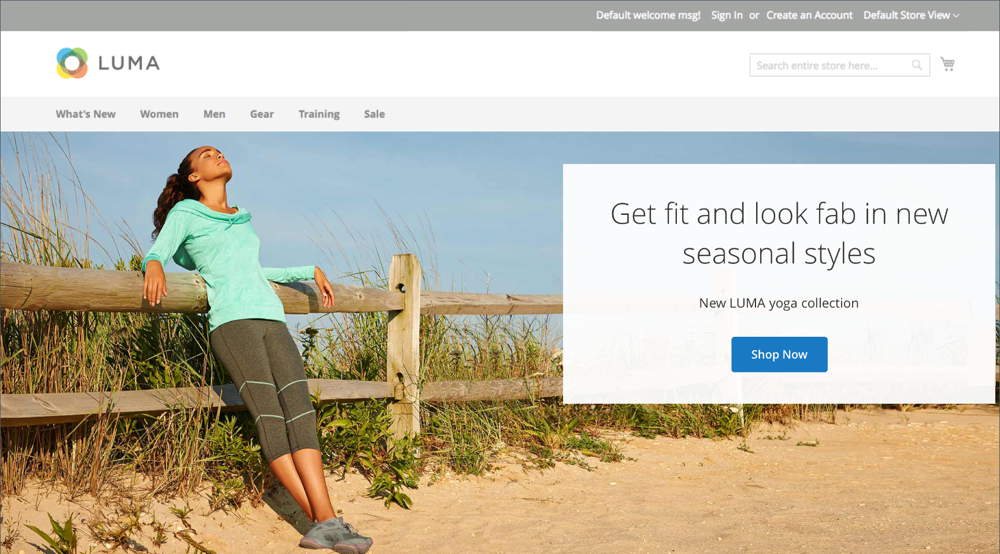

# Media - Banner

Verwenden Sie den Inhaltstyp _Banner_ , um eine illustrierte, interaktive Komponente hinzuzufügen, die Benutzer mit einem Aktionsaufruf und einer Schaltfläche in der [[!DNL Page Builder] Bühne](workspace.md#stage) interagiert.

>[!NOTE]
>
>Zuvor war die Option _Banner_ im Menü &quot;Inhalt&quot;jetzt [Dynamischer Block](../content-design/dynamic-blocks.md).

{width="700" zoomable="yes"}

{{$include /help/_includes/page-builder-save-timeout.md}}

## Banner-Toolbox

Die Banner-Toolbox wird angezeigt, wenn Sie den Mauszeiger über den Banner-Container bewegen.

{width="600" zoomable="yes"}

| Tool | Symbol | Beschreibung |
|--- |--- |--- |
| Verschieben | {width="25"} | Verschiebt das Banner an eine andere Position auf der Bühne. |
| (Titel) | Banner | Identifiziert den aktuellen Inhaltscontainer als Banner. Bewegen Sie den Mauszeiger über den Container, um die Toolbox anzuzeigen. |
| Einstellungen | {width="25"} | Öffnet die Seite Banner bearbeiten , auf der Sie die Eigenschaften des Banners und Containers ändern können. |
| Ausblenden | {width="25"} | Blendet das aktuelle Banner aus. |
| Anzeigen | {width="25"} | Zeigt das ausgeblendete Banner an. |
| Duplizieren | {width="25"} | Kopiert das Banner. |
| Entfernen | {width="25"} | Löscht das Banner aus der Bühne. |
| [!UICONTROL Upload New Image] |  | Lädt ein Bild aus Ihrem lokalen Dateisystem in die Galerie für den Bannerhintergrund hoch. |
| [!UICONTROL Select from Gallery] |  | Verwendet ein vorhandenes Bild aus der Galerie für den Bannerhintergrund. |

{style="table-layout:auto"}

{{$include /help/_includes/page-builder-hidden-element-note.md}}

## Banner hinzufügen

1. Erweitern Sie im Bedienfeld [!DNL Page Builder] den Wert **[!UICONTROL Media]** und ziehen Sie einen Platzhalter **[!UICONTROL Banner]** auf die Bühne.

   {width="600" zoomable="yes"}

   Die Schaltflächen _[!UICONTROL Upload Image]_und_[!UICONTROL Select from Gallery]_ sind enthalten, sodass Sie den Bannerinhalt direkt von der Bühne aus ändern können. Sie können auch den Inhalt auf der Seite _[!UICONTROL Edit Banner]_ändern.

1. Klicken Sie in den Banner-Platzhalter, um den [Texteditor](../content-design/editor.md) anzuzeigen und Inhalt für das Banner einzugeben.

   Mithilfe der Einstellungen für [Inhalt](#content) können Sie auch komplexere Bannerinhalte einfügen.

## Ändern der Bannereinstellungen

1. Bewegen Sie den Mauszeiger über den Banner-Container, um die Toolbox anzuzeigen, und wählen Sie das Symbol _Einstellungen_ ().

1. In den folgenden Abschnitten finden Sie detaillierte Informationen zum Aktualisieren der verfügbaren Einstellungen:

   - [[!UICONTROL Appearance]](#appearance)
   - [[!UICONTROL Content]](#content)
   - [[!UICONTROL Background]](#background)
   - [[!UICONTROL Advanced]](#advanced)

1. Klicken Sie nach Abschluss des Vorgangs in der oberen rechten Ecke auf **[!UICONTROL Save]** , um die Seite _[!UICONTROL Edit Banner]_zu schließen.

1. Klicken Sie oben rechts auf **[!UICONTROL Save]** , um die Einstellungen anzuwenden und zum Arbeitsbereich [!DNL Page Builder] zurückzukehren.

## [!UICONTROL Appearance]

Banner können einfach eingerichtet und gepflegt werden, da sie auf einer von vier vordefinierten Vorlagen basieren.

- Wählen Sie einen der folgenden Bannerplatzierungstypen aus:

  | Platzierung | Beschreibung |
  | --------- | ----------- |
  | [!UICONTROL Poster] | Zentriert Inhalt und Schaltfläche auf dem Banner. Die Überlagerung erweitert bei Verwendung die gesamte Breite des Banners. |
  | [!UICONTROL Collage Left] | Platziert Inhalt und Schaltfläche in einen definierten Bereich auf der linken Seite des Banners. Wenn die Überlagerung verwendet wird, deckt sie nur den definierten Bereich ab. |
  | [!UICONTROL Collage Center] | Platziert Inhalt und Schaltfläche in einen definierten Bereich, der auf dem Banner zentriert ist. Wenn die Überlagerung verwendet wird, deckt sie nur den definierten Bereich ab. |
  | [!UICONTROL Collage Right] | Platziert Inhalt und Schaltfläche in einen definierten Bereich auf der rechten Seite des Banners. Wenn die Überlagerung verwendet wird, deckt sie nur den definierten Bereich ab. |

  {style="table-layout:auto"}

  {width="600" zoomable="yes"}

- (Optional) Geben Sie den **[!UICONTROL Minimum Height]** für die Zeile ein.

  Die Mindesthöhe kann eine Zahl mit einer beliebigen gültigen CSS-Einheit (z. B. `100px`, `50%`, `50em`, `100vh`) oder eine Berechnung (z. B. `100vh - 237px`) sein.

  Sie können beispielsweise die Mindesthöhe eines Banners so festlegen, dass die gesamte Höhe der Seite gestreckt wird. So erhalten Sie überzeugende Optionen für Hintergrundbilder und Videos mit vollständigem Seitenumbruch.

## [!UICONTROL Background]

Es gibt viele Optionen zum Definieren der Hintergrundanzeige eines Banners. Sie können eine einfache Farbe oder ein Hintergrundbild anwenden und komplexere Effekte verwalten.

### [!UICONTROL Background Color]

Geben Sie die Hintergrundfarbe an, indem Sie ein Muster auswählen, auf die Farbauswahl klicken oder einen gültigen Farbnamen oder einen entsprechenden Hexadezimalwert eingeben. Diese Einstellung bestimmt die Hintergrundfarbe der Zeile. Sie können auch die Deckkraft der Farbe anpassen.

{width="200"}

Sie können den Wert auf eine von drei Arten festlegen:

- Ein vordefinierter Farbname, z. B. `White`
- Der hexadezimale Farbwert für die Farbe, z. B. `#ffffff`
- Der rgba-Wert für die Farbe mit Deckkraft-Prozent, z. B. `rgba(255, 255, 255, 0.75)`

Wenn Sie eine Farbe auswählen möchten, klicken Sie auf das Muster links neben dem Feld _Keine Farbe_.

{width="600" zoomable="yes"}

Wenn Sie auf das Farbfeld klicken, um die Farbauswahl erneut zu öffnen, zeigt das Feld unter dem Schieberegler die aktuellen Rot-, Grün-, Blau- und Alpha-Werte (rgba) an. Die letzte Zahl gibt den aktuellen Deckkraftprozentsatz als Dezimalzahl an. Sie können den Schieberegler verwenden, um die Deckkraft anzupassen, oder den gewünschten Dezimalwert eingeben.

{width="600" zoomable="yes"}

>[!NOTE]
>
>[!DNL Page Builder] unterstützt auch eine Transparenzschicht (oder den _Alphakanal_) in Hintergrundbildern, mit der Hintergründe mit unterschiedlicher Deckkraft erstellt werden können.

### [!UICONTROL Background Type]

Ein Hintergrundtyp kann ein Bild oder ein Video sein. [!DNL Page Builder] ist standardmäßig auf `Image` eingestellt und zeigt verschiedene Bildeinstellungen an. Wenn Sie `Video` auswählen, tauscht [!DNL Page Builder] die Bildeinstellungen mit Videoeinstellungen. Die beiden Einstellungen für den Hintergrundtyp werden in den folgenden Abschnitten beschrieben.

{width="200"}

### Bildtypeinstellungen

Wenn Sie den _Hintergrundtyp_ auf `Image` festlegen, verwenden Sie die folgenden Einstellungen, um die Anzeige des Hintergrundbilds zu definieren.

{width="600" zoomable="yes"}

- **[!UICONTROL Background Image]** - Verwenden Sie bei Bedarf die bereitgestellten Tools, um ein Hintergrundbild auszuwählen, das auf das Banner angewendet werden soll:

  | Tool | Beschreibung |
  | ---- | ----------- |
  | [!UICONTROL Upload] | Lädt eine Bilddatei von Ihrem lokalen Computer in die Galerie hoch und wendet sie dann als Hintergrundbild für das Banner an. |
  | [!UICONTROL Select from Gallery] | fordert Sie auf, ein vorhandenes Bild aus der Galerie als Hintergrundbild für das Banner auszuwählen. |
  | {width="25"} | Ermöglicht Ihnen, das Bild entweder auf die Kachel &quot;Kamera&quot;zu ziehen oder zum Bild in Ihrem lokalen Dateisystem zu navigieren. |

  {style="table-layout:auto"}

- **[!UICONTROL Background Mobile Image]** - Verwenden Sie bei Bedarf dieselben Tools, um ein anderes Hintergrundbild für die Anzeige auf Mobilgeräten auszuwählen.

- **[!UICONTROL Background Size]** - Legen Sie diese Option fest, um festzulegen, wie das Hintergrundbild im Verhältnis zur Breite des Banners skaliert wird:

  | Option | Beschreibung |
  | ------ | ----------- |
  | `Cover` | Das Hintergrundbild deckt die gesamte Breite des Banners ab. |
  | `Contain` | Das Hintergrundbild ist auf die Breite des Inhaltsbereichs beschränkt. |
  | `Auto` | Wendet die Größe aus dem aktuellen Stylesheet an. |

  {style="table-layout:auto"}

  {width="200"}

- **[!UICONTROL Background Position]** - Legen Sie diese Option fest, um zu bestimmen, wie das Hintergrundbild im Verhältnis zum Banner verankert ist:

  | Anker | Positionen |
  | ------ | ----------- |
  | `Top` | Links/Mitte/Rechts |
  | `Center` | Links/Mitte/Rechts |
  | `Bottom` | Links/Mitte/Rechts |

  {style="table-layout:auto"}

  Der Ankerpunkt ist wie eine Push-Taste, die das Bild an der angegebenen Hintergrundposition am Banner anhängt.

- **[!UICONTROL Background Attachment]** - Legen Sie den Anlagentyp fest, um zu bestimmen, wie sich das Hintergrundbild im Verhältnis zur Scrollseite bewegt:

  | Option | Beschreibung |
  | ------ | ----------- |
  | `Scroll` | Das angehängte Hintergrundbild wird synchronisiert, um sich beim Bildlauf der Seite nach unten zu bewegen. |
  | `Fixed` | (Für Mobilgeräte nicht verfügbar) Das Hintergrundbild wird nicht verschoben, wenn der Container über das Bild blättert, und ist an der angegebenen Hintergrundposition fixiert. |

  {style="table-layout:auto"}

- **[!UICONTROL Background Repeat]** - Wenn Sie das Hintergrundbild wiederholen möchten, um den Raum zu füllen, ändern Sie diese Einstellung `Yes`.

### Videotypeinstellungen

Wenn Sie die _[!UICONTROL Background Type]_auf `Video` setzen, verwenden Sie die folgenden Einstellungen, um die Anzeige des Hintergrundbilds zu definieren.

- **[!UICONTROL Video URL]** - Geben Sie eine gültige Video-URL ein. Gültige Video-URLs können Links zu folgenden Elementen sein:

   - YouTube-Videos: `https://youtu.be/CoDhMRUUjeI`
   - Video-Videos: `https://vimeo.com/190156113`
   - Gültige Videodateien (`.mp4` wird empfohlen): `https://myvideos.com/spiral.mp4`

  {width="200"}

- **[!UICONTROL Overlay Color]** - Wählen Sie eine Farbe, um einen transparenten Farbton auf das Video anzuwenden.

- **[!UICONTROL Infinite Loop]** - Auf `No` setzen, damit das Video einmal wiedergegeben und gestoppt wird. Wenn der Wert auf &quot;`Yes`&quot;(Standard) gesetzt ist, wiederholt sich das Video in einer Endlosschleife.

- **[!UICONTROL Lazy Load]** - Auf `No` setzen, um das Video mit der Seite zu laden, selbst wenn es nicht sichtbar ist. Wenn der Wert auf &quot;`Yes`&quot;(Standard) gesetzt ist, wird das Video nur aus der Quelle geladen, wenn es auf dem Bildschirm sichtbar ist.

- **[!UICONTROL Play Only When Visible]** - Auf `No` setzen, damit das Video sofort nach dem Laden wiedergegeben wird, unabhängig davon, ob es sichtbar ist. Wenn der Wert auf `Yes` (Standard) gesetzt ist, beginnt die Wiedergabe des Videos nur, wenn es sichtbar ist.

- **[!UICONTROL Fallback Image]** - Geben Sie bei Bedarf ein Bild an, das auf dem Bildschirm angezeigt werden soll, bevor das Video geladen wird, und wenn das Video aus irgendeinem Grund nicht geladen wird.

## [!UICONTROL Content]

Sie können den Bannerinhalt direkt auf der Bühne oder beim Ändern der Einstellungen ändern. Die Einstellungen bieten komplexere Inhaltsfunktionen wie Bannerlinks, Schaltflächen und Überlagerungen. Die Position des Inhalts spiegelt die Platzierungseinstellung [Erscheinungsbild](#appearance) wider.

### Einfacher Inhalt auf der Bühne

1. Klicken Sie auf den Platzhaltertext und geben Sie den Text ein, der im Banner angezeigt werden soll.

   Die Editor-Symbolleiste wird über dem Textfeld angezeigt.

   {width="600" zoomable="yes"}

1. Verwenden Sie die Editor-Symbolleiste, um Text einzugeben und zu formatieren sowie Elemente wie Links, Bilder und Widgets einzufügen.

   {width="600" zoomable="yes"}

### Komplexe Inhalte in den Einstellungen

1. Bewegen Sie den Mauszeiger über den Banner-Container, um die Toolbox anzuzeigen, und wählen Sie das Symbol _Einstellungen_ ( {width="25"} ).

1. Scrollen Sie nach unten zum Abschnitt _[!UICONTROL Content]_und verwenden Sie den Editor **[!UICONTROL Message Text]**, um Bannertext einzugeben und zu formatieren.

   Sie können auch Elemente wie Textlinks, Bilder und Widgets einfügen.

   {width="600" zoomable="yes"}

1. Geben Sie bei Bedarf **[!UICONTROL Link]** für das Banner an.

   Der Link ist die Zielseite, die angezeigt wird, wenn der Kunde auf die Bannerschaltfläche oder -fläche klickt. Sie können einen von drei Linktypen verwenden:

   - **[!UICONTROL URL]** - Links zu einer relativen oder vollständig qualifizierten URL.
   - **[!UICONTROL Product]** - Identifiziert die Zielseite anhand des Produktnamen oder der SKU. Suchen Sie nach dem Produkt anhand des Namens, der entweder auf einem Teil- oder einem vollständigen Namen basiert. Wählen Sie das Produkt aus der Liste der Suchergebnisse aus.
   - **[!UICONTROL Category]** - Identifiziert die Zielseite als eine bestimmte Kategorie oder Unterkategorie im Kategoriebaum. Suchen Sie nach der Kategorie basierend auf einem Teil- oder Vollnamen. Wählen Sie die Kategorie aus dem erweiterten Bereich des angezeigten Baums aus.
   - **[!UICONTROL Page]** - Identifiziert die Zielseite als bestimmte Inhaltsseite. Suchen Sie nach der Seite, die auf einem Teil- oder vollständigen Namen basiert. Wählen Sie die Seite aus der Liste der Suchergebnisse aus.

   >[!NOTE]
   >
   >Ab Version 2.4.1 unterstützt [!DNL Page Builder] die Verknüpfung von Banner und Links innerhalb des verschachtelten Texts aufgrund von Problemen mit der Anzeige auf der Storefront nicht mehr. Wenn Sie einen Link in der _[!UICONTROL Message Text]_verwenden, können Sie die_[!UICONTROL Link]_ -Option nicht konfigurieren. Wenn Sie lieber einen einzelnen Link für das gesamte Banner verwenden möchten, können Sie alle Links aus dem Text entfernen. 
   >
   >{width="200"}

1. Fügen Sie bei Bedarf eine Schaltfläche hinzu, um Kunden aufzufordern, dem Link zu folgen.

   Die Einstellung Bannerdarstellung platziert einen einzelnen Link oder eine einzelne Schaltfläche unter dem Text. Füllen Sie die Eigenschaften des Links oder der Schaltfläche aus, den/die Sie hinzufügen möchten.

   {width="600" zoomable="yes"}

   >[!NOTE]
   >
   >Sie können auch mehrere Schaltflächen oder Links verwenden, indem Sie dem Banner einen [Block](block.md) hinzufügen. Um Konflikte zu vermeiden, behalten Sie alle Links oder Schaltflächen im separaten Block bei und fügen Sie dem Banner keinen Link oder keine Schaltfläche direkt hinzu.

   - Setzen Sie **[!UICONTROL Show Button]** auf einen der folgenden Werte:

     | Option | Beschreibung |
     | ------ | ----------- |
     | `Always` | Eine Schaltfläche wird immer im Banner angezeigt. |
     | `On Hover` | Auf dem Banner wird nur beim Bewegen des Mauszeigers eine Schaltfläche angezeigt. |
     | `Never Show` | Auf dem Banner wird nie eine Schaltfläche angezeigt. |

     {style="table-layout:auto"}

   - Geben Sie den **[!UICONTROL Button Text]** ein, der auf der Schaltfläche angezeigt werden soll.

   - Setzen Sie **[!UICONTROL Button Type]** auf einen der folgenden Werte:

     | Option | Beschreibung |
     | ------ | ----------- |
     | `Primary` | Wendet den primären Schaltflächenstil aus dem aktuellen Stylesheet an. |
     | `Secondary` | Wendet ggf. den sekundären Schaltflächenstil aus dem aktuellen Stylesheet an. |
     | `Link` | Erstellt einen Hyperlink anstelle einer Schaltfläche. |

     {style="table-layout:auto"}

     Der Schaltflächenstil des aktuellen Designs bestimmt das Schaltflächenformat. In der Regel hat eine primäre Schaltfläche eine auffälligere Hintergrundfarbe als eine sekundäre Schaltfläche.

1. Setzen Sie **[!UICONTROL Show Overlay]** auf einen der folgenden Werte:

   | Option | Beschreibung |
   | ------ | ----------- |
   | `Always` | Die Überlagerung ist immer sichtbar. |
   | `On Hover` | Die Überlagerung wird nur beim Bewegen des Mauszeigers angezeigt. |
   | `Never Show` | Die Überlagerung ist nicht sichtbar. |

   {style="table-layout:auto"}

   Sie können eine Überlagerung verwenden, um eine Hintergrundfarbe auf den aktiven Inhaltsbereich anzuwenden, der durch die Einstellung [!UICONTROL Appearance] definiert wird. Das Hintergrundbild des Banners bleibt für die gesamte Breite des Banners sichtbar.

   Wenn Sie eine Überlagerung anzeigen, legen Sie den Wert **[!UICONTROL Overlay Color]** fest:

   - Klicken Sie auf das Muster **Keine Farbe** und wählen Sie ein Muster aus.
   - Geben Sie im Feld **Keine Farbe** entweder einen gültigen Farbnamen oder einen hexadezimalen Wert ein.

   {width="600" zoomable="yes"}

1. Klicken Sie oben rechts auf **[!UICONTROL Save]** , um die Einstellungen anzuwenden und zum Arbeitsbereich [!DNL Page Builder] zurückzukehren.

   {width="600" zoomable="yes"}

## [!UICONTROL Search Engine Optimization] {#seo}

Text für diese Einstellungen ist für Suchmaschinen sichtbar und verbessert die Indexierung der Seite.

- Geben Sie für &quot;**[!UICONTROL Alternative Text]**&quot;eine _alt_ -Textbeschreibung für die anzuzeigenden Tools für die digitale Barrierefreiheit ein.

  Die Verwendung von Alternativtext ist eine Best Practice für Barrierefreiheit und ist in einigen Gebietsschemata gesetzlich vorgeschrieben. In HTML ist das Attribut `alt` eine Untergruppe des Tags `image`: `<image title="tooltip" alt="description" src="image.jpg">`.

- Geben Sie für &quot;**[!UICONTROL Title Attribute]**&quot;den Text ein, der beim Bewegen des Mauszeigers als QuickInfo angezeigt werden soll.

  Als Best Practice wird empfohlen, einen beschreibenden, schlüsselwortreichen Titel zu wählen, um die Indexierung des Bildes durch Suchmaschinen zu verbessern. In HTML ist das Attribut `title` eine Untergruppe des Tags `image`: `<image title="tooltip" alt="description" src="image.jpg">`.

## [!UICONTROL Advanced]

1. Um die horizontale Position der Inhaltscontainer zu steuern, die dem Banner hinzugefügt werden, wählen Sie einen **[!UICONTROL Alignment]**:

   | Option | Beschreibung |
   | ------ | ----------- |
   | `Default` | Wendet die Standardeinstellung für die Ausrichtung an, die im Stylesheet des aktuellen Designs angegeben ist. |
   | `Left` | Richtet die Inhaltscontainer am linken Rand des Bannercontainers aus, wobei der angegebene Abstand berücksichtigt wird. |
   | `Center` | Richtet den Inhalts-Container in der Mitte des Banner-Containers aus, wobei der angegebene Abstand berücksichtigt wird. |
   | `Right` | Richtet den Inhalts-Container am rechten Rand des Banner-Containers aus, wobei der angegebene Abstand berücksichtigt wird. |

   {style="table-layout:auto"}

1. Legen Sie den **[!UICONTROL Border]** -Stil fest, der auf alle vier Seiten des Bannercontainers angewendet wird:

   | Option | Beschreibung |
   | ------ | ----------- |
   | `Default` | Wendet den standardmäßigen Randstil an, der vom zugehörigen Stylesheet angegeben wird. |
   | `None` | liefert keine sichtbare Anzeige der Containergrenzen. |
   | `Dotted` | Der Container-Rahmen wird als gepunktete Linie angezeigt. |
   | `Dashed` | Der Container-Rahmen wird als gestrichelte Linie angezeigt. |
   | `Solid` | Der Container-Rahmen wird als durchgehende Linie angezeigt. |
   | `Double` | Der Container-Rahmen wird als doppelte Linie angezeigt. |
   | `Groove` | Der Container-Rahmen wird als Rillenlinie angezeigt. |
   | `Ridge` | Der Container-Rahmen wird als gekürzte Linie angezeigt. |
   | `Inset` | Der Container-Rahmen wird als Inset-Zeile angezeigt. |
   | `Outset` | Der Container-Rahmen wird als Ausgangspunkt angezeigt. |

   {style="table-layout:auto"}

1. Wenn Sie einen anderen Rahmenstil als `None` festlegen, füllen Sie die Anzeigeoptionen für die Rahmenanzeige aus:

   - **[!UICONTROL Border Color]** - Geben Sie die Farbe an, indem Sie ein Muster auswählen, auf die Farbauswahl klicken oder einen gültigen Farbnamen oder einen entsprechenden Hexadezimalwert eingeben.

     {width="600" zoomable="yes"}

   - **[!UICONTROL Border Width]** - Geben Sie die Anzahl der Pixel für die Rahmenlinienbreite ein.

   - **[!UICONTROL Border Radius]** - Geben Sie die Anzahl der Pixel an, um die Größe des Radius zu definieren, der zum Runden jeder Ecke des Rahmens verwendet wird.

1. (Optional) Geben Sie die Namen von **[!UICONTROL CSS classes]** aus dem aktuellen Stylesheet an, das auf den Bannercontainer angewendet werden soll.

   Trennen Sie mehrere Klassennamen durch ein Leerzeichen.

1. Geben Sie Werte in Pixel an, damit der Wert **[!UICONTROL Margins and Padding]** die äußeren Ränder und den inneren Abstand des Banners angibt.

   Geben Sie jeden entsprechenden Wert in das Banner-Container-Diagramm ein.

   | Option | Beschreibung |
   | ------ | ----------- |
   | [!UICONTROL Margins] | Die Menge an leerem Raum, die auf den äußeren Rand aller Seiten des Containers angewendet wird. |
   | [!UICONTROL Padding] | Die Menge an leerem Raum, die auf den inneren Rand aller Seiten des Containers angewendet wird. |

   {style="table-layout:auto"}
