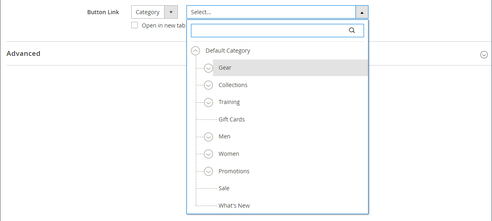
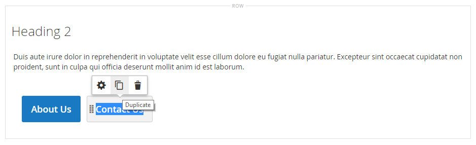

# Elemente - Schaltflächen

Verwenden Sie den _Schaltflächen_-Inhaltstyp, um entweder eine einzelne Schaltfläche oder eine Reihe von Schaltflächen in der [[!DNL Page Builder] Phase](workspace.md#stage) hinzuzufügen. Sie können Schaltflächen horizontal oder vertikal anordnen und sie direkt zu Zeilen, Spalten, Registerkarten und Bannern auf der Bühne hinzufügen.

{width="600" zoomable="yes"}

{{$include /help/_includes/page-builder-save-timeout.md}}

## Toolboxes

Wenn Sie mit dem Inhaltstyp Schaltflächen arbeiten, fügen Sie einzelne Schaltflächen und den Schaltflächen-Container, der eine oder mehrere Schaltflächen enthält, hinzu und bearbeiten diese. Jeder verfügt über seine eigene Toolbox, mit der Sie Schaltflächen auf der [!DNL Page Builder] entwerfen können.

### Individuelle Schaltflächen-Toolbox

{width="500" zoomable="yes"}

| Tool | Symbol | Beschreibung |
| --------- | -------- | -------------- |
| Einstellungen | {width="25"} | Öffnet die Seite Schaltfläche Bearbeiten, auf der Sie die Eigenschaften der Schaltfläche ändern können. |
| Duplikat | {width="25"} | Erstellt eine Kopie der Schaltfläche. |
| entfernen | {width="25"} | Löscht die Schaltfläche aus der Phase. |

{style="table-layout:auto"}

### Schaltflächen-Container-Toolbox

{width="500" zoomable="yes"}

| Tool | Symbol | Beschreibung |
| --------- | ----------------- | ----------- |
| Verschieben | {width="25"} | Verschiebt den Schaltflächen-Container an eine andere gültige Position auf der Seite. |
| Hinzufügen | {width="25"} | Fügt dem Container eine Schaltfläche hinzu. |
| (Bezeichnung) | Schaltfläche | Identifiziert den aktuellen Container als Schaltflächenelement. |
| Einstellungen | {width="25"} | Öffnet die Seite Schaltflächen bearbeiten , auf der Sie die Eigenschaften des Containers ändern können. |
| Ausblenden | {width="25"} | Blendet den Schaltflächen-Container aus. |
| Anzeigen | {width="25"} | Zeigt den ausgeblendeten Schaltflächen-Container an. |
| Duplikat | {width="25"} | Erstellt eine Kopie des Schaltflächen-Containers. |
| entfernen | {width="25"} | Löscht den Schaltflächen-Container und seinen Inhalt aus der Phase . |

{style="table-layout:auto"}

{{$include /help/_includes/page-builder-hidden-element-note.md}}

## Individuelle Schaltfläche hinzufügen

1. Erweitern Sie im [!DNL Page Builder] Bedienfeld **[!UICONTROL Elements]** und ziehen Sie einen **[!UICONTROL Buttons]** Platzhalter in eine Zeile, Spalte oder einen Tab, die bzw. der auf dem Bühnenbild festgelegt ist.

   {width="500" zoomable="yes"}

1. Bewegen Sie den Mauszeiger über die Schaltfläche, um die Toolbox anzuzeigen, und wählen _das Symbol_ Einstellungen) aus.

1. Geben Sie die **[!UICONTROL Button Text]** ein, die auf der Schaltfläche angezeigt werden soll.

   {width="600" zoomable="yes"}

1. Legen Sie **[!UICONTROL Button Type]** auf eine der folgenden Einstellungen fest:

   | Typ | Beschreibung |
   | ------ | ----------- |
   | `Primary` | Wendet die primäre Schaltflächenformatvorlage aus dem aktuellen Stylesheet an. |
   | `Secondary` | Wendet ggf. das sekundäre Schaltflächenformat aus dem aktuellen Stylesheet an. |
   | `Link` | Erstellt statt einer Schaltfläche einen Hyperlink. |

   {style="table-layout:auto"}

   Beispiel für eine Primäre und eine sekundäre Schaltfläche {width="500" zoomable="yes"}

1. Legen Sie die **[!UICONTROL Button Link]** mit einem der folgenden Typen fest:

   - **[!UICONTROL URL]** - Geben Sie die Ziel-URL für den Link ein.

     Die URL kann entweder ein relativer Link zu einem Produkt oder einer Seite in Ihrem Store oder eine vollständig qualifizierte URL sein.

     Beispiel für eine relative URL - `../luma-analog-watch.html`

     Beispiel einer vollqualifizierten URL: `http://mystore.com/luma-analog-watch.html`

     Wenn der Link zu einer anderen Website führt, können Sie die aktuelle Seite in Ihrem Store offen halten, indem Sie den Link in einer neuen Browser-Registerkarte öffnen.

     Um zu verhindern, dass der Besucher Ihren Store verlässt, aktivieren Sie das Kontrollkästchen **[!UICONTROL Open in new tab]** .

   - **[!UICONTROL Product]** : Geben Sie einen Produktnamen (teilweise oder vollständig) oder eine SKU ein und wählen Sie dann den Produktnamen in der Liste aus.

     >[!NOTE]
     >
     >Die Produkte werden in der Liste entsprechend den Einstellungen _Nicht vorrätige Produkte anzeigen_ angezeigt. Bei Händlern mit mehreren Source, die [Inventory management](../inventory-management/introduction.md) verwenden, ist die Produktliste durch die Quelle begrenzt, die nur der Standard-Website zugewiesen ist.

     {width="600" zoomable="yes"}

   - **[!UICONTROL Category]** : Geben Sie einen Kategorienamen ein (teilweise oder vollständig) oder klicken Sie in das leere Feld, um die Kategoriestruktur anzuzeigen. Wählen Sie dann den Kategorienamen in der Baumstruktur aus.

     {width="600" zoomable="yes"}

   - **[!UICONTROL Page]** : Geben Sie den Namen einer CMS-Seite ein (teilweise oder vollständig) oder klicken Sie in das leere Feld, um die vollständige Liste anzuzeigen. Wählen Sie dann den Namen der Seite in der Suchergebnisliste aus.

     {width="600" zoomable="yes"}

1. Füllen Sie [Erweiterte Einstellungen][advanced-settings] nach Bedarf aus.

1. Wenn Sie fertig sind, klicken Sie oben rechts auf **[!UICONTROL Save]** , um die Einstellungen anzuwenden und zum Arbeitsbereich [!DNL Page Builder] zurückzukehren.

## Schaltflächensatz hinzufügen

In den folgenden Abschnitten wird eine Reihe von Schritten beschrieben, die mit einer einzelnen Schaltfläche beginnen und einen Satz von drei Schaltflächen in einem Schaltflächen-Container erstellen. Wenn Sie noch keine einzelne Schaltfläche haben, befolgen Sie die vorherigen Anweisungen, um eine einzelne Schaltfläche zum Schritt hinzuzufügen.

### Schritt 1: Zweite Schaltfläche erstellen

1. Bewegen Sie den Mauszeiger über den Schaltflächen-Container, um die Toolbox anzuzeigen, und wählen _das Symbol_ Hinzufügen{width="20"} ) aus.

   {width="500" zoomable="yes"}

1. Geben Sie den Text ein, der auf der zweiten Schaltfläche angezeigt werden soll.

1. Klicken Sie auf die Schaltfläche „Neu“, um die Toolbox anzuzeigen, und wählen _das Symbol_ Einstellungen{width="20"}) aus.

   {width="500" zoomable="yes"}

1. Legen Sie **[!UICONTROL Button Type]** auf `Secondary` fest.

1. Richten Sie die **[!UICONTROL Button Link]** nach Bedarf ein.

   Im folgenden Beispiel ist der Link eine relative URL, die zur Seite [Kontakt](../getting-started/store-details.md#contact-us-form) führt.

   {width="600" zoomable="yes"}

1. Füllen Sie [Erweiterte Einstellungen][advanced-settings] nach Bedarf aus.

1. Klicken Sie abschließend auf **[!UICONTROL Save]** , um die Einstellungen anzuwenden und zum Arbeitsbereich [!DNL Page Builder] zurückzukehren.

### Schritt 2: Dritte Schaltfläche erstellen

1. Klicken Sie erneut auf die zweite Schaltfläche auf der Bühne und wählen Sie das Symbol _Duplizieren_ ( {width="20"} ) aus.

   {width="500" zoomable="yes"}

1. Geben Sie den Text ein, der auf der dritten Schaltfläche angezeigt werden soll.

1. Klicken Sie auf die dritte Schaltfläche, um die Toolbox anzuzeigen, und wählen Sie das Symbol _Einstellungen_ ( {width="20"} ) aus.

   {width="500" zoomable="yes"}

1. Aktualisieren Sie die **[!UICONTROL Button Link]** nach Bedarf.

1. Klicken Sie oben rechts auf **[!UICONTROL Save]** , um die Einstellungen anzuwenden und zum Arbeitsbereich [!DNL Page Builder] zurückzukehren.

### Schritt 3: Button-Container aktualisieren

1. Bewegen Sie den Mauszeiger über den Schaltflächen-Container, um die Toolbox anzuzeigen, und wählen Sie _Symbol_ Einstellungen{width="20"} ) aus.

   {width="500" zoomable="yes"}

1. Wählen Sie unter _[!UICONTROL Appearance]_&#x200B;die Option **[!UICONTROL Stacked]**&#x200B;aus.

1. Legen Sie **[!UICONTROL All Buttons are same size]** auf `Yes` fest.

   {width="300"}

1. Aktualisieren Sie die verbleibenden Einstellungen nach Bedarf mithilfe der Beschreibungen unter [Einstellungen für einen Schaltflächen-Container ändern][button-container].

1. Klicken Sie abschließend auf **[!UICONTROL Save]** , um die Einstellungen anzuwenden und zum Arbeitsbereich [!DNL Page Builder] zurückzukehren.

   Die gesamte gestapelte Tastenmenge wird auf der Bühne mit einer primären Taste und zwei sekundären Tasten angezeigt.

   {width="500" zoomable="yes"}

## Schaltfläche verschieben

1. Klicken Sie auf die Schaltfläche, die Sie verschieben möchten.

1. Wählen Sie das Symbol Verschieben ( {width="20"} ) aus, das unmittelbar vor dem Schaltflächentext angezeigt wird, und ziehen Sie es an eine neue Position für die Schaltfläche im Schaltflächen-Container.

   {width="500" zoomable="yes"}

## Ändern der Einstellungen für eine Schaltfläche

1. Klicken Sie auf die Schaltfläche auf der Bühne, um die Toolbox anzuzeigen, und wählen Sie _Symbol_ Einstellungen{width="20"} ) aus.

   {width="500" zoomable="yes"}

1. Aktualisieren Sie die Standardeinstellungen nach Bedarf.

   - **[!UICONTROL Button Text]** - Geben Sie den Text ein, der auf der Schaltfläche angezeigt werden soll (kann auch direkt von der Bühne aus aktualisiert werden).

   - **[!UICONTROL Button Type]** - Bestimmt das Schaltflächenformat.

     | Typ | Beschreibung |
     | ------ | ----------- |
     | `Primary` | Wendet die primäre Schaltflächenformatvorlage aus dem aktuellen Stylesheet an. |
     | `Secondary` | Wendet ggf. die sekundäre Schaltflächenformatvorlage aus dem aktuellen Stylesheet an. |
     | `Link` | Erstellt statt einer Schaltfläche einen Hyperlink. |

     {style="table-layout:auto"}

   - **[!UICONTROL Button Link]** - Bestimmt die Zielseite, die bereitgestellt wird, wenn auf die Schaltfläche geklickt wird.

     | Option | Beschreibung |
     | ------ | ----------- |
     | `URL` | Verwendet entweder eine relative oder eine vollqualifizierte URL zur Identifizierung der Zielseite. |
     | `Product` | Identifiziert die Zielseite anhand des Produktnamens oder der SKU. Der Produktname kann entweder anhand eines Teil- oder eines vollständigen Namens gesucht werden. Das Produkt wird dann aus der Liste der Suchergebnisse ausgewählt. |
     | `Category` | Gibt die Zielseite als eine bestimmte Kategorie oder Unterkategorie in der Kategoriestruktur an. |
     | `Page` | Identifiziert die Zielseite als eine bestimmte CMS-Seite. |

     {style="table-layout:auto"}

1. Füllen Sie [Erweiterte Einstellungen][advanced-settings] nach Bedarf aus.

1. Um die Einstellungen zu speichern und zum Arbeitsbereich &quot;[!DNL Page Builder]&quot; zurückzukehren, klicken Sie oben rechts auf **[!UICONTROL Save]** .

## Ändern der Einstellungen für einen Schaltflächen-Container

1. Bewegen Sie den Mauszeiger über den Schaltflächen-Container, um die Toolbox anzuzeigen, und wählen Sie _Symbol_ Einstellungen{width="20"} ) aus.

1. Aktualisieren Sie die **[!UICONTROL Appearance]** nach Bedarf.

   - Verwenden Sie die Anordnungsoptionen, um die Schaltflächen entweder horizontal oder vertikal im Container anzuzeigen:

     | Option | Beschreibung |
     | ------ | ----------- |
     | `Inline` | Ordnet die Schaltflächen horizontal an. |
     | `Stacked` | Ordnet die Schaltflächen vertikal an. |

     {style="table-layout:auto"}

   - Legen Sie die Option **[!UICONTROL All buttons are same size]** entsprechend Ihren Anforderungen fest.

     Bei Festlegung auf `Yes` haben alle Schaltflächen im Container eine konsistente Größe, die auf der Länge des längsten Schaltflächentextes basiert.

1. Füllen Sie [Erweiterte Einstellungen][advanced-settings] nach Bedarf aus.

1. Klicken Sie abschließend auf **[!UICONTROL Save]** , um die Einstellungen anzuwenden und zum Arbeitsbereich [!DNL Page Builder] zurückzukehren.

## Erweiterte Einstellungen ändern

Sie können die _[!UICONTROL Advanced]_&#x200B;für einzelne Schaltflächen und für den Schaltflächen-Container ändern.

1. Um die Positionierung innerhalb des übergeordneten Containers zu steuern, wählen Sie die **[!UICONTROL Alignment]**:

   | Option | Beschreibung |
   | ------ | ----------- |
   | `Default` | Wendet die Standardeinstellung für die Ausrichtung an, die im Stylesheet des aktuellen Designs angegeben ist. |
   | `Left` | Richtet den Inhalt am linken Rand des übergeordneten Containers aus, wobei ein etwaiger Abstand berücksichtigt wird. |
   | `Center` | Richtet den Inhalt in der Mitte des übergeordneten Containers aus, wobei ein etwaiger Abstand berücksichtigt wird. |
   | `Right` | Richtet den Inhalt am rechten Rand des übergeordneten Containers aus, wobei ein beliebiger Abstand berücksichtigt wird. |

   {style="table-layout:auto"}

1. Legen Sie den **[!UICONTROL Border]** fest, der auf alle vier Seiten des Schaltflächen- oder Schaltflächen-Containers angewendet wird:

   | Option | Beschreibung |
   | ------ | ----------- |
   | `Default` | Wendet die Standardformatvorlage für Rahmen an, die im zugehörigen Stylesheet angegeben ist. |
   | `None` | Zeigt keine sichtbaren Begrenzungen des Containers an. |
   | `Dotted` | Der Container-Rahmen wird als gepunktete Linie angezeigt. |
   | `Dashed` | Der Container-Rahmen wird als gestrichelte Linie angezeigt. |
   | `Solid` | Der Container-Rahmen wird als durchgezogene Linie angezeigt. |
   | `Double` | Der Container-Rahmen wird als doppelte Linie angezeigt. |
   | `Groove` | Der Container-Rahmen wird als gerillte Linie angezeigt. |
   | `Ridge` | Der Container-Rahmen wird als geriffelte Linie angezeigt. |
   | `Inset` | Der Container-Rahmen wird als Einfügelinie angezeigt. |
   | `Outset` | Der Container-Rahmen wird als Ausgangslinie angezeigt. |

   {style="table-layout:auto"}

1. Wenn Sie einen anderen Rahmenstil als `None` festlegen, müssen Sie die Anzeigeoptionen für den Rahmen vervollständigen:

   | Option | Beschreibung |
   | ------ |------------ |
   | [!UICONTROL Border Color] | Geben Sie die Farbe an, indem Sie einen Musterabschnitt auswählen, auf die Farbauswahl klicken oder einen gültigen Farbnamen oder einen entsprechenden Hexadezimalwert eingeben. |
   | [!UICONTROL Border Width] | Geben Sie die Anzahl der Pixel für die Rahmenlinienbreite ein. |
   | [!UICONTROL Border Radius] | Geben Sie die Anzahl der Pixel ein, um die Größe des Radius festzulegen, mit dem jede Ecke des Rahmens gerundet werden soll. |

   {style="table-layout:auto"}

1. (Optional) Geben Sie die Namen der **[!UICONTROL CSS classes]** aus dem aktuellen Stylesheet an, die auf die Schaltfläche oder den Schaltflächen-Container angewendet werden sollen.

   Trennen Sie mehrere Klassennamen durch ein Leerzeichen.

1. Geben Sie Werte in Pixeln für die **[!UICONTROL Margins and Padding]** ein, um die äußeren Ränder und den inneren Abstand der Schaltfläche oder des Schaltflächen-Containers zu bestimmen.

   Geben Sie die entsprechenden Werte in das Diagramm ein.

   | Container-Bereich | Beschreibung |
   | -------------- | ----------- |
   | [!UICONTROL Margins] | Die Menge des Leerraums, der auf die Außenkante aller Seiten des Containers angewendet wird. Optionen: `Top` / `Right` / `Bottom` / `Left` |
   | [!UICONTROL Padding] | Die Menge des Leerraums, der auf die Innenkante aller Seiten des Containers angewendet wird. Optionen: `Top` / `Right` / `Bottom` / `Left` |

   {style="table-layout:auto"}

[advanced-settings]: #change-advanced-settings
[button-container]: #change-settings-for-a-button-container

<!-- Last updated from includes: 2023-09-11 14:30:19 -->
