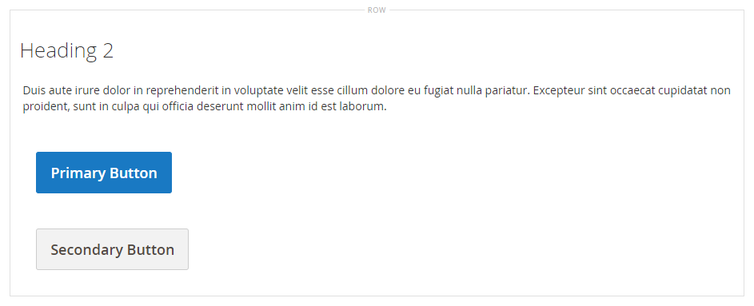

# Elemente - Schaltflächen

Verwenden Sie die _Schaltflächen_ Inhaltstyp zum Hinzufügen einer einzelnen Schaltfläche oder einer Reihe von Schaltflächen im [[!DNL Page Builder] Schritt](workspace.md#stage). Sie können Schaltflächen horizontal oder vertikal anordnen und sie direkt zu Zeilen, Spalten, Registerkarten und Bannern auf der Bühne hinzufügen.

{width="600" zoomable="yes"}

{{$include /help/_includes/page-builder-save-timeout.md}}

## Toolboxes

Wenn Sie mit dem Inhaltstyp Schaltflächen arbeiten, fügen Sie einzelne Schaltflächen und den Schaltflächen-Container, der mindestens eine Schaltfläche enthält, hinzu und bearbeiten diese. Jede verfügt über eine eigene Toolbox, mit der Sie Schaltflächen auf [!DNL Page Builder] Bühne.

### Symbolleiste für einzelne Schaltflächen

{width="500" zoomable="yes"}

| Tool | Symbol | Beschreibung |
| --------- | -------- | -------------- |
| Einstellungen | {width="25"} | Öffnet die Seite Schaltfläche bearbeiten , auf der Sie die Eigenschaften der Schaltfläche ändern können. |
| Duplizieren | {width="25"} | Kopiert die Schaltfläche. |
| Entfernen | {width="25"} | Löscht die Schaltfläche aus der Bühne. |

{style="table-layout:auto"}

### Schaltflächen-Container-Toolbox

{width="500" zoomable="yes"}

| Tool | Symbol | Beschreibung |
| --------- | ----------------- | ----------- |
| Verschieben | {width="25"} | Verschiebt den Schaltflächen-Container an eine andere gültige Position auf der Seite. |
| Hinzufügen | {width="25"} | Fügt eine Schaltfläche zum Container hinzu. |
| (Titel) | Schaltfläche | Identifiziert den aktuellen Container als Schaltflächenelement. |
| Einstellungen | {width="25"} | Öffnet die Seite &quot;Schaltflächen bearbeiten&quot;, auf der Sie die Eigenschaften des Containers ändern können. |
| Ausblenden | {width="25"} | Blendet den Schaltflächencontainer aus. |
| Anzeigen | {width="25"} | Zeigt den ausgeblendeten Schaltflächen-Container an. |
| Duplizieren | {width="25"} | Kopiert den Schaltflächen-Container. |
| Entfernen | {width="25"} | Löscht den Schaltflächen-Container und seinen Inhalt aus der Bühne. |

{style="table-layout:auto"}

{{$include /help/_includes/page-builder-hidden-element-note.md}}

## Hinzufügen einer einzelnen Schaltfläche

1. Im [!DNL Page Builder] Bedienfeld, erweitern **[!UICONTROL Elements]** und ziehen Sie eine **[!UICONTROL Buttons]** Platzhalter für eine Zeile, Spalte oder Registerkarte, die auf der Bühne festgelegt ist.

   {width="500" zoomable="yes"}

1. Bewegen Sie den Mauszeiger über die Schaltfläche, um die Symbolleiste anzuzeigen, und wählen Sie die _Einstellungen_ ().

1. Geben Sie die **[!UICONTROL Button Text]** auf der Schaltfläche angezeigt.

   {width="600" zoomable="yes"}

1. Satz **[!UICONTROL Button Type]** auf einen der folgenden Werte zu:

   | Typ | Beschreibung |
   | ------ | ----------- |
   | `Primary` | Wendet den primären Schaltflächenstil aus dem aktuellen Stylesheet an. |
   | `Secondary` | Wendet ggf. den sekundären Schaltflächenstil aus dem aktuellen Stylesheet an. |
   | `Link` | Erstellt einen Hyperlink anstelle einer Schaltfläche. |

   {style="table-layout:auto"}

   {width="500" zoomable="yes"}

1. Legen Sie die **[!UICONTROL Button Link]** mit einem der folgenden Typen:

   - **[!UICONTROL URL]** - Geben Sie die Ziel-URL für den Link ein.

     Die URL kann entweder ein relativer Link zu einem Produkt oder einer Seite in Ihrem Store oder eine vollständig qualifizierte URL sein.

     Beispiel für eine relative URL - `../luma-analog-watch.html`

     Vollständig qualifiziertes URL-Beispiel - `http://mystore.com/luma-analog-watch.html`

     Wenn der Link zu einer anderen Website führt, können Sie die aktuelle Seite für Ihren Store offen halten, indem Sie den Link in einer neuen Browser-Registerkarte öffnen.

     Um zu verhindern, dass Besucher von Ihrem Store weg navigieren, wählen Sie die **[!UICONTROL Open in new tab]** aktivieren.

   - **[!UICONTROL Product]** - Geben Sie einen Produktnamen (teilweise oder vollständig) oder eine SKU ein und wählen Sie dann den Produktnamen in der Liste aus.

     >[!NOTE]
     >
     >Die Produkte werden in der Liste entsprechend der Variablen _Nicht vorrätige Produkte anzeigen_ -Einstellungen. Für Multi-Source-Händler mit [Inventory management](../inventory-management/introduction.md)festgelegt ist, ist die Produktliste nur durch die der Standardwebsite zugewiesene Quelle beschränkt.

     {width="600" zoomable="yes"}

   - **[!UICONTROL Category]** - Geben Sie einen Kategorienamen (teilweise oder vollständig) ein oder klicken Sie in das leere Feld, um die Kategorienstruktur anzuzeigen. Wählen Sie dann den Kategorienamen im Baum aus.

     {width="600" zoomable="yes"}

   - **[!UICONTROL Page]** - Geben Sie den Namen einer CMS-Seite ein (teilweise oder vollständig) oder klicken Sie in das leere Feld, um die vollständige Liste anzuzeigen. Wählen Sie dann den Namen der Seite in der Liste der Suchergebnisse aus.

     {width="600" zoomable="yes"}

1. Führen Sie die [Erweiterte Einstellungen][advanced-settings] nach Bedarf.

1. Wenn Sie fertig sind, klicken Sie auf **[!UICONTROL Save]** in der oberen rechten Ecke, um die Einstellungen anzuwenden und zum [!DNL Page Builder] Arbeitsbereich.

## Schaltflächensatz hinzufügen

In den folgenden Abschnitten werden eine Reihe von Schritten beschrieben, die mit einer einzelnen Schaltfläche beginnen und eine Reihe von drei Schaltflächen in einem Schaltflächencontainer erstellen. Wenn Sie noch keine einzelne Schaltfläche haben, befolgen Sie die vorherigen Anweisungen, um der Bühne eine einzelne Schaltfläche hinzuzufügen.

### Schritt 1: Zweite Schaltfläche erstellen

1. Bewegen Sie den Mauszeiger über den Schaltflächencontainer, um die Toolbox anzuzeigen und die _Hinzufügen_ ( {width="20"} ).

   {width="500" zoomable="yes"}

1. Geben Sie den Text ein, der auf der zweiten Schaltfläche angezeigt werden soll.

1. Klicken Sie auf die neue Schaltfläche, um die zugehörige Symbolleiste anzuzeigen, und wählen Sie die _Einstellungen_ ( {width="20"} ).

   {width="500" zoomable="yes"}

1. Satz **[!UICONTROL Button Type]** nach `Secondary`.

1. Richten Sie die **[!UICONTROL Button Link]** nach Bedarf.

   Im folgenden Beispiel ist der Link eine relative URL, die an die [Kontakt](../getting-started/store-details.md#contact-us-form) Seite.

   {width="600" zoomable="yes"}

1. Führen Sie die [Erweiterte Einstellungen][advanced-settings] nach Bedarf.

1. Wenn Sie fertig sind, klicken Sie auf **[!UICONTROL Save]** , um die Einstellungen anzuwenden und zum [!DNL Page Builder] Arbeitsbereich.

### Schritt 2: Dritte Schaltfläche erstellen

1. Klicken Sie erneut auf die zweite Schaltfläche auf der Bühne und wählen Sie die _Duplizieren_ ( {width="20"} ).

   {width="500" zoomable="yes"}

1. Geben Sie den Text ein, der auf der dritten Schaltfläche angezeigt werden soll.

1. Klicken Sie auf die dritte Schaltfläche, um die Toolbox anzuzeigen, und wählen Sie die _Einstellungen_ ( {width="20"} ).

   {width="500" zoomable="yes"}

1. Aktualisieren Sie die **[!UICONTROL Button Link]** nach Bedarf.

1. Klicken Sie oben rechts auf **[!UICONTROL Save]** , um die Einstellungen anzuwenden und zum [!DNL Page Builder] Arbeitsbereich.

### Schritt 3: Aktualisieren des Schaltflächencontainers

1. Bewegen Sie den Mauszeiger über den Schaltflächencontainer, um die Toolbox anzuzeigen und die _Einstellungen_ ( {width="20"} ).

   {width="500" zoomable="yes"}

1. under _[!UICONTROL Appearance]_auswählen **[!UICONTROL Stacked]**.

1. Satz **[!UICONTROL All Buttons are same size]** nach `Yes`.

   {width="300"}

1. Aktualisieren Sie die restlichen Einstellungen nach Bedarf mithilfe der Beschreibungen unter [Einstellungen für einen Schaltflächencontainer ändern][button-container].

1. Wenn Sie fertig sind, klicken Sie auf **[!UICONTROL Save]** , um die Einstellungen anzuwenden und zum [!DNL Page Builder] Arbeitsbereich.

   Auf der Bühne wird der gesamte gestapelte Schaltflächensatz mit einer primären und zwei sekundären Schaltflächen angezeigt.

   {width="500" zoomable="yes"}

## Schaltfläche verschieben

1. Klicken Sie auf die Schaltfläche, die Sie verschieben möchten.

1. Ziehen Sie die Verschiebung ( {width="20"} ), das direkt vor dem Schaltflächentext an eine neue Position für die Schaltfläche im Schaltflächencontainer angezeigt wird.

   {width="500" zoomable="yes"}

## Einstellungen für eine Schaltfläche ändern

1. Klicken Sie auf die Schaltfläche auf der Bühne, um die Symbolleiste anzuzeigen, und wählen Sie die _Einstellungen_ ( {width="20"} ).

   {width="500" zoomable="yes"}

1. Aktualisieren Sie die Standardeinstellungen nach Bedarf.

   - **[!UICONTROL Button Text]** - Geben Sie den Text ein, der auf der Schaltfläche angezeigt werden soll (kann auch direkt von der Bühne aus aktualisiert werden).

   - **[!UICONTROL Button Type]** - Bestimmt das Schaltflächenformat.

     | Typ | Beschreibung |
     | ------ | ----------- |
     | `Primary` | Wendet den primären Schaltflächenstil aus dem aktuellen Stylesheet an. |
     | `Secondary` | Wendet ggf. den sekundären Schaltflächenstil aus dem aktuellen Stylesheet an. |
     | `Link` | Erstellt einen Hyperlink anstelle einer Schaltfläche. |

     {style="table-layout:auto"}

   - **[!UICONTROL Button Link]** - Bestimmt die Zielseite, die beim Klicken auf die Schaltfläche angezeigt wird.

     | Option | Beschreibung |
     | ------ | ----------- |
     | `URL` | Verwendet entweder eine relative oder vollständig qualifizierte URL zur Identifizierung der Zielseite. |
     | `Product` | Identifiziert die Zielseite basierend auf dem Produktnamen oder der SKU. Der Produktname kann basierend auf einem Teil- oder Vollnamen gesucht werden. Das Produkt wird dann aus der Liste der Suchergebnisse ausgewählt. |
     | `Category` | Identifiziert die Zielseite als eine bestimmte Kategorie oder Unterkategorie im Kategoriebaum. |
     | `Page` | Identifiziert die Zielseite als spezifische CMS-Seite. |

     {style="table-layout:auto"}

1. Führen Sie die [Erweiterte Einstellungen][advanced-settings] nach Bedarf.

1. So speichern Sie die Einstellungen und kehren zum [!DNL Page Builder] Arbeitsbereich, klicken Sie auf **[!UICONTROL Save]** in der oberen rechten Ecke.

## Einstellungen für einen Schaltflächencontainer ändern

1. Bewegen Sie den Mauszeiger über den Schaltflächencontainer, um die Toolbox anzuzeigen und die _Einstellungen_ ( {width="20"} ).

1. Aktualisieren Sie die **[!UICONTROL Appearance]** nach Bedarf.

   - Verwenden Sie die Anordnungsoptionen, um die Schaltflächen entweder horizontal oder vertikal im Container anzuzeigen:

     | Option | Beschreibung |
     | ------ | ----------- |
     | `Inline` | Ordnet die Schaltflächen horizontal an. |
     | `Stacked` | Ordnet die Schaltflächen vertikal an. |

     {style="table-layout:auto"}

   - Legen Sie die **[!UICONTROL All buttons are same size]** nach Ihren Wünschen.

     Wenn festgelegt auf `Yes`enthalten, haben alle Schaltflächen im Container eine konsistente Größe, die auf der Länge des längsten Schaltflächentextes basiert.

1. Führen Sie die [Erweiterte Einstellungen][advanced-settings] nach Bedarf.

1. Wenn Sie fertig sind, klicken Sie auf **[!UICONTROL Save]** , um die Einstellungen anzuwenden und zum [!DNL Page Builder] Arbeitsbereich.

## Erweiterte Einstellungen ändern

Sie können _[!UICONTROL Advanced]_Einstellungen für einzelne Schaltflächen und für den Schaltflächencontainer.

1. Um die Positionierung innerhalb des übergeordneten Containers zu steuern, wählen Sie die **[!UICONTROL Alignment]**:

   | Option | Beschreibung |
   | ------ | ----------- |
   | `Default` | Wendet die Standardeinstellung für die Ausrichtung an, die im Stylesheet des aktuellen Designs angegeben ist. |
   | `Left` | Richtet den Inhalt am linken Rand des übergeordneten Containers aus, wobei der angegebene Abstand berücksichtigt wird. |
   | `Center` | Richtet den Inhalt in der Mitte des übergeordneten Containers aus, wobei der angegebene Abstand berücksichtigt wird. |
   | `Right` | Richtet den Inhalt am rechten Rand des übergeordneten Containers aus, wobei der angegebene Abstand berücksichtigt wird. |

   {style="table-layout:auto"}

1. Legen Sie die **[!UICONTROL Border]** Stil angewendet auf alle vier Seiten des Schaltflächen- oder Schaltflächen-Containers:

   | Option | Beschreibung |
   | ------ | ----------- |
   | `Default` | Wendet den standardmäßigen Randstil an, der vom zugehörigen Stylesheet angegeben wird. |
   | `None` | liefert keine sichtbare Anzeige der Containergrenzen. |
   | `Dotted` | Der Container-Rahmen wird als gepunktete Linie angezeigt. |
   | `Dashed` | Der Container-Rahmen wird als gestrichelte Linie angezeigt. |
   | `Solid` | Der Container-Rahmen wird als durchgehende Linie angezeigt. |
   | `Double` | Der Container-Rahmen wird als doppelte Linie angezeigt. |
   | `Groove` | Der Container-Rahmen wird als Rillenlinie angezeigt. |
   | `Ridge` | Der Container-Rahmen wird als gekürzte Linie angezeigt. |
   | `Inset` | Der Container-Rahmen wird als Inset-Zeile angezeigt. |
   | `Outset` | Der Container-Rahmen wird als Ausgangspunkt angezeigt. |

   {style="table-layout:auto"}

1. Wenn Sie einen anderen Rahmenstil als `None`, füllen Sie die Randanzeigeoptionen aus:

   | Option | Beschreibung |
   | ------ |------------ |
   | [!UICONTROL Border Color] | Geben Sie die Farbe an, indem Sie ein Muster auswählen, auf die Farbauswahl klicken oder einen gültigen Farbnamen oder einen entsprechenden Hexadezimalwert eingeben. |
   | [!UICONTROL Border Width] | Geben Sie die Anzahl Pixel für die Rahmenlinienbreite an. |
   | [!UICONTROL Border Radius] | Geben Sie die Anzahl der Pixel an, um die die Größe des Radius definiert wird, mit dem die einzelnen Ecken des Rands gerundet werden. |

   {style="table-layout:auto"}

1. (Optional) Geben Sie die Namen von **[!UICONTROL CSS classes]** aus dem aktuellen Stylesheet, das auf den Schaltflächen- oder Schaltflächen-Container angewendet werden soll.

   Trennen Sie mehrere Klassennamen durch ein Leerzeichen.

1. Geben Sie Werte in Pixel für die **[!UICONTROL Margins and Padding]** um die äußeren Ränder und den inneren Abstand des Schaltflächen- oder Schaltflächenbehälters zu bestimmen.

   Geben Sie die entsprechenden Werte in das Diagramm ein.

   | Container-Bereich | Beschreibung |
   | -------------- | ----------- |
   | [!UICONTROL Margins] | Die Menge an leerem Raum, die auf den äußeren Rand aller Seiten des Containers angewendet wird. Optionen: `Top` / `Right` / `Bottom` / `Left` |
   | [!UICONTROL Padding] | Die Menge an leerem Raum, die auf den inneren Rand aller Seiten des Containers angewendet wird. Optionen: `Top` / `Right` / `Bottom` / `Left` |

   {style="table-layout:auto"}

[advanced-settings]: #change-advanced-settings
[button-container]: #change-settings-for-a-button-container
