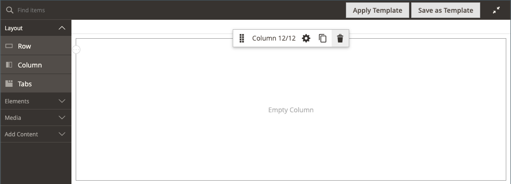

# Layout - Spalte

Verwenden Sie den Content _Typ_ Spalte“, um eine Seite im [[!DNL Page Builder] Schritt“ in mehrere Spalten ](workspace.md#stage). Wenn Sie eine Spalte zu einer Zeile oder Registerkarte oder direkt zum Schritt hinzufügen, wird die Spaltengruppe zunächst in zwei Spalten mit gleicher Breite unterteilt. Sie können Spalten nach Bedarf hinzufügen oder entfernen. Die Größe einer Spalte kann geändert werden, indem der Rahmen zwischen zwei Spalten gezogen wird. Die Breite der nächsten Spalte wird angepasst, um den verfügbaren Platz in der Zeile, Registerkarte oder Phase zu füllen. Eine einzelne Spalte erweitert die gesamte Breite der Bühne oder ihres Containers.

{width="600" zoomable="yes"}

{{$include /help/_includes/page-builder-save-timeout.md}}

## Aktualisierungen in der Version 2.4.5

Die Page Builder-Funktionen wurden mit Version 2.4.5 aktualisiert, sodass Benutzende jetzt _[!DNL Columns]_als übergeordneten Container für einzelne Spalten verwenden. Dieser neue Container unterstützt auch Eigenschaften für den Hintergrund und macht das Einschließen von Spalten in einer Zeile überflüssig. Es reduziert unnötiges Markup und bietet eine feinere Kontrolle über die Anzeige und das Erlebnis in der Storefront.

Sie können das Layout des [!DNL Columns]-Containers ändern, indem Sie eine Spalte über oder unter andere Spalten in der Gruppe ziehen und stapeln. Dies eröffnet eine neue Vielzahl möglicher Layout-Kombinationen, die ohne Anpassung durch Entwickler erreicht werden können.

Sehen Sie sich dieses Video an, um zu demonstrieren, wie Sie mit dem [!DNL Columns]-Container Ihre Seiten-Layouts verfeinern können:

>[!VIDEO](https://video.tv.adobe.com/v/345828?quality=12&learn=on)

## Spalten-Toolbox

Jede Spalte verfügt über eine Toolbox mit Optionen, die angezeigt wird, wenn Sie den Mauszeiger über den Container bewegen.

| Tool | Symbol | Beschreibung |
|--- |--- |--- |
| Verschieben | {width="25"} | Verschiebt die Spalte und ihren Inhalt an eine andere Position im Verhältnis zu anderen Spalten. |
| (Bezeichnung) | Spalte | Gibt den aktuellen Container als Spalte an. Bewegen Sie den Mauszeiger über den Spalten-Container, um die Toolbox anzuzeigen. |
| Einstellungen | {width="25"} | Öffnet die Seite Spalte bearbeiten , auf der Sie die Eigenschaften des Containers ändern können. |
| Duplikat | {width="25"} | Erstellt eine Kopie der aktuellen Spalte. |
| entfernen | {width="25"} | Löscht die aktuelle Spalte und ihren Inhalt. |

{style="table-layout:auto"}

## Spaltenraster

Das [Raster](workspace.md) stellt sicher, dass Inhalte konsistent in einer Spalte ausgerichtet werden, und hilft bei der korrekten Darstellung der Seite auf Desktop- und Mobilgeräten. Weitere Informationen finden Sie [ Abschnitt „Erweiterte ](setup.md)&quot; der [!DNL Page Builder].

{width="500" zoomable="yes"}

Im folgenden zweispaltigen Beispiel geben die Zahlen in Klammern (6/12) am oberen Rand jedes Spalten-Containers die Anzahl der Rasteraufteilungen in jeder Spalte und die Gesamtzahl der Aufteilungen an. In diesem Fall ist die Spalte die Breite von sechs Rastereinheiten von insgesamt 12.

{width="600" zoomable="yes"}

## Spalte hinzufügen

1. Ziehen Sie im [!DNL Page Builder] Bedienfeld unter _[!UICONTROL Layout]_einen **[!UICONTROL Column]**auf die Bühne.

   {width="600" zoomable="yes"}

   Die Spaltengruppe ist nun in zwei Spalten gleicher Breite unterteilt. Jede Spalte ist ein separater Container für Inhalte und verfügt über einen eigenen Satz von Toolbox-Optionen.

   {width="600" zoomable="yes"}

1. Klicken Sie in der linken oberen Ecke der Spaltengruppe auf das Tool _Raster_ () und passen Sie die Rastergröße nach Bedarf an.

   Durch die Positionierung von Inhalten im Raster wird der Inhalt konsistent ausgerichtet und die Seite auf Desktop- und Mobilgeräten korrekt gerendert. Weitere Informationen finden Sie [ Abschnitt „Erweiterte ](../configuration-reference/general/content-management.md)&quot; der [!DNL Page Builder].

   {width="600" zoomable="yes"}

## Spaltengröße ändern

1. Bewegen Sie den Mauszeiger über den Rahmen zwischen zwei Spalten.

   Der Rahmen wird hervorgehoben und die Toolbox für die ausgewählte Spalte wird angezeigt.

   {width="600" zoomable="yes"}

1. Halten Sie die Maustaste gedrückt, um das Raster anzuzeigen, und ziehen Sie den Rahmen an eine neue Position auf dem Raster.

   Die Breite beider Spalten wird an die Änderung angepasst. Die neue Breite jeder Spalte wird nach der Beschriftung angezeigt, z. B. `4/12` (vier von 12) und `8/12` (acht von 12).

   {width="600" zoomable="yes"}

## Spalte entfernen

1. Bewegen Sie den Mauszeiger über die Spalte, die Sie entfernen möchten, um die Toolbox anzuzeigen, und wählen Sie das Symbol _Entfernen_ ( {width="20"} ) aus.

   {width="600" zoomable="yes"}

1. Wenn die Spalte Inhalt enthält, klicken Sie zur Bestätigung auf **[!UICONTROL OK]** .

   Um den Prozess in Zukunft zu beschleunigen, können Sie den Bestätigungsschritt überspringen, indem Sie das Kontrollkästchen **[!UICONTROL Do not show this again]** aktivieren.

   Die Spaltengruppe verfügt nun über eine einzige Spalte (12/12) und ein Raster. Da das Raster nur für Spalten verfügbar ist, können Sie dieses Verfahren verwenden, um das Raster anzuzeigen.

   {width="600" zoomable="yes"}

1. Wenn die Spaltengruppe die verbleibende Spalte auf die gesamte Breite der Zeile oder des Stadiums erweitern soll:

   - Bewegen Sie den Mauszeiger über die Spalte, um die Toolbox anzuzeigen, und wählen _das Symbol_ Einstellungen{width="20"}Einstellungssymbol).

   - Scrollen Sie nach unten zum Abschnitt _[!UICONTROL Advanced]_und legen Sie alle vier **[!UICONTROL Padding]**auf `0` fest.

     {width="600" zoomable="yes"}

   - Klicken Sie oben rechts auf **[!UICONTROL Save]** , um die _[!UICONTROL Edit Column]_zu schließen.

1. Klicken Sie auf _Vollbildmodus schließen_ ( {width="20"} ) in der oberen rechten Ecke des Arbeitsbereichs und klicken Sie dann auf **[!UICONTROL Save]** in der oberen rechten Ecke.

## Spalteneinstellungen ändern

1. Bewegen Sie den Mauszeiger über die Spalte, um die Toolbox anzuzeigen, und wählen _das Symbol_ Einstellungen{width="20"}Einstellungssymbol).

   {width="600" zoomable="yes"}

1. Ändern Sie die **[!UICONTROL Appearance]** nach Bedarf.

   - Wählen Sie die Ausrichtungseinstellung aus, die die Position der Spalte in Bezug auf den Container bestimmt.

     | Option | Beschreibung |
     | ------ | ----------- |
     | `Full Height` | Die Spalte erweitert die volle Höhe ihres Containers. |
     | `Top Aligned` | Die Spalte wird oben im Container ausgerichtet. |
     | `Centered` | Die Spalte ist in der Mitte des Containers zentriert. |
     | `Bottom Aligned` | Die Spalte wird am unteren Rand ihres Containers ausgerichtet. |

     {style="table-layout:auto"}

   - Geben Sie bei Bedarf den **[!UICONTROL Minimum Height]** für die Spalte ein. Sie können beispielsweise die Mindesthöhe so einstellen, dass sie der Höhe eines Hintergrundbilds entspricht.

   - Wenn Sie die Mindesthöhe festlegen, legen Sie die **[!UICONTROL Vertical Alignment]** fest, um die Position von Inhalts-Containern zu steuern, die der Spalte hinzugefügt werden (`Top`, `Center` oder `Bottom`).

1. Ändern Sie den Hintergrund für den Spalteninhalt.

   - **[!UICONTROL Background Color]** : Geben Sie die Farbe an, indem Sie ein Muster auswählen, auf die Farbauswahl klicken oder einen gültigen Farbnamen oder einen entsprechenden Hexadezimalwert eingeben. Diese Einstellung bestimmt die Hintergrundfarbe der Spalte.

   - **[!UICONTROL Background Image]** - Verwenden Sie bei Bedarf die bereitgestellten Tools, um ein Hintergrundbild auszuwählen, das auf die Spalte angewendet werden soll:

     | Tool | Beschreibung |
     | ------ | ----------- |
     | [!UICONTROL Upload] | Lädt eine Bilddatei von Ihrem lokalen Computer in die Galerie hoch und wendet sie dann als Hintergrundbild für die Spalte an. |
     | [!UICONTROL Select from Gallery] | Fordert Sie auf, ein vorhandenes Bild aus der Galerie als Hintergrundbild für die Spalte auszuwählen. |
     | {width="25"} | Hiermit können Sie das Bild entweder auf die Kamerakachel ziehen oder zum Bild in Ihrem lokalen Dateisystem navigieren. |

     {style="table-layout:auto"}

   - **[!UICONTROL Background Mobile Image]** - Verwenden Sie bei Bedarf dieselben Tools, um ein anderes Hintergrundbild für die Anzeige auf Mobilgeräten auszuwählen.

   - **[!UICONTROL Background Size]** - Ändern Sie diese Einstellung, um festzulegen, wie das Hintergrundbild in Bezug auf die Breite der Spalte skaliert wird:

     | Option | Beschreibung |
     | ------ | ----------- |
     | `Cover` | Das Hintergrundbild deckt die gesamte Breite der Spalte ab. |
     | `Contain` | Das Hintergrundbild ist auf die Breite des Inhaltsbereichs beschränkt. |
     | `Auto` | Wendet die standardmäßige Hintergrundgröße an, die im Stylesheet des aktuellen Designs angegeben ist. |

     {style="table-layout:auto"}

   - **[!UICONTROL Background Position]** - Ändern Sie diese Einstellung, um den Ankerpunkt des Bildes in Bezug auf die Spalte zu bestimmen. Optionen: `Top Left`, `Top Center`, `Top Right`, `Center Left`, `Center`, `Center Right`, `Bottom Left`, `Bottom Center` oder `Bottom Right`

   - **[!UICONTROL Background Attachment]** : Ändern Sie diese Einstellung, um zu bestimmen, wie sich das Hintergrundbild in Bezug auf die Bildlaufseite bewegt:

     | Option | Beschreibung |
     | ------ | ----------- |
     | `Scroll` | Das Hintergrundbild wird synchronisiert und bewegt sich beim Bildlauf auf der Seite nach unten. |
     | `Fixed` | (Nicht für Mobilgeräte verfügbar) Das Hintergrundbild wird nicht verschoben, wenn der Container über das Bild scrollt, und es wird an der angegebenen Hintergrundposition fixiert. |

     {style="table-layout:auto"}

   - **[!UICONTROL Background Repeat]** : Wenn Sie das Hintergrundbild wiederholen möchten, um den Bereich zu füllen, ändern Sie diese Einstellung `Yes`.

1. Aktualisieren Sie die _[!UICONTROL Advanced]_nach Bedarf.

   - Um die horizontale Positionierung von Inhalts-Containern zu steuern, die der Spalte hinzugefügt werden, wählen Sie ein **[!UICONTROL Alignment]** aus:

     | Option | Beschreibung |
     | ------ | ----------- |
     | `Default` | Wendet die Standardeinstellung für die Ausrichtung an, die im Stylesheet des aktuellen Designs angegeben ist. |
     | `Left` | Richtet die Inhalts-Container am linken Rand des Spalten-Containers aus, wobei für jeden angegebenen Abstand berücksichtigt wird. |
     | `Center` | Richtet den Inhalts-Container in der Mitte des Spalten-Containers aus, wobei alle angegebenen Auffüllungen berücksichtigt werden. |
     | `Right` | Richtet den Inhalts-Container am rechten Rand des Spalten-Containers aus, wobei für jeden angegebenen Abstand berücksichtigt wird. |

     {style="table-layout:auto"}

   - Legen Sie den **[!UICONTROL Border]** fest, der auf alle vier Seiten des Spalten-Containers angewendet wird:

     | Option | Beschreibung |
     | ------ | ----------- |
     | `Default` | Wendet die Standardformatvorlage für Rahmen an, die im zugehörigen Stylesheet angegeben ist. |
     | `None` | Zeigt keine sichtbaren Begrenzungen des Containers an. |
     | `Dotted` | Der Container-Rahmen wird als gepunktete Linie angezeigt. |
     | `Dashed` | Der Container-Rahmen wird als gestrichelte Linie angezeigt. |
     | `Solid` | Der Container-Rahmen wird als durchgezogene Linie angezeigt. |
     | `Double` | Der Container-Rahmen wird als doppelte Linie angezeigt. |
     | `Groove` | Der Container-Rahmen wird als gerillte Linie angezeigt. |
     | `Ridge` | Der Container-Rahmen wird als geriffelte Linie angezeigt. |
     | `Inset` | Der Container-Rahmen wird als Einfügelinie angezeigt. |
     | `Outset` | Der Container-Rahmen wird als Ausgangslinie angezeigt. |

     {style="table-layout:auto"}

   - Wenn Sie einen anderen Rahmenstil als `None` festlegen, müssen Sie die Anzeigeoptionen für den Rahmen vervollständigen:

     | Option | Beschreibung |
     | ------ |------------ |
     | [!UICONTROL Border Color] | Geben Sie die Farbe an, indem Sie einen Musterabschnitt auswählen, auf die Farbauswahl klicken oder einen gültigen Farbnamen oder einen entsprechenden Hexadezimalwert eingeben. |
     | [!UICONTROL Border Width] | Geben Sie die Anzahl der Pixel für die Rahmenlinienbreite ein. |
     | [!UICONTROL Border Radius] | Geben Sie die Anzahl der Pixel ein, um die Größe des Radius festzulegen, mit dem jede Ecke des Rahmens gerundet werden soll. |

     {style="table-layout:auto"}

   - (Optional) Geben Sie die Namen der **[!UICONTROL CSS classes]** aus dem aktuellen Stylesheet an, die auf den Spalten-Container angewendet werden sollen.

     Trennen Sie mehrere Klassennamen durch ein Leerzeichen.

   - Geben Sie Werte in Pixeln für die **[!UICONTROL Margins and Padding]** ein, um die äußeren Ränder und den inneren Abstand der Spalte anzugeben.

     Geben Sie jeden entsprechenden Wert in das Spalten-Container-Diagramm ein.

     | Container-Bereich | Beschreibung |
     | -------------- | ----------- |
     | [!UICONTROL Margins] | Die Menge des Leerraums, der auf die Außenkante aller Seiten des Containers angewendet wird. Optionen: `Top` / `Right` / `Bottom` / `Left` |
     | [!UICONTROL Padding] | Die Menge des Leerraums, der auf die Innenkante aller Seiten des Containers angewendet wird. Optionen: `Top` / `Right` / `Bottom` / `Left` |

     {style="table-layout:auto"}

1. Klicken Sie abschließend auf **[!UICONTROL Save]** , um die Einstellungen anzuwenden und zum Arbeitsbereich [!DNL Page Builder] zurückzukehren.
