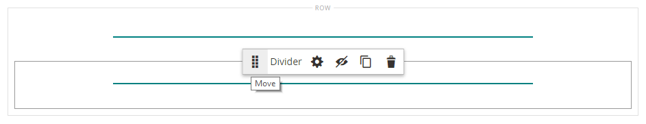

# Elemente - Trennlinie

Verwenden Sie _Inhaltstyp_ Trennzeichen“, um eine Regel als visuellen Trennzeichen zwischen Inhaltsabschnitten in der [[!DNL Page Builder] Phase) ](workspace.md#stage). Sie können die Linienfarbe, Stärke und Breite der Trennlinie angeben. Sie können auch die Ausrichtung steuern und die Ränder, den Abstand und das Format des Containerrahmens festlegen. Standardmäßig ist die Trennlinie eine Haarlinie, die die gesamte Breite des Containers ausdehnt, wobei Abstände berücksichtigt werden.

{width="500" zoomable="yes"}

Obwohl die meisten Container mit Trennlinien unsichtbar sind, wird im folgenden Beispiel der Container mit einem rot gestrichelten Rahmen angezeigt, sodass Sie die Beziehung zwischen der Trennlinie, dem Abstand und dem Container sehen können. Sie können den Abstand zwischen den Elementen am oberen und unteren Rand der Trennlinie anpassen.

{width="500" zoomable="yes"}

{{$include /help/_includes/page-builder-save-timeout.md}}

## Werkzeugkasten für Trennlinien

| Tool | Symbol | Beschreibung |
| ---- | --------------------| ------------|
| Verschieben | {width="25"} | Verschiebt den Teilungs-Container an eine andere gültige Position auf der Seite. |
| (Bezeichnung) | TEILER | Gibt den aktuellen Container als Trennelement an. |
| Einstellungen | {width="25"} | Öffnet die Seite Unterteilung bearbeiten , auf der Sie die Eigenschaften der Unterteilung und ihres Containers ändern können. |
| Ausblenden | {width="25"} | Blendet den Trennlinien-Container aus. |
| Anzeigen | {width="25"} | Zeigt den ausgeblendeten Teilungs-Container an. |
| Duplikat | {width="25"} | Erstellt eine Kopie des Teilungs-Containers. |
| entfernen | {width="25"} | Löscht den Teilungs-Container und seinen Inhalt aus der Phase. |

{style="table-layout:auto"}

{{$include /help/_includes/page-builder-hidden-element-note.md}}

## Trennlinie hinzufügen

1. Erweitern Sie im [!DNL Page Builder] Bedienfeld **[!UICONTROL Elements]** und ziehen Sie einen **[!UICONTROL Divider]** Platzhalter in eine Zeile, Spalte oder einen Tab, die bzw. der auf dem Bühnenbild festgelegt ist.

   Verwenden Sie die rote Richtlinie als Referenz, wenn Sie die Trennlinie entweder vor oder nach einem anderen Inhalts-Container auf der Bühne positionieren.

   {width="600" zoomable="yes"}

   Im folgenden Beispiel markiert die Trennlinie den Anfang eines neuen Textabschnitts.

   {width="500" zoomable="yes"}

1. Gehen Sie wie folgt vor, um die Einstellungen der neuen Trennlinie festzulegen.

## Ändern der Teilereinstellungen

1. Bewegen Sie den Mauszeiger über den Trennungs-Container, um die Toolbox anzuzeigen, und wählen _das Symbol_ Einstellungen{width="20"}) aus.

   {width="500" zoomable="yes"}

1. Ändern Sie die **[!UICONTROL Line Color]** mit einer der folgenden Methoden:

   - Geben Sie einen gültigen [HTML-Farbnamen ein][1]. Beispiel: `Teal`.
   - Geben Sie den hexadezimalen Farbwert ein. Beispiel: `#008080`.

   Klicken Sie abschließend auf **[!UICONTROL Apply]**.

   {width="600" zoomable="yes"}

1. Geben Sie die **[!UICONTROL Line Thickness]** in Pixeln an.

1. Um die Maßeinheit anzugeben, geben Sie den **[!UICONTROL Line Width]** ein, gefolgt von `px` oder `%`.

   {width="600" zoomable="yes"}

1. Aktualisieren Sie die _[!UICONTROL Advanced]_&#x200B;nach Bedarf.

   - Um die Positionierung der Trennlinie innerhalb des übergeordneten Containers zu steuern, wählen Sie die **[!UICONTROL Alignment]**:

     | Option | Beschreibung |
     | ------ | ----------- |
     | `Default` | Wendet die Standardeinstellung für die Ausrichtung an, die im Stylesheet des aktuellen Designs angegeben ist. |
     | `Left` | Richtet die Liste am linken Rand des übergeordneten Containers aus, wobei ein etwaiger Abstand berücksichtigt wird. |
     | `Center` | Richtet die Liste in der Mitte des übergeordneten Containers aus, wobei der angegebene Abstand berücksichtigt wird. |
     | `Right` | Richtet den Block am rechten Rand des übergeordneten Containers aus, wobei alle angegebenen Auffüllungen berücksichtigt werden. |

     {style="table-layout:auto"}

     Im folgenden Beispiel werden die Optionen so eingestellt, dass eine mittlere Ausrichtung für die Trennlinie verwendet wird.

     {width="600" zoomable="yes"}

   - Legen Sie den **[!UICONTROL Border]** fest, der auf alle vier Seiten des Trennlinien-Containers angewendet werden soll:

     | Option | Beschreibung |
     | ------ | ----------- |
     | `Default` | Wendet die Standardformatvorlage für Rahmen an, die im zugehörigen Stylesheet angegeben ist. |
     | `None` | Zeigt keine sichtbaren Begrenzungen des Containers an. |
     | `Dotted` | Der Container-Rahmen wird als gepunktete Linie angezeigt. |
     | `Dashed` | Der Container-Rahmen wird als gestrichelte Linie angezeigt. |
     | `Solid` | Der Container-Rahmen wird als durchgezogene Linie angezeigt. |
     | `Double` | Der Container-Rahmen wird als doppelte Linie angezeigt. |
     | `Groove` | Der Container-Rahmen wird als gerillte Linie angezeigt. |
     | `Ridge` | Der Container-Rahmen wird als geriffelte Linie angezeigt. |
     | `Inset` | Der Container-Rahmen wird als Einfügelinie angezeigt. |
     | `Outset` | Der Container-Rahmen wird als Ausgangslinie angezeigt. |

     {style="table-layout:auto"}

   - Wenn Sie einen anderen Rahmenstil als `None` festlegen, müssen Sie die Anzeigeoptionen für den Rahmen vervollständigen:

     | Option | Beschreibung |
     | ------ |------------ |
     | [!UICONTROL Border Color] | Geben Sie die Farbe an, indem Sie einen Musterabschnitt auswählen, auf die Farbauswahl klicken oder einen gültigen Farbnamen oder einen entsprechenden Hexadezimalwert eingeben. |
     | [!UICONTROL Border Width] | Geben Sie die Anzahl der Pixel für die Rahmenlinienbreite ein. |
     | [!UICONTROL Border Radius] | Geben Sie die Anzahl der Pixel ein, um die Größe des Radius festzulegen, mit dem jede Ecke des Rahmens gerundet werden soll. |

     {style="table-layout:auto"}

   - (Optional) Geben Sie die Namen der **[!UICONTROL CSS classes]** aus dem aktuellen Stylesheet an, die auf den Container angewendet werden sollen.

     Trennen Sie mehrere Klassennamen durch ein Leerzeichen.

   - Geben Sie Werte in Pixeln für den **[!UICONTROL Margins and Padding]** ein, um die äußeren Ränder und den inneren Abstand des Trennungs-Containers zu bestimmen.

     Geben Sie die entsprechenden Werte in das Diagramm ein.

     | Container-Bereich | Beschreibung |
     | -------------- | ----------- |
     | [!UICONTROL Margins] | Die Menge des Leerraums, der auf die Außenkante aller Seiten des Containers angewendet wird. Optionen: `Top` / `Right` / `Bottom` / `Left` |
     | [!UICONTROL Padding] | Die Menge des Leerraums, der auf die Innenkante aller Seiten des Containers angewendet wird. Optionen: `Top` / `Right` / `Bottom` / `Left` |

     {style="table-layout:auto"}

1. Klicken Sie abschließend auf **[!UICONTROL Save]** , um die Einstellungen anzuwenden und zum Arbeitsbereich [!DNL Page Builder] zurückzukehren.

   {width="500" zoomable="yes"}

## Eine Trennlinie duplizieren

Bei einer formatierten Trennlinie mit bestimmten Einstellungen ist es effizienter, ein Duplikat zu erstellen, anstatt mit einem neuen Platzhalter von vorne zu beginnen.

1. Bewegen Sie den Mauszeiger über den Trennungs-Container, um die Toolbox anzuzeigen, und wählen Sie _Symbol Duplizieren_ ( {width="20"} ) aus.

   Der doppelte Teilungs-Container wird direkt unter dem Original angezeigt.

   {width="500" zoomable="yes"}

1. Bewegen Sie den Mauszeiger über den neuen Trennungs-Container, um die Toolbox anzuzeigen, und wählen Sie _Symbol_ Verschieben{width="20"} ) aus.

   {width="500" zoomable="yes"}

1. Wählen Sie die Trennlinie aus und ziehen Sie sie, bis die rote Richtlinie die neue Position markiert.

   Die oberen und unteren Ränder der einzelnen Container werden beim Verschieben der Trennlinie als gestrichelte Linien angezeigt.

   {width="500" zoomable="yes"}

[1]: https://en.wikipedia.org/wiki/Web_colors
