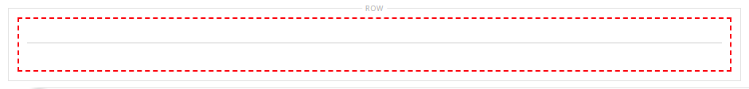

# Elemente - Trennlinie

Verwenden Sie den Inhaltstyp _Divider_ , um eine Regel als visuellen Umbruch zwischen Inhaltsabschnitten in der [[!DNL Page Builder] Phase](workspace.md#stage) hinzuzufügen. Sie können die Linienfarbe, die Dicke und die Breite des Trennzeichens angeben. Sie können auch die Ausrichtung, die Ränder und den Abstand sowie das Format des Containerrahmens steuern. Standardmäßig ist der Divider eine Haarregel, die die gesamte Breite des Containers erweitert, wobei der Abstand berücksichtigt wird.

{width="500" zoomable="yes"}

Obwohl die meisten Divider-Container unsichtbar sind, zeigt das folgende Beispiel den Container mit einem roten gestrichelten Rand, sodass Sie die Beziehung zwischen dem Divider, dem Abstand und dem Container sehen können. Sie können den Abstand am oberen und unteren Rand der Trennlinie anpassen, um den Abstand zwischen Elementen zu steuern.

{width="500" zoomable="yes"}

{{$include /help/_includes/page-builder-save-timeout.md}}

## Trennlinien-Toolbox

| Tool | Symbol | Beschreibung |
| ---- | --------------------| ------------|
| Verschieben | {width="25"} | Verschiebt den Divider-Container an eine andere gültige Position auf der Seite. |
| (Titel) | DIVIDER | Identifiziert den aktuellen Container als Trennelement. |
| Einstellungen | {width="25"} | Öffnet die Seite Divider bearbeiten , auf der Sie die Eigenschaften des Dividers und seines Containers ändern können. |
| Ausblenden | {width="25"} | Blendet den Trenncontainer aus. |
| Anzeigen | {width="25"} | Zeigt den ausgeblendeten Divider-Container an. |
| Duplizieren | {width="25"} | Kopiert den Divider-Container. |
| Entfernen | {width="25"} | Löscht den Divider-Container und seinen Inhalt aus der Bühne. |

{style="table-layout:auto"}

{{$include /help/_includes/page-builder-hidden-element-note.md}}

## Divider hinzufügen

1. Erweitern Sie im Bedienfeld [!DNL Page Builder] den Eintrag **[!UICONTROL Elements]** und ziehen Sie einen Platzhalter **[!UICONTROL Divider]** auf eine Zeile, Spalte oder Registerkarte, die auf der Bühne festgelegt ist.

   Verwenden Sie die rote Führungslinie für die Referenz, wenn Sie die Trennlinie entweder vor oder nach einem anderen Inhaltscontainer auf der Bühne positionieren.

   {width="600" zoomable="yes"}

   Im folgenden Beispiel markiert die Trennlinie den Anfang eines neuen Textabschnitts.

   {width="500" zoomable="yes"}

1. Gehen Sie wie folgt vor, um die Einstellungen der neuen Trennlinie festzulegen.

## Dividereinstellungen ändern

1. Bewegen Sie den Mauszeiger über den Divider-Container, um die Toolbox anzuzeigen und das Symbol _Einstellungen_ ( {width="20"} ) zu wählen.

   {width="500" zoomable="yes"}

1. Ändern Sie den Divider **[!UICONTROL Line Color]** mit einer der folgenden Methoden:

   - Geben Sie einen gültigen [HTML-Farbnamen][1] ein. Beispiel: `Teal`.
   - Geben Sie den hexadezimalen Farbwert ein. Beispiel: `#008080`.

   Klicken Sie nach Abschluss des Vorgangs auf **[!UICONTROL Apply]**.

   {width="600" zoomable="yes"}

1. Geben Sie den Wert **[!UICONTROL Line Thickness]** in Pixel ein.

1. Um die Maßeinheit anzugeben, geben Sie den Wert **[!UICONTROL Line Width]** gefolgt von `px` oder `%` ein.

   {width="600" zoomable="yes"}

1. Aktualisieren Sie die _[!UICONTROL Advanced]_-Einstellungen nach Bedarf.

   - Um die Positionierung des Trennzeichens innerhalb des übergeordneten Containers zu steuern, wählen Sie den Wert **[!UICONTROL Alignment]**:

     | Option | Beschreibung |
     | ------ | ----------- |
     | `Default` | Wendet die Standardeinstellung für die Ausrichtung an, die im Stylesheet des aktuellen Designs angegeben ist. |
     | `Left` | Richtet die Liste am linken Rand des übergeordneten Containers aus, wobei der angegebene Abstand berücksichtigt wird. |
     | `Center` | Richtet die Liste in der Mitte des übergeordneten Containers aus, wobei der angegebene Abstand berücksichtigt wird. |
     | `Right` | Richtet den Block am rechten Rand des übergeordneten Containers aus, wobei der angegebene Abstand berücksichtigt wird. |

     {style="table-layout:auto"}

     Im folgenden Beispiel werden die Optionen so eingestellt, dass eine mittlere Ausrichtung für die Trennlinie verwendet wird.

     {width="600" zoomable="yes"}

   - Legen Sie den **[!UICONTROL Border]** -Stil fest, der auf alle vier Seiten des Divider-Containers angewendet wird:

     | Option | Beschreibung |
     | ------ | ----------- |
     | `Default` | Wendet den standardmäßigen Randstil an, der vom zugehörigen Stylesheet angegeben wird. |
     | `None` | liefert keine sichtbare Anzeige der Containergrenzen. |
     | `Dotted` | Der Container-Rahmen wird als gepunktete Linie angezeigt. |
     | `Dashed` | Der Container-Rahmen wird als gestrichelte Linie angezeigt. |
     | `Solid` | Der Container-Rahmen wird als durchgehende Linie angezeigt. |
     | `Double` | Der Container-Rahmen wird als doppelte Linie angezeigt. |
     | `Groove` | Der Container-Rahmen wird als Rillenlinie angezeigt. |
     | `Ridge` | Der Container-Rahmen wird als gekürzte Linie angezeigt. |
     | `Inset` | Der Container-Rahmen wird als Inset-Zeile angezeigt. |
     | `Outset` | Der Container-Rahmen wird als Ausgangspunkt angezeigt. |

     {style="table-layout:auto"}

   - Wenn Sie einen anderen Rahmenstil als `None` festlegen, füllen Sie die Anzeigeoptionen für die Rahmenanzeige aus:

     | Option | Beschreibung |
     | ------ |------------ |
     | [!UICONTROL Border Color] | Geben Sie die Farbe an, indem Sie ein Muster auswählen, auf die Farbauswahl klicken oder einen gültigen Farbnamen oder einen entsprechenden Hexadezimalwert eingeben. |
     | [!UICONTROL Border Width] | Geben Sie die Anzahl Pixel für die Rahmenlinienbreite an. |
     | [!UICONTROL Border Radius] | Geben Sie die Anzahl der Pixel an, um die die Größe des Radius definiert wird, mit dem die einzelnen Ecken des Rands gerundet werden. |

     {style="table-layout:auto"}

   - (Optional) Geben Sie die Namen von **[!UICONTROL CSS classes]** aus dem aktuellen Stylesheet an, das auf den Container angewendet werden soll.

     Trennen Sie mehrere Klassennamen durch ein Leerzeichen.

   - Geben Sie Werte in Pixel für den Wert **[!UICONTROL Margins and Padding]** ein, um die äußeren Ränder und den inneren Abstand des Divider-Containers zu bestimmen.

     Geben Sie die entsprechenden Werte in das Diagramm ein.

     | Container-Bereich | Beschreibung |
     | -------------- | ----------- |
     | [!UICONTROL Margins] | Die Menge an leerem Raum, die auf den äußeren Rand aller Seiten des Containers angewendet wird. Optionen: `Top` / `Right` / `Bottom` / `Left` |
     | [!UICONTROL Padding] | Die Menge an leerem Raum, die auf den inneren Rand aller Seiten des Containers angewendet wird. Optionen: `Top` / `Right` / `Bottom` / `Left` |

     {style="table-layout:auto"}

1. Klicken Sie nach Abschluss des Vorgangs auf **[!UICONTROL Save]** , um die Einstellungen anzuwenden und zum Arbeitsbereich [!DNL Page Builder] zurückzukehren.

   {width="500" zoomable="yes"}

## Divider duplizieren

Für einen formatierten Divider mit bestimmten Einstellungen ist es effizienter, ein Duplikat zu erstellen, anstatt von vorn mit einem neuen Platzhalter zu beginnen.

1. Bewegen Sie den Mauszeiger über den Divider-Container, um die Werkzeugleiste anzuzeigen, und wählen Sie das Symbol _Duplizieren_ ( {width="20"} ).

   Der doppelte Divider-Container wird direkt unter dem Original angezeigt.

   {width="500" zoomable="yes"}

1. Bewegen Sie den Mauszeiger über den neuen Divider-Container, um die Toolbox anzuzeigen und das Symbol _Verschieben_ ( {width="20"} ) zu wählen.

   {width="500" zoomable="yes"}

1. Wählen Sie die Trennlinie aus und ziehen Sie sie, bis die rote Führungslinie die neue Position markiert.

   Die oberen und unteren Ränder jedes Containers werden als gestrichelte Linien angezeigt, während der Divider verschoben wird.

   {width="500" zoomable="yes"}

[1]: https://en.wikipedia.org/wiki/Web_colors
