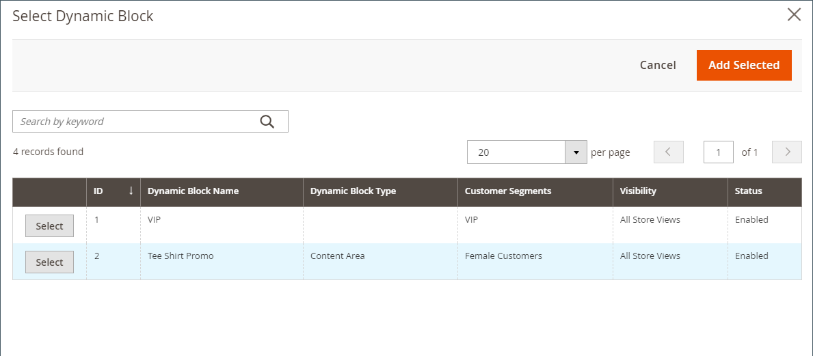
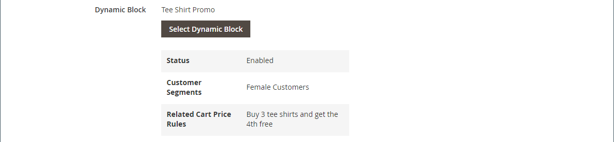

# Inhalt hinzufügen - Dynamischer Block

Verwenden Sie den Inhaltstyp Dynamischer Block , um einen vorhandenen [dynamischen Block](../content-design/dynamic-blocks.md) zur [[!DNL Page Builder] Phase](workspace.md#stage) hinzuzufügen.

{width="700" zoomable="yes"}

{{$include /help/_includes/page-builder-save-timeout.md}}

## Toolbox für dynamische Blöcke

| Tool | Symbol | Beschreibung |
| --------- | ------------- | ----------------- |
| Verschieben | {width="25"} | Verschiebt den Block-Container und dessen Inhalt an eine andere Position auf der Bühne. |
| Einstellungen | {width="25"} | Öffnet die Seite _Block bearbeiten_ auf der Sie den Block auswählen und die Eigenschaften des Containers ändern können. |
| Ausblenden | {width="25"} | Blendet den aktuellen Block-Container und dessen Inhalt aus. |
| Anzeigen | {width="25"} | Zeigt den ausgeblendeten Block-Container und dessen Inhalt an. |
| Duplikat | {width="25"} | Erstellt eine Kopie des Block-Containers und seines Inhalts. |
| entfernen | {width="25"} | Löscht den Block-Container und seinen Inhalt aus der Phase . |

{style="table-layout:auto"}

{{$include /help/_includes/page-builder-hidden-element-note.md}}

## Hinzufügen eines vorhandenen dynamischen Blocks zum Schritt

1. Navigieren Sie zum Arbeitsbereich [!DNL Page Builder] auf der Zielseite, dem Block, dem Produkt oder der Kategorie.

1. Erweitern Sie im [!DNL Page Builder] Bedienfeld **[!UICONTROL Add Content]** und ziehen Sie einen **[!UICONTROL Dynamic Block]** Platzhalter auf das Bühnenbild.

   {width="600" zoomable="yes"}

1. Bewegen Sie den Mauszeiger über den leeren dynamischen Block-Container, um die Toolbox anzuzeigen, und wählen Sie _Symbol_ Einstellungen{width="20"}) aus.

   {width="600" zoomable="yes"}

1. Klicken Sie auf der _Dynamischen Block bearbeiten_ auf **[!UICONTROL Select Dynamic Block]** und wählen Sie den Block mithilfe der Liste aus.

   {width="600" zoomable="yes"}

   Suchen Sie in der Liste den dynamischen Block, den Sie einfügen möchten, und klicken Sie auf **[!UICONTROL Select]**. Klicken Sie dann auf **[!UICONTROL Add Selected]**.

   {width="600" zoomable="yes"}

   Eine Zusammenfassung der Informationen zu dynamischen Blöcken wird unten angezeigt.

   {width="600" zoomable="yes"}

1. Legen Sie **[!UICONTROL Template]** auf eine der folgenden Einstellungen fest:

   | Option | Beschreibung |
   | ------ | ----------- |
   | `Dynamic Block Block Template` | Fügt einen eigenständigen Block hinzu. |
   | `Dynamic Block Inline Template` | Fügt den Blockinhalt in Text ein. |

   {style="table-layout:auto"}

   {width="200"}

1. Füllen Sie die erweiterten Einstellungen nach Bedarf aus.

1. Klicken Sie abschließend auf **[!UICONTROL Save]** , um die Einstellungen anzuwenden und zum Arbeitsbereich [!DNL Page Builder] zurückzukehren.

### Erweiterte Einstellungen

1. Um die Positionierung des dynamischen Blocks innerhalb des übergeordneten Containers zu steuern, wählen Sie ein **[!UICONTROL Alignment]** aus:

   | Option | Beschreibung |
   | ------ | ----------- |
   | `Default` | Wendet die Standardeinstellung für die Ausrichtung an, die im Stylesheet des aktuellen Designs angegeben ist. |
   | `Left` | Richtet die Liste am linken Rand des übergeordneten Containers aus, wobei ein etwaiger Abstand berücksichtigt wird. |
   | `Center` | Richtet die Liste in der Mitte des übergeordneten Containers aus, wobei der angegebene Abstand berücksichtigt wird. |
   | `Right` | Richtet den Block am rechten Rand des übergeordneten Containers aus, wobei alle angegebenen Auffüllungen berücksichtigt werden. |

   {style="table-layout:auto"}

1. Legen Sie den **[!UICONTROL Border]** fest, der auf alle vier Seiten des dynamischen Block-Containers angewendet wird:

   | Option | Beschreibung |
   | ------ | ----------- |
   | `Default` | Wendet die Standardformatvorlage für Rahmen an, die im zugehörigen Stylesheet angegeben ist. |
   | `None` | Zeigt keine sichtbaren Begrenzungen des Containers an. |
   | `Dotted` | Der Container-Rahmen wird als gepunktete Linie angezeigt. |
   | `Dashed` | Der Container-Rahmen wird als gestrichelte Linie angezeigt. |
   | `Solid` | Der Container-Rahmen wird als durchgezogene Linie angezeigt. |
   | `Double` | Der Container-Rahmen wird als doppelte Linie angezeigt. |
   | `Groove` | Der Container-Rahmen wird als gerillte Linie angezeigt. |
   | `Ridge` | Der Container-Rahmen wird als geriffelte Linie angezeigt. |
   | `Inset` | Der Container-Rahmen wird als Einfügelinie angezeigt. |
   | `Outset` | Der Container-Rahmen wird als Ausgangslinie angezeigt. |

   {style="table-layout:auto"}

1. Wenn Sie einen anderen Rahmenstil als `None` festlegen, müssen Sie die Anzeigeoptionen für den Rahmen vervollständigen:

   | Option | Beschreibung |
   | ------ |------------ |
   | [!UICONTROL Border Color] | Geben Sie die Farbe an, indem Sie einen Musterabschnitt auswählen, auf die Farbauswahl klicken oder einen gültigen Farbnamen oder einen entsprechenden Hexadezimalwert eingeben. |
   | [!UICONTROL Border Width] | Geben Sie die Anzahl der Pixel für die Rahmenlinienbreite ein. |
   | [!UICONTROL Border Radius] | Geben Sie die Anzahl der Pixel ein, um die Größe des Radius festzulegen, mit dem jede Ecke des Rahmens gerundet werden soll. |

   {style="table-layout:auto"}

1. (Optional) Geben Sie die Namen der **[!UICONTROL CSS classes]** aus dem aktuellen Stylesheet an, die auf den Container angewendet werden sollen.

   Trennen Sie mehrere Klassennamen durch ein Leerzeichen.

1. Geben Sie Werte in Pixeln für den **[!UICONTROL Margins and Padding]** ein, um die äußeren Ränder und den inneren Abstand des dynamischen Block-Containers zu bestimmen.

   Geben Sie die entsprechenden Werte in das Diagramm ein.

   | Container-Bereich | Beschreibung |
   | -------------- | ----------- |
   | [!UICONTROL Margins] | Die Menge des Leerraums, der auf die Außenkante aller Seiten des Containers angewendet wird. Optionen: `Top` / `Right` / `Bottom` / `Left` |
   | [!UICONTROL Padding] | Die Menge des Leerraums, der auf die Innenkante aller Seiten des Containers angewendet wird. Optionen: `Top` / `Right` / `Bottom` / `Left` |

   {style="table-layout:auto"}

## Bearbeiten der Einstellungen des dynamischen Block-Containers

1. Bewegen Sie den Mauszeiger über den Container mit den dynamischen Blöcken, um die Toolbox anzuzeigen, und wählen Sie _Symbol_ Einstellungen{width="20"}) aus.

   {width="500" zoomable="yes"}

1. Ändern Sie bei Bedarf den dynamischen Block:

   - Klicken Sie auf **[!UICONTROL Select Dynamic Block]**.

     {width="20"}

   - Klicken Sie in der Liste der aktiven dynamischen Blöcke auf **[!UICONTROL Select]** für den Block, den Sie hinzufügen möchten.

1. Aktualisieren Sie die verbleibenden Einstellungen nach Bedarf.

1. Klicken Sie abschließend auf **[!UICONTROL Save]** , um die Einstellungen anzuwenden und zum Arbeitsbereich [!DNL Page Builder] zurückzukehren.

## Dynamischen Block duplizieren

1. Bewegen Sie den Mauszeiger über den Container mit den dynamischen Blöcken, um die Toolbox anzuzeigen, und wählen Sie das Symbol _Duplizieren_ ( {width="20"} ) aus.

   Das Duplikat wird direkt unter dem Original angezeigt.

   {width="500" zoomable="yes"}

1. Um den neuen dynamischen Block an eine andere Position zu verschieben, bewegen Sie den Mauszeiger über den Container und wählen Sie dann in der Toolbox _Verschieben_ ({width="20"} ) aus.

1. Wählen Sie den dynamischen Block aus und ziehen Sie ihn, bis die rote Richtlinie an der neuen Position angezeigt wird.

   Der obere und untere Rand jedes Containers werden während des Verschiebens des dynamischen Blocks als gestrichelte Linien angezeigt.

## Entfernen eines dynamischen Blocks aus der Phase

1. Bewegen Sie den Mauszeiger über den Container mit den dynamischen Blöcken, um die Toolbox anzuzeigen, und wählen _das Symbol_ Entfernen{width="20"} entfernen).

1. Wenn Sie zum Bestätigen aufgefordert werden, klicken Sie auf **[!UICONTROL OK]**.

<!-- Last updated from includes: 2023-09-11 14:30:19 -->
