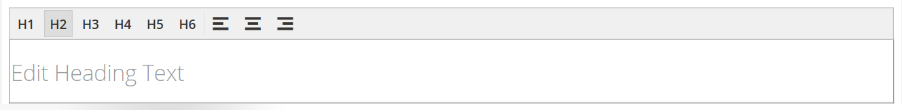
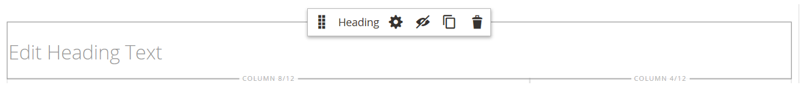
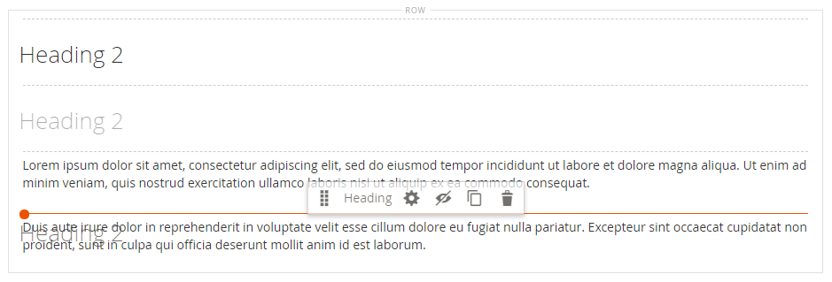

# Elemente - Überschrift

Überschriftenebenen bilden eine Hierarchie, die Inhalte organisiert und Suchmaschinen bei der Indexierung jeder Seite unterstützt. Verwenden Sie den Inhaltstyp _Überschrift_ in der [[!DNL Page Builder] Bühne](workspace.md#stage) , um einen Textcontainer mit einer Überschriftenebene von H1 bis H6 zur Bühne hinzuzufügen. Überschriften werden entsprechend dem Stylesheet formatiert, das dem aktuellen Design zugeordnet ist.

Das Feld [Inhaltsüberschrift](workspace.md) im Abschnitt _[!UICONTROL Content]_kann verwendet werden, um eine H1-Überschrift oben auf der Seite hinzuzufügen. Das Feld ist jedoch eine ältere Version von [!DNL Commerce] und wird zur Unterstützung älterer Inhalte bereitgestellt. Dieses Feld nutzt nicht die erweiterten Funktionen von [!DNL Page Builder]. Es wird empfohlen, das Feld Inhaltsüberschrift leer zu lassen und den Inhaltstyp [!DNL Page Builder] Überschrift zu verwenden, um Überschriften beliebiger Ebenen zur Seite hinzuzufügen.

Das folgende Beispiel zeigt, wie die Inhaltsüberschrift und der Inhaltstyp &quot;Überschrift&quot;angezeigt werden, wenn sie durch das Luma-Design formatiert sind.

{width="700" zoomable="yes"}

Sie können eine Überschrift aus dem Abschnitt _Elemente_ des Bedienfelds [!DNL Page Builder] in eine Zeile, Spalte oder Registerkarte ziehen, die auf der Bühne festgelegt ist. Die Überschriftenebene und die Ausrichtung können über die Editor-Symbolleiste auf der Bühne oder über das Steuerelement _Einstellungen_ ( {width="20"} ) gesteuert werden.

{{$include /help/_includes/page-builder-save-timeout.md}}

## Überschrifteneditor

{width="500" zoomable="yes"}

## Überschriftencontainer-Toolbox

Wie bei allen Inhalts-Containern wird die Toolbox angezeigt, wenn Sie den Mauszeiger über den Container bewegen.

{width="500" zoomable="yes"}

| Tool | Symbol | Beschreibung |
| --------- | ----------------- | ---------------------- |
| Verschieben | {width="25"} | Verschiebt den Überschriftenbehälter an eine andere gültige Position auf der Seite. |
| (Titel) | Überschrift | Identifiziert den aktuellen Container als Überschrift. |
| Einstellungen | {width="25"} | Öffnet die Seite Überschrift bearbeiten , auf der Sie die Eigenschaften des Containers ändern können. |
| Ausblenden | {width="25"} | Blendet den Überschriftenbehälter aus. |
| Anzeigen | {width="25"} | Zeigt den ausgeblendeten Überschriftenbehälter an. |
| Duplizieren | {width="25"} | Kopiert den Überschriftencontainer. |
| Entfernen | {width="25"} | Löscht den Überschriftenbehälter und seinen Inhalt aus der Bühne. |

{style="table-layout:auto"}

{{$include /help/_includes/page-builder-hidden-element-note.md}}

## Hinzufügen einer Überschrift

1. Erweitern Sie im Bedienfeld [!DNL Page Builder] den Eintrag **[!UICONTROL Elements]** und ziehen Sie einen Platzhalter **[!UICONTROL Heading]** auf eine Zeile, Spalte oder Registerkarte, die auf der Bühne festgelegt ist.

   {width="600" zoomable="yes"}

1. Geben Sie im Editor den Überschriftentext über dem Platzhalter `Edit Heading Text` ein.

   Standardmäßig wird dem Überschriftentext ein Überschriftentyp der Ebene 2 (H2) zugewiesen.

   {width="500" zoomable="yes"}

1. Wählen Sie in der Symbolleiste den entsprechenden Überschrifttyp zwischen H1 und H6 aus.

1. Ändern Sie bei Bedarf die Ausrichtung.

## Bearbeiten von Kopfzeileneinstellungen

1. Bewegen Sie den Mauszeiger über den Überschriftenbehälter, um die Werkzeugleiste anzuzeigen, und wählen Sie das Symbol _Einstellungen_ ( {width="20"} ).

   {width="500" zoomable="yes"}

1. Aktualisieren Sie bei Bedarf den Überschrifteninhalt (**[!UICONTROL Heading Type]** und **[!UICONTROL Heading Text]**).

   Sie können diesen Inhalt auch im Überschrifteneditor aktualisieren.

1. Aktualisieren Sie die _[!UICONTROL Advanced]_-Einstellungen nach Bedarf.

   - Um die Positionierung der Überschrift innerhalb des übergeordneten Containers zu steuern, wählen Sie einen **[!UICONTROL Alignment]**:

     | Option | Beschreibung |
     | ------ | ----------- |
     | `Default` | Wendet die Standardeinstellung für die Ausrichtung an, die im Stylesheet des aktuellen Designs angegeben ist. |
     | `Left` | Richtet die Liste am linken Rand des übergeordneten Containers aus, wobei der angegebene Abstand berücksichtigt wird. |
     | `Center` | Richtet die Liste in der Mitte des übergeordneten Containers aus, wobei der angegebene Abstand berücksichtigt wird. |
     | `Right` | Richtet den Block am rechten Rand des übergeordneten Containers aus, wobei der angegebene Abstand berücksichtigt wird. |

     {style="table-layout:auto"}

   - Legen Sie den **[!UICONTROL Border]** -Stil fest, der auf alle vier Seiten des Überschriftencontainers angewendet wird:

     | Option | Beschreibung |
     | ------ | ----------- |
     | `Default` | Wendet den standardmäßigen Randstil an, der vom zugehörigen Stylesheet angegeben wird. |
     | `None` | liefert keine sichtbare Anzeige der Containergrenzen. |
     | `Dotted` | Der Container-Rahmen wird als gepunktete Linie angezeigt. |
     | `Dashed` | Der Container-Rahmen wird als gestrichelte Linie angezeigt. |
     | `Solid` | Der Container-Rahmen wird als durchgehende Linie angezeigt. |
     | `Double` | Der Container-Rahmen wird als doppelte Linie angezeigt. |
     | `Groove` | Der Container-Rahmen wird als Rillenlinie angezeigt. |
     | `Ridge` | Der Container-Rahmen wird als gekürzte Linie angezeigt. |
     | `Inset` | Der Container-Rahmen wird als Inset-Zeile angezeigt. |
     | `Outset` | Der Container-Rahmen wird als Ausgangspunkt angezeigt. |

     {style="table-layout:auto"}

   - Wenn Sie einen anderen Rahmenstil als `None` festlegen, füllen Sie die Anzeigeoptionen für die Rahmenanzeige aus:

     | Option | Beschreibung |
     | ------ |------------ |
     | [!UICONTROL Border Color] | Geben Sie die Farbe an, indem Sie ein Muster auswählen, auf die Farbauswahl klicken oder einen gültigen Farbnamen oder einen entsprechenden Hexadezimalwert eingeben. |
     | [!UICONTROL Border Width] | Geben Sie die Anzahl Pixel für die Rahmenlinienbreite an. |
     | [!UICONTROL Border Radius] | Geben Sie die Anzahl der Pixel an, um die die Größe des Radius definiert wird, mit dem die einzelnen Ecken des Rands gerundet werden. |

     {style="table-layout:auto"}

   - (Optional) Geben Sie die Namen von **[!UICONTROL CSS classes]** aus dem aktuellen Stylesheet an, das auf den Container angewendet werden soll.

     Trennen Sie mehrere Klassennamen durch ein Leerzeichen.

   - Geben Sie Werte in Pixel für den Wert **[!UICONTROL Margins and Padding]** ein, um die äußeren Ränder und den inneren Abstand des Überschriftencontainers zu bestimmen.

     Geben Sie die entsprechenden Werte in das Diagramm ein.

     | Container-Bereich | Beschreibung |
     | -------------- | ----------- |
     | [!UICONTROL Margins] | Die Menge an leerem Raum, die auf den äußeren Rand aller Seiten des Containers angewendet wird. Optionen: `Top` / `Right` / `Bottom` / `Left` |
     | [!UICONTROL Padding] | Die Menge an leerem Raum, die auf den inneren Rand aller Seiten des Containers angewendet wird. Optionen: `Top` / `Right` / `Bottom` / `Left` |

     {style="table-layout:auto"}

1. Klicken Sie nach Abschluss des Vorgangs auf **[!UICONTROL Save]** , um die Einstellungen anzuwenden und zum Arbeitsbereich [!DNL Page Builder] zurückzukehren.

## Überschrift duplizieren

Für eine formatierte Überschrift mit bestimmten Einstellungen ist es effizienter, die Überschrift zu duplizieren, anstatt mit einem neuen Platzhalter zu beginnen.

1. Bewegen Sie den Mauszeiger über den Überschriftenbehälter, um die Symbolleiste anzuzeigen, und wählen Sie das Symbol _Duplizieren_ ( {width="20"} ).

   Das Duplikat wird direkt unter dem Original angezeigt.

   {width="500" zoomable="yes"}

1. Bewegen Sie den Mauszeiger über den neuen Überschriftenbehälter, um die Werkzeugleiste anzuzeigen, und wählen Sie das Symbol _Verschieben_ ( {width="20"} ).

   {width="500" zoomable="yes"}

1. Wählen Sie die Überschrift aus und ziehen Sie sie, bis die rote Führungslinie die neue Position markiert.

   Die oberen und unteren Ränder jedes Containers werden als gestrichelte Linien angezeigt, während die Überschrift verschoben wird.

   {width="500" zoomable="yes"}

1. Wenn Sie die Überschriftenebene ändern möchten, klicken Sie auf den Überschriftentext und wählen Sie die neue Ebene in der Editor-Symbolleiste aus.

   {width="500" zoomable="yes"}
