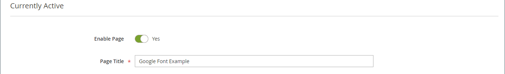

# Elements - HTML-Code

Verwenden Sie den Inhaltstyp _HTML-Code_, um HTML-, CSS- und JavaScript-Code-Ausschnitte in der [[!DNL Page Builder] stage“ ](workspace.md#stage). Wenn Sie beispielsweise benutzerdefinierte HTML hinzufügen möchten, deklarieren Sie eine CSS-Klasse, die auf ein Seitenelement angewendet werden kann. Sie können auch ein Code-Fragment für ein Logo, eine Schaltfläche oder ein Banner hinzufügen, das bzw. das Sie von einem Drittanbieter erhalten haben.

## HTML-Code-Toolbox

{width="500" zoomable="yes"}

| Tool | Symbol | Beschreibung |
| --------- | ---------- | ----------------- |
| Verschieben | {width="25"} | Verschiebt den HTML-Code-Container an eine andere gültige Position auf der Seite. |
| Einstellungen | {width="25"} | Öffnet die Seite HTML-Code bearbeiten , auf der Sie die Eigenschaften des Containers ändern können. |
| Ausblenden | {width="25"} | Blendet den HTML-Code-Container aus. |
| Anzeigen | {width="25"} | Zeigt den ausgeblendeten HTML-Code-Container an. |
| Duplikat | {width="25"} | Erstellt eine Kopie des HTML-Code-Containers. |
| entfernen | {width="25"} | Löscht den HTML-Code-Container und seinen Inhalt aus dem Schritt. |

{{$include /help/_includes/page-builder-hidden-element-note.md}}

## HTML-Code hinzufügen

Das folgende Beispiel zeigt, wie Sie [Google Font][1]-Code einbetten und benutzerdefinierte Überschriftenklassen deklarieren, die das aktuelle Stylesheet überschreiben.

### Schritt 1: Google-Schriftart auswählen

1. Besuchen Sie die [Google Fonts][1]-Site und wählen Sie die Schriftfamilie aus, die Sie verwenden möchten.

1. Kopieren Sie den generierten Code, der in den `<head>` Abschnitt der Seite eingebettet werden soll, und fügen Sie ihn vorübergehend in einen Texteditor ein.

   - Schriftart-Code einbetten
   - CSS-Regel

1. Fügen Sie die Schriftfamilienregel zu jeder Überschriftenklasse hinzu, indem Sie die Überschriftenklassen in ein `<style>` Tag einschließen.

   Dieser Code wird in [!DNL Page Builder] eingefügt.

   ```html
   <style>
      h1 {color: teal; font-family: 'Khand', sans-serif; }
      h2 {color: teal; font-family: 'Khand', sans-serif; }
      h3 {color: teal; font-family: 'Khand', sans-serif; }
   </style>
   ```

### Schritt 2: Hinzufügen des Codes zur Seite

1. Navigieren Sie in _Admin_-Seitenleiste Ihres Stores zu **[!UICONTROL Content]** > _[!UICONTROL Elements]_>**[!UICONTROL Pages]**.

1. Suchen Sie die Seite, auf der die Schriftart verfügbar sein soll, und öffnen Sie sie im Bearbeitungsmodus.

1. Scrollen Sie nach unten und erweitern Sie den Abschnitt **[!UICONTROL Content]** .

1. Erweitern Sie im [!DNL Page Builder] Bedienfeld **[!UICONTROL Elements]** und ziehen Sie einen **[!UICONTROL HTML Code]** Platzhalter in eine Zeile, Spalte oder einen Tab, die bzw. der auf dem Bühnenbild festgelegt ist.

   Verwenden Sie die rote Richtlinie, um die Trennlinie entweder vor oder nach einem anderen Inhalts-Container in der Zeile, Spalte oder im Registerkartensatz zu positionieren.

   {width="600" zoomable="yes"}

1. Bewegen Sie den Mauszeiger über den HTML-Container, um die Toolbox anzuzeigen, und wählen _das Symbol_ Settings ( {width="20"} ) aus.

1. Fügen Sie den von Ihnen vorbereiteten Einbettungs-Google-Schriftarten-Code und die Stildeklarationen in das Textfeld ein.

   Um die Lesbarkeit zu vereinfachen, können Sie einige Leerzeichen eingeben, um den Code einzuziehen.

   {width="500" zoomable="yes"}

1. Aktualisieren Sie die verbleibenden Einstellungen nach Bedarf (siehe [Ändern von HTML-Code-Einstellungen](#html-settings)).

1. Klicken Sie oben rechts auf **[!UICONTROL Save]** , um die Einstellungen anzuwenden und zum Arbeitsbereich [!DNL Page Builder] zurückzukehren.

   Die neue Schriftart wird gerendert, wenn die Seite über einen Browser aufgerufen wird.

### Schritt 3: Vorschau der Seite

1. Legen Sie im _[!UICONTROL Currently Active]_Abschnitt **[!UICONTROL Enable Page]**auf `Yes` fest.

   {width="600" zoomable="yes"}

1. Klicken Sie oben rechts auf den **[!UICONTROL Save]** und wählen Sie **[!UICONTROL Save & Close]** aus.

1. Suchen Sie die Seite im Raster und wählen Sie **[!UICONTROL View]** in der Spalte _[!UICONTROL Actions]_aus.

   {width="700" zoomable="yes"}

## HTML-Code-Einstellungen ändern {#html-settings}

1. Bewegen Sie den Mauszeiger über den HTML-Container, um die Toolbox anzuzeigen, und wählen _das Symbol_ Settings{width="20"} ).

1. Bearbeiten Sie den Code im Textfeld nach Bedarf.

   HTML-, CSS- und JavaScript-Code werden unterstützt. Code-Snippets, die zum Abschnitt `<head>` der Seite gehören, können hier eingegeben werden.

   Der Editor bietet außerdem Schaltflächen zum Einfügen spezieller Elemente in den Code:

   | Schaltfläche | Beschreibung |
   | ------ | ----------- |
   | Widget einfügen… | Klicken Sie, um ein Widget an der Cursorposition in das Textfeld &quot;HTML&quot; einzufügen. |
   | Bild einfügen… | Klicken Sie hier, um ein hochgeladenes Bild oder ein Bild aus der Galerie an der Cursorposition im HTML-Textfeld einzufügen. |
   | Variable einfügen… | Klicken Sie, um eine Variable an der Cursorposition im Textfeld &quot;HTML&quot; einzufügen. |

1. Aktualisieren Sie die _[!UICONTROL Advanced]_nach Bedarf.

   - Um die Positionierung des Codes innerhalb des übergeordneten Containers zu steuern, wählen Sie ein **[!UICONTROL Alignment]** aus:

     | Option | Beschreibung |
     | ------ | ----------- |
     | `Default` | Wendet die Standardeinstellung für die Ausrichtung an, die im Stylesheet des aktuellen Designs angegeben ist. |
     | `Left` | Richtet die Liste am linken Rand des übergeordneten Containers aus, wobei ein etwaiger Abstand berücksichtigt wird. |
     | `Center` | Richtet die Liste in der Mitte des übergeordneten Containers aus, wobei der angegebene Abstand berücksichtigt wird. |
     | `Right` | Richtet den Block am rechten Rand des übergeordneten Containers aus, wobei alle angegebenen Auffüllungen berücksichtigt werden. |

     Im folgenden Beispiel werden die Optionen so festgelegt, dass für den gerenderten Code-Block eine Mittelausrichtung verwendet wird.

     {width="600" zoomable="yes"}

   - Legen Sie den **[!UICONTROL Border]** fest, der auf alle vier Seiten des Code-Containers angewendet werden soll:

     | Option | Beschreibung |
     | ------ | ----------- |
     | `Default` | Wendet die Standardformatvorlage für Rahmen an, die im zugehörigen Stylesheet angegeben ist. |
     | `None` | Zeigt keine sichtbaren Begrenzungen des Containers an. |
     | `Dotted` | Der Container-Rahmen wird als gepunktete Linie angezeigt. |
     | `Dashed` | Der Container-Rahmen wird als gestrichelte Linie angezeigt. |
     | `Solid` | Der Container-Rahmen wird als durchgezogene Linie angezeigt. |
     | `Double` | Der Container-Rahmen wird als doppelte Linie angezeigt. |
     | `Groove` | Der Container-Rahmen wird als gerillte Linie angezeigt. |
     | `Ridge` | Der Container-Rahmen wird als geriffelte Linie angezeigt. |
     | `Inset` | Der Container-Rahmen wird als Einfügelinie angezeigt. |
     | `Outset` | Der Container-Rahmen wird als Ausgangslinie angezeigt. |

   - Wenn Sie einen anderen Rahmenstil als `None` festlegen, müssen Sie die Anzeigeoptionen für den Rahmen vervollständigen:

     | Option | Beschreibung |
     | ------ |------------ |
     | [!UICONTROL Border Color] | Geben Sie die Farbe an, indem Sie einen Musterabschnitt auswählen, auf die Farbauswahl klicken oder einen gültigen Farbnamen oder einen entsprechenden Hexadezimalwert eingeben. |
     | [!UICONTROL Border Width] | Geben Sie die Anzahl der Pixel für die Rahmenlinienbreite ein. |
     | [!UICONTROL Border Radius] | Geben Sie die Anzahl der Pixel ein, um die Größe des Radius festzulegen, mit dem jede Ecke des Rahmens gerundet werden soll. |

     {style="table-layout:auto"}

   - (Optional) Geben Sie die Namen der **[!UICONTROL CSS classes]** aus dem aktuellen Stylesheet an, die auf den Container angewendet werden sollen.

     Trennen Sie mehrere Klassennamen durch ein Leerzeichen.

   - Geben Sie Werte in Pixeln für den **[!UICONTROL Margins and Padding]** ein, um die äußeren Ränder und den inneren Abstand des Code-Containers zu bestimmen.

     Geben Sie die entsprechenden Werte in das Diagramm ein.

     | Container-Bereich | Beschreibung |
     | -------------- | ----------- |
     | [!UICONTROL Margins] | Die Menge des Leerraums, der auf die Außenkante aller Seiten des Containers angewendet wird. Optionen: `Top` / `Right` / `Bottom` / `Left` |
     | [!UICONTROL Padding] | Die Menge des Leerraums, der auf die Innenkante aller Seiten des Containers angewendet wird. Optionen: `Top` / `Right` / `Bottom` / `Left` |

[1]: https://fonts.google.com/
