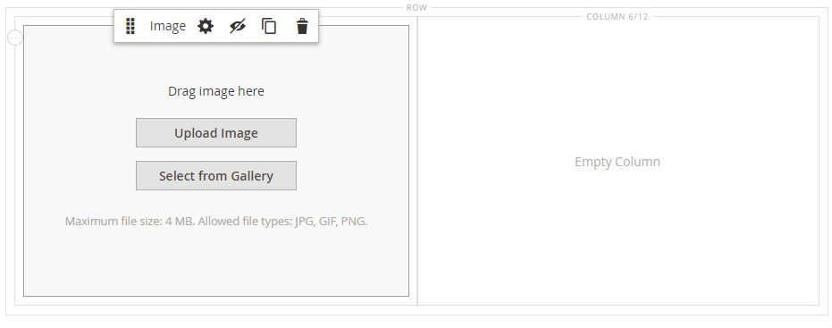
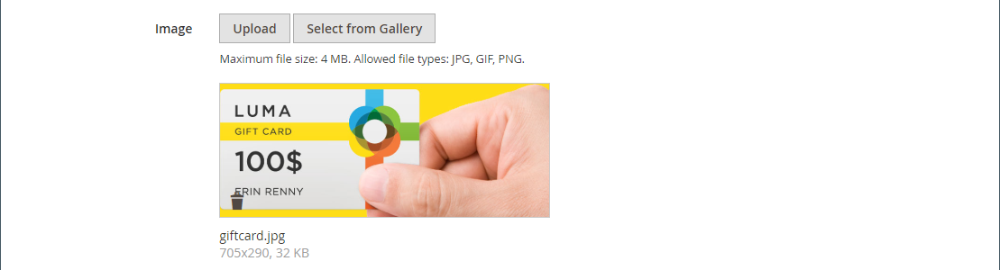

# Medien - Bild

Verwenden Sie den Inhaltstyp _Bild_ , um der [[!DNL Page Builder] Bühne](workspace.md#stage) ein JPG-, GIF- oder PNG-Bild hinzuzufügen. Zusätzlich zum standardmäßigen Desktop-Bild können Sie ein sekundäres Bild für Mobilgeräte angeben. Sie können auch eine Beschriftung hinzufügen, die unter dem Bild angezeigt wird, und das Bild mit einer URL, einem Produkt, einer Kategorie oder einer Seite verknüpfen.

>[!TIP]
>
>Sie können die [Adobe Stock-Integration](../content-design/adobe-stock.md) verwenden, um ein geeignetes Asset aus den Millionen von [Adobe Stock](https://stock.adobe.com) zu finden und zu speichern. Weitere Informationen zum Suchen, Verfeinern und Speichern von Adobe Stock-Assets in Ihrer Galerie finden Sie unter [Verwenden von Adobe Stock-Bildern](../content-design/adobe-stock-manage.md) .

{{$include /help/_includes/page-builder-save-timeout.md}}

## Bild-Toolbox

Die Bild-Toolbox wird angezeigt, wenn Sie den Mauszeiger über den Bildcontainer bewegen.

{width="500" zoomable="yes"}

| Tool | Symbol | Beschreibung |
|--- |--- |--- |
| Verschieben | {width="25"} | Verschiebt das Bild an eine andere Position auf der Bühne. |
| (Titel) | Bild | Identifiziert den aktuellen Inhalts-Container als Bild. Bewegen Sie den Mauszeiger über den Bildcontainer, um die Toolbox anzuzeigen. |
| Einstellungen | {width="25"} | Öffnet die Seite _Bild bearbeiten_ , auf der Sie die Eigenschaften des Bildes und Containers ändern können. |
| Ausblenden | {width="25"} | Blendet das aktuelle Bild aus. |
| Anzeigen | {width="25"} | Zeigt das ausgeblendete Bild an. |
| Duplizieren | {width="25"} | Kopiert das Bild. |
| Entfernen | {width="25"} | Löscht das Bild aus der Bühne. |
| Neues Bild hochladen |  | Lädt ein Bild aus Ihrem lokalen Dateisystem in die Galerie hoch. |
| Aus Galerie auswählen |  | Auswahl eines vorhandenen Bildes aus der Galerie. |

{style="table-layout:auto"}

{{$include /help/_includes/page-builder-hidden-element-note.md}}

## Bild hinzufügen

1. Erweitern Sie im Bedienfeld [!DNL Page Builder] den Eintrag **[!UICONTROL Media]** und ziehen Sie einen **[!UICONTROL Image]** Platzhalter in den Zielcontainer.

   Sie können ein Bild zu einer Zeile, Spalte oder Registerkarte hinzufügen. Im folgenden Beispiel wird das Bild in eine leere Spalte gezogen.

   {width="600" zoomable="yes"}

1. Verwenden Sie eine der folgenden Methoden, um das Bild-Asset hinzuzufügen:

   {width="500" zoomable="yes"}

   >[!NOTE]
   >
   >Die maximale Dateigröße beträgt 4 MB. Unterstützte Dateitypen sind JPG, GIF und PNG.

   - _**Neues Bild hochladen**_: Mit dieser Methode können Sie eine neue Bilddatei von Ihrem System hochladen.

      - Klicken Sie auf **[!UICONTROL Upload Image]**.

      - Suchen Sie das Bild und wählen Sie es aus, um es der Galerie und dem Zielcontainer hinzuzufügen.

     Alternativ können Sie eine Bilddatei auch aus Ihrem System ziehen und auf das Symbol _Kamera_ ( {width="20"} ) ziehen.

   - _**Vorhandenes Asset auswählen**_: Verwenden Sie diese Methode, um ein vorhandenes Bild-Asset aus dem Medienspeicher/der Galerie auszuwählen.

      - Klicken Sie auf **[!UICONTROL Select from Gallery]**.

      - Navigieren Sie mithilfe der Baumstruktur zum Bild.

      - Klicken Sie auf die Miniaturansicht und dann auf **[!UICONTROL Add Selected]**.

        {width="600" zoomable="yes"}

   - _**Adobe Stock-Bild suchen und auswählen**_: Verwenden Sie diese Methode, um ein Bild aus Adobe Stock zu suchen.

     >[!NOTE]
     >
     >Für diese Methode ist eine [Adobe Stock-Integration](../content-design/adobe-stock.md) erforderlich, die für Ihren Administrator konfiguriert ist.

      - Klicken Sie auf **[!UICONTROL Search Adobe Stock]** und suchen Sie nach einem Bild.

      - Speichern Sie die Vorschau oder das lizenzierte Bild in der Galerie.

        Weitere Informationen zum Arbeiten mit Adobe Stock-Assets finden Sie unter [Verwenden von Adobe Stock-Bildern](../content-design/adobe-stock-manage.md) .

      - Wählen Sie die Asset-Miniaturansicht in der Galerie aus und klicken Sie auf **[!UICONTROL Add Selected]**.

   Das Bild wird im Zielbehälter am Speicherort des Platzhalters angezeigt. Im Gegensatz zu einem Hintergrundbild können Sie das Bild an eine andere Position innerhalb des aktuellen Containers oder in einen anderen Container verschieben.

   >[!NOTE]
   >
   >Zu den Inhaltstypen [Banner](banner.md) und [Regler](slider.md) gehören auch die Optionen _Bild hochladen_ und _Aus Galerie auswählen_ zum Hinzufügen von Bildern.

   {width="500" zoomable="yes"}

## Bildeinstellungen ändern

1. Bewegen Sie den Mauszeiger über den Bildcontainer, um das Tool-Feld anzuzeigen und das Symbol _Einstellungen_ ({width="20"} ) zu wählen.
Dateiname, Abmessungen und Dateigröße werden unter dem aktuellen Bild angezeigt.

   {width="600" zoomable="yes"}

1. Um den aktuellen **[!UICONTROL Image]**-Wert zu ändern, führen Sie einen der folgenden Schritte aus:

   - _**Neues Bild hochladen**_: Mit dieser Methode können Sie eine neue Bilddatei von Ihrem System hochladen.

      - Klicken Sie auf **[!UICONTROL Upload Image]**.

      - Suchen Sie das Bild und wählen Sie es aus, um es der Galerie und dem Zielcontainer hinzuzufügen.

   - _**Vorhandenes Asset auswählen**_: Verwenden Sie diese Methode, um ein vorhandenes Bild-Asset aus dem Medienspeicher/der Galerie auszuwählen.

      - Klicken Sie auf **[!UICONTROL Select from Gallery]**.

      - Navigieren Sie mithilfe der Baumstruktur zum Bild.

      - Klicken Sie auf die Miniaturansicht und dann auf **[!UICONTROL Add Selected]**.

        {width="600" zoomable="yes"}

   - **Adobe Stock-Bild suchen und auswählen**: Verwenden Sie diese Methode, um ein Bild aus Adobe Stock zu suchen.

     >[!NOTE]
     >
     >Für diese Methode ist eine [Adobe Stock-Integration](../content-design/adobe-stock.md) erforderlich, die für Ihren Administrator konfiguriert ist.

      - Klicken Sie auf **[!UICONTROL Search Adobe Stock]** und suchen Sie nach einem Bild.

      - Speichern Sie die Vorschau oder das lizenzierte Bild in der Galerie.

        Weitere Informationen zum Arbeiten mit Adobe Stock-Assets finden Sie unter [Verwenden von Adobe Stock-Bildern](../content-design/adobe-stock-manage.md) .

      - Wählen Sie die Asset-Miniaturansicht in der Galerie aus und klicken Sie auf **[!UICONTROL Add Selected]**.

1. Verwenden Sie zum Hinzufügen von **[!UICONTROL Mobile Image]** die im vorherigen Schritt beschriebenen Methoden, um ein Bild auszuwählen, das für die Anzeige auf Mobilgeräten verwendet werden soll.

   {width="600" zoomable="yes"}

1. Geben Sie bei Bedarf **[!UICONTROL Link]** für das Bild an.

   Der Link ist die Zielseite, die angezeigt wird, wenn der Kunde auf das Bild klickt. Sie können einen von drei Linktypen verwenden:

   - **[!UICONTROL URL]** - Links zu einer relativen oder vollständig qualifizierten URL.

   - **[!UICONTROL Product]** - Identifiziert die Zielseite anhand des Produktnamen oder der SKU. Suchen Sie nach dem Produkt anhand des Namens, der entweder auf einem Teil- oder einem vollständigen Namen basiert. Wählen Sie das Produkt aus der Liste der Suchergebnisse aus.

     {width="600" zoomable="yes"}

   - **[!UICONTROL Category]** - Identifiziert die Zielseite als eine bestimmte Kategorie oder Unterkategorie im Kategoriebaum. Suchen Sie nach der Kategorie basierend auf einem Teil- oder Vollnamen. Wählen Sie die Kategorie aus dem erweiterten Bereich des angezeigten Baums aus.

     {width="600" zoomable="yes"}

   - **[!UICONTROL Page]** - Identifiziert die Zielseite als bestimmte Inhaltsseite. Suchen Sie nach der Seite, die auf einem Teil- oder vollständigen Namen basiert. Wählen Sie die Seite aus der Liste der Suchergebnisse aus.

     {width="600" zoomable="yes"}

   Wenn Sie verhindern möchten, dass der Besucher von Ihrem Store weg navigiert, aktivieren Sie das Kontrollkästchen **[!UICONTROL Open in new tab]** . Wenn das Kontrollkästchen deaktiviert wird, wird das verknüpfte Ziel in derselben Browser-Registerkarte geöffnet, wodurch der Besucher effektiv von Ihrem Store weg navigiert.

1. Um eine **[!UICONTROL Image Caption]** hinzuzufügen, geben Sie den Text ein, der unter dem Bild angezeigt werden soll.

   Das Format der Beschriftung wird durch das Stylesheet bestimmt, das dem aktuellen Design zugeordnet ist.

   Die Beschriftung wird normalerweise unter dem Bild angezeigt und liefert Informationen über das Bild für Besucher und Suchmaschinen. Wenn Ihre Site in mehreren Sprachen verfügbar ist, können Sie dasselbe Bild verwenden, die Beschriftung jedoch übersetzen. In HTML ist das Tag `<figcaption>` eine Untergruppe des Tags `<figure>`. `<figcaption>This is the image caption</figcaption>`

1. Aktualisieren Sie die anderen Einstellungen nach Bedarf:

   - [Suchmaschinenoptimierung](#search-engine-optimization)
   - [Erweitert](#advanced)

1. Klicken Sie nach Abschluss des Vorgangs auf **[!UICONTROL Save]** , um die Einstellungen anzuwenden und zum Arbeitsbereich [!DNL Page Builder] zurückzukehren.

## Verschieben eines Bildes

1. Bewegen Sie den Mauszeiger über den Bildcontainer, um die Werkzeugleiste anzuzeigen, und wählen Sie das Symbol _Verschieben_ ({width="20"} ).

   {width="500" zoomable="yes"}

1. Wählen Sie das Bild aus und ziehen Sie es an die neue Position, direkt unterhalb der roten Führungslinie.

   {width="500" zoomable="yes"}

## Entfernen von Bildern

1. Bewegen Sie den Mauszeiger über den Bildcontainer, um die Werkzeugleiste anzuzeigen, und wählen Sie das Symbol _Entfernen_ ( {width="20"} ).

1. Klicken Sie bei Aufforderung zur Bestätigung auf **[!UICONTROL OK]**.

## Suchmaschinenoptimierung

Text für diese Einstellungen ist für Suchmaschinen sichtbar und verbessert die Indexierung der Seite.

- Geben Sie für &quot;**[!UICONTROL Alternative Text]**&quot;eine _alt_ -Textbeschreibung für die anzuzeigenden Tools für die digitale Barrierefreiheit ein.

  Die Verwendung von Alternativtext ist eine Best Practice für Barrierefreiheit und ist in einigen Gebietsschemata gesetzlich vorgeschrieben. In HTML ist das Attribut `alt` eine Untergruppe des Tags `image`: `<image title="tooltip" alt="description" src="image.jpg">`.

- Geben Sie für &quot;**[!UICONTROL Title Attribute]**&quot;den Text ein, der beim Bewegen des Mauszeigers als QuickInfo angezeigt werden soll.

  Als Best Practice wird empfohlen, einen beschreibenden, schlüsselwortreichen Titel zu wählen, um die Indexierung des Bildes durch Suchmaschinen zu verbessern. In HTML ist das Attribut `title` eine Untergruppe des Tags `image`: `<image title="tooltip" alt="description" src="image.jpg">`.

## [!UICONTROL Advanced]

- Um die horizontale Positionierung der Bilder zu steuern, die dem Container hinzugefügt werden, wählen Sie einen **[!UICONTROL Alignment]**.

  | Option | Beschreibung |
  | ------ | ----------- |
  | `Default` | Wendet die Standardeinstellung für die Ausrichtung an, die im Stylesheet des aktuellen Designs angegeben ist. |
  | `Left` | Richtet den Bildinhalt am linken Rand des Bildcontainers aus, wobei der angegebene Abstand berücksichtigt wird. |
  | `Center` | Richtet den Bildinhalt in der Mitte des Bildcontainers aus, wobei der angegebene Abstand berücksichtigt wird. |
  | `Right` | Richtet den Bildinhalt am rechten Rand des Bildcontainers aus, wobei der angegebene Abstand berücksichtigt wird. |

  {style="table-layout:auto"}

- Legen Sie den **[!UICONTROL Border]** -Stil fest, der auf alle vier Seiten des Bild-Containers angewendet wird:

  | Option | Beschreibung |
  | ------ | ----------- |
  | `Default` | Wendet den standardmäßigen Randstil an, der vom zugehörigen Stylesheet angegeben wird. |
  | `None` | liefert keine sichtbare Anzeige der Containergrenzen. |
  | `Dotted` | Der Container-Rahmen wird als gepunktete Linie angezeigt. |
  | `Dashed` | Der Container-Rahmen wird als gestrichelte Linie angezeigt. |
  | `Solid` | Der Container-Rahmen wird als durchgehende Linie angezeigt. |
  | `Double` | Der Container-Rahmen wird als doppelte Linie angezeigt. |
  | `Groove` | Der Container-Rahmen wird als Rillenlinie angezeigt. |
  | `Ridge` | Der Container-Rahmen wird als gekürzte Linie angezeigt. |
  | `Inset` | Der Container-Rahmen wird als Inset-Zeile angezeigt. |
  | `Outset` | Der Container-Rahmen wird als Ausgangspunkt angezeigt. |

  {style="table-layout:auto"}

- Wenn Sie einen anderen Rahmenstil als `None` festlegen, füllen Sie die Anzeigeoptionen für die Rahmenanzeige aus:

  {width="600" zoomable="yes"}

  | Option | Beschreibung |
  | ------ |------------ |
  | [!UICONTROL Border Color] | Geben Sie die Farbe an, indem Sie ein Muster auswählen, auf die Farbauswahl klicken oder einen gültigen Farbnamen oder einen entsprechenden Hexadezimalwert eingeben. |
  | [!UICONTROL Border Width] | Geben Sie die Anzahl Pixel für die Rahmenlinienbreite an. |
  | [!UICONTROL Border Radius] | Geben Sie die Anzahl der Pixel an, um die die Größe des Radius definiert wird, mit dem die einzelnen Ecken des Rands gerundet werden. |

  {style="table-layout:auto"}

- (Optional) Geben Sie die Namen von **[!UICONTROL CSS classes]** aus dem aktuellen Stylesheet an, das auf den Bildcontainer angewendet werden soll.

  Trennen Sie mehrere Klassennamen durch ein Leerzeichen.

- Geben Sie Werte in Pixel an, damit der **[!UICONTROL Margins and Padding]** die äußeren Ränder und den inneren Abstand des Bildcontainers angibt.

  Geben Sie jeden entsprechenden Wert in das Bild-Container-Diagramm ein.

  | Container-Bereich | Beschreibung |
  | -------------- | ----------- |
  | [!UICONTROL Margins] | Die Menge an leerem Raum, die auf den äußeren Rand aller Seiten des Containers angewendet wird. |
  | [!UICONTROL Padding] | Die Menge an leerem Raum, die auf den inneren Rand aller Seiten des Containers angewendet wird. |

  {style="table-layout:auto"}
