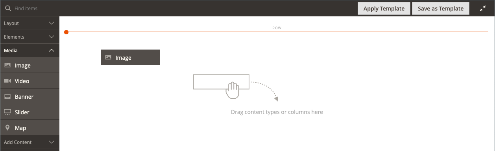

# Medien - Bild

Verwenden Sie den _image_-Inhaltstyp, um ein JPG-, GIF- oder PNG-Bild zur [[!DNL Page Builder] Phase](workspace.md#stage) hinzuzufügen. Zusätzlich zum Standard-Desktop-Image können Sie ein sekundäres Image für Mobilgeräte angeben. Sie können auch eine Beschriftung hinzufügen, die unter dem Bild angezeigt wird, und das Bild mit einer beliebigen URL, einem Produkt, einer Kategorie oder Seite verknüpfen.

>[!TIP]
>
>Sie können die [Adobe Stock-Integration](../content-design/adobe-stock.md) verwenden, um ein geeignetes Asset aus den Millionen zu finden und zu speichern, die von [Adobe Stock bereitgestellt &#x200B;](https://stock.adobe.com). Siehe [Verwenden von Adobe Stock](../content-design/adobe-stock-manage.md) für Details zum Suchen, Verfeinern und Speichern von Adobe Stock-Assets in Ihrer Galerie.

{{$include /help/_includes/page-builder-save-timeout.md}}

## Bild-Toolbox

Die Bild-Toolbox wird angezeigt, wenn Sie den Mauszeiger über den Bild-Container bewegen.

{width="500" zoomable="yes"}

| Tool | Symbol | Beschreibung |
|--- |--- |--- |
| Verschieben | {width="25"} | Verschiebt das Bild an eine andere Position auf der Bühne. |
| (Bezeichnung) | Bild | Identifiziert den aktuellen Inhalts-Container als Bild. Bewegen Sie den Mauszeiger über den Bild-Container, um die Toolbox anzuzeigen. |
| Einstellungen | {width="25"} | Öffnet die Seite _Bild bearbeiten_ auf der Sie die Eigenschaften des Bildes und des Containers ändern können. |
| Ausblenden | {width="25"} | Blendet das aktuelle Bild aus. |
| Anzeigen | {width="25"} | Zeigt das ausgeblendete Bild an. |
| Duplikat | {width="25"} | Erstellt eine Kopie des Bildes. |
| entfernen | {width="25"} | Löscht das Bild aus der Phase. |
| Neues Bild hochladen |  | Lädt ein Bild aus dem lokalen Dateisystem in die Galerie hoch. |
| Aus Galerie auswählen |  | Wählt ein vorhandenes Bild aus der Galerie aus. |

{style="table-layout:auto"}

{{$include /help/_includes/page-builder-hidden-element-note.md}}

## Bild hinzufügen

1. Erweitern Sie im [!DNL Page Builder] Bedienfeld **[!UICONTROL Media]** und ziehen Sie einen **[!UICONTROL Image]** Platzhalter in den Ziel-Container.

   Sie können ein Bild zu einer Zeile, Spalte oder Registerkarte hinzufügen. Im folgenden Beispiel wird das Bild in eine leere Spalte gezogen.

   {width="600" zoomable="yes"}

1. Verwenden Sie eine der folgenden Methoden, um das Bild-Asset hinzuzufügen:

   {width="500" zoomable="yes"}

   >[!NOTE]
   >
   >Die maximale Dateigröße beträgt 4 MB. Unterstützte Dateitypen sind JPG, GIF und PNG.

   - _&#x200B;**Neues Bild hochladen**&#x200B;_: Verwenden Sie diese Methode, um eine neue Bilddatei von Ihrem System hochzuladen.

      - Klicken Sie auf **[!UICONTROL Upload Image]**.

      - Suchen Sie das Bild und wählen Sie es aus, um es der Galerie und dem Ziel-Container hinzuzufügen.

     Alternativ können Sie auch eine Bilddatei aus Ihrem System ziehen und auf dem Symbol _Kamera_ ( {width="20"} ) ablegen.

   - _&#x200B;**Vorhandenes Asset auswählen**&#x200B;_: Verwenden Sie diese Methode, um ein vorhandenes Bild-Asset aus dem Medienspeicher/der Mediensammlung auszuwählen.

      - Klicken Sie auf **[!UICONTROL Select from Gallery]**.

      - Navigieren Sie mithilfe der Baumstruktur zum Bild.

      - Klicken Sie auf die Miniaturansicht und dann auf **[!UICONTROL Add Selected]**.

        {width="600" zoomable="yes"}

   - _&#x200B;**Adobe Stock-Bild suchen und auswählen**&#x200B;_: Verwenden Sie diese Methode, um ein Bild aus Adobe Stock zu suchen.

     >[!NOTE]
     >
     >Für diese Methode ist eine [Adobe Stock-Integration](../content-design/adobe-stock.md) für Ihren Administrator konfiguriert.

      - Klicken Sie auf **[!UICONTROL Search Adobe Stock]** und suchen Sie nach einem Bild.

      - Speichern Sie die Vorschau oder das lizenzierte Bild in der Galerie.

        Weitere [&#x200B; zum Arbeiten mit Adobe Stock-Assets finden &#x200B;](../content-design/adobe-stock-manage.md) unter „Verwenden von Adobe StockBildern“.

      - Wählen Sie die Asset-Miniaturansicht in der Galerie aus und klicken Sie auf **[!UICONTROL Add Selected]**.

   Das Bild wird im Ziel-Container an der Position des Platzhalters angezeigt. Im Gegensatz zu einem Hintergrundbild können Sie das Bild an eine andere Position innerhalb des aktuellen Containers oder in einen anderen Container verschieben.

   >[!NOTE]
   >
   >Die Inhaltstypen [Banner](banner.md) und [Regler](slider.md) enthalten auch Optionen _Bild hochladen_ und _Aus Galerie auswählen_ zum Hinzufügen von Bildern.

   {width="500" zoomable="yes"}

## Bildeinstellungen ändern

1. Bewegen Sie den Mauszeiger über den Bild-Container, um die Toolbox anzuzeigen, und wählen Sie _Symbol Einstellungen_ ({width="20"} ) aus.
Der Dateiname, die Abmessungen und die Dateigröße werden unter dem aktuellen Bild angezeigt.

   {width="600" zoomable="yes"}

1. Führen Sie einen der folgenden Schritte aus, um die aktuelle **[!UICONTROL Image]** zu ändern:

   - _&#x200B;**Neues Bild hochladen**&#x200B;_: Verwenden Sie diese Methode, um eine neue Bilddatei von Ihrem System hochzuladen.

      - Klicken Sie auf **[!UICONTROL Upload Image]**.

      - Suchen Sie das Bild und wählen Sie es aus, um es der Galerie und dem Ziel-Container hinzuzufügen.

   - _&#x200B;**Vorhandenes Asset auswählen**&#x200B;_: Verwenden Sie diese Methode, um ein vorhandenes Bild-Asset aus dem Medienspeicher/der Mediensammlung auszuwählen.

      - Klicken Sie auf **[!UICONTROL Select from Gallery]**.

      - Navigieren Sie mithilfe der Baumstruktur zum Bild.

      - Klicken Sie auf die Miniaturansicht und dann auf **[!UICONTROL Add Selected]**.

        {width="600" zoomable="yes"}

   - **Adobe Stock-Bild suchen und auswählen**: Verwenden Sie diese Methode, um ein Bild aus Adobe Stock zu suchen.

     >[!NOTE]
     >
     >Für diese Methode ist eine [Adobe Stock-Integration](../content-design/adobe-stock.md) für Ihren Administrator konfiguriert.

      - Klicken Sie auf **[!UICONTROL Search Adobe Stock]** und suchen Sie nach einem Bild.

      - Speichern Sie die Vorschau oder das lizenzierte Bild in der Galerie.

        Weitere [&#x200B; zum Arbeiten mit Adobe Stock-Assets finden &#x200B;](../content-design/adobe-stock-manage.md) unter „Verwenden von Adobe StockBildern“.

      - Wählen Sie die Asset-Miniaturansicht in der Galerie aus und klicken Sie auf **[!UICONTROL Add Selected]**.

1. Verwenden Sie zum Hinzufügen eines **[!UICONTROL Mobile Image]** dieselben im vorherigen Schritt beschriebenen Methoden, um ein Bild auszuwählen, das für die Anzeige auf Mobilgeräten verwendet werden soll.

   {width="600" zoomable="yes"}

1. Geben Sie bei Bedarf einen **[!UICONTROL Link]** für das Bild an.

   Der Link ist die Zielseite, die angezeigt wird, wenn der Kunde auf das Bild klickt. Sie können einen von drei Link-Typen verwenden:

   - **[!UICONTROL URL]** - Links zu einer relativen oder vollständig qualifizierten URL.

   - **[!UICONTROL Product]** - Identifiziert die Zielseite anhand des Produktnamens oder der SKU. Suchen Sie nach dem Produkt anhand eines Namens, der entweder auf einem Teil- oder einem vollständigen Namen basiert. Wählen Sie das Produkt aus der Suchergebnisliste aus.

     {width="600" zoomable="yes"}

   - **[!UICONTROL Category]** - Identifiziert die Zielseite als eine bestimmte Kategorie oder Unterkategorie in der Kategoriestruktur. Suche nach der Kategorie basierend auf einem Teil- oder Vollnamen. Wählen Sie die Kategorie aus dem erweiterten Abschnitt der angezeigten Baumstruktur aus.

     {width="600" zoomable="yes"}

   - **[!UICONTROL Page]** - Identifiziert die Zielseite als eine bestimmte Inhaltsseite. Suche nach der Seite basierend auf einem Teil- oder vollständigen Namen. Wählen Sie die Seite aus der Liste Suchergebnisse aus.

     {width="600" zoomable="yes"}

   Wenn Sie verhindern möchten, dass der Besucher Ihren Store verlässt, aktivieren Sie das Kontrollkästchen **[!UICONTROL Open in new tab]** . Wenn das Kontrollkästchen deaktiviert ist, wird das verknüpfte Ziel in derselben Browser-Registerkarte geöffnet, die den Besucher effektiv von Ihrem Store weg navigieren könnte.

1. Um ein **[!UICONTROL Image Caption]** hinzuzufügen, geben Sie den Text ein, der unter dem Bild angezeigt werden soll.

   Das Format der Beschriftung wird durch das Stylesheet bestimmt, das mit dem aktuellen Design verknüpft ist.

   Die Beschriftung wird normalerweise unter dem Bild angezeigt und stellt für Besucher und Suchmaschinen Informationen zum Bild bereit. Wenn Ihre Site in mehreren Sprachen verfügbar ist, können Sie dasselbe Bild verwenden, aber die Beschriftung übersetzen. In HTML ist das `<figcaption>`-Tag eine Teilmenge des `<figure>`-Tags. `<figcaption>This is the image caption</figcaption>`

1. Aktualisieren Sie alle anderen Einstellungen nach Bedarf:

   - [Suchmaschinenoptimierung](#search-engine-optimization)
   - [Erweitert](#advanced)

1. Klicken Sie abschließend auf **[!UICONTROL Save]** , um die Einstellungen anzuwenden und zum Arbeitsbereich [!DNL Page Builder] zurückzukehren.

## Verschieben eines Bildes

1. Bewegen Sie den Mauszeiger über den Bild-Container, um die Toolbox anzuzeigen, und wählen Sie _Symbol „Verschieben_ ({width="20"} ) aus.

   {width="500" zoomable="yes"}

1. Wählen Sie das Bild aus und ziehen Sie es an die neue Position, direkt unter der roten Richtlinie.

   {width="500" zoomable="yes"}

## Entfernen eines Bildes

1. Bewegen Sie den Mauszeiger über den Bild-Container, um die Toolbox anzuzeigen, und wählen _das Symbol Entfernen_ ( {width="20"} ) aus.

1. Wenn Sie zum Bestätigen aufgefordert werden, klicken Sie auf **[!UICONTROL OK]**.

## Suchmaschinenoptimierung

Der Text für diese Einstellungen ist für Suchmaschinen sichtbar und verbessert die Indizierung der Seite.

- Geben Sie **[!UICONTROL Alternative Text]** eine _Alt_-Textbeschreibung für die anzuzeigenden digitalen Barrierefreiheits-Tools ein.

  Die Verwendung von Alternativtext ist eine Best Practice für die Barrierefreiheit und wird in einigen Gebietsschemata gesetzlich vorgeschrieben. In HTML ist das `alt`-Attribut eine Teilmenge des `image`-Tags: `<image title="tooltip" alt="description" src="image.jpg">`.

- Geben Sie **[!UICONTROL Title Attribute]** den Text ein, der beim Bewegen des Mauszeigers als QuickInfo angezeigt werden soll.

  Wählen Sie als Best Practice einen beschreibenden, schlüsselwortreichen Titel aus, um die Art und Weise zu verbessern, wie das Bild von Suchmaschinen indiziert wird. In HTML ist das `title`-Attribut eine Teilmenge des `image`-Tags: `<image title="tooltip" alt="description" src="image.jpg">`.

## [!UICONTROL Advanced]

- Um die horizontale Positionierung der dem Container hinzugefügten Bilder zu steuern, wählen Sie ein **[!UICONTROL Alignment]** aus.

  | Option | Beschreibung |
  | ------ | ----------- |
  | `Default` | Wendet die Standardeinstellung für die Ausrichtung an, die im Stylesheet des aktuellen Designs angegeben ist. |
  | `Left` | Richtet den Bildinhalt am linken Rand des Bild-Containers aus, wobei ein beliebiger Abstand berücksichtigt wird. |
  | `Center` | Richtet den Bildinhalt in der Mitte des Bild-Containers aus, wobei für jeden angegebenen Abstand gesorgt wird. |
  | `Right` | Richtet den Bildinhalt am rechten Rand des Bild-Containers aus, wobei ein beliebiger Abstand berücksichtigt wird. |

  {style="table-layout:auto"}

- Legen Sie den **[!UICONTROL Border]** fest, der auf alle vier Seiten des Bild-Containers angewendet werden soll:

  | Option | Beschreibung |
  | ------ | ----------- |
  | `Default` | Wendet die Standardformatvorlage für Rahmen an, die im zugehörigen Stylesheet angegeben ist. |
  | `None` | Zeigt keine sichtbaren Begrenzungen des Containers an. |
  | `Dotted` | Der Container-Rahmen wird als gepunktete Linie angezeigt. |
  | `Dashed` | Der Container-Rahmen wird als gestrichelte Linie angezeigt. |
  | `Solid` | Der Container-Rahmen wird als durchgezogene Linie angezeigt. |
  | `Double` | Der Container-Rahmen wird als doppelte Linie angezeigt. |
  | `Groove` | Der Container-Rahmen wird als gerillte Linie angezeigt. |
  | `Ridge` | Der Container-Rahmen wird als geriffelte Linie angezeigt. |
  | `Inset` | Der Container-Rahmen wird als Einfügelinie angezeigt. |
  | `Outset` | Der Container-Rahmen wird als Ausgangslinie angezeigt. |

  {style="table-layout:auto"}

- Wenn Sie einen anderen Rahmenstil als `None` festlegen, müssen Sie die Anzeigeoptionen für den Rahmen vervollständigen:

  {width="600" zoomable="yes"}

  | Option | Beschreibung |
  | ------ |------------ |
  | [!UICONTROL Border Color] | Geben Sie die Farbe an, indem Sie einen Musterabschnitt auswählen, auf die Farbauswahl klicken oder einen gültigen Farbnamen oder einen entsprechenden Hexadezimalwert eingeben. |
  | [!UICONTROL Border Width] | Geben Sie die Anzahl der Pixel für die Rahmenlinienbreite ein. |
  | [!UICONTROL Border Radius] | Geben Sie die Anzahl der Pixel ein, um die Größe des Radius festzulegen, mit dem jede Ecke des Rahmens gerundet werden soll. |

  {style="table-layout:auto"}

- (Optional) Geben Sie die Namen der **[!UICONTROL CSS classes]** aus dem aktuellen Stylesheet an, die auf den Bild-Container angewendet werden sollen.

  Trennen Sie mehrere Klassennamen durch ein Leerzeichen.

- Geben Sie Werte in Pixeln für die **[!UICONTROL Margins and Padding]** ein, um die äußeren Ränder und den inneren Abstand des Bild-Containers anzugeben.

  Geben Sie jeden entsprechenden Wert in das Bild-Container-Diagramm ein.

  | Container-Bereich | Beschreibung |
  | -------------- | ----------- |
  | [!UICONTROL Margins] | Die Menge des Leerraums, der auf die Außenkante aller Seiten des Containers angewendet wird. |
  | [!UICONTROL Padding] | Die Menge des Leerraums, der auf die Innenkante aller Seiten des Containers angewendet wird. |

  {style="table-layout:auto"}

<!-- Last updated from includes: 2023-09-11 14:30:19 -->
