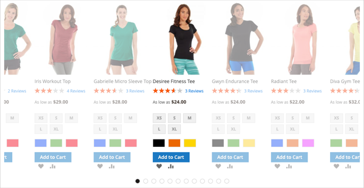
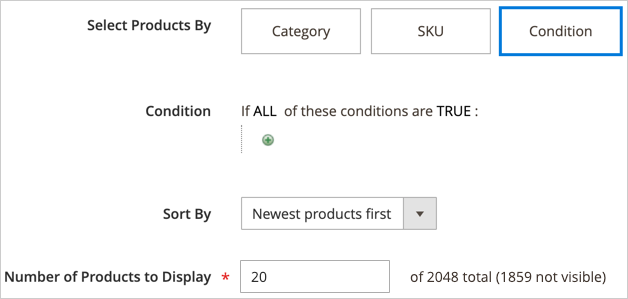
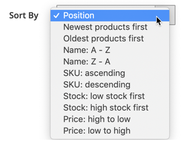

# Inhalt hinzufügen - Produkte

Verwenden Sie den Content _Typ_ Produkte“, um eine Liste von Produkten zum [[!DNL Page Builder] Staging](workspace.md#stage) hinzuzufügen, entweder mithilfe eines Rasters oder eines Karussell-Layouts. Verwenden Sie das [Inhalt hinzufügen - Block](block.md), um den Block auf der [!DNL Page Builder] Phase zu platzieren und anschließend eine Produktliste innerhalb des Blocks zu platzieren. Sie können die Produktliste auch direkt in einer Zeile auf einer Seite hinzufügen.

## Richtlinien für die Verwendung des Produktkarussells

Das Produktkarussell bietet eine leistungsstarke und ansprechende Möglichkeit, Ihre Produkte zu präsentieren. Um das Beste daraus zu machen, werden die folgenden Richtlinien empfohlen:

- Fügen Sie Produktkarussells direkt zu seitenbreiten Containern wie Zeilen, Registerkarten oder einspaltigen Layouts hinzu. Die Verwendung von Seitenbreiten-Layouts gewährleistet die beste responsive Anzeige Ihrer Produkte. [!DNL Page Builder] reduziert die Anzahl der angezeigten Produkte je nach Seitenbreite und nicht nach Breite des Containers.

- Fügen Sie kein Produktkarussell zu einer schmalen Spalte hinzu. Wie bereits erwähnt, bestimmt [!DNL Page Builder] standardmäßig die Anzahl der anzuzeigenden Produkte anhand der Seitenbreite und nicht anhand der Spaltenbreite.

- Wenn Sie möchten, dass das Produktkarussell kontinuierlich automatisch scrollt, legen Sie sowohl **[!UICONTROL Autoplay]** als auch **[!UICONTROL Infinite Loop]** auf `Yes` fest. Wenn „Autoplay“ auf &quot;`Yes`&quot;, „Infinite Loop“ jedoch auf &quot;`No`&quot; eingestellt ist, wird der automatische Bildlauf am Ende der Produktliste angehalten.

- Legen Sie die **[!UICONTROL Carousel Mode]** auf `Continuous` fest, um jeweils ein Produkt im Karussell hervorzuheben, zu zentrieren und zu scrollen. Die anderen Produkte sind in der Liste sichtbar, aber transparent, um das zentrierte Produkt hervorzuheben.

  {width="600"}

- Wenn Sie bis zu fünf Produkte gleichzeitig im Karussell anzeigen und scrollen möchten, setzen Sie die **[!UICONTROL Carousel Mode]** auf `Default`.

  {width="600"}

Die folgenden Anweisungen zeigen, wie Sie einem Block eine Produktliste hinzufügen. Sie können dann ein [Widget) verwenden](../content-design/widgets.md) um den Block an einer bestimmten Position auf einer beliebigen Seite in Ihrem Store zu platzieren.

{{$include /help/_includes/page-builder-save-timeout.md}}

## Produkte-Toolbox

| Tool | Symbol | Beschreibung |
| --------- | ------------- | ----------------- |
| Verschieben | {width="25"} | Verschiebt den Produkt-Container und seinen Inhalt an eine andere Position auf der Bühne. |
| Einstellungen | {width="25"} | Öffnet die Seite _Produkte bearbeiten_ auf der Sie die Produktliste auswählen und die Eigenschaften des Containers ändern können. |
| Ausblenden | {width="25"} | Blendet den aktuellen Produkt-Container und dessen Inhalt aus. |
| Anzeigen | {width="25"} | Zeigt den Container mit den ausgeblendeten Produkten und den zugehörigen Inhalt an. |
| Duplikat | {width="25"} | Erstellt eine Kopie des Produkt-Containers und seines Inhalts. |
| entfernen | {width="25"} | Löscht den Produkt-Container und seinen Inhalt aus der Phase. |

{style="table-layout:auto"}

{{$include /help/_includes/page-builder-hidden-element-note.md}}

## Erstellen eines Produktlistenblocks

1. Navigieren Sie in _Admin_-Seitenleiste zu **[!UICONTROL Content]** > _[!UICONTROL Elements]_>**[!UICONTROL Blocks]**.

1. Klicken Sie auf **[!UICONTROL Add New Block]**.

1. Geben Sie den **[!UICONTROL Block Title]** und die **[!UICONTROL Identifier]** ein.

1. Wählen Sie die **[!UICONTROL Store View]** aus, in der der Block verfügbar sein soll.

1. Scrollen Sie nach unten und klicken Sie im Bereich Inhaltsvorschau auf **[!UICONTROL Edit with Page Builder]** oder , um den Arbeitsbereich [!DNL Page Builder] zu öffnen.

1. Erweitern Sie im [!DNL Page Builder] Bedienfeld **[!UICONTROL Add Content]** und ziehen Sie einen **[!UICONTROL Products]** Platzhalter auf das Bühnenbild.

   {width="600" zoomable="yes"}

## Konfigurieren des Produktlisten-Containers

Bewegen Sie den Mauszeiger über den leeren _Produkte_-Container, um die Toolbox anzuzeigen, und klicken Sie auf _Einstellungen_ ({width="20"} ).

{width="500" zoomable="yes"}

Füllen Sie _Einstellungen_ gemäß den folgenden Abschnitten aus:

### Erscheinungsbild

1. Um zu bestimmen, wie die Produktliste auf der Seite angezeigt wird, wählen Sie einen der Darstellungstypen aus:

   | Typ | Beschreibung |
   | ---- | ----------- |
   | Produktraster | Zeigt die Produkte in einem Raster an, das (standardmäßig) fünf Produkte pro Zeile anzeigt, wobei so viele Zeilen wie erforderlich sind, um die in der **[!UICONTROL Number of Products to Display]**-Einstellung eingegebene Zahl anzuzeigen. |
   | Produktkarussell | Zeigt die Produkte innerhalb eines Karussells an (auch als Schieberegler bezeichnet). Im Karussell werden bis zu fünf Produkte pro Folie angezeigt.   **Warnhinweis bezüglich der Reaktion**: Wenn Sie dieses Erscheinungsbild auswählen, ist es am besten, den Inhaltstyp Produkte direkt zu einer Zeile, Registerkarte oder einem einspaltigen Layout hinzuzufügen, wo er responsiv ist und auf kleineren Bildschirmen weniger Produkte pro Seite anzeigt. Wenn Sie sie zu Inhaltstypen hinzufügen, die schmaler sind als die Breite der Seite (z. B. eine schmale Spalte), zeigt das Karussell pro Folie mehr Produkte an, als der Container zulässt, unabhängig von der Bildschirmgröße. |

   {style="table-layout:auto"}

   {width="300"}

   Wenn Sie das Produktkarussell auswählen, müssen Sie auch die [Karusselleinstellungen“ &#x200B;](#carousel-settings).

1. Wählen Sie **[!UICONTROL Select Products By]** die Methode für die Produktauswahl:

   Sie können Ihre Produkte nach Kategorie, SKU oder Bedingung auswählen. Diese Optionen schließen sich gegenseitig aus. Sie können beispielsweise nicht die Option Kategorie auswählen, die Kategorieauswahl verwenden und dann zur Option Bedingung wechseln, um einige Bedingungen hinzuzufügen. Ihre Produkte werden nur auf Grundlage dessen ausgewählt, was Sie für _eine_ drei Optionen festgelegt haben.

   - **[!UICONTROL Category]** - Wählen Sie diese Option, um Produkte mit einer ausgewählten Kategorie anzuzeigen.

     {width="500"}

     Wenn diese Option ausgewählt ist, steht eine **[!UICONTROL Category]** zur Verfügung. Klicken Sie auf den Pfeil und gehen Sie nach unten, um die Kategorie der anzuzeigenden Produkte auszuwählen. In den [!DNL Commerce] Beispieldaten werden beispielsweise durch Drill-in und Auswahl von _Damen > Oberteile > T-_ alle Produkte für diese Kategorie angezeigt.

     {width="500"}

   - **[!UICONTROL SKU]** : Wählen Sie diese Option aus, um Produkte mit einer oder mehreren SKUs anzuzeigen.

     Wenn diese Option ausgewählt ist, wird ein **[!UICONTROL Product SKUs]** Textfeld bereitgestellt, in das Sie eine kommagetrennte Liste der anzuzeigenden SKUs eingeben müssen.

     {width="500"}

   - **[!UICONTROL Condition]** : Wählen Sie diese Option, um Produkte entsprechend einer oder mehreren von Ihnen definierten Bedingungen anzuzeigen.

     Wenn diese Option aktiviert ist, stehen Tools zum Hinzufügen von Bedingungen zur Auswahl. Sie können beispielsweise nur Produkte auswählen, deren Geschlecht auf Unisex festgelegt ist.

     {width="500"}

     >[!NOTE]
     >
     >Wenn Sie die Kategorie- oder SKU-Option auswählen, erhalten Sie die **[!UICONTROL Sort By]** Option von `Position`. Mit dieser Sortieroption werden die Produkte in der gleichen Reihenfolge angezeigt wie in Ihrem Katalog. 
     >
     >Für die Option Kategorie zeigt die Sortierung nach Position die Produkte in der gleichen Reihenfolge an, in der sie in Ihrem Katalog angezeigt werden. Für die SKU-Option werden bei der Sortierung nach Position die Produkte in der Reihenfolge angezeigt, in der Sie sie in das **[!UICONTROL Product SKUs]** Textfeld eingeben.

1. Wählen Sie **[!UICONTROL Sort By]** die Sortierreihenfolge für die Produkte in der Liste aus:

   | Option | Beschreibung |
   | ------ | ----------- |
   | `Position` (nur für Kategorie- und SKU-Optionen) | Wenn Sie die Option Kategorie auswählen, zeigt die Position die Produkte in der gleichen Reihenfolge an wie ihre Position im Katalog. Wenn Sie die SKU-Option auswählen, zeigt die Position Produkte in der gleichen Reihenfolge an wie die SKUs im Textfeld „Produkt-SKUs“. |
   | `Newest products first` | Sortiert Produkte nach dem Datum, an dem sie dem Katalog hinzugefügt wurden, und zeigt zuerst die Produkte mit dem letzten Eingabedatum an. |
   | `Oldest products first` | Sortiert Produkte nach dem Datum, an dem sie dem Katalog hinzugefügt wurden, wobei die Produkte mit dem ältesten Eingabedatum zuerst angezeigt werden. |
   | `Name: A - Z` | Sortiert Produkte in alphabetischer Reihenfolge. |
   | `Name: Z - A` | Sortiert Produkte in umgekehrter alphabetischer Reihenfolge. |
   | `SKU: ascending` | Sortiert Produkte nach SKU in alphanumerischer Reihenfolge. |
   | `SKU: descending` | Sortiert Produkte nach SKU in umgekehrter alphanumerischer Reihenfolge. |
   | `Stock: low stock first` | Sortiert Produkte vom niedrigsten zum höchsten verfügbaren Bestand. |
   | `Stock: high stock first` | Sortiert Produkte vom höchsten zum niedrigsten verfügbaren Bestand. |
   | `Price: high to low` | Sortiert Produkte vom höchsten zum niedrigsten Preis. |
   | `Price: low to high` | Sortiert Produkte vom niedrigsten zum höchsten Preis. |

   {style="table-layout:auto"}

   {width="300"}

1. Geben Sie die **[!UICONTROL Number of Products to Display]** im Karussell oder Raster ein.

   Werte können von `1` bis `999` sein. Der Standardwert ist für ein Raster `5` und für ein Karussell `20`.

   >[!NOTE]
   >
   >Einige Produkte in den Einstellungen für Kategorie, SKU oder Bedingung werden möglicherweise nicht in Ihrem Produktraster oder Karussell angezeigt. Beispielsweise werden deaktivierte Produkte, als nicht sichtbar gekennzeichnete Produkte, nicht vorrätige Produkte und Produkte, die einer anderen Website zugewiesen sind, nicht angezeigt.

   >[!IMPORTANT]
   >
   >Die Preise für konfigurierbare, gruppierte und gebündelte (dynamische) Produkte sind im Administrator nicht definiert. Daher werden diese Produkte nicht in der **[!UICONTROL Preview]** angezeigt, wenn die Produkte nach Preis gefiltert werden. Diese Produkte können nicht korrekt im **[!UICONTROL Preview]** bestellt werden, wenn sie nach Preis bestellt werden.

### Karusselleinstellungen

1. Um zu bestimmen, wie die Produkte innerhalb des Karussells angezeigt werden, wählen Sie die **[!UICONTROL Carousel Mode]** aus:

   | Option | Beschreibung |
   | ------ | ----------- |
   | `Default` | Das Karussell zeigt standardmäßig fünf Produkte pro Folie an und reduziert diese Anzahl nach Bedarf dynamisch. |
   | `Continuous` | Das Karussell zeigt standardmäßig fünf Produkte pro Folie an (wobei die Hälfte eines Produkts rechts und links ist), zentriert und scrollt jedoch ein Produkt auf einmal in einer Endlosschleife. Produkte rechts und links vom zentrierten Produkt werden abgeblendet, sodass das zentrierte Produkt hervorgehoben wird. |

   {style="table-layout:auto"}

   Wenn Sie zwischen diesen beiden Modi wechseln, bleiben die anderen Karusselleinstellungen erhalten, mit Ausnahme der **[!UICONTROL Infinite Loop]**, die im kontinuierlichen Modus immer auf `Yes` festgelegt ist und das Feld deaktiviert ist.

   {width="600" zoomable="yes"}

1. Legen Sie bei Bedarf die Option **[!UICONTROL Autoplay]** auf `Yes` fest.

   Wenn die automatische Wiedergabe aktiviert ist, beginnt das Karussell automatisch mit dem Scrollen, wenn die Seite geladen wird. Wenn Sie die Standardeinstellung (`No`) beibehalten, muss der Kunde auf die Foliennavigation (Punkte oder Pfeile) klicken, um jede Folie nacheinander anzuzeigen.

   Wenn Sie diese Funktion aktivieren, geben Sie **[!UICONTROL Autoplay Speed]** ein, um die Verzögerung in Millisekunden zwischen den einzelnen Folien anzugeben. Der Standardwert ist `4000` (4 Sekunden).

1. Legen Sie bei Bedarf die Option **[!UICONTROL Infinite Loop]** auf `Yes` fest.

   Wenn die Endlosschleife aktiviert ist, wird die Bildschirmpräsentation unbegrenzt wiederholt, solange die Seite geöffnet ist. Wenn Sie die Standardeinstellung (`No`) beibehalten, wird die Bildschirmpräsentation nur einmal wiedergegeben.

   >[!NOTE]
   >
   >Wenn Sie **[!UICONTROL Infinite Loop]** auf `No` und **[!UICONTROL Autoplay]** auf `Yes` setzen, wird die automatische Wiedergabe am Ende der Anzahl der anzuzeigenden Produkte angehalten.

1. Legen Sie bei Bedarf die Option **[!UICONTROL Show Arrows]** auf `Yes` fest.

   Wenn diese Option aktiviert ist, enthält jede Folie _linken und rechten Seite_ Weiter _und_ Zurück“. Wenn Sie die Standardeinstellung (`No`) beibehalten, werden auf den Folien keine Navigationspfeile angezeigt.

1. Legen Sie bei Bedarf die Option **[!UICONTROL Show Dots]** auf `No` fest.

   Bei Festlegung auf die Standardeinstellung (`Yes`) werden unten im Karussellregler Navigationspunkte angezeigt. Wenn Sie diese Einstellung deaktivieren, zeigt der Karussellregler keine Navigationspunkte an.

### Erweitert

1. Um die Positionierung der Produktliste innerhalb des übergeordneten Containers zu steuern, wählen Sie die **[!UICONTROL Alignment]** aus:

   | Option | Beschreibung |
   | ------ | ----------- |
   | `Default` | Wendet die Standardeinstellung für die Ausrichtung an, die im Stylesheet des aktuellen Designs angegeben ist. |
   | `Left` | Richtet die Liste am linken Rand des übergeordneten Containers aus, wobei ein etwaiger Abstand berücksichtigt wird. |
   | `Center` | Richtet die Liste in der Mitte des übergeordneten Containers aus, wobei der angegebene Abstand berücksichtigt wird. |
   | `Right` | Richtet die Liste am rechten Rand des übergeordneten Containers aus, wobei ein etwaiger Abstand berücksichtigt wird. |

   {style="table-layout:auto"}

1. Legen Sie den **[!UICONTROL Border]** fest, der auf alle vier Seiten des Produkt-Containers angewendet wird:

   | Option | Beschreibung |
   | ------ | ----------- |
   | `Default` | Wendet die Standardformatvorlage für Rahmen an, die im zugehörigen Stylesheet angegeben ist. |
   | `None` | Zeigt keine sichtbaren Begrenzungen des Containers an. |
   | `Dotted` | Der Container-Rahmen wird als gepunktete Linie angezeigt. |
   | `Dashed` | Der Container-Rahmen wird als gestrichelte Linie angezeigt. |
   | `Solid` | Der Container-Rahmen wird als durchgezogene Linie angezeigt. |
   | `Double` | Der Container-Rahmen wird als doppelte Linie angezeigt. |
   | `Groove` | Der Container-Rahmen wird als gerillte Linie angezeigt. |
   | `Ridge` | Der Container-Rahmen wird als geriffelte Linie angezeigt. |
   | `Inset` | Der Container-Rahmen wird als Einfügelinie angezeigt. |
   | `Outset` | Der Container-Rahmen wird als Ausgangslinie angezeigt. |

   {style="table-layout:auto"}

1. Wenn Sie einen anderen Rahmenstil als `None` festlegen, müssen Sie die Anzeigeoptionen für den Rahmen vervollständigen:

   | Option | Beschreibung |
   | ------ |------------ |
   | [!UICONTROL Border Color] | Geben Sie die Farbe an, indem Sie einen Musterabschnitt auswählen, auf die Farbauswahl klicken oder einen gültigen Farbnamen oder einen entsprechenden Hexadezimalwert eingeben. |
   | [!UICONTROL Border Width] | Geben Sie die Anzahl der Pixel für die Rahmenlinienbreite ein. |
   | [!UICONTROL Border Radius] | Geben Sie die Anzahl der Pixel ein, um die Größe des Radius festzulegen, mit dem jede Ecke des Rahmens gerundet werden soll. |

   {style="table-layout:auto"}

1. (Optional) Geben Sie die Namen der **[!UICONTROL CSS classes]** aus dem aktuellen Stylesheet an, die auf den Container angewendet werden sollen.

   Trennen Sie mehrere Klassennamen durch ein Leerzeichen.

1. Geben Sie Werte in Pixeln für den **[!UICONTROL Margins and Padding]** ein, um die äußeren Ränder und den inneren Abstand des Containers „Produkte“ zu bestimmen.

   Geben Sie die entsprechenden Werte in das Diagramm ein.

   | Container-Bereich | Beschreibung |
   | -------------- | ----------- |
   | [!UICONTROL Margins] | Die Menge des Leerraums, der auf die Außenkante aller Seiten des Containers angewendet wird. Optionen: `Top` / `Right` / `Bottom` / `Left` |
   | [!UICONTROL Padding] | Die Menge des Leerraums, der auf die Innenkante aller Seiten des Containers angewendet wird. Optionen: `Top` / `Right` / `Bottom` / `Left` |

## Speichern und Vorschau auf der Bühne

Klicken Sie oben rechts auf **[!UICONTROL Save]** , um die Einstellungen anzuwenden und zum Arbeitsbereich [!DNL Page Builder] zurückzukehren.

Wenn Sie ein Produktkarussell konfiguriert haben, sollte es dem folgenden Beispiel ähneln:

{width="600"}

Sie können jetzt ein [Widget](../content-design/widgets.md) verwenden, um diesen Block an der gewünschten Stelle im Store zu platzieren. Sie können auch [Inhalt hinzufügen - Block](block.md) verwenden, um den Block zu einer vorhandenen Seite, Registerkarte oder einem Block hinzuzufügen.

<!-- Last updated from includes: 2023-09-11 14:30:19 -->
