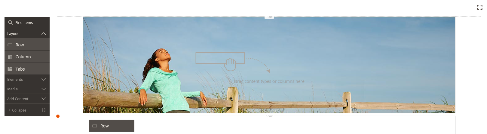

# Layout - Zeile

Verwenden Sie den Inhaltstyp _Zeile_ , um eine Zeile zur [[!DNL Page Builder] Bühne](workspace.md#stage) hinzuzufügen.

{{$include /help/_includes/page-builder-save-timeout.md}}

## Zeilen-Toolbox

Die Zeilen-Symbolleiste wird angezeigt, wenn Sie den Mauszeiger über den Zeilencontainer bewegen. Die Toolbox enthält Optionen zum Verschieben, Ausblenden, Duplizieren, Bearbeiten oder Entfernen der Zeile. Die Auswahl der Einstellungen bestimmt das Erscheinungsbild, den Hintergrund und das Layout der Zeile. Zusätzliche Inhaltselemente können aus dem Bereich &quot;[!DNL Page Builder]&quot;auf der linken Seite in die Zeile gezogen werden.

{width="600" zoomable="yes"}

| Tool | Symbol | Beschreibung |
| --------- | ---------- | ----------- |
| Verschieben | {width="25"} | Verschiebt die Zeile an eine andere Position im Verhältnis zu anderen Zeilen auf der Bühne. |
| (Titel) | [!UICONTROL Row] | Identifiziert den aktuellen Inhaltscontainer als Zeile. Bewegen Sie den Mauszeiger über den Container, um die Toolbox anzuzeigen. |
| Einstellungen | {width="25"} | Öffnet die Seite Zeile bearbeiten , auf der Sie die Eigenschaften des Containers ändern können. |
| Ausblenden | {width="25"} | Blendet die aktuelle Zeile aus. |
| Anzeigen | {width="25"} | Zeigt die ausgeblendete Zeile an. |
| Duplizieren | {width="25"} | Kopiert die Zeile. |
| Entfernen | {width="25"} | Löscht den Zeilencontainer und seinen Inhalt aus der Bühne. |

{style="table-layout:auto"}

{{$include /help/_includes/page-builder-hidden-element-note.md}}

## Zeile hinzufügen

1. Ziehen Sie im Bedienfeld [!DNL Page Builder] unter _[!UICONTROL Layout]_eine neue **[!UICONTROL Row]**auf die Bühne, direkt unterhalb der ersten Zeile.

1. Um die Zeile zu formatieren, bewegen Sie den Mauszeiger über den Zeilencontainer, um die Toolbox anzuzeigen, und wählen Sie das Symbol _Einstellungen_ ( {width="20"} ).

   In den folgenden Abschnitten finden Sie detaillierte Informationen zum Abschließen der verfügbaren Einstellungen.

   {width="600" zoomable="yes"}

## Zeileneinstellungen ändern

1. Bewegen Sie den Mauszeiger über den Zeilencontainer, um die Werkzeugleiste anzuzeigen, und wählen Sie das Symbol _Einstellungen_ ( {width="20"} ).

   {width="600" zoomable="yes"}

1. In den folgenden Abschnitten finden Sie detaillierte Informationen zum Aktualisieren der verfügbaren Einstellungen.

1. Klicken Sie nach Abschluss des Vorgangs auf **[!UICONTROL Save]** , um die Einstellungen anzuwenden und zum Arbeitsbereich [!DNL Page Builder] zurückzukehren.

## Erscheinungsbild

Verwenden Sie die Einstellungen für _Erscheinungsbild_ , um festzulegen, wie Inhalte in der Zeile angezeigt werden.

{width="600" zoomable="yes"}

- Um zu bestimmen, wie die Hintergrundfarbe und/oder das Hintergrundbild im Verhältnis zum Container und zur Breite des Inhaltsbereichs angezeigt werden, wählen Sie die Ausrichtung:

  | Option | Beschreibung |
  | ------ | ----------- |
  | [!UICONTROL Contained] | Die Hintergrundfarbe oder das Bild ist auf die maximale Seitenbreite beschränkt, die vom Design definiert wird. |
  | [!UICONTROL Full Width] | Beschränkt den Inhalt auf die maximale Seitenbreite, die vom Design definiert wird. Die Hintergrundfarbe und/oder das Bild sind nicht beschränkt und erweitern die gesamte Breite der Zeile. |
  | [!UICONTROL Full Bleed] | Der Inhalt und das Hintergrundbild und/oder die Farbe sind nicht beschränkt und erweitern die gesamte Breite der Zeile. Der vollständige Anschnitt kann nur mit [Designs](../content-design/themes.md) verwendet werden, die das Layout unterstützen. |

  {style="table-layout:auto"}

- Geben Sie die **[!UICONTROL Minimum Height]** für die Zeile ein. Dieser Wert kann eine Zahl mit einer beliebigen gültigen CSS-Einheit (z. B. `100px`, `50%`, `50em`, `100vh`) oder eine Berechnung (z. B. `100vh - 237px`) sein.

  Sie können beispielsweise die Mindesthöhe einer Zeile so festlegen, dass die gesamte Höhe der Seite gestreckt wird, sodass Sie überzeugende Optionen für Hintergrundbilder und Videos mit vollständigem Seitenumbruch erhalten.

- Wählen Sie die Einstellung &quot;**[!UICONTROL Vertical Alignment]**&quot;, um alle Inhaltscontainer auszurichten, die der Zeile hinzugefügt werden (oben, zentriert oder unten).

## Hintergrund

Es gibt viele Möglichkeiten, die Hintergrundanzeige einer Zeile zu definieren. Sie können eine einfache Farbe oder ein Hintergrundbild anwenden und komplexere Effekte verwalten.

### Hintergrundfarbe

Geben Sie die Hintergrundfarbe an, indem Sie ein Muster auswählen, auf die Farbauswahl klicken oder einen gültigen Farbnamen oder einen entsprechenden Hexadezimalwert eingeben. Diese Einstellung bestimmt die Hintergrundfarbe der Zeile. Sie können auch die Deckkraft der Farbe anpassen.

{width="200"}

Sie können den Wert auf eine von drei Arten festlegen:

- Ein vordefinierter Farbname, z. B. `White`
- Der hexadezimale Farbwert für die Farbe, z. B. `#ffffff`
- Der rgba-Wert für die Farbe mit Deckkraft-Prozent, z. B. `rgba(255, 255, 255, 0.75)`

Wenn Sie eine Farbe auswählen möchten, klicken Sie auf das Muster links neben dem Feld _Keine Farbe_.

{width="600" zoomable="yes"}

Wenn Sie auf das Farbfeld klicken, um die Farbauswahl erneut zu öffnen, zeigt das Feld unter dem Schieberegler die aktuellen Rot-, Grün-, Blau- und Alpha-Werte (rgba) an. Die letzte Zahl gibt den aktuellen Deckkraftprozentsatz als Dezimalzahl an. Sie können den Schieberegler verwenden, um die Deckkraft anzupassen, oder den gewünschten Dezimalwert eingeben.

{width="600" zoomable="yes"}

>[!NOTE]
>
>[!DNL Page Builder] unterstützt auch eine Transparenzschicht (oder den _Alphakanal_) in Hintergrundbildern, mit der Hintergründe mit unterschiedlicher Deckkraft erstellt werden können.

### [!UICONTROL Background Type]

Ein Hintergrundtyp kann ein Bild oder ein Video sein. [!DNL Page Builder] ist standardmäßig auf `Image` eingestellt und zeigt verschiedene Bildeinstellungen an. Wenn Sie `Video` auswählen, tauscht [!DNL Page Builder] die Bildeinstellungen mit Videoeinstellungen. Beide Hintergrundtypen werden wie folgt beschrieben.

{width="200"}

### Bildtypeinstellungen

Wenn Sie die _[!UICONTROL Background Type]_auf `Image` setzen, verwenden Sie die folgenden Einstellungen, um die Anzeige des Hintergrundbilds zu definieren.

{width="600" zoomable="yes"}

- **[!UICONTROL Background Image]** - Verwenden Sie bei Bedarf die bereitgestellten Tools, um ein Hintergrundbild auszuwählen, das auf die Zeile angewendet werden soll:

  | Option | Beschreibung |
  | ------ | ----------- |
  | [!UICONTROL Upload] | Lädt eine Bilddatei von Ihrem lokalen Computer in die Galerie hoch und wendet sie dann als Hintergrundbild für die Zeile an. |
  | [!UICONTROL Select from Gallery] | fordert Sie auf, ein vorhandenes Bild aus der Galerie als Hintergrundbild für die Zeile auszuwählen. |
  | {width="25"} | Ermöglicht Ihnen, das Bild entweder auf die Kachel &quot;Kamera&quot;zu ziehen oder zum Bild in Ihrem lokalen Dateisystem zu navigieren. |

  {style="table-layout:auto"}

- **[!UICONTROL Background Mobile Image]** - Verwenden Sie bei Bedarf dieselben Tools, um ein anderes Hintergrundbild für die Anzeige auf Mobilgeräten auszuwählen.

- **[!UICONTROL Background Size]** - Legen Sie diese Option fest, um zu bestimmen, wie das Hintergrundbild im Verhältnis zur Breite der Zeile skaliert wird:

  | Option | Beschreibung |
  | ------ | ----------- |
  | `Cover` | Das Hintergrundbild deckt die gesamte Breite der Zeile ab. |
  | `Contain` | Das Hintergrundbild ist auf die Breite des Inhaltsbereichs beschränkt. |
  | `Auto` | Wendet die Größe aus dem aktuellen Stylesheet an. |

  {style="table-layout:auto"}

  {width="250"}

- **[!UICONTROL Background Position]** - Legen Sie diese Option fest, um zu bestimmen, wie das Hintergrundbild im Verhältnis zur Zeile verankert ist:

  | Verankerungspunkt | Position |
  | ------ | ----------- |
  | `Top` | Links/Mitte/Rechts |
  | `Center` | Links/Mitte/Rechts |
  | `Bottom` | Links/Mitte/Rechts |

  {style="table-layout:auto"}

  Der Ankerpunkt ist wie eine Push-Pin, die das Bild an der angegebenen Hintergrundposition an die Zeile anhängt.

- **[!UICONTROL Background Attachment]** - Legen Sie den Anlagentyp fest, um zu bestimmen, wie sich das Hintergrundbild im Verhältnis zur Scrollseite bewegt:

  | Option | Beschreibung |
  | ------ | ----------- |
  | `Scroll` | Das angehängte Hintergrundbild wird synchronisiert, um sich beim Bildlauf der Seite nach unten zu bewegen. Verwenden Sie Parallax Background, um die Scrollgeschwindigkeit zu steuern. |
  | `Fixed` | (Für Mobilgeräte nicht verfügbar) Das Hintergrundbild wird nicht verschoben, wenn der Container über das Bild blättert, und ist an der angegebenen Hintergrundposition fixiert. |

  {style="table-layout:auto"}

- **[!UICONTROL Background Repeat]** - Auf `Yes` setzen, um das Hintergrundbild zu wiederholen und den verfügbaren Platz in der Zeile auszufüllen.

### Videotypeinstellungen

Wenn Sie den _Hintergrundtyp_ auf `Video` festlegen, verwenden Sie die folgenden Einstellungen, um die Anzeige des Hintergrundbilds zu definieren.

- **[!UICONTROL Video URL]** - Geben Sie eine gültige Video-URL ein. Gültige Video-URLs können Links zu folgenden Elementen sein:

   - YouTube-Videos: `https://youtu.be/CoDhMRUUjeI`
   - Video-Videos: `https://vimeo.com/190156113`
   - Gültige Videodateien (`.mp4` wird empfohlen): `https://myvideos.com/spiral.mp4`

  {width="300"}

- **[!UICONTROL Overlay Color]** - Wählen Sie eine Farbe, um einen transparenten Farbton auf das Video anzuwenden.

- **[!UICONTROL Infinite Loop]** - Auf `No` setzen, damit das Video einmal wiedergegeben und gestoppt wird. Wenn diese Option auf &quot;`Yes`&quot;(Standard) gesetzt ist, wiederholt sich das Video in einer Endlosschleife.

- **[!UICONTROL Lazy Load]** - Auf `No` setzen, um das Video mit der Seite zu laden, selbst wenn es nicht sichtbar ist. Wenn diese Option auf &quot;`Yes`&quot;(Standard) gesetzt ist, wird das Video nur aus der Quelle geladen, wenn es auf dem Bildschirm sichtbar ist.

- **[!UICONTROL Play Only When Visible]** - Auf `No` setzen, damit das Video sofort nach dem Laden wiedergegeben wird, unabhängig davon, ob es sichtbar ist. Wenn diese Option auf &quot;`Yes`&quot;(Standard) gesetzt ist, beginnt die Wiedergabe des Videos nur, wenn es sichtbar ist.

- **[!UICONTROL Fallback Image]** - Geben Sie bei Bedarf ein Bild an, das auf dem Bildschirm angezeigt werden soll, bevor das Video geladen wird, und wenn das Video aus irgendeinem Grund nicht geladen wird.

## Parallax-Hintergrund

Mit diesen Optionen können Sie die Geschwindigkeit eines Bildlaufhintergrundbilds oder -videos im Verhältnis zum Bildlauf der Seite steuern. Der Hintergrund kann so eingestellt werden, dass er langsamer scrollt, um ein Gefühl der Eintauchen zu schaffen.

- Setzen Sie **Parallax-Hintergrund aktivieren** auf `Yes`.
- Geben Sie die **Parallax-Geschwindigkeit** als Dezimalwert zwischen `-1.0` und `2.0` ein.

{width="600" zoomable="yes"}

## Erweitert

- Um die horizontale Positionierung der Inhaltscontainer zu steuern, die der Zeile hinzugefügt werden, wählen Sie einen **[!UICONTROL Alignment]**:

  | Option | Beschreibung |
  | ------ | ----------- |
  | `Default` | Wendet die Standardeinstellung für die Ausrichtung an, die im Stylesheet des aktuellen Designs angegeben ist. |
  | `Left` | Richtet die Inhaltscontainer am linken Rand des Zeilenbehälters aus, wobei der angegebene Abstand berücksichtigt wird. |
  | `Center` | Richtet den Inhalts-Container in der Mitte des Zeilenbehälters aus, wobei der angegebene Abstand berücksichtigt wird. |
  | `Right` | Richtet den Inhalts-Container am rechten Rand des Zeilenbehälters aus, wobei der angegebene Abstand berücksichtigt wird. |

  {style="table-layout:auto"}

- Legen Sie den **[!UICONTROL Border]** -Stil fest, der auf alle vier Seiten des Zeilenbehälters angewendet wird:

  | Option | Beschreibung |
  | ------ | ----------- |
  | `Default` | Wendet den standardmäßigen Randstil an, der vom zugehörigen Stylesheet angegeben wird. |
  | `None` | liefert keine sichtbare Anzeige der Containergrenzen. |
  | `Dotted` | Der Container-Rahmen wird als gepunktete Linie angezeigt. |
  | `Dashed` | Der Container-Rahmen wird als gestrichelte Linie angezeigt. |
  | `Solid` | Der Container-Rahmen wird als durchgehende Linie angezeigt. |
  | `Double` | Der Container-Rahmen wird als doppelte Linie angezeigt. |
  | `Groove` | Der Container-Rahmen wird als Rillenlinie angezeigt. |
  | `Ridge` | Der Container-Rahmen wird als gekürzte Linie angezeigt. |
  | `Inset` | Der Container-Rahmen wird als Inset-Zeile angezeigt. |
  | `Outset` | Der Container-Rahmen wird als Ausgangspunkt angezeigt. |

  {style="table-layout:auto"}

- Wenn Sie einen anderen Rahmenstil als `None` festlegen, füllen Sie die Anzeigeoptionen für die Rahmenanzeige aus:

  {width="600" zoomable="yes"}

  | Option | Beschreibung |
  | ------ |------------ |
  | [!UICONTROL Border Color] | Geben Sie die Farbe an, indem Sie ein Muster auswählen, auf die Farbauswahl klicken oder einen gültigen Farbnamen oder einen entsprechenden Hexadezimalwert eingeben. |
  | [!UICONTROL Border Width] | Geben Sie die Anzahl Pixel für die Rahmenlinienbreite an. |
  | [!UICONTROL Border Radius] | Geben Sie die Anzahl der Pixel an, um die die Größe des Radius definiert wird, mit dem die einzelnen Ecken des Rands gerundet werden. |

  {style="table-layout:auto"}

  Die Zeile im folgenden Beispiel hat einen Rahmenradius von 15.

  {width="500"}

- (Optional) Geben Sie die Namen von **[!UICONTROL CSS classes]** aus dem aktuellen Stylesheet an, das auf den Zeilencontainer angewendet werden soll.

  Trennen Sie mehrere Klassennamen durch ein Leerzeichen.

- Geben Sie Werte in Pixel an, damit der Wert **[!UICONTROL Margins and Padding]** die äußeren Ränder und den inneren Abstand der Zeile angibt.

  Geben Sie jeden entsprechenden Wert in das Zeilenbehälterdiagramm ein.

  | Container-Bereich | Beschreibung |
  | -------------- | ----------- |
  | [!UICONTROL Margins] | Die Menge an leerem Raum, die auf den äußeren Rand aller Seiten des Containers angewendet wird. Optionen: `Top` / `Right` / `Bottom` / `Left` |
  | [!UICONTROL Padding] | Die Menge an leerem Raum, die auf den inneren Rand aller Seiten des Containers angewendet wird. Optionen: `Top` / `Right` / `Bottom` / `Left` |

  {style="table-layout:auto"}

  {width="600" zoomable="yes"}
