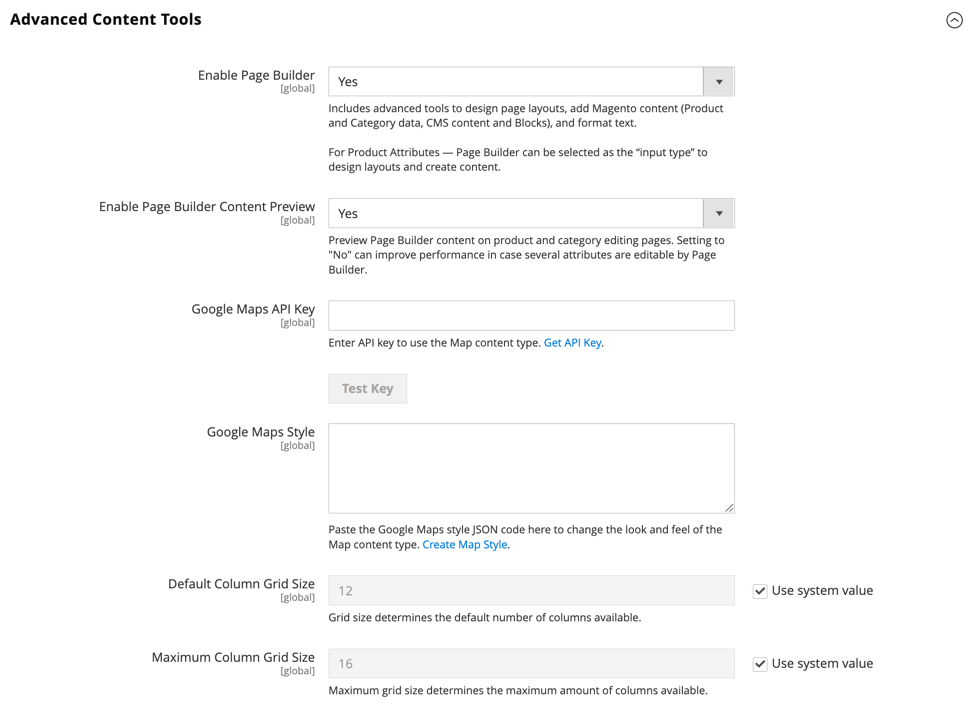
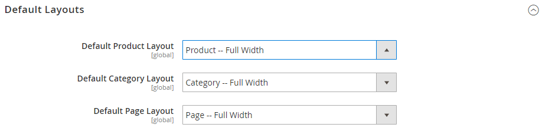

# [!DNL Page Builder]

Wenn es in der -Konfiguration aktiviert ist, ist [!DNL Page Builder] das standardmäßige Tool zur Inhaltserstellung für CMS-Seiten, -Blöcke und -dynamische Blöcke. Darüber hinaus bietet die _[!UICONTROL Enable Advanced CMS]_-Schaltfläche [!DNL Page Builder] als Option für Kategorien und Produkte. Sie können auch das standardmäßige [Seiten-Layout](../content-design/page-layout.md) auswählen, das Sie für Produkte, Kategorien und CMS-Seiten verwenden möchten. [!DNL Page Builder] ist nicht für Newsletter-Inhalte verfügbar, die den WYSIWYG-[Editor) &#x200B;](../content-design/editor.md).

>[!NOTE]
>
>Wenn installiert, überschreibt [!DNL Page Builder] die Standardeinstellung für das Feld [!UICONTROL Mask for Meta Description]. Der Wert wird von `{{name}} {{description}}` in `{{name}}` geändert.
> >Sie können auf diese Einstellung zugreifen, wenn Sie zu [!UICONTROL Stores] > _[!UICONTROL Settings]_> [!UICONTROL Configuration] gehen, [!UICONTROL Catalog] erweitern und darunter [!UICONTROL Catalog] auswählen. Das Feld [!UICONTROL Mask for Meta Description] befindet sich im Abschnitt [!UICONTROL Product Fields Auto-generation] .

>[!NOTE]
>
>Ein Administrator bzw. eine Administratorin muss über [!UICONTROL Content] Berechtigungen für den [Rollenbereich](../systems/permissions-user-roles.md) verfügen, um [!UICONTROL Edit with Page Builder] Schaltflächen sehen und Page Builder verwenden zu können.

Weitere Informationen zu den Konfigurationsoptionen für die erweiterten Content-Management-Tools finden Sie [_„Konfigurationshandbuch_](../configuration-reference/general/content-management.md).

## Konfigurieren von [!DNL Page Builder]

1. Navigieren Sie in _Admin_-Seitenleiste zu **[!UICONTROL Stores]** > _[!UICONTROL Settings]_>**[!UICONTROL Configuration]**.

1. Wählen Sie im linken Bedienfeld unter _[!UICONTROL General]_&#x200B;die Option **[!UICONTROL Content Management]**&#x200B;aus.

1. Erweitern Sie  **[!UICONTROL Advanced Content Tools]** und stellen Sie sicher, dass **[!UICONTROL Enable Page Builder]** auf `Yes` gesetzt ist.

   {width="600" zoomable="yes"}

1. Wenn Sie bereit sind, [!DNL Google Maps] einzurichten, gehen Sie wie folgt vor:

   - Folgen Sie bei Bedarf den Anweisungen [API-Schlüssel abrufen](https://developers.google.com/maps/documentation/javascript/get-api-key) und kopieren Sie dann Ihre **[!UICONTROL Google Maps API Key]** und fügen Sie sie ein.

   - Um die **[!UICONTROL Google Maps Style]** zu ändern, fügen Sie den JSON-Code ein, der vom [[!DNL Google Maps] API-Stilassistenten“ generiert &#x200B;](https://mapstyle.withgoogle.com/).

   >[!NOTE]
   >
   >Weitere Informationen [&#x200B; Verwendung von [!DNL Google Maps] in [!DNL Page Builder] Inhalten finden Sie unter &#x200B;](map.md)Medien - Karte .

1. Gehen Sie wie folgt vor, um die Anzahl der Richtlinien im [!DNL Page Builder] Spaltenraster zu konfigurieren:

   - Geben Sie **[!UICONTROL Default Column Grid Size]** die Standardanzahl der Spalten ein, die im Raster angezeigt werden sollen.

   - Geben Sie **[!UICONTROL Maximum Column Grid Size]** die größte Anzahl von Spalten ein, die im Raster verfügbar sein sollen.

   >[!NOTE]
   >
   >Weitere Informationen [&#x200B; Verwendung des Spaltenrasters beim Arbeiten mit [!DNL Page Builder] Inhalten finden Sie unter &#x200B;](column.md)Layout - Spalte .

1. Klicken Sie abschließend auf **[!UICONTROL Save Config]**.

## Standard-Layouts konfigurieren

1. Navigieren Sie in _Admin_-Seitenleiste zu **[!UICONTROL Stores]** > _[!UICONTROL Settings]_>**[!UICONTROL Configuration]**.

1. Wählen Sie im linken Bedienfeld unter _[!UICONTROL General]_&#x200B;die Option **[!UICONTROL Web]**&#x200B;aus.

1. Erweitern Sie  **[!UICONTROL Default Layouts]** und führen Sie folgende Schritte aus:

   {width="600" zoomable="yes"}

   Weitere Informationen zu den Web-Konfigurationsoptionen finden Sie im [_Konfigurationshandbuch_](../configuration-reference/general/web.md#default-layouts).

   - Wählen Sie die **[!UICONTROL Default Product Layout]** aus, die Sie für Produktseiten verwenden möchten.

   - Wählen Sie die **[!UICONTROL Default Category Layout]** aus, die Sie für Kategorieseiten verwenden möchten.

   - Wählen Sie die **[!UICONTROL Default Page Layout]** aus, die Sie für CMS-Seiten verwenden möchten.

1. Klicken Sie abschließend auf **[!UICONTROL Save Config]**.

## [!DNL Page Builder] deaktivieren

>[!NOTE]
>
>Durch Deaktivieren von [!DNL Page Builder] werden die erweiterten Inhaltstools durch WYSIWYG [Editor](../content-design/editor.md) ersetzt, was zu Anzeigefehlern in der Storefront führen kann. Inhalte, die Sie zuvor mit [!DNL Page Builder] erstellt haben, können möglicherweise nicht von Admin aus bearbeitet werden.

1. Navigieren Sie in _Admin_-Seitenleiste zu **[!UICONTROL Stores]** > _[!UICONTROL Settings]_>**[!UICONTROL Configuration]**.

1. Wählen Sie im linken Bedienfeld unter _[!UICONTROL General]_&#x200B;die Option **[!UICONTROL Content Management]**&#x200B;aus.

1. Erweitern Sie  **[!UICONTROL Advanced Content Tools]** und legen Sie **[!UICONTROL Enable Page Builder]** auf `No` fest.

1. Wenn Sie zum Bestätigen aufgefordert werden, klicken Sie auf **[!UICONTROL Turn Off]**.

1. Klicken Sie abschließend auf **[!UICONTROL Save Config]**.

1. Wenn Sie dazu aufgefordert werden[&#x200B; aktualisieren Sie &#x200B;](../systems/cache-management.md) ungültigen Cache.
