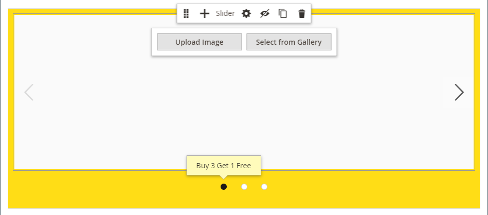
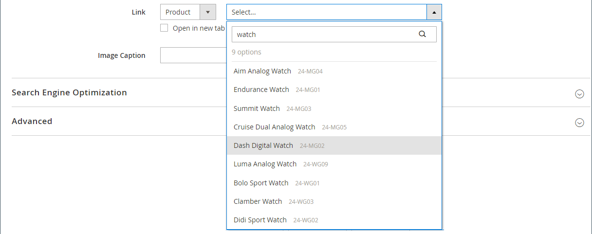
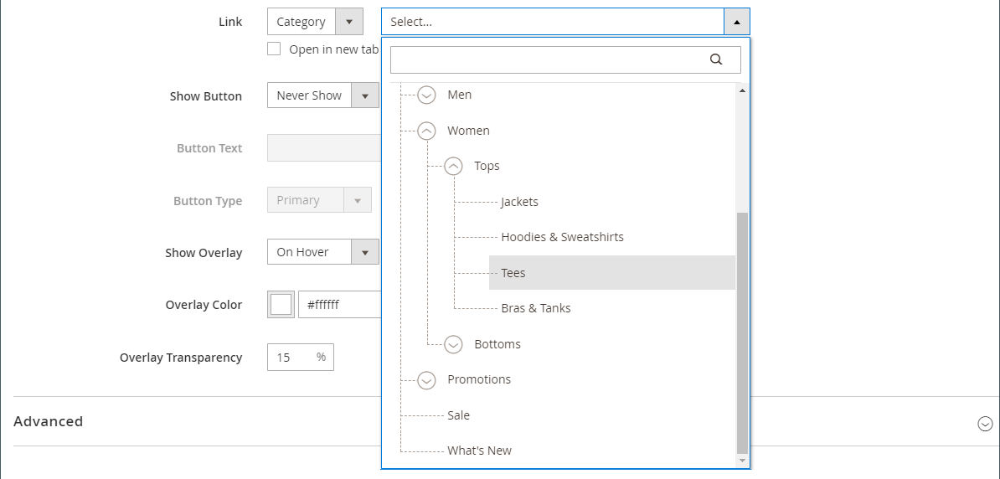

# Medien - Regler

Verwenden Sie den Inhaltstyp _Regler_ , um eine Diashow von Bildern zur [[!DNL Page Builder] Bühne](workspace.md#stage) hinzuzufügen. Sie können neue Bilder hochladen oder vorhandene Bilder aus der Galerie oder dem Produktkatalog auswählen. Ein Regler kann so eingestellt werden, dass er automatisch abgespielt wird oder manuell mit Navigationsschaltflächen gesteuert wird. Informationen zum Verknüpfen des Reglers mit einer bestimmten Promotion finden Sie unter [Dynamischer Block](dynamic-block.md).

{width="700" zoomable="yes"}

{{$include /help/_includes/page-builder-save-timeout.md}}

## Toolboxes

Wenn Sie mit dem Slider-Inhaltstyp arbeiten, fügen Sie einzelne Folien und den Regler-Container, der mindestens eine Folie enthält, hinzu und bearbeiten diese. Jede Folie verfügt über eine eigene Toolbox, mit der Sie Folien auf der [!DNL Page Builder]-Bühne entwerfen.

## Einzelne Folien-Toolbox

{width="500" zoomable="yes"}

| Tool | Symbol | Beschreibung |
|--- |--- |--- |
| Verschieben | {width="25"} | Verschiebt die Folie an eine andere Position auf dem Schieberegler. |
| (Titel) | Folie # | Gibt die Nummer der aktuellen Folie an. |
| Einstellungen | {width="25"} | Öffnet die Seite _[!UICONTROL Edit Slide]_, auf der Sie die Eigenschaften der aktuellen Folie ändern können. |
| Duplizieren | {width="25"} | Kopiert die aktuelle Folie. |
| Entfernen | {width="25"} | Löscht die aktuelle Folie aus dem Regler. |

{style="table-layout:auto"}

## Regler-Toolbox

| Tool | Symbol | Beschreibung |
|--- |--- |--- |
| Verschieben | {width="25"} | Verschiebt den Regler an eine andere Position auf der Bühne. |
| (Titel) | [!UICONTROL Slider] | Gibt den Regler-Container an. |
| Einstellungen | {width="25"} | Öffnet die Seite &quot;_[!UICONTROL Edit Slider]_&quot;, auf der Sie die Eigenschaften des Videos und Containers ändern können. |
| Ausblenden | {width="25"} | Blendet den aktuellen Schieberegler aus. |
| Anzeigen | {width="25"} | Zeigt den ausgeblendeten Regler an. |
| Duplizieren | {width="25"} | Kopiert den Regler. |
| Entfernen | {width="25"} | Löscht den Regler aus der Bühne. |

{style="table-layout:auto"}

{{$include /help/_includes/page-builder-hidden-element-note.md}}

## Hinzufügen einer einzelnen Folie

1. Öffnen Sie die Seite, den Block oder den dynamischen Block, in den Sie den Schieberegler platzieren möchten, und erweitern Sie den Abschnitt &quot;**[!UICONTROL Content]**&quot;.

1. Erweitern Sie im Bedienfeld [!DNL Page Builder] den Eintrag **[!UICONTROL Media]** und ziehen Sie einen Platzhalter **[!UICONTROL Slider]** auf eine Zeile, Spalte oder Registerkarte auf der Bühne.

   Im folgenden Beispiel ist die Hintergrundfarbe der Zeile gelb (`#fffd16`).

   {width="600" zoomable="yes"}

   Der Regler-Container wird auf der Bühne mit einer einzigen, leeren Folie angezeigt.

1. Klicken Sie in den Regler-Container, um den [Texteditor](../content-design/editor.md) anzuzeigen, und geben Sie Inhalt für die erste Folie ein.

   Mithilfe der Einstellungen für [Inhalt](#content) können Sie auch komplexere Bannerinhalte einfügen.

1. Klicken Sie auf den Navigationspunkt unten im Regler, um die Symbolleiste für die jeweilige Folie anzuzeigen, und wählen Sie das Symbol _Einstellungen_ ( {width="20"} ).

   Regler haben zwei Werkzeugkästen. Stellen Sie sicher, dass Sie die Folie-Toolbox am unteren Rand verwenden.

1. Führen Sie die Einstellungen nach Bedarf gemäß den folgenden Abschnitten aus:

   - [[!UICONTROL Appearance]](#appearance)
   - [[!UICONTROL Background]](#background)
   - [[!UICONTROL Content]](#content)
   - [[!UICONTROL Search Engine Optimization]](#seo)
   - [[!UICONTROL Advanced]](#advanced)

1. Klicken Sie nach Abschluss des Vorgangs auf **[!UICONTROL Save]** , um die Einstellungen anzuwenden und zum Arbeitsbereich [!DNL Page Builder] zurückzukehren.

## Hinzufügen weiterer Folien

In den folgenden Abschnitten wird eine Reihe von Schritten beschrieben, die mit einer einzelnen Folie beginnen und einen responsiven Regler erstellen, der Funktionen und Links zu bestimmten Produkten enthält. Wenn Sie noch keine einzelne Folie haben, befolgen Sie die vorherigen Anweisungen, um der Bühne eine einzelne Folie hinzuzufügen.

Verwenden Sie zum Hinzufügen von Folien eine oder eine Kombination der folgenden Methoden:

### Methode 1: Vorhandene Folie duplizieren

Sie können Zeit sparen, indem Sie eine Folie duplizieren, die bereits mit den gewünschten Einstellungen konfiguriert wurde.

1. Klicken Sie auf den Navigationspunkt unter der Folie, um die Symbolleiste anzuzeigen, und wählen Sie das Symbol _Duplizieren_ ( {width="20"} ).

   {width="500" zoomable="yes"}

1. Klicken Sie auf den Navigationspunkt für die neue Folie, um die Toolbox anzuzeigen und das Symbol _Einstellungen_ ( {width="20"} ) auszuwählen.

1. Ändern Sie die Einstellungen nach Bedarf entsprechend den folgenden Abschnitten:

   - [[!UICONTROL Appearance]](#appearance)
   - [[!UICONTROL Background]](#background)
   - [[!UICONTROL Content]](#content)
   - [[!UICONTROL Advanced]](#advanced)

1. Klicken Sie nach Abschluss des Vorgangs auf **[!UICONTROL Save]** , um die Einstellungen anzuwenden und zum Arbeitsbereich [!DNL Page Builder] zurückzukehren.

### Methode 2: Neue leere Folie hinzufügen

1. Bewegen Sie den Mauszeiger über den Regler-Container oben, um die Toolbox anzuzeigen und das Symbol _Hinzufügen_ ( {width="20"} ) zu wählen.

   {width="500" zoomable="yes"}

   Eine neue leere Folie mit einem eigenen Navigationspunkt und einer eigenen Werkzeugleiste wird dem Regler hinzugefügt und auf der Bühne angezeigt.

   {width="500" zoomable="yes"}

1. Klicken Sie auf den Navigationspunkt für die neue Folie, um die Toolbox anzuzeigen und das Symbol _Einstellungen_ ( {width="20"} ) auszuwählen.

1. Ändern Sie die Einstellungen nach Bedarf entsprechend den folgenden Abschnitten:

   - [[!UICONTROL Appearance]](#appearance)
   - [[!UICONTROL Background]](#background)
   - [[!UICONTROL Content]](#content)
   - [[!UICONTROL Advanced]](#advanced)

1. Klicken Sie nach Abschluss des Vorgangs in der oberen rechten Ecke auf **[!UICONTROL Save]** , um die Seite _[!UICONTROL Edit Slide]_zu schließen.

### Widget auf einer Folie hinzufügen

Sie können Ihrer Folie jeden [Widget-Typ](../content-design/widgets.md#widget-types) in einer [!DNL Page Builder]-Bühne hinzufügen, indem Sie die folgenden Schritte ausführen:

1. [Erstellen Sie das Widget](../content-design/widget-create.md), das Sie auf einer Folie sehen möchten.

1. Öffnen Sie die Seite, den Block oder den dynamischen Block, in den Sie den Schieberegler platzieren möchten, und erweitern Sie den Abschnitt &quot;**[!UICONTROL Content]**&quot;.

1. Erweitern Sie im Bedienfeld [!DNL Page Builder] den Eintrag **[!UICONTROL Media]** und ziehen Sie einen Platzhalter **[!UICONTROL Slider]** auf eine Zeile, Spalte oder Registerkarte auf der Bühne.

1. Klicken Sie in den Regler-Container, um die Symbolleiste [Texteditor](../content-design/editor.md) anzuzeigen, und klicken Sie auf das Symbol _Widget einfügen_ ( {width="20"} ).

1. Wählen Sie den benötigten **[!UICONTROL Widget Type]** aus.

1. Legen Sie die Einstellungen fest, die je nach Typ des Widgets unterschiedlich sind

   {width="600" zoomable="yes"}

1. Klicken Sie nach Abschluss des Vorgangs oben rechts auf **[!UICONTROL Insert Widget]** .

1. Ändern Sie die anderen Einstellungen nach Bedarf.

1. Klicken Sie nach Abschluss des Vorgangs oben rechts auf **[!UICONTROL Save]** .

   {width="600" zoomable="yes"}

### Jede Folie anzeigen

Um jede Folie auf der Bühne anzuzeigen, klicken Sie auf den nächsten Punkt unter der derzeit angezeigten Folie.

{width="500" zoomable="yes"}

Die Folie im vorherigen Beispiel enthält ein Hintergrundbild, ein transparentes mobiles Bild und ein Inline-Bild, das vom Texteditor hinzugefügt wurde. Diese Technik funktioniert auf Mobilgeräten gut, indem das Hintergrundbild deaktiviert und nur das kleinere Inline-Bild angezeigt wird. Die Produktfolie in diesem Beispiel weist die folgenden zusätzlichen Einstellungen auf:

| Option | Beispieleinstellung |
|--- |--- |
| [!UICONTROL Appearance] | `Collage Right` |
| [!UICONTROL Background Color] | `#ffffff` (weiß) |
| [!UICONTROL Background Image] | Das Bild auf dieser Folie wurde von der Produktseite gespeichert und in die Galerie hochgeladen. |
| [!UICONTROL Mobile Background Image] | Das mobile Hintergrundbild ist ein transparentes Bild mit einer Fläche von 10 Pixel. Wenn Sie ein leeres Bild für Mobilgeräte verwenden, wird das standardmäßige Hintergrundbild durch ein unsichtbares Bild ersetzt. |
| [!UICONTROL Background Size] | `Auto` |
| [!UICONTROL Message Text] | `Minerva LumaTech&trade; V-Tee` (Zentrieren) mit eingefügtem Bild, skaliert bei 40 % (Zentrieren) |
| [!UICONTROL Link] | `Product` |
| [!UICONTROL Show Button] | `Always` |
| [!UICONTROL Button Text] | `Buy Now` |
| [!UICONTROL Show Overlay] | `Never Show` |
| [!UICONTROL Alignment] | `Center` (zum Ausrichten der Schaltfläche) |
| [!UICONTROL Border] | `Solid` |
| [!UICONTROL Border Color] | `#000000` (Schwarz) |
| [!UICONTROL Border Width] | `1 px` |

{style="table-layout:auto"}

## Einzelne Folieneinstellungen ändern

1. Ändern Sie die Anzeige des Reglers auf der Bühne und zeigen Sie die Folie an, die Sie ändern möchten.

1. Wählen Sie in der Symbolleiste der einzelnen Folien das Symbol _Einstellungen_ ( {width="20"} ) aus und füllen Sie die Einstellungen nach Bedarf gemäß den folgenden Abschnitten aus.

1. Klicken Sie oben rechts auf **[!UICONTROL Save]** , um die Einstellungen anzuwenden und zum Arbeitsbereich [!DNL Page Builder] zurückzukehren.

### [!UICONTROL Appearance]

1. Wählen Sie einen der folgenden Platzierungstypen für die Folie aus:

   | Typ | Beschreibung |
   | ---- | ----------- |
   | `Poster` | Zentriert den Folieninhalt im Regler-Container. Falls verwendet, erweitert die Überlagerung die gesamte Breite des Reglers. |
   | `Collage Left` | Platziert den Folieninhalt in einem definierten Bereich auf der linken Seite des Reglerbehälters. Wenn die Überlagerung verwendet wird, deckt sie nur den definierten Bereich ab. |
   | `Collage Center` | Platziert den Folieninhalt in einem definierten Bereich, der auf den Regler-Container zentriert ist. Wenn die Überlagerung verwendet wird, deckt sie nur den definierten Bereich ab. |
   | `Collage Right` | Platziert den Folieninhalt in einem definierten Bereich auf der rechten Seite des Reglerbehälters. Wenn die Überlagerung verwendet wird, deckt sie nur den definierten Bereich ab. |

   {style="table-layout:auto"}

   {width="600" zoomable="yes"}

1. Geben Sie den Wert **[!UICONTROL Slide Name]** ein.

   Wenn Sie im Bearbeitungsmodus arbeiten, wird der Name der Folie als QuickInfo über dem Navigationspunkt angezeigt. Der Name der Folie ist in der Storefront nicht sichtbar.

   {width="500" zoomable="yes"}

1. Geben Sie die **[!UICONTROL Minimum Height]** für die Folie ein.

   Die Mindesthöhe kann eine Zahl mit einer beliebigen gültigen CSS-Einheit (z. B. `100px`, `50%`, `50em`, `100vh`) oder eine Berechnung (z. B. `100vh - 237px`) sein.

   Sie können beispielsweise die Mindesthöhe der Folie so festlegen, dass sie die gesamte Höhe der Seite abdeckt, und dann Hintergrundbilder und Videos für überzeugende Designoptionen verwenden.

   >[!NOTE]
   >
   >Wenn die Folie auf die volle Höhe der Seite (100vh) eingestellt ist, erstreckt sich der Schieberegler, der die Folie enthält, auch über die gesamte Höhe der Seite, um die Höhe der Folie aufzunehmen.

## [!UICONTROL Background]

Es gibt viele Möglichkeiten, die Hintergrundanzeige einer Folie zu definieren. Sie können eine einfache Farbe oder ein Hintergrundbild anwenden und komplexere Effekte verwalten.

### [!UICONTROL Background Color]

Geben Sie die Hintergrundfarbe an, indem Sie ein Muster auswählen, auf die Farbauswahl klicken oder einen gültigen Farbnamen oder einen entsprechenden Hexadezimalwert eingeben. Diese Einstellung bestimmt die Hintergrundfarbe der Zeile. Sie können auch die Deckkraft der Farbe anpassen.

{width="200"}

Sie können den Wert auf eine von drei Arten festlegen:

- Ein vordefinierter Farbname, z. B. `White`
- Der hexadezimale Farbwert für die Farbe, z. B. `#ffffff`
- Der rgba-Wert für die Farbe mit Deckkraft-Prozent, z. B. `rgba(255, 255, 255, 0.75)`

Wenn Sie eine Farbe auswählen möchten, klicken Sie auf das Muster links neben dem Feld _Keine Farbe_.

{width="600" zoomable="yes"}

Wenn Sie auf das Farbfeld klicken, um die Farbauswahl erneut zu öffnen, zeigt das Feld unter dem Schieberegler die aktuellen Rot-, Grün-, Blau- und Alpha-Werte (rgba) an. Die letzte Zahl gibt den aktuellen Deckkraftprozentsatz als Dezimalzahl an. Sie können den Schieberegler verwenden, um die Deckkraft anzupassen, oder den gewünschten Dezimalwert eingeben.

{width="600" zoomable="yes"}

>[!NOTE]
>
>[!DNL Page Builder] unterstützt auch eine Transparenzschicht (oder den _Alphakanal_) in Hintergrundbildern, mit der Hintergründe mit unterschiedlicher Deckkraft erstellt werden können.

### [!UICONTROL Background Type]

Ein Hintergrundtyp kann ein Bild oder ein Video sein. [!DNL Page Builder] ist standardmäßig auf `Image` eingestellt und zeigt verschiedene Bildeinstellungen an. Wenn Sie `Video` auswählen, tauscht [!DNL Page Builder] die Bildeinstellungen mit Videoeinstellungen. Die beiden Einstellungen für den Hintergrundtyp werden in den folgenden Abschnitten beschrieben.

{width="400"}

### Bildtypeinstellungen

Wenn Sie die _[!UICONTROL Background Type]_auf `Image` setzen, verwenden Sie die folgenden Einstellungen, um die Anzeige des Hintergrundbilds zu definieren.

{width="600" zoomable="yes"}

- **[!UICONTROL Background Image]** - Verwenden Sie bei Bedarf die bereitgestellten Tools, um ein Hintergrundbild auszuwählen, das auf das Banner angewendet werden soll:

  | Tool | Beschreibung |
  | ---- | ----------- |
  | [!UICONTROL Upload] | Lädt eine Bilddatei von Ihrem lokalen Computer in die Galerie hoch und wendet sie dann als Hintergrundbild für das Banner an. |
  | [!UICONTROL Select from Gallery] | fordert Sie auf, ein vorhandenes Bild aus der Galerie als Hintergrundbild für das Banner auszuwählen. |
  | {width="25"} | Ermöglicht Ihnen, das Bild entweder auf die Kachel &quot;Kamera&quot;zu ziehen oder zum Bild in Ihrem lokalen Dateisystem zu navigieren. |

  {style="table-layout:auto"}

- **[!UICONTROL Background Mobile Image]** - Verwenden Sie bei Bedarf dieselben Tools, um ein anderes Hintergrundbild für die Anzeige auf Mobilgeräten auszuwählen.

- **[!UICONTROL Background Size]** - Wählen Sie aus, wie das Hintergrundbild im Verhältnis zur Breite des Banners skaliert wird:

  | Option | Beschreibung |
  | ------ | ----------- |
  | `Cover` | Das Hintergrundbild deckt die gesamte Breite des Banners ab. |
  | `Contain` | Das Hintergrundbild ist auf die Breite des Inhaltsbereichs beschränkt. |
  | `Auto` | Wendet die Größe aus dem aktuellen Stylesheet an. |

  {style="table-layout:auto"}

  {width="400"}

- **[!UICONTROL Background Position]** - Wählen Sie aus, wie das Hintergrundbild im Verhältnis zum Banner verankert ist:

  | Verankerungspunkt | Position |
  | ------------ | -------- |
  | `Top` | Links/Mitte/Rechts |
  | `Center` | Links/Mitte/Rechts |
  | `Bottom` | Links/Mitte/Rechts |

  {style="table-layout:auto"}

  Der Ankerpunkt ist wie eine Push-Taste, die das Bild an der angegebenen Hintergrundposition am Banner anhängt.

- **[!UICONTROL Background Repeat]** - Wenn Sie das Hintergrundbild wiederholen möchten, um den Raum zu füllen, ändern Sie diese Einstellung `Yes`.

### Videotypeinstellungen

Wenn Sie den _Hintergrundtyp_ auf `Video` festlegen, verwenden Sie die folgenden Einstellungen, um die Anzeige des Hintergrundbilds zu definieren.

- **[!UICONTROL Video URL]** - Geben Sie eine gültige Video-URL ein. Gültige Video-URLs können Links zu folgenden Elementen sein:

   - YouTube-Videos: `https://youtu.be/CoDhMRUUjeI`
   - Video-Videos: `https://vimeo.com/190156113`
   - Gültige Videodateien (`.mp4` wird empfohlen): `https://myvideos.com/spiral.mp4`

  {width="500"}

- **[!UICONTROL Overlay Color]** - Wählen Sie eine Farbe, um einen transparenten Farbton auf das Video anzuwenden.

- **[!UICONTROL Infinite Loop]** - Auf `No` setzen, damit das Video einmal wiedergegeben und gestoppt wird. Wenn diese Option auf &quot;`Yes`&quot;(Standard) gesetzt ist, wiederholt sich das Video in einer Endlosschleife.

- **[!UICONTROL Lazy Load]** - Auf `No` setzen, um das Video mit der Seite zu laden, selbst wenn es nicht sichtbar ist. Wenn diese Option auf &quot;`Yes`&quot;(Standard) gesetzt ist, wird das Video nur aus der Quelle geladen, wenn es auf dem Bildschirm sichtbar ist.

- **[!UICONTROL Play Only When Visible]** - Auf `No` setzen, damit das Video sofort nach dem Laden wiedergegeben wird, unabhängig davon, ob es sichtbar ist. Wenn diese Option auf &quot;`Yes`&quot;(Standard) gesetzt ist, beginnt die Wiedergabe des Videos nur, wenn es sichtbar ist.

- **[!UICONTROL Fallback Image]** - Geben Sie bei Bedarf ein Bild an, das auf dem Bildschirm angezeigt werden soll, bevor das Video geladen wird, und wenn das Video aus irgendeinem Grund nicht geladen wird.

## [!UICONTROL Content]

Sie können den Inhalt der Folie direkt auf der Bühne oder beim Ändern der Einstellungen ändern. Die Einstellungen bieten komplexere Inhaltsfunktionen, wie z. B. Folienlinks, Schaltflächen und Überlagerungen. Die Position des Inhalts spiegelt die Platzierungseinstellung [Erscheinungsbild](#appearance) wider.

### Einfacher Inhalt auf der Bühne

1. Klicken Sie auf den Platzhalter oder vorhandenen Text und geben Sie den neuen Text ein, der auf der Folie angezeigt werden soll.

   Die Editor-Symbolleiste wird über dem Textfeld angezeigt.

1. Verwenden Sie die Editor-Symbolleiste, um Text einzugeben und zu formatieren sowie Elemente wie Links, Bilder und Widgets einzufügen.

   {width="500" zoomable="yes"}

### Komplexe Inhalte in den Einstellungen

1. Klicken Sie auf den Navigationspunkt unten im Regler, um die Symbolleiste für die jeweilige Folie anzuzeigen, und wählen Sie das Symbol _Einstellungen_ ( {width="20"} ).

1. Geben Sie im Abschnitt _[!UICONTROL Content]_den **[!UICONTROL Message Text]**ein, der mit der Folie angezeigt werden soll.

1. Scrollen Sie nach unten zum Abschnitt _[!UICONTROL Content]_und verwenden Sie den Editor **[!UICONTROL Message Text]**, um Bannertext einzugeben und zu formatieren.

   Sie können auch Elemente wie Textlinks, Bilder und Widgets einfügen.

1. Formatieren Sie den Text nach Bedarf mithilfe der Editor-Symbolleiste.

   Die erste Folie in diesem Beispiel hat ein Hintergrundbild, aber keinen Nachrichtentext. Der Text `Buy 3 Get 1 Free` über dem Regler befindet sich in einem Textcontainer (später hinzugefügt).

1. Geben Sie bei Bedarf einen **[!UICONTROL Link]** für die Folie an.

   Der Link ist die Zielseite, die angezeigt wird, wenn der Kunde auf den Objektträger klickt. Sie können einen von drei Linktypen verwenden:

   - **[!UICONTROL URL]** - Links zu einer relativen oder vollständig qualifizierten URL.

   - **[!UICONTROL Product]** - Identifiziert die Zielseite anhand des Produktnamen oder der SKU. Suchen Sie nach dem Produkt anhand des Namens, der entweder auf einem Teil- oder einem vollständigen Namen basiert. Wählen Sie das Produkt aus der Liste der Suchergebnisse aus.

     {width="600" zoomable="yes"}

   - **[!UICONTROL Category]** - Identifiziert die Zielseite als eine bestimmte Kategorie oder Unterkategorie im Kategoriebaum. Suchen Sie nach der Kategorie basierend auf einem Teil- oder Vollnamen. Wählen Sie die Kategorie aus dem erweiterten Bereich des angezeigten Baums aus.

     {width="600" zoomable="yes"}

   - **[!UICONTROL Page]** - Identifiziert die Zielseite als bestimmte Inhaltsseite. Suchen Sie nach der Seite, die auf einem Teil- oder vollständigen Namen basiert. Wählen Sie die Seite aus der Liste der Suchergebnisse aus.

     {width="600" zoomable="yes"}

   

   Ab Version 2.4.1 unterstützt [!DNL Page Builder] die Verknüpfung von Folie und Links innerhalb des verschachtelten Texts aufgrund von Problemen mit der Anzeige auf der Storefront nicht mehr. Wenn Sie einen Link im _[!UICONTROL Message Text]_ verwenden, können Sie die Option _[!UICONTROL Link]_ nicht konfigurieren. Wenn Sie lieber einen einzigen Link für die gesamte Folie verwenden möchten, können Sie alle Links aus dem Text entfernen.

   {width="300"}
   

   Wenn Sie verhindern möchten, dass der Besucher von Ihrem Store weg navigiert, aktivieren Sie das Kontrollkästchen **[!UICONTROL Open in new tab]** . Wenn das Kontrollkästchen deaktiviert wird, wird das verknüpfte Ziel in derselben Browser-Registerkarte geöffnet, wodurch der Besucher effektiv von Ihrem Store weg navigiert.

1. Fügen Sie bei Bedarf eine Schaltfläche hinzu, um Kunden aufzufordern, dem Link zu folgen.

   Die Position der Folie _Erscheinungsbild_ platziert einen einzelnen Link oder eine Schaltfläche unter dem Text. Füllen Sie die Eigenschaften des Links oder der Schaltfläche aus, den/die Sie hinzufügen möchten.

   {width="600" zoomable="yes"}

   >[!NOTE]
   >
   >Sie können auch mehrere Schaltflächen oder Links verwenden, indem Sie dem Banner einen [Block](block.md) hinzufügen. Um Konflikte zu vermeiden, behalten Sie alle Links oder Schaltflächen im separaten Block bei und fügen Sie dem Banner keinen Link oder keine Schaltfläche direkt hinzu.

   - Setzen Sie **[!UICONTROL Show Button]** auf einen der folgenden Werte:

     | Option | Beschreibung |
     | ------ | ----------- |
     | `Always` | Auf der Folie wird immer eine Schaltfläche angezeigt. |
     | `On Hover` | Auf der Folie wird nur beim Bewegen des Mauszeigers eine Schaltfläche angezeigt. |
     | `Never Show` | Auf der Folie wird nie eine Schaltfläche angezeigt. |

     {style="table-layout:auto"}

   - Geben Sie den **[!UICONTROL Button Text]** ein, der auf der Schaltfläche angezeigt werden soll.

   - Setzen Sie **[!UICONTROL Button Type]** auf einen der folgenden Werte:

     | Option | Beschreibung |
     | ------ | ----------- |
     | `Primary` | Wendet den primären Schaltflächenstil aus dem aktuellen Stylesheet an. |
     | `Secondary` | Wendet ggf. den sekundären Schaltflächenstil aus dem aktuellen Stylesheet an. |
     | `Link` | Erstellt einen Hyperlink anstelle einer Schaltfläche. |

     {style="table-layout:auto"}

     Der Schaltflächenstil des aktuellen Designs bestimmt das Schaltflächenformat. In der Regel hat eine primäre Schaltfläche eine auffälligere Hintergrundfarbe als eine sekundäre Schaltfläche.

1. Setzen Sie **[!UICONTROL Show Overlay]** auf einen der folgenden Werte:

   | Option | Beschreibung |
   | ------ | ----------- |
   | `Always` | Die Überlagerung ist immer sichtbar. |
   | `On Hover` | Die Überlagerung wird nur beim Bewegen des Mauszeigers angezeigt. |
   | `Never Show` | Die Überlagerung ist nicht sichtbar. |

   {style="table-layout:auto"}

   Sie können eine Überlagerung verwenden, um eine Hintergrundfarbe auf den aktiven Inhaltsbereich anzuwenden, der durch die Einstellung Erscheinungsbild definiert wird. Das Hintergrundbild der Folie bleibt für die gesamte Breite der Folie sichtbar.

   {width="600" zoomable="yes"}

   Wenn Sie eine Überlagerung anzeigen, legen Sie den Wert **[!UICONTROL Overlay Color]** fest:

   - Klicken Sie auf das Muster _Keine Farbe_ und wählen Sie ein Muster aus.
   - Geben Sie im Feld **[!UICONTROL Color]** einen gültigen Farbnamen oder einen Hexadezimalwert ein.

   {width="600" zoomable="yes"}

## [!UICONTROL Search Engine Optimization] {#seo}

Text für diese Einstellungen ist für Suchmaschinen sichtbar und verbessert die Indexierung der Seite.

- Geben Sie für &quot;**[!UICONTROL Alternative Text]**&quot;eine _alt_ -Textbeschreibung für die anzuzeigenden Tools für die digitale Barrierefreiheit ein.

  Die Verwendung von Alternativtext ist eine Best Practice für Barrierefreiheit und ist in einigen Gebietsschemata gesetzlich vorgeschrieben. In HTML ist das Attribut `alt` eine Untergruppe des Tags `image`: `<image title="tooltip" alt="description" src="image.jpg">`.

- Geben Sie für &quot;**[!UICONTROL Title Attribute]**&quot;den Text ein, der beim Bewegen des Mauszeigers als QuickInfo angezeigt werden soll.

  Als Best Practice wird empfohlen, einen beschreibenden, schlüsselwortreichen Titel zu wählen, um die Indexierung des Bildes durch Suchmaschinen zu verbessern. In HTML ist das Attribut `title` eine Untergruppe des Tags `image`: `<image title="tooltip" alt="description" src="image.jpg">`.

## [!UICONTROL Advanced]

1. Um die horizontale Positionierung des Inhalts zu steuern, der der Folie hinzugefügt wird, wählen Sie den Wert **[!UICONTROL Alignment]**:

   | Option | Beschreibung |
   | ------ | ----------- |
   | `Default` | Wendet die Standardeinstellung für die Ausrichtung an, die im Stylesheet des aktuellen Designs angegeben ist. |
   | `Left` | Richtet den Inhalt am linken Rand der Folie aus, wobei der angegebene Abstand berücksichtigt wird. |
   | `Center` | Richtet den Inhalt in der Mitte der Folie aus, wobei der angegebene Abstand berücksichtigt wird. |
   | `Right` | Richtet den Inhalt am rechten Rand der Folie aus, wobei der angegebene Abstand berücksichtigt wird. |

   {style="table-layout:auto"}

1. Legen Sie den **[!UICONTROL Border]** -Stil fest, der auf alle vier Seiten der Folie angewendet wird:

   | Option | Beschreibung |
   | ------ | ----------- |
   | `Default` | Wendet den standardmäßigen Randstil an, der vom zugehörigen Stylesheet angegeben wird. |
   | `None` | Es wird kein sichtbarer Hinweis auf die Ränder der Folie angezeigt. |
   | `Dotted` | Der Container-Rahmen wird als gepunktete Linie angezeigt. |
   | `Dashed` | Der Container-Rahmen wird als gestrichelte Linie angezeigt. |
   | `Solid` | Der Container-Rahmen wird als durchgehende Linie angezeigt. |
   | `Double` | Der Container-Rahmen wird als doppelte Linie angezeigt. |
   | `Groove` | Der Container-Rahmen wird als Rillenlinie angezeigt. |
   | `Ridge` | Der Container-Rahmen wird als gekürzte Linie angezeigt. |
   | `Inset` | Der Container-Rahmen wird als Inset-Zeile angezeigt. |
   | `Outset` | Der Container-Rahmen wird als Ausgangspunkt angezeigt. |

   {style="table-layout:auto"}

1. Wenn Sie einen anderen Rahmenstil als `None` festlegen, füllen Sie die Anzeigeoptionen für die Rahmenanzeige aus:

   {width="600" zoomable="yes"}

   | Option | Beschreibung |
   | ------ |------------ |
   | [!UICONTROL Border Color] | Geben Sie die Farbe an, indem Sie ein Muster auswählen, auf die Farbauswahl klicken oder einen gültigen Farbnamen oder einen entsprechenden Hexadezimalwert eingeben. |
   | [!UICONTROL Border Width] | Geben Sie die Anzahl Pixel für die Rahmenlinienbreite an. |
   | [!UICONTROL Border Radius] | Geben Sie die Anzahl der Pixel an, um die die Größe des Radius definiert wird, mit dem die einzelnen Ecken des Rands gerundet werden. |

   {style="table-layout:auto"}

1. (Optional) Geben Sie die Namen von **[!UICONTROL CSS classes]** aus dem aktuellen Stylesheet an, das auf die Folie angewendet werden soll.

   Trennen Sie mehrere Klassennamen durch ein Leerzeichen.

1. Geben Sie Werte in Pixel an, damit der Wert **[!UICONTROL Margins and Padding]** die äußeren Ränder und den inneren Abstand der Folie angibt.

   Geben Sie jeden entsprechenden Wert in das Dia-Diagramm ein.

   | Container-Bereich | Beschreibung |
   | -------------- | ----------- |
   | [!UICONTROL Margins] | Die Menge des Leerraums, der auf die Außenkante aller Seiten der Folie angewendet wird. |
   | [!UICONTROL Padding] | Die Menge des Leerraums, der auf die Innenseite aller Seiten der Folie angewendet wird. |

   {style="table-layout:auto"}

## Einen Regler-Titel hinzufügen

Wenn Sie einen Titel über dem Regler wünschen, fügen Sie einfach einen [Textinhaltstyp] über dem Regler hinzu. Formatieren Sie dann den Text nach Bedarf.

1. Erweitern Sie im Bedienfeld [!DNL Page Builder] den Eintrag **[!UICONTROL Elements]** und ziehen Sie einen Platzhalter für **Text** auf eine Zeile, Spalte oder Registerkarte, die auf der Bühne festgelegt ist.

   Beim Ziehen markiert eine rote Führungslinie den Einfügepunkt über dem Schieberegler.

   {width="600" zoomable="yes"}

1. Formatieren Sie den Text nach Bedarf im Editor.

   {width="500" zoomable="yes"}

## Ändern der Reglereinstellungen

1. Bewegen Sie den Mauszeiger über den Regler-Container, um die Haupt-Toolbox anzuzeigen, und wählen Sie das Symbol _Einstellungen_ ( {width="20"} ).

   {width="500" zoomable="yes"}

1. Geben Sie die **[!UICONTROL Minimum Height]** für die Folie ein.

   Die Mindesthöhe kann eine Zahl mit einer beliebigen gültigen CSS-Einheit (z. B. `100px`, `50%`, `50em`, `100vh`) oder eine Berechnung (z. B. `100vh - 237px`) sein.

   Sie können beispielsweise die Mindest-Höhe eines Schiebereglers so festlegen, dass die gesamte Höhe der Seite gestreckt wird. So erhalten Sie überzeugende Optionen für Hintergrundbilder und Videos mit vollständigem Seitenumbruch.

   {width="400"}

1. Wenn der Regler beim Laden der Seite beginnen soll, setzen Sie **[!UICONTROL Autoplay]** auf `Yes` und setzen Sie **[!UICONTROL Autoplay Speed]** auf die Anzahl der Millisekunden in der Verzögerung zwischen den Folien.

   Standardmäßig ist die Geschwindigkeit auf 4000 ms eingestellt, was vier Sekunden beträgt. Wenn Sie die automatische Wiedergabe auf &quot;`No`&quot; setzen, wird standardmäßig die erste Folie angezeigt und der Kunde muss auf die Foliennavigation (Punkte oder Pfeile) klicken, um die nächste Folie nacheinander anzuzeigen.

   {width="600" zoomable="yes"}

1. Um den Übergang von einer Folie zur nächsten zu glätten, setzen Sie **[!UICONTROL Fade]** auf `Yes`.

   Mit verblassen scheinen die Folien an Ort und Stelle zu bleiben, doch der Inhalt ändert sich reibungslos von einem zum nächsten. Ohne Überblendung sehen Sie die horizontale Bewegung von einer Folie zur nächsten.

   {width="600" zoomable="yes"}

1. Damit die Diashow unbegrenzt wiederholt wird, während die Seite geöffnet ist, setzen Sie **[!UICONTROL Infinite Loop]** auf `Yes`.

1. Gehen Sie wie folgt vor, um den Navigationstyp für den Schieberegler auszuwählen:

   - Um die Pfeile _Weiter_ und _Zurück_ auf der linken und rechten Seite jeder Folie einzufügen, setzen Sie **[!UICONTROL Show Arrows]** auf `Yes`.

   - Um eine Reihe von Navigationspunkten unter dem Schieberegler einzubeziehen, setzen Sie **[!UICONTROL Show Dots]** auf `Yes`.

   {width="600" zoomable="yes"}

1. Füllen Sie die Regler-Einstellungen für [Erweitert](#slider-advanced) nach Bedarf aus.

1. Klicken Sie nach Abschluss des Vorgangs auf **[!UICONTROL Save]** , um die Einstellungen anzuwenden und zum Arbeitsbereich [!DNL Page Builder] zurückzukehren.

### Erweitert - Regler {#slider-advanced}

1. Um die Positionierung der Folien innerhalb des übergeordneten Regler-Containers zu steuern, wählen Sie den Wert **[!UICONTROL Alignment]**:

   | Option | Beschreibung |
   | ------ | ----------- |
   | `Default` | Wendet die Standardeinstellung für die Ausrichtung an, die im Stylesheet des aktuellen Designs angegeben ist. |
   | `Left` | Richtet die Folien am linken Rand des Regler-Containers aus, wobei der angegebene Abstand berücksichtigt wird. |
   | `Center` | Richtet die Folien in der Mitte des Regler-Containers aus, wobei der angegebene Abstand berücksichtigt wird. |
   | `Right` | Richtet die Folien am rechten Rand des Regler-Containers aus, wobei der angegebene Abstand berücksichtigt wird. |

   {style="table-layout:auto"}

1. Legen Sie den **[!UICONTROL Border]** -Stil fest, der auf alle vier Seiten des Regler-Containers angewendet wird:

   | Option | Beschreibung |
   | ------ | ----------- |
   | `Default` | Wendet den standardmäßigen Randstil an, der vom zugehörigen Stylesheet angegeben wird. |
   | `None` | liefert keine sichtbare Anzeige der Containergrenzen. |
   | `Dotted` | Der Container-Rahmen wird als gepunktete Linie angezeigt. |
   | `Dashed` | Der Container-Rahmen wird als gestrichelte Linie angezeigt. |
   | `Solid` | Der Container-Rahmen wird als durchgehende Linie angezeigt. |
   | `Double` | Der Container-Rahmen wird als doppelte Linie angezeigt. |
   | `Groove` | Der Container-Rahmen wird als Rillenlinie angezeigt. |
   | `Ridge` | Der Container-Rahmen wird als gekürzte Linie angezeigt. |
   | `Inset` | Der Container-Rahmen wird als Inset-Zeile angezeigt. |
   | `Outset` | Der Container-Rahmen wird als Ausgangspunkt angezeigt. |

   {style="table-layout:auto"}

1. Wenn Sie einen anderen Rahmenstil als `None` festlegen, füllen Sie die Anzeigeoptionen für die Rahmenanzeige aus:

   | Option | Beschreibung |
   | ------ |------------ |
   | [!UICONTROL Border Color] | Geben Sie die Farbe an, indem Sie ein Muster auswählen, auf die Farbauswahl klicken oder einen gültigen Farbnamen oder einen entsprechenden Hexadezimalwert eingeben. |
   | [!UICONTROL Border Width] | Geben Sie die Anzahl Pixel für die Rahmenlinienbreite an. |
   | [!UICONTROL Border Radius] | Geben Sie die Anzahl der Pixel an, um die die Größe des Radius definiert wird, mit dem die einzelnen Ecken des Rands gerundet werden. |

   {style="table-layout:auto"}

1. (Optional) Geben Sie die Namen von **[!UICONTROL CSS classes]** aus dem aktuellen Stylesheet an, das auf den Regler-Container angewendet werden soll.

   Trennen Sie mehrere Klassennamen durch ein Leerzeichen.

1. Geben Sie Werte in Pixel für den Wert **[!UICONTROL Margins and Padding]** ein, um die äußeren Ränder und den inneren Abstand des Regler-Containers zu bestimmen.

   Geben Sie die entsprechenden Werte in das Diagramm ein.

   | Container-Bereich | Beschreibung |
   | -------------- | ----------- |
   | [!UICONTROL Margins] | Die Menge an leerem Raum, die auf den äußeren Rand aller Seiten des Containers angewendet wird. |
   | [!UICONTROL Padding] | Die Menge an leerem Raum, die auf den inneren Rand aller Seiten des Containers angewendet wird. |

   {style="table-layout:auto"}

## Regler testen

1. Öffnen Sie die Seite, auf der Sie den Regler eingefügt haben, und setzen Sie **[!UICONTROL Enable Page]** auf `Yes`.

1. Klicken Sie in der oberen rechten Ecke auf den Pfeil **[!UICONTROL Save]** und wählen Sie **[!UICONTROL Save & Close]**.

1. Suchen Sie die Seite im Raster _Seiten_ und wählen Sie **[!UICONTROL View]** in der Spalte _[!UICONTROL Action]_aus.

   {width="600" zoomable="yes"}

   Ändern Sie bei der Vorschau des Reglers die Größe des Fensters, damit Sie sehen können, wie es auf einem Mobilgerät angezeigt wird.

   {width="400" zoomable="yes"}
