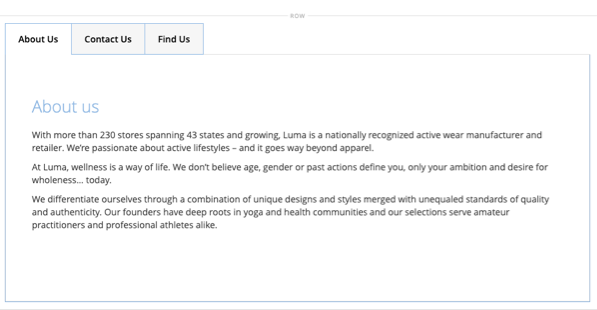

# Layout - Registerkarten

Verwenden Sie die _Registerkarten_ Inhaltstyp , um eine Reihe von Registerkarten im [[!DNL Page Builder] Schritt](workspace.md#stage). Wenn Sie den Registerkarten-Platzhalter aus dem Bedienfeld auf die Bühne ziehen, wird zunächst eine einzelne Standardregisterkarte angezeigt. Sie können weitere Registerkarten hinzufügen, um einen vollständigen Satz zu erstellen. Die Breite des Registerkartensatzes wird durch die Breite des übergeordneten Containers und der Abstandseinstellungen bestimmt.

{width="500" zoomable="yes"}

{{$include /help/_includes/page-builder-save-timeout.md}}

## Toolboxes

Wenn Sie mit dem _Registerkarten_ Inhaltstyp, können Sie einzelne Registerkarten und den Registerkarten-Container hinzufügen und bearbeiten, der mindestens eine Registerkarte enthält. Jede Registerkarte verfügt über eine eigene Toolbox, mit der Sie Registerkarten für das Erstellen von [!DNL Page Builder] Bühne.

### Symbolleiste für einzelne Registerkarten

{width="500" zoomable="yes"}

| Tool | Symbol | Beschreibung |
|--- |--- |--- |
| Verschieben | {width="25"} | Mit diesem Steuerelement neben der Tabulatorbeschriftung können Sie die einzelne Registerkarte in der Registerkarte an eine andere Position verschieben. |
| Einstellungen | {width="25"} | Öffnet die Seite &quot;Registerkarten bearbeiten&quot;, auf der Sie die Eigenschaften der einzelnen Registerkarten ändern können. |
| Duplizieren | {width="25"} | Kopiert die Registerkarte. |
| Entfernen | {width="25"} | Löscht die Registerkarte aus dem Registerkartensatz. |

{style="table-layout:auto"}

### Registerkarten-Container-Toolbox

{width="500" zoomable="yes"}

| Tool | Symbol | Beschreibung |
|--- |--- |--- |
| Verschieben | {width="25"} | Verschiebt den Satz von Registerkarten an eine andere Position im Raster im übergeordneten Container. |
| Hinzufügen | {width="25"} | Fügt dem Registerkartensatz eine Registerkarte hinzu. |
| (Titel) | [!UICONTROL Tabs] | Identifiziert den aktuellen Container als Registerkartensatz. Bewegen Sie den Mauszeiger über den oberen Rand des Containers, um die Toolbox anzuzeigen. |
| Einstellungen | {width="25"} | Öffnet die Seite &quot;Registerkarte bearbeiten&quot;, auf der Sie die Eigenschaften des Containers ändern können. |
| Ausblenden | {width="25"} | Blendet den Registerkartencontainer aus. |
| Anzeigen | {width="25"} | Zeigt den ausgeblendeten Registerkarten-Container an. |
| Duplizieren | {width="25"} | Kopiert die aktuelle Registerkarte. |
| Entfernen | {width="25"} | Löscht den aktuellen Tab-Satz aus der Bühne. |

{style="table-layout:auto"}

{{$include /help/_includes/page-builder-hidden-element-note.md}}

## Hinzufügen einer einzelnen Registerkarte

1. Im [!DNL Page Builder] Bereich unter _[!UICONTROL Layout]_, ziehen Sie die **[!UICONTROL Tabs]**Platzhalter direkt zur Bühne oder zu einer Zeile oder Spalte auf der Bühne.

   {width="600" zoomable="yes"}

1. Klicken Sie auf **[!UICONTROL Tab 1]** Beschriftung zum Anzeigen der einzelnen Registerkarten-Toolbox und zur Auswahl der _Einstellungen_ ( {width="20"} ).

1. Geben Sie die **[!UICONTROL Tab Name]** die Sie als Beschriftung verwenden möchten.

   {width="600" zoomable="yes"}

1. Geben Sie bei Bedarf die **[!UICONTROL Minimum Height]** für die Registerkarte.

   Dieser Wert kann eine Zahl mit einer beliebigen gültigen CSS-Einheit sein (z. B. `100px`, `50%`, `50em`, `100vh`) oder einer Berechnung (z. B. `100vh - 237px`).

1. Wählen Sie eine **[!UICONTROL Vertical Alignment]** Einstellung, um alle Inhaltscontainer auszurichten, die der Registerkarte hinzugefügt werden (oben, zentriert oder unten).

1. Legen Sie bei Bedarf die anderen Optionen mithilfe der folgenden Abschnitte als Anleitung fest:

   - [[!UICONTROL Background]][background]
   - [[!UICONTROL Advanced]][advanced]

1. Klicken Sie oben rechts auf **[!UICONTROL Save]** , um die Einstellungen anzuwenden und zum [!DNL Page Builder] Arbeitsbereich.

## Hinzufügen einer Reihe von Registerkarten

Die folgenden Schritte beginnen mit einer einzelnen Registerkarte und erstellen eine Reihe von drei Registerkarten innerhalb eines Registerkarten-Containers. Wenn Sie noch keine einzelne Registerkarte haben, befolgen Sie die vorherigen Anweisungen, um der Bühne eine einzelne Registerkarte hinzuzufügen.

1. Bewegen Sie den Mauszeiger über den Registerkarten-Container, um die Symbolleiste anzuzeigen und die _Hinzufügen_ ( {width="20"} ).

1. Klicken Sie in der **[!UICONTROL Tab 2]** Titel, um den Cursor anzuzeigen, und geben Sie einen eigenen Titel für die Registerkarte ein.

1. Klicken Sie erneut auf die zweite Registerkarte auf der Bühne und wählen Sie die _Duplizieren_ ( {width="20"} ).

1. Klicken Sie in den YourName **[!UICONTROL Copy]** Titel, um den Cursor anzuzeigen, und geben Sie einen eigenen Titel für die dritte Registerkarte ein.

{width="600" zoomable="yes"}

## Verschieben einer Registerkarte innerhalb des Sets

1. Klicken Sie auf die Registerkarte, die Sie verschieben möchten.

1. Auswählen und Ziehen des _Verschieben_ ( {width="20"} ), das direkt vor dem Titel-Text der Registerkarte angezeigt wird, an eine neue Position innerhalb des Registerkartensets.

## Inhalt zu einer Registerkarte hinzufügen

Sie können jeden Inhaltstyp auf eine Registerkarte genau so wie auf eine Zeile anwenden. Gehen Sie wie folgt vor, um einen Inhaltstyp für Text hinzuzufügen.

1. Klicken Sie auf die Registerkarte, auf der Sie den Inhalt hinzufügen möchten.

1. Im [!DNL Page Builder] Bedienfeld, erweitern **[!UICONTROL Elements]** und ziehen Sie eine **Text** Platzhalter zur Registerkarte.

1. Geben Sie Text in den Editor ein oder fügen Sie ihn ein und verwenden Sie die Editor-Symbolleiste, um ihn nach Bedarf zu formatieren.

   Siehe [Elemente - Text](text.md) für weitere Informationen zum Arbeiten mit dem Textinhalttyp.

   {width="500" zoomable="yes"}

1. Klicken Sie oben rechts auf **[!UICONTROL Save]**.

## Einzelne Registerkarteneinstellungen ändern

1. Bewegen Sie den Mauszeiger über eine einzelne Registerkarte, um die Symbolleiste anzuzeigen und die _Einstellungen_ ( {width="20"} ).

1. Ändern Sie bei Bedarf die grundlegenden Einstellungen für die Registerkarte:

   - **[!UICONTROL Tab Name]** - Geben Sie den überarbeiteten Text für die Registerkartenbeschriftung ein. Sie können den Titel auch direkt auf der Bühne ändern.

   - **[!UICONTROL Minimum Height]** - Geben Sie als Pixel ein, wenn Sie die automatische Höhe überschreiben möchten. Sie können beispielsweise die Mindesthöhe so festlegen, dass sie der Höhe eines Hintergrundbilds entspricht, um sicherzustellen, dass das vollständige Bild sichtbar ist.

   - **[!UICONTROL Vertical Alignment]** - Wählen Sie die vertikale Position der Inhaltscontainer aus, die der Registerkarte hinzugefügt werden.

1. Ändern Sie die anderen Einstellungen nach Bedarf mithilfe der folgenden Abschnitte für Details.

1. Wenn Sie fertig sind, klicken Sie auf **[!UICONTROL Save]** , um die Einstellungen anzuwenden und zum [!DNL Page Builder] Arbeitsbereich.

### Hintergrund

- **[!UICONTROL Background Color]** - Geben Sie die Hintergrundfarbe an, indem Sie ein Muster auswählen, auf die Farbauswahl klicken oder einen gültigen Farbnamen oder einen entsprechenden Hexadezimalwert eingeben. Diese Einstellung bestimmt die Hintergrundfarbe der Zeile. Sie können auch die Deckkraft der Farbe anpassen.

  {width="200"}

  Sie können einen Wert auf drei Arten eingeben:

   - Ein vordefinierter Farbname, z. B. `White`

   - Der hexadezimale Farbwert für die Farbe, beispielsweise `#ffffff`

   - Der rgba-Wert für die Farbe mit Deckkraft in Prozent, z. B. `rgba(255, 255, 255, 0.75)`

  Wenn Sie eine Farbe auswählen möchten, klicken Sie auf das Farbfeld links neben _Keine Farbe_ ankreuzen.

  {width="600" zoomable="yes"}

  Wenn Sie auf das Farbfeld klicken, um die Farbauswahl erneut zu öffnen, zeigt das Feld unter dem Schieberegler die aktuellen Rot-, Grün-, Blau- und Alpha-Werte (rgba) an. Die letzte Zahl gibt den aktuellen Deckkraftprozentsatz als Dezimalzahl an. Sie können den Schieberegler verwenden, um die Deckkraft anzupassen, oder den gewünschten Dezimalwert eingeben.

  {width="600" zoomable="yes"}

  >[!NOTE]
  >
  >[!DNL Page Builder] auch eine Transparenzschicht unterstützt oder _Alphakanal_, in Hintergrundbildern, die verwendet werden können, um Hintergründe mit unterschiedlicher Deckkraft zu erstellen.

- **[!UICONTROL Background Image]** - Verwenden Sie bei Bedarf die bereitgestellten Tools, um ein Hintergrundbild auszuwählen, das auf die Registerkarte angewendet werden soll:

  | Tool | Beschreibung |
  |--- |--- |
  | [!UICONTROL Upload] | Lädt eine Bilddatei von Ihrem lokalen Computer in die Galerie hoch und wendet sie dann als Hintergrundbild für die Registerkarte an. |
  | [!UICONTROL Select from Gallery] | fordert Sie auf, ein vorhandenes Bild aus der Galerie als Hintergrundbild für die Registerkarte auszuwählen. |
  | {width="25"} | Ermöglicht Ihnen, das Bild entweder auf die Kachel &quot;Kamera&quot;zu ziehen oder zum Bild in Ihrem lokalen Dateisystem zu navigieren. |

  {style="table-layout:auto"}

- **[!UICONTROL Background Mobile Image]** - Verwenden Sie bei Bedarf dieselben Tools, um ein anderes Hintergrundbild für die Anzeige auf Mobilgeräten auszuwählen.

- **[!UICONTROL Background Size]** - Wählen Sie aus, wie das Hintergrundbild im Verhältnis zur Breite der Registerkarte skaliert wird:

  | Option | Beschreibung |
  |--- |--- |
  | `Cover` | Das Hintergrundbild deckt die gesamte Breite der Registerkarte ab. |
  | `Contain` | Das Hintergrundbild ist auf die Breite des Registerkartenbereichs beschränkt. |
  | `Auto` | Wendet die Größe aus dem aktuellen Stylesheet an. |

  {style="table-layout:auto"}

- **[!UICONTROL Background Position]** - Wählen Sie aus, wie das Hintergrundbild im Verhältnis zur Registerkarte verankert ist: `Top Left` / `Top Center` / `Top Right` / `Center Left` / `Center` / `Center Right` / `Bottom Left` / `Bottom Center` / `Bottom Right`

- **[!UICONTROL Background Attachment]** - Wählen Sie den Anlagentyp aus, um festzulegen, wie sich das Hintergrundbild im Verhältnis zur Scrollseite bewegt:

  | Option | Beschreibung |
  | --- | --- |
  | `Scroll` | Das angehängte Hintergrundbild wird synchronisiert, um sich beim Bildlauf der Seite nach unten zu bewegen. |
  | `Fixed` | (Für Mobilgeräte nicht verfügbar) Das Hintergrundbild wird nicht verschoben, wenn der Container über das Bild blättert, und ist an der angegebenen Hintergrundposition fixiert. |

  {style="table-layout:auto"}

- **[!UICONTROL Background Repeat]** - Legen Sie `Yes` um das Hintergrundbild zu wiederholen, um den verfügbaren Platz auf der Registerkarte auszufüllen.

### Erweitert

- Um die horizontale Ausrichtung der Inhaltscontainer zu steuern, die der Registerkarte hinzugefügt werden, wählen Sie eine **[!UICONTROL Alignment]** .

  | Option | Beschreibung |
  | --- | --- |
  | `Default` | Wendet die Standardeinstellung für die Ausrichtung an, die im Stylesheet des aktuellen Designs angegeben ist. |
  | `Left` | Richtet die Inhaltscontainer am linken Rand der Registerkarte aus, wobei der angegebene Abstand berücksichtigt wird. |
  | `Center` | Richtet den Inhalts-Container in der Mitte der Registerkarte aus, wobei der angegebene Abstand berücksichtigt wird. |
  | `Right` | Richtet den Inhalts-Container am rechten Rand der Registerkarte aus, wobei der angegebene Abstand berücksichtigt wird. |

  {style="table-layout:auto"}

- Legen Sie die **[!UICONTROL Border]** -Stil, der auf alle vier Seiten des Registerkartencontainers angewendet wird:

  | Option | Beschreibung |
  | --- | --- |
  | `Default` | Wendet den standardmäßigen Randstil an, der vom zugehörigen Stylesheet angegeben wird. |
  | `None` | liefert keine sichtbare Anzeige der Containergrenzen. |
  | `Dotted` | Der Container-Rahmen wird als gepunktete Linie angezeigt. |
  | `Dashed` | Der Container-Rahmen wird als gestrichelte Linie angezeigt. |
  | `Solid` | Der Container-Rahmen wird als durchgehende Linie angezeigt. |
  | `Double` | Der Container-Rahmen wird als doppelte Linie angezeigt. |
  | `Groove` | Der Container-Rahmen wird als Rillenlinie angezeigt. |
  | `Ridge` | Der Container-Rahmen wird als gekürzte Linie angezeigt. |
  | `Inset` | Der Container-Rahmen wird als Inset-Zeile angezeigt. |
  | `Outset` | Der Container-Rahmen wird als Ausgangspunkt angezeigt. |

  {style="table-layout:auto"}

- Wenn Sie einen anderen Rahmenstil als `None`, füllen Sie die Randanzeigeoptionen aus:

  {width="600" zoomable="yes"}

  | Option | Beschreibung |
  | ------ |------------ |
  | [!UICONTROL Border Color] | Geben Sie die Farbe an, indem Sie ein Muster auswählen, auf die Farbauswahl klicken oder einen gültigen Farbnamen oder einen entsprechenden Hexadezimalwert eingeben. |
  | [!UICONTROL Border Width] | Geben Sie die Anzahl Pixel für die Rahmenlinienbreite an. |
  | [!UICONTROL Border Radius] | Geben Sie die Anzahl der Pixel an, um die die Größe des Radius definiert wird, mit dem die einzelnen Ecken des Rands gerundet werden. |

  {style="table-layout:auto"}

  Die Zeile im folgenden Beispiel hat einen Rahmenradius von 15.

  {width="500"}

- (Optional) Geben Sie die Namen von **[!UICONTROL CSS classes]** aus dem aktuellen Stylesheet, das auf den Spaltencontainer angewendet werden soll.

  Trennen Sie mehrere Klassennamen durch ein Leerzeichen.

- Geben Sie Werte in Pixel für die **[!UICONTROL Margins and Padding]** um die äußeren Ränder und den inneren Abstand der Spalte anzugeben.

  Geben Sie jeden entsprechenden Wert in das Tab-Container-Diagramm ein.

  | Container-Bereich | Beschreibung |
  | -------------- | ---------- |
  | [!UICONTROL Margins] | Die Menge an leerem Raum, die auf den äußeren Rand aller Seiten des Containers angewendet wird. Optionen: `Top` / `Right` / `Bottom` / `Left` |
  | [!UICONTROL Padding] | Die Menge an leerem Raum, die auf den inneren Rand aller Seiten des Containers angewendet wird. Optionen: `Top` / `Right` / `Bottom` / `Left` |

  {style="table-layout:auto"}

## Einstellungen für Registerkarteneinstellungen ändern

1. Bewegen Sie den Mauszeiger über den oberen Rand des Registerkartenset-Containers, um die Toolbox anzuzeigen und die _Einstellungen_ ( {width="20"} ).

1. Ändern Sie bei Bedarf die **[!UICONTROL Default Active Tab]**.

   Wählen Sie die Registerkarte im Set aus, die aktiv sein soll, wenn die Seite geladen wird.

1. Geben Sie die **[!UICONTROL Minimum Height]**, in Pixeln, wenn Sie die automatische Höhe für den Registerkartensatz überschreiben möchten.

1. Um die Navigationsregisterkarten am oberen Rand des Registerkartensets zu positionieren, wählen Sie die **[!UICONTROL Tab Navigation Alignment]** (`Left`, `Center`oder `Right`).

   {width="500" zoomable="yes"}

1. Legen Sie die erweiterten Optionen für den Registerkartensatz fest:

   - Um die Positionierung des Registerkartensatzes innerhalb des übergeordneten Containers zu steuern, wählen Sie eine **[!UICONTROL Alignment]**:

     | Option | Beschreibung |
     | ------ | ---------- |
     | `Default` | Wendet die Standardeinstellung für die Ausrichtung an, die im Stylesheet des aktuellen Designs angegeben ist. |
     | `Left` | Richtet den Tab-Satz am linken Rand des übergeordneten Containers aus, wobei der angegebene Abstand berücksichtigt wird. |
     | `Center` | Richtet die Registerkarte in der Mitte des übergeordneten Containers aus, wobei der angegebene Abstand berücksichtigt wird. |
     | `Right` | Richtet den Tab-Satz am rechten Rand des übergeordneten Containers aus, wobei der angegebene Abstand berücksichtigt wird. |

     {style="table-layout:auto"}

   - Legen Sie die **[!UICONTROL Border]** Stil angewendet auf alle vier Seiten des Registerkarten-Containers:

     | Option | Beschreibung |
     | ------ | ---------- |
     | `Default` | Wendet den standardmäßigen Randstil an, der vom zugehörigen Stylesheet angegeben wird. |
     | `None` | liefert keine sichtbare Anzeige der Containergrenzen. |
     | `Dotted` | Der Container-Rahmen wird als gepunktete Linie angezeigt. |
     | `Dashed` | Der Container-Rahmen wird als gestrichelte Linie angezeigt. |
     | `Solid` | Der Container-Rahmen wird als durchgehende Linie angezeigt. |
     | `Double` | Der Container-Rahmen wird als doppelte Linie angezeigt. |
     | `Groove` | Der Container-Rahmen wird als Rillenlinie angezeigt. |
     | `Ridge` | Der Container-Rahmen wird als gekürzte Linie angezeigt. |
     | `Inset` | Der Container-Rahmen wird als Inset-Zeile angezeigt. |
     | `Outset` | Der Container-Rahmen wird als Ausgangspunkt angezeigt. |

     {style="table-layout:auto"}

   - Wenn Sie einen anderen Rahmenstil als `None`, füllen Sie die Randanzeigeoptionen aus:

     | Option | Beschreibung |
     | ------ |------------ |
     | [!UICONTROL Border Color] | Geben Sie die Farbe an, indem Sie ein Muster auswählen, auf die Farbauswahl klicken oder einen gültigen Farbnamen oder einen entsprechenden Hexadezimalwert eingeben. |
     | [!UICONTROL Border Width] | Geben Sie die Anzahl Pixel für die Rahmenlinienbreite an. |
     | [!UICONTROL Border Radius] | Geben Sie die Anzahl der Pixel an, um die die Größe des Radius definiert wird, mit dem die einzelnen Ecken des Rands gerundet werden. |

     {style="table-layout:auto"}

   - (Optional) Geben Sie die Namen von **[!UICONTROL CSS classes]** aus dem aktuellen Stylesheet, das auf den Registerkarten-Container angewendet werden soll.

     Trennen Sie mehrere Klassennamen durch ein Leerzeichen.

   - Geben Sie Werte in Pixel für die **[!UICONTROL Margins and Padding]** um die äußeren Ränder und den inneren Abstand des Registerkartenbehälters zu bestimmen.

     Geben Sie die entsprechenden Werte in das Containerdiagramm der Registerkarten ein.

     | Container-Bereich | Beschreibung |
     | -------------- | ---------- |
     | [!UICONTROL Margins] | Die Menge an leerem Raum, die auf den äußeren Rand aller Seiten des Containers angewendet wird. Optionen: `Top` / `Right` / `Bottom` / `Left` |
     | [!UICONTROL Padding] | Die Menge an leerem Raum, die auf den inneren Rand aller Seiten des Containers angewendet wird. Optionen: `Top` / `Right` / `Bottom` / `Left` |

     {style="table-layout:auto"}

1. Wenn Sie fertig sind, klicken Sie auf **[!UICONTROL Save]** , um die Einstellungen anzuwenden und zum [!DNL Page Builder] Arbeitsbereich.

[background]: #background
[advanced]: #advanced
