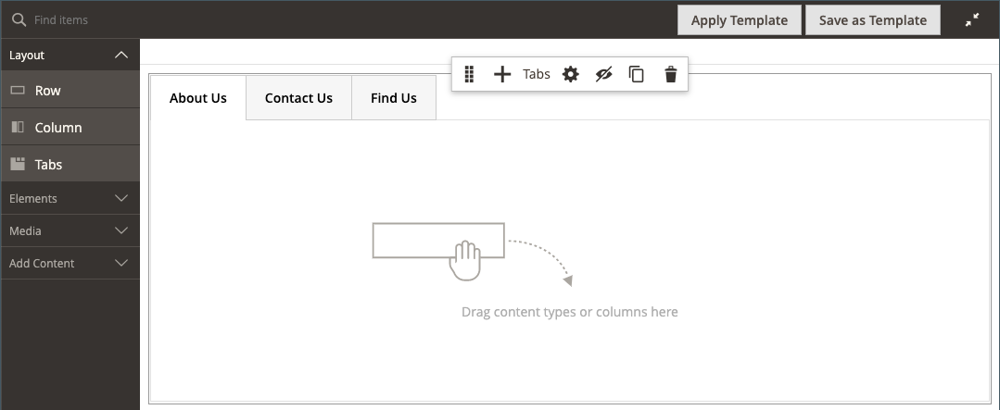

# Layout - Registerkarten

Verwenden Sie den _Registerkarten_ Content-Typ, um eine Reihe von Registerkarten in der [[!DNL Page Builder] Phase](workspace.md#stage) hinzuzufügen. Wenn Sie den Platzhalter Registerkarten aus dem Bedienfeld auf das Stadium ziehen, wird zunächst eine einzige Standardregisterkarte angezeigt. Sie können weitere Registerkarten hinzufügen, um einen vollständigen Satz zu erstellen. Die Breite des Registerkartensatzes wird durch die Breite des übergeordneten Containers und die Abstandseinstellungen bestimmt.

{width="500" zoomable="yes"}

{{$include /help/_includes/page-builder-save-timeout.md}}

## Toolboxes

Wenn Sie mit dem Inhaltstyp _Registerkarten_ arbeiten, fügen Sie einzelne Registerkarten und den Registerkarten-Container, der eine oder mehrere Registerkarten enthält, hinzu und bearbeiten diese. Jede Registerkarte verfügt über eine eigene Toolbox, mit der Sie Registerkarten auf der [!DNL Page Builder] entwerfen können.

### Individuelle Registerkarten-Toolbox

{width="500" zoomable="yes"}

| Tool | Symbol | Beschreibung |
|--- |--- |--- |
| Verschieben | {width="25"} | Dieses Steuerelement neben der Registerkartenbeschriftung wird verwendet, um die jeweilige Registerkarte an eine andere Position im Registerkartensatz zu verschieben. |
| Einstellungen | {width="25"} | Öffnet die Seite Registerkarten bearbeiten , auf der Sie die Eigenschaften der einzelnen Registerkarten ändern können. |
| Duplikat | {width="25"} | Erstellt eine Kopie der Registerkarte. |
| entfernen | {width="25"} | Löscht die Registerkarte aus dem Registerkartensatz. |

{style="table-layout:auto"}

### Registerkarten-Container-Toolbox

{width="500" zoomable="yes"}

| Tool | Symbol | Beschreibung |
|--- |--- |--- |
| Verschieben | {width="25"} | Verschiebt die Gruppe von Registerkarten an eine andere Position im Raster im übergeordneten Container. |
| Hinzufügen | {width="25"} | Fügt dem Registerkartensatz eine Registerkarte hinzu. |
| (Bezeichnung) | [!UICONTROL Tabs] | Identifiziert den aktuellen Container als Registerkartensatz. Bewegen Sie den Mauszeiger über den oberen Rand des Containers, um die Toolbox anzuzeigen. |
| Einstellungen | {width="25"} | Öffnet die Registerkarte Bearbeiten , auf der Sie die Eigenschaften des Containers ändern können. |
| Ausblenden | {width="25"} | Blendet den Container der Registerkarte aus. |
| Anzeigen | {width="25"} | Zeigt den Container der ausgeblendeten Registerkarte an. |
| Duplikat | {width="25"} | Erstellt eine Kopie der aktuellen Registerkarte. |
| entfernen | {width="25"} | Löscht den aktuellen Registerkartensatz aus dem Schritt. |

{style="table-layout:auto"}

{{$include /help/_includes/page-builder-hidden-element-note.md}}

## Einzelne Registerkarte hinzufügen

1. Ziehen Sie im [!DNL Page Builder] unter _[!UICONTROL Layout]_den **[!UICONTROL Tabs]**Platzhalter direkt auf die Bühne oder in eine Zeile oder Spalte auf der Bühne.

   {width="600" zoomable="yes"}

1. Klicken Sie auf die **[!UICONTROL Tab 1]** Beschriftung, um die jeweilige Registerkarten-Toolbox anzuzeigen, und wählen Sie das Symbol _Einstellungen_ aus ({width="20"} ).

1. Geben Sie die **[!UICONTROL Tab Name]** ein, die Sie als Titel verwenden möchten.

   {width="600" zoomable="yes"}

1. Geben Sie bei Bedarf die **[!UICONTROL Minimum Height]** für die Registerkarte ein.

   Dieser Wert kann eine Zahl mit einer beliebigen gültigen CSS-Einheit (z. B. `100px`, `50%`, `50em`, `100vh`) oder eine Berechnung (z. B. `100vh - 237px`) sein.

1. Wählen Sie eine **[!UICONTROL Vertical Alignment]** aus, um alle Inhalts-Container auszurichten, die der Registerkarte hinzugefügt werden (oben, zentriert oder unten).

1. Legen Sie bei Bedarf die anderen Optionen anhand der folgenden Abschnitte fest:

   - [[!UICONTROL Background]](#background)
   - [[!UICONTROL Advanced]](#advanced)

1. Klicken Sie oben rechts auf **[!UICONTROL Save]** , um die Einstellungen anzuwenden und zum Arbeitsbereich [!DNL Page Builder] zurückzukehren.

## Eine Gruppe von Registerkarten hinzufügen

Die folgenden Schritte beginnen mit einer einzelnen Registerkarte und erstellen einen Satz von drei Registerkarten in einem Registerkarten-Container. Wenn Sie noch nicht über eine einzelne Registerkarte verfügen, befolgen Sie die vorherigen Anweisungen, um der Phase eine einzelne Registerkarte hinzuzufügen.

1. Bewegen Sie den Mauszeiger über den Container mit Registerkarten, um die Toolbox anzuzeigen, und wählen _das Symbol Hinzufügen_ ( {width="20"} ) aus.

1. Klicken Sie auf den **[!UICONTROL Tab 2]**, um den Cursor anzuzeigen, und geben Sie einen eigenen Titel für die Registerkarte ein.

1. Klicken Sie erneut auf die zweite Registerkarte auf der Bühne und wählen Sie das Symbol _Duplizieren_ ( {width="20"} ) aus.

1. Klicken Sie auf die Beschriftung YourName-**[!UICONTROL Copy]**, um den Cursor anzuzeigen, und geben Sie Ihre eigene Beschriftung für die dritte Registerkarte ein.

{width="600" zoomable="yes"}

## Verschieben einer Registerkarte innerhalb des Sets

1. Klicken Sie auf die Registerkarte, die Sie verschieben möchten.

1. Wählen Sie das Symbol _Verschieben_ ( {width="20"} ) aus, das unmittelbar vor dem Text der Registerkartenbeschriftung angezeigt wird, und ziehen Sie es an eine neue Position innerhalb des Registerkartensatzes.

## Hinzufügen von Inhalt zu einer Registerkarte

Sie können einen beliebigen Inhaltstyp auf eine Registerkarte genau wie auf eine Zeile anwenden. Führen Sie die folgenden Schritte aus, um einen Textinhaltstyp als Beispiel hinzuzufügen.

1. Klicken Sie auf die Registerkarte, der Sie den Inhalt hinzufügen möchten.

1. Erweitern Sie im [!DNL Page Builder] Bedienfeld **[!UICONTROL Elements]** und ziehen Sie einen **Text**-Platzhalter auf die Registerkarte.

1. Geben Sie Text im Editor ein oder fügen Sie ihn ein und formatieren Sie ihn mithilfe der Editor-Symbolleiste nach Bedarf.

   Weitere Informationen [ Arbeiten mit dem Inhaltstyp „Text](text.md) finden Sie unter „Elemente - Text“.

   {width="500" zoomable="yes"}

1. Klicken Sie oben rechts auf **[!UICONTROL Save]**.

## Individuelle Registerkarteneinstellungen ändern

1. Bewegen Sie den Mauszeiger über eine einzelne Registerkarte, um die Toolbox anzuzeigen, und wählen Sie _Symbol Einstellungen_ ( {width="20"} ) aus.

1. Ändern Sie bei Bedarf eine der grundlegenden Einstellungen für die Registerkarte:

   - **[!UICONTROL Tab Name]** - Geben Sie einen überarbeiteten Text für die Registerkartenbeschriftung ein. Sie können die Beschriftung auch direkt auf der Bühne ändern.

   - **[!UICONTROL Minimum Height]** : Geben Sie als Pixel ein, wenn Sie die automatische Höhe überschreiben möchten. Sie können beispielsweise die Mindesthöhe so festlegen, dass sie mit der Höhe eines Hintergrundbilds übereinstimmt, um sicherzustellen, dass das vollständige Bild sichtbar ist.

   - **[!UICONTROL Vertical Alignment]** - Wählen Sie die vertikale Position von Inhalts-Containern aus, die der Registerkarte hinzugefügt werden.

1. Ändern Sie die anderen Einstellungen nach Bedarf, indem Sie die folgenden Abschnitte für Details verwenden.

1. Klicken Sie abschließend auf **[!UICONTROL Save]** , um die Einstellungen anzuwenden und zum Arbeitsbereich [!DNL Page Builder] zurückzukehren.

### Hintergrund

- **[!UICONTROL Background Color]** : Geben Sie die Hintergrundfarbe an, indem Sie ein Muster auswählen, auf die Farbauswahl klicken oder einen gültigen Farbnamen oder einen entsprechenden Hexadezimalwert eingeben. Diese Einstellung bestimmt die Hintergrundfarbe der Zeile. Sie können auch die Deckkraft der Farbe anpassen.

  {width="200"}

  Sie haben drei Möglichkeiten, einen Wert einzugeben:

   - Ein vordefinierter Farbname, z. B. `White`

   - Der hexadezimale Farbwert für die Farbe, z. B. `#ffffff`

   - Der RGBA-Wert für die Farbe mit Prozentsatz für die Deckkraft, z. B. `rgba(255, 255, 255, 0.75)`

  Wenn Sie eine Farbe auswählen möchten, klicken Sie auf das Farbfeld links neben dem Feld _Keine Farbe_.

  {width="600" zoomable="yes"}

  Wenn Sie auf das Farbfeld klicken, um die Farbauswahl erneut zu öffnen, werden im Feld unter dem Schieberegler die aktuellen Rot-, Grün-, Blau- und Alpha-Werte (RGBA) angezeigt. Die letzte Zahl gibt den aktuellen Prozentsatz der Deckkraft als Dezimalzahl an. Sie können den Schieberegler verwenden, um die Deckkraft anzupassen, oder den gewünschten Dezimalwert eingeben.

  {width="600" zoomable="yes"}

  >[!NOTE]
  >
  >[!DNL Page Builder] unterstützt auch eine Transparenzschicht (_Alphakanal_ in Hintergrundbildern, die verwendet werden können, um Hintergründe mit unterschiedlichem Grad der Deckkraft zu erstellen.

- **[!UICONTROL Background Image]** - Verwenden Sie bei Bedarf die bereitgestellten Tools, um ein Hintergrundbild auszuwählen, das auf die Registerkarte angewendet werden soll:

  | Tool | Beschreibung |
  |--- |--- |
  | [!UICONTROL Upload] | Lädt eine Bilddatei von Ihrem lokalen Computer in die Galerie hoch und wendet sie dann als Hintergrundbild für die Registerkarte an. |
  | [!UICONTROL Select from Gallery] | Fordert Sie auf, ein vorhandenes Bild aus der Galerie als Hintergrundbild für die Registerkarte auszuwählen. |
  | {width="25"} | Hiermit können Sie das Bild entweder auf die Kamerakachel ziehen oder zum Bild in Ihrem lokalen Dateisystem navigieren. |

  {style="table-layout:auto"}

- **[!UICONTROL Background Mobile Image]** - Verwenden Sie bei Bedarf dieselben Tools, um ein anderes Hintergrundbild für die Anzeige auf Mobilgeräten auszuwählen.

- **[!UICONTROL Background Size]** : Wählen Sie aus, wie das Hintergrundbild in Bezug auf die Breite der Registerkarte skaliert werden soll:

  | Option | Beschreibung |
  |--- |--- |
  | `Cover` | Das Hintergrundbild deckt die gesamte Breite der Registerkarte ab. |
  | `Contain` | Das Hintergrundbild ist auf die Breite des Registerkartenbereichs beschränkt. |
  | `Auto` | Wendet die Größe aus dem aktuellen Stylesheet an. |

  {style="table-layout:auto"}

- **[!UICONTROL Background Position]** : Auswählen, wie das Hintergrundbild in Bezug auf die Registerkarte verankert werden soll: `Top Left` / `Top Center` / `Top Right` / `Center Left` / `Center` / `Center Right` / `Bottom Left` / `Bottom Center` / `Bottom Right`

- **[!UICONTROL Background Attachment]** : Wählen Sie den Anlagentyp aus, um zu bestimmen, wie sich das Hintergrundbild in Bezug auf die Bildlaufseite bewegt:

  | Option | Beschreibung |
  | --- | --- |
  | `Scroll` | Das angehängte Hintergrundbild wird synchronisiert, sodass es beim Bildlauf auf der Seite nach unten verschoben wird. |
  | `Fixed` | (Nicht für Mobilgeräte verfügbar) Das Hintergrundbild wird nicht verschoben, wenn der Container über das Bild scrollt und an der angegebenen Hintergrundposition fixiert ist. |

  {style="table-layout:auto"}

- **[!UICONTROL Background Repeat]** : Wählen Sie `Yes` aus, um das Hintergrundbild zu wiederholen und den verfügbaren Platz auf der Registerkarte auszufüllen.

### Erweitert

- Um die horizontale Ausrichtung von Inhalts-Containern zu steuern, die der Registerkarte hinzugefügt werden, wählen Sie ein **[!UICONTROL Alignment]** aus.

  | Option | Beschreibung |
  | --- | --- |
  | `Default` | Wendet die Standardeinstellung für die Ausrichtung an, die im Stylesheet des aktuellen Designs angegeben ist. |
  | `Left` | Richtet die Inhalts-Container am linken Rand der Registerkarte aus, wobei für jeden angegebenen Abstand berücksichtigt wird. |
  | `Center` | Richtet den Inhalts-Container in der Mitte der Registerkarte aus, wobei für jeden angegebenen Abstand berücksichtigt wird. |
  | `Right` | Richtet den Inhalts-Container am rechten Rand der Registerkarte aus, wobei für jeden angegebenen Abstand berücksichtigt wird. |

  {style="table-layout:auto"}

- Legen Sie den **[!UICONTROL Border]** fest, der auf alle vier Seiten des Registerkarten-Containers angewendet wird:

  | Option | Beschreibung |
  | --- | --- |
  | `Default` | Wendet die Standardformatvorlage für Rahmen an, die im zugehörigen Stylesheet angegeben ist. |
  | `None` | Zeigt keine sichtbaren Begrenzungen des Containers an. |
  | `Dotted` | Der Container-Rahmen wird als gepunktete Linie angezeigt. |
  | `Dashed` | Der Container-Rahmen wird als gestrichelte Linie angezeigt. |
  | `Solid` | Der Container-Rahmen wird als durchgezogene Linie angezeigt. |
  | `Double` | Der Container-Rahmen wird als doppelte Linie angezeigt. |
  | `Groove` | Der Container-Rahmen wird als gerillte Linie angezeigt. |
  | `Ridge` | Der Container-Rahmen wird als geriffelte Linie angezeigt. |
  | `Inset` | Der Container-Rahmen wird als Einfügelinie angezeigt. |
  | `Outset` | Der Container-Rahmen wird als Ausgangslinie angezeigt. |

  {style="table-layout:auto"}

- Wenn Sie einen anderen Rahmenstil als `None` festlegen, müssen Sie die Anzeigeoptionen für den Rahmen vervollständigen:

  {width="600" zoomable="yes"}

  | Option | Beschreibung |
  | ------ |------------ |
  | [!UICONTROL Border Color] | Geben Sie die Farbe an, indem Sie einen Musterabschnitt auswählen, auf die Farbauswahl klicken oder einen gültigen Farbnamen oder einen entsprechenden Hexadezimalwert eingeben. |
  | [!UICONTROL Border Width] | Geben Sie die Anzahl der Pixel für die Rahmenlinienbreite ein. |
  | [!UICONTROL Border Radius] | Geben Sie die Anzahl der Pixel ein, um die Größe des Radius festzulegen, mit dem jede Ecke des Rahmens gerundet werden soll. |

  {style="table-layout:auto"}

  Die Zeile im folgenden Beispiel hat einen Rahmenradius von 15.

  {width="500"}

- (Optional) Geben Sie die Namen der **[!UICONTROL CSS classes]** aus dem aktuellen Stylesheet an, die auf den Spalten-Container angewendet werden sollen.

  Trennen Sie mehrere Klassennamen durch ein Leerzeichen.

- Geben Sie Werte in Pixeln für die **[!UICONTROL Margins and Padding]** ein, um die äußeren Ränder und den inneren Abstand der Spalte anzugeben.

  Geben Sie jeden entsprechenden Wert im Registerkarten-Container-Diagramm ein.

  | Container-Bereich | Beschreibung |
  | -------------- | ---------- |
  | [!UICONTROL Margins] | Die Menge des Leerraums, der auf die Außenkante aller Seiten des Containers angewendet wird. Optionen: `Top` / `Right` / `Bottom` / `Left` |
  | [!UICONTROL Padding] | Die Menge des Leerraums, der auf die Innenkante aller Seiten des Containers angewendet wird. Optionen: `Top` / `Right` / `Bottom` / `Left` |

  {style="table-layout:auto"}

## Ändern der Registerkartensatzeinstellungen

1. Bewegen Sie den Mauszeiger über den oberen Rand des Registerkarten-Set-Containers, um die Toolbox anzuzeigen, und wählen Sie das Symbol _Einstellungen_ ( {width="20"} ) aus.

1. Ändern Sie bei Bedarf die **[!UICONTROL Default Active Tab]**.

   Wählen Sie im Set die Registerkarte aus, die beim Laden der Seite aktiv sein soll.

1. Geben Sie die **[!UICONTROL Minimum Height]** in Pixeln an, wenn Sie die automatische Höhe für den Registerkartensatz überschreiben möchten.

1. Um die Navigationsregisterkarten am oberen Rand des Registerkartensatzes zu positionieren, wählen Sie die **[!UICONTROL Tab Navigation Alignment]** (`Left`, `Center` oder `Right`).

   {width="500" zoomable="yes"}

1. Legen Sie die erweiterten Optionen für den Registerkartensatz fest:

   - Um die Positionierung des Registerkartensatzes innerhalb des übergeordneten Containers zu steuern, wählen Sie eine **[!UICONTROL Alignment]** aus:

     | Option | Beschreibung |
     | ------ | ---------- |
     | `Default` | Wendet die Standardeinstellung für die Ausrichtung an, die im Stylesheet des aktuellen Designs angegeben ist. |
     | `Left` | Richtet die Registerkarte am linken Rand des übergeordneten Containers aus, wobei ein etwaiger Abstand berücksichtigt wird. |
     | `Center` | Richtet die Registerkarte aus, die in der Mitte des übergeordneten Containers festgelegt ist, wobei alle angegebenen Auffüllungen berücksichtigt werden. |
     | `Right` | Richtet die Registerkarten am rechten Rand des übergeordneten Containers aus, wobei ein etwaiger Abstand berücksichtigt wird. |

     {style="table-layout:auto"}

   - Legen Sie den **[!UICONTROL Border]** fest, der auf alle vier Seiten des Registerkarten-Containers angewendet werden soll:

     | Option | Beschreibung |
     | ------ | ---------- |
     | `Default` | Wendet die Standardformatvorlage für Rahmen an, die im zugehörigen Stylesheet angegeben ist. |
     | `None` | Zeigt keine sichtbaren Begrenzungen des Containers an. |
     | `Dotted` | Der Container-Rahmen wird als gepunktete Linie angezeigt. |
     | `Dashed` | Der Container-Rahmen wird als gestrichelte Linie angezeigt. |
     | `Solid` | Der Container-Rahmen wird als durchgezogene Linie angezeigt. |
     | `Double` | Der Container-Rahmen wird als doppelte Linie angezeigt. |
     | `Groove` | Der Container-Rahmen wird als gerillte Linie angezeigt. |
     | `Ridge` | Der Container-Rahmen wird als geriffelte Linie angezeigt. |
     | `Inset` | Der Container-Rahmen wird als Einfügelinie angezeigt. |
     | `Outset` | Der Container-Rahmen wird als Ausgangslinie angezeigt. |

     {style="table-layout:auto"}

   - Wenn Sie einen anderen Rahmenstil als `None` festlegen, müssen Sie die Anzeigeoptionen für den Rahmen vervollständigen:

     | Option | Beschreibung |
     | ------ |------------ |
     | [!UICONTROL Border Color] | Geben Sie die Farbe an, indem Sie einen Musterabschnitt auswählen, auf die Farbauswahl klicken oder einen gültigen Farbnamen oder einen entsprechenden Hexadezimalwert eingeben. |
     | [!UICONTROL Border Width] | Geben Sie die Anzahl der Pixel für die Rahmenlinienbreite ein. |
     | [!UICONTROL Border Radius] | Geben Sie die Anzahl der Pixel ein, um die Größe des Radius festzulegen, mit dem jede Ecke des Rahmens gerundet werden soll. |

     {style="table-layout:auto"}

   - (Optional) Geben Sie die Namen der **[!UICONTROL CSS classes]** aus dem aktuellen Stylesheet an, die auf den Registerkarten-Container angewendet werden sollen.

     Trennen Sie mehrere Klassennamen durch ein Leerzeichen.

   - Geben Sie Werte in Pixeln für die **[!UICONTROL Margins and Padding]** ein, um die äußeren Ränder und den inneren Abstand des Registerkarten-Containers zu bestimmen.

     Geben Sie die entsprechenden Werte in das Registerkarten-Container-Diagramm ein.

     | Container-Bereich | Beschreibung |
     | -------------- | ---------- |
     | [!UICONTROL Margins] | Die Menge des Leerraums, der auf die Außenkante aller Seiten des Containers angewendet wird. Optionen: `Top` / `Right` / `Bottom` / `Left` |
     | [!UICONTROL Padding] | Die Menge des Leerraums, der auf die Innenkante aller Seiten des Containers angewendet wird. Optionen: `Top` / `Right` / `Bottom` / `Left` |

     {style="table-layout:auto"}

1. Klicken Sie abschließend auf **[!UICONTROL Save]** , um die Einstellungen anzuwenden und zum Arbeitsbereich [!DNL Page Builder] zurückzukehren.

<!-- Last updated from includes: 2023-09-11 14:30:19 -->
