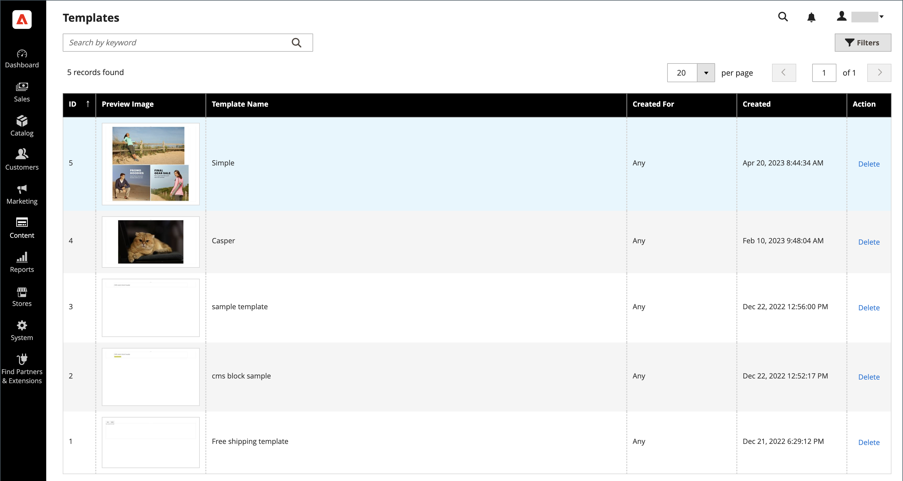

# Vorlagen [!DNL Page Builder]

Vorlagen sind Container, die [!DNL Page Builder] Inhalt und Layouts vorhandener Seiten, Blöcke, dynamischer Blöcke, Produktattribute und Kategoriebeschreibungen speichern. Die Verwendung von Vorlagen spart Ihnen Zeit und Mühe bei der Erstellung von Inhalten (oder beim Ersetzen älterer Inhalte). Sie können beispielsweise Ihren vorhandenen [!DNL Page Builder]-Inhalt als Vorlage speichern und diese Vorlage (mit allen Inhalten und Layouts) dann auf einen anderen Bereich anwenden, um schnell [!DNL Page Builder] Inhalt zu erstellen.

## Auf Vorlagen zugreifen

Navigieren Sie in _Admin_-Seitenleiste zu **[!UICONTROL Content]** > _[!UICONTROL Elements]_>**[!UICONTROL Templates]**.

{width="700" zoomable="yes"}

## [!DNL Page Builder] Inhalt als Vorlage speichern

1. Navigieren Sie zur [[!DNL Page Builder] Phase](workspace.md#stage) und greifen Sie auf den Inhalt zu, den Sie als Vorlage speichern möchten.

   Dabei kann es sich um eine Seite, einen Block, einen dynamischen Block, ein Produktattribut oder eine Kategoriebeschreibung handeln.

1. Klicken Sie oben rechts über der Bühne auf **[!UICONTROL Save as Template]** .

   ![[!DNL Page Builder] mit der Schaltfläche Als Vorlage speichern &#x200B;](./assets/pb-templates-saveastemplate-button.png){width="600" zoomable="yes"}

   Diese Aktion zeigt das _[!UICONTROL Save Content as Template]_&#x200B;Dialogfeld an.

   ![[!DNL Page Builder] Dialogfeld „Als Vorlage speichern“](./assets/pb-templates-save-dialog.png){width="400" zoomable="yes"}

1. Geben Sie **[!UICONTROL Template Name]** einen eindeutigen Namen für die Vorlage ein.

   Ein eindeutiger Name ist erforderlich, damit er bei Bedarf durchsucht, ausgewählt und auf einen anderen Inhaltsbereich angewendet werden kann.

1. Legen Sie bei Bedarf **Erstellt für** fest, um die Vorlage einem bestimmten Inhaltsbereichstyp zuzuweisen.

   Wenn Sie diese Zuweisung hinzufügen, kann sie gefiltert und leichter gefunden werden, wenn Sie diese Vorlage später anwenden möchten. Aber sie beschränkt ihre Verwendung nicht auf diesen Bereich. Sie können jede Vorlage überall dort verwenden, wo [!DNL Page Builder] Inhalt zulässig ist.

1. Klicken Sie auf **[!UICONTROL Save]**.

   Eine Bestätigungsmeldung wird angezeigt, dass Ihre Vorlage gespeichert wurde.

## Anwenden einer Vorlage

Sie können eine Vorlage auf einen [!DNL Page Builder] Inhaltsbereich anwenden (Seite, Block, dynamischer Block, Produktattribut oder Kategoriebeschreibung).

1. Navigieren Sie zum Inhaltsbereich, auf den Sie die Vorlage anwenden möchten.

1. Klicken Sie im Inhaltsbereich oben rechts auf **[!UICONTROL Apply Template]** .

   ![[!DNL Page Builder] Schaltfläche „Vorlage anwenden“](./assets/pb-templates-applytemplate-button.png){width="600" zoomable="yes"}

1. Wählen Sie eine Vorlage aus dem _[!UICONTROL Apply Template]_&#x200B;Raster aus und klicken Sie am Ende der Zeile auf **[!UICONTROL Apply]**.

   Um die gesamte Vorlage anzuzeigen, können Sie auf die Vorlagenminiatur klicken. Durch diese Aktion wird das Bild erweitert, sodass Sie die gesamte Vorlage nach Bedarf anzeigen können.

   ![[!DNL Page Builder] Vorlagenraster anwenden](./assets/pb-templates-apply-slideout-nofilters.png){width="600" zoomable="yes"}

## Löschen einer Vorlage

1. Navigieren Sie in der _Admin_-Seitenleiste zu **[!UICONTROL Content]** > **[!UICONTROL Templates]**.

1. Wählen Sie auf _Seite_ Vorlagen“ eine Vorlage aus und klicken Sie am Ende der Zeile auf **[!UICONTROL Delete]** .

   Um die gesamte Vorlage anzuzeigen, können Sie auf die Vorlagenminiatur klicken. Durch diese Aktion wird das Bild erweitert, sodass Sie die gesamte Vorlage nach Bedarf anzeigen können.

1. Bestätigen Sie nach Aufforderung das Entfernen der Vorlage.

## Vorlagen filtern

Das _Vorlage anwenden_ und das Seitenraster _Vorlagen_ bieten zwei Möglichkeiten, das Vorlagenraster zu filtern:

- Verwenden Sie das Suchfeld oben links, um das Raster anhand des Vorlagennamen und basierend auf dem eingegebenen Text zu filtern.

- Klicken Sie auf **[!UICONTROL Filters]** , um die Filteroptionen zu öffnen, in denen Sie Vorlagen nach folgenden Kriterien filtern können:

   - Ein Bereich von Vorlagen-IDs (**[!UICONTROL ID]**)
   - Ein Bereich von Erstellungsdaten (**[!UICONTROL Created]**)
   - Der Vorlagenname (**[!UICONTROL Template Name]**)
   - Der festgelegte Inhaltsbereich (**[!UICONTROL Created For]**)

![[!DNL Page Builder] Vorlagenraster anwenden](./assets/pb-templates-apply-slideout-withfilters.png){width="600" zoomable="yes"}

## Demo zu Inhaltsvorlagen

In diesem Video erfahren Sie mehr über Page Builder-Inhaltsvorlagen:

>[!VIDEO](https://video.tv.adobe.com/v/3411360?captions=ger&quality=12&learn=on)
