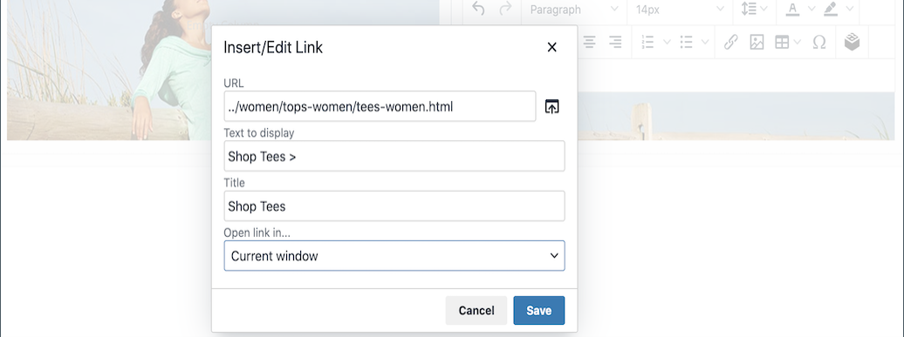

# Elemente - Text

Verwenden Sie den _Text_-Inhaltstyp, um einen Text-Container mit einem WYSIWYG-Editor (“What You See Is What You Get„) in der &quot;[[!DNL Page Builder] &quot; &#x200B;](workspace.md#stage). Darüber hinaus können Sie Links, Bilder, [Variablen](../systems/variables-predefined.md) und Widgets zum Text über die Editor-Symbolleiste hinzufügen.

{width="700"}

{{$include /help/_includes/page-builder-save-timeout.md}}

## Texteditor-Tools

Sie können auf den Texteditor direkt über die Bühne oder über eine Einstellungsseite zugreifen. Direkt am Staging vorgenommene Änderungen werden automatisch gespeichert. Weitere Informationen finden Sie unter [Verwenden des Editors](../content-design/editor.md).

{width="600"}

## Toolbox für Text-Container

{width="600"}

| Tool | Symbol | Beschreibung |
| --------- | --------------------- | -------------- |
| Verschieben | {width="25"} | Verschiebt den Text-Container an eine andere gültige Position auf der Seite. |
| (Bezeichnung) | TEXT | Identifiziert den aktuellen Container als Textelement. |
| Einstellungen | {width="25"} | Öffnet die Eigenschaften des Textcontainers im Bearbeitungsmodus. |
| Ausblenden | {width="25"} | Blendet den Text-Container aus. |
| Anzeigen | {width="25"} | Zeigt den ausgeblendeten Textcontainer an. |
| Duplikat | {width="25"} | Erstellt eine Kopie des Textcontainers. |
| entfernen | {width="25"} | Löscht den Text-Container und seinen Inhalt aus der Phase. |

{style="table-layout:auto"}

{{$include /help/_includes/page-builder-hidden-element-note.md}}

## Text hinzufügen

1. Erweitern Sie im [!DNL Page Builder] Bedienfeld **[!UICONTROL Elements]** und ziehen Sie einen **[!UICONTROL Text]** Platzhalter in eine Zeile, Spalte oder einen Tab, die bzw. der auf dem Bühnenbild festgelegt ist.

   {width="600" zoomable="yes"}

1. Verwenden Sie den Editor, um Text nach Bedarf einzugeben und zu formatieren.

   Weitere Informationen finden Sie unter [Verwenden des Editors](../content-design/editor.md).

   {width="600"}

## Link erstellen

Die Schaltfläche Link einfügen im Editor erleichtert das Hinzufügen eines Hyperlinks zu einem Bild in der Galerie. Sie kann jedoch auch verwendet werden, um einen Inline-Link im Text zu erstellen, wenn Sie die URL im Voraus haben. Im Gegensatz zur Schaltfläche Widget ist die Schaltfläche Link einfügen/bearbeiten nicht mit Seiten, Produkten oder Kategorien im Store integriert.

Informationen zum Erstellen eines Links für eine Telefonnummer oder E-Mail finden Sie unter [Hinzufügen benutzerdefinierter Variablen](../systems/variables-custom.md).

1. Navigieren Sie in der Storefront zu der Seite, die das Ziel des Links sein soll, und kopieren Sie die Link-Informationen.

   Sie können entweder die vollqualifizierte URL oder eine relative URL verwenden, bei der der Verweis auf Ihre Store-Domain weggelassen wird.

   Vollständige URL - `https://mystore.com/women/tops-women/tees-women.html`

   Relative URL - `../women/tops-women/tees-women.html`

1. Wählen Sie den Text im Editor-Bereich aus und klicken Sie auf _Link einfügen/bearbeiten_ (Schaltfläche {width="20"} ) in der Editor-Symbolleiste.

   {width="500" zoomable="yes"}

1. Geben Sie **[!UICONTROL URL]** den relativen Link ein, den Sie vorbereitet haben.

1. Legen Sie **[!UICONTROL Target]** auf `None` fest.

   Bei dieser Einstellung wird die Seite im selben Browser-Fenster geöffnet, anstatt eine neue Registerkarte zu öffnen.

1. Geben Sie **[!UICONTROL Title]** `Shop Tees` ein.

   Das `Title` Link-Attribut wird von einigen Browsern als QuickInfo verwendet.

1. Um den Link zu speichern und zum [!DNL Page Builder] Workspace zurückzukehren, klicken Sie auf **[!UICONTROL OK]**.

   {width="500" zoomable="yes"}

## Einfügen eines Bildes

1. Platzieren Sie den Cursor an der Stelle, an der das Bild eingefügt werden soll.

1. Klicken Sie _der Editor-Symbolleiste auf_ Bild einfügen/bearbeiten{width="20"}Bild einfügen/bearbeiten).

1. Klicken Sie **[!UICONTROL Source]** auf das Suchsymbol, um den Medienspeicher zum Suchen und Auswählen eines Bildes zu verwenden.

1. Geben Sie **[!UICONTROL Image Description]** einen beschreibenden Text für das Bild ein.

   Dieser Text füllt das `alt` Link-Attribut für das Bild und wird von einigen Browsern für die Barrierefreiheit verwendet.

1. Geben Sie die Breite und Höhe **[!UICONTROL Dimensions]** Pixels für das Rendern des Bildes auf der Seite ein.

   Lassen Sie das Kontrollkästchen **[!UICONTROL Constrain proportions]** aktiviert, um das Seitenverhältnis für das Bild automatisch beizubehalten.

1. Um das Bild einzufügen und dann zum [!DNL Page Builder] Arbeitsbereich zurückzukehren, klicken Sie auf **[!UICONTROL OK]**.

## Texteinstellungen ändern

1. Bewegen Sie den Mauszeiger über den Text-Container, um die Toolbox anzuzeigen, und wählen _das Symbol_ Einstellungen{width="20"} ) aus.

   >[!NOTE]
   >
   >Da der Text-Container fest in einem anderen Container verschachtelt ist, stellen Sie sicher, dass Sie die richtige Toolbox haben.

1. Aktualisieren Sie den Inhalt nach Bedarf.

1. Aktualisieren Sie die _[!UICONTROL Advanced]_&#x200B;nach Bedarf.

   - Um die Positionierung des Textes innerhalb des übergeordneten Containers zu steuern, wählen Sie ein **[!UICONTROL Alignment]** aus:

     | Option | Beschreibung |
     | ------ |------------ |
     | `Default` | Wendet die Standardeinstellung für die Ausrichtung an, die im Stylesheet des aktuellen Designs angegeben ist. |
     | `Left` | Richtet die Liste am linken Rand des übergeordneten Containers aus, wobei ein etwaiger Abstand berücksichtigt wird. |
     | `Center` | Richtet die Liste in der Mitte des übergeordneten Containers aus, wobei der angegebene Abstand berücksichtigt wird. |
     | `Right` | Richtet den Block am rechten Rand des übergeordneten Containers aus, wobei alle angegebenen Auffüllungen berücksichtigt werden. |

     {style="table-layout:auto"}

   - Legen Sie den **[!UICONTROL Border]** fest, der auf alle vier Seiten des Text-Containers angewendet wird:

     | Option | Beschreibung |
     | ------ |------------ |
     | `Default` | Wendet die Standardformatvorlage für Rahmen an, die im zugehörigen Stylesheet angegeben ist. |
     | `None` | Zeigt keine sichtbaren Begrenzungen des Containers an. |
     | `Dotted` | Der Container-Rahmen wird als gepunktete Linie angezeigt. |
     | `Dashed` | Der Container-Rahmen wird als gestrichelte Linie angezeigt. |
     | `Solid` | Der Container-Rahmen wird als durchgezogene Linie angezeigt. |
     | `Double` | Der Container-Rahmen wird als doppelte Linie angezeigt. |
     | `Groove` | Der Container-Rahmen wird als gerillte Linie angezeigt. |
     | `Ridge` | Der Container-Rahmen wird als geriffelte Linie angezeigt. |
     | `Inset` | Der Container-Rahmen wird als Einfügelinie angezeigt. |
     | `Outset` | Der Container-Rahmen wird als Ausgangslinie angezeigt. |

     {style="table-layout:auto"}

   - Wenn Sie einen anderen Rahmenstil als `None` festlegen, müssen Sie die Anzeigeoptionen für den Rahmen vervollständigen:

     | Option | Beschreibung |
     | ------ |------------ |
     | [!UICONTROL Border Color] | Geben Sie die Farbe an, indem Sie einen Musterabschnitt auswählen, auf die Farbauswahl klicken oder einen gültigen Farbnamen oder einen entsprechenden Hexadezimalwert eingeben. |
     | [!UICONTROL Border Width] | Geben Sie die Anzahl der Pixel für die Rahmenlinienbreite ein. |
     | [!UICONTROL Border Radius] | Geben Sie die Anzahl der Pixel ein, um die Größe des Radius festzulegen, mit dem jede Ecke des Rahmens gerundet werden soll. |

     {style="table-layout:auto"}

   - (Optional) Geben Sie die Namen der **[!UICONTROL CSS classes]** aus dem aktuellen Stylesheet an, die auf den Container angewendet werden sollen.

     Trennen Sie mehrere Klassennamen durch ein Leerzeichen.

   - Geben Sie Werte in Pixeln für den **[!UICONTROL Margins and Padding]** ein, um die äußeren Ränder und den inneren Abstand des Textcontainers zu bestimmen.

     Geben Sie die entsprechenden Werte in das Diagramm ein.

     | Container-Bereich | Beschreibung |
     | -------------- |------------ |
     | [!UICONTROL Margins] | Die Menge des Leerraums, der auf die Außenkante aller Seiten des Containers angewendet wird. Optionen: `Top` / `Right` / `Bottom` / `Left` |
     | [!UICONTROL Padding] | Die Menge des Leerraums, der auf die Innenkante aller Seiten des Containers angewendet wird. Optionen: `Top` / `Right` / `Bottom` / `Left` |

     {style="table-layout:auto"}

1. Klicken Sie abschließend auf **[!UICONTROL Save]** , um die Einstellungen anzuwenden und zum Arbeitsbereich [!DNL Page Builder] zurückzukehren.

<!-- Last updated from includes: 2023-09-11 14:30:19 -->
