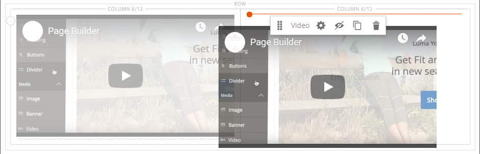

# Medien - Video

Verwenden Sie den Inhaltstyp _Video_ , um ein auf [YouTube][1] oder [Vimeo][2] gehostetes Video zur [[!DNL Page Builder] Bühne](workspace.md#stage) hinzuzufügen. Es ist einfach, Videos in eine Seite oder einen Block oder in Produkt- und Kategoriebeschreibungen einzubetten.

{width="700" zoomable="yes"}

{{$include /help/_includes/page-builder-save-timeout.md}}

## Video-Toolbox

{width="600" zoomable="yes"}

| Tool | Symbol | Beschreibung |
|--- |--- |--- |
| Verschieben | {width="25"} | Verschiebt das Video an eine andere Position auf der Bühne. |
| (Titel) | [!UICONTROL Video] | Identifiziert den aktuellen Inhalts-Container als Video. Bewegen Sie den Mauszeiger über den Bildcontainer, um die Toolbox anzuzeigen. |
| Einstellungen | {width="25"} | Öffnet die Seite &quot;_[!UICONTROL Edit Video]_&quot;, auf der Sie die Eigenschaften des Videos und Containers ändern können. |
| Ausblenden | {width="25"} | Blendet das aktuelle Video aus. |
| Anzeigen | {width="25"} | Zeigt das ausgeblendete Video an. |
| Duplizieren | {width="25"} | Kopiert das Video. |
| Entfernen | {width="25"} | Löscht das Video aus der Bühne. |

{style="table-layout:auto"}

{{$include /help/_includes/page-builder-hidden-element-note.md}}

## Video hinzufügen

1. Bevor Sie beginnen, navigieren Sie zum Video [YouTube][1] oder [Vimeo][2] , das Sie einbetten möchten, und kopieren Sie den Link.

   Alternativ können Sie auch einen direkten Link in eine gültige Videodatei kopieren. Gültige Links finden Sie unter [Grundlegende Videoeinstellungen](#basic-video-settings) .

1. Kehren Sie im [!DNL Commerce] Admin zum Arbeitsbereich [!DNL Page Builder] zurück, in den Sie das Video einfügen möchten.

1. Erweitern Sie im Bedienfeld [!DNL Page Builder] den Wert **[!UICONTROL Media]** und ziehen Sie einen Platzhalter **[!UICONTROL Video]** auf die Bühne.

   {width="600" zoomable="yes"}

1. Bewegen Sie den Mauszeiger über den Video-Container, um die Toolbox anzuzeigen, und wählen Sie das Symbol _Einstellungen_ ( {width="20"} ).

1. Fügen Sie für &quot;**[!UICONTROL Video URL]**&quot;die URL des kopierten Videos ein.

   Die URL des in diesem Beispiel verwendeten [!DNL Page Builder] Videos lautet: `https://www.youtube.com/watch?v=Y0KNS7C5dZA`.

1. Geben Sie die maximale Breite in Pixel ein, um die **[!UICONTROL Maximum Width]** des Videos zu begrenzen.

   Wenn leer, ist das Video so breit wie vom Container erlaubt, sodass Ränder und Abstände möglich sind.

1. Klicken Sie oben rechts auf **[!UICONTROL Save]** , um die Einstellungen anzuwenden und zum Arbeitsbereich [!DNL Page Builder] zurückzukehren.

## Videoeinstellungen ändern

1. Bewegen Sie den Mauszeiger über den Video-Container, um die Toolbox anzuzeigen, und wählen Sie das Symbol _Einstellungen_ ( {width="20"} ).

1. Ändern Sie die Einstellungen in den folgenden Abschnitten:

   - [Allgemein](#basic-video-settings)
   - [Erweitert](#advanced)

1. Klicken Sie oben rechts auf **[!UICONTROL Save]** , um die Einstellungen anzuwenden und zum Arbeitsbereich [!DNL Page Builder] zurückzukehren.

### Grundlegende Videoeinstellungen

1. Um das aktuelle Video zu ändern, aktualisieren Sie die **[!UICONTROL Video URL]**.

   Geben Sie eine gültige Video-URL ein. Gültige Video-URLs können Links zu folgenden Elementen sein:

   - YouTube-Videos: `https://youtu.be/CoDhMRUUjeI`
   - Video-Videos: `https://vimeo.com/190156113`
   - Gültige Videodateien (`.mp4` wird empfohlen): `https://myvideos.com/spiral.mp4`

1. Um die für das Video zulässige Breite in der Storefront zu ändern, geben Sie den neuen Wert &quot;**[!UICONTROL Maximum Width]**&quot;in Pixel ein.

   Wenn das Video leer ist, wird die gesamte Breite des Containers erweitert, wobei Ränder und Abstand weniger berücksichtigt werden.

1. Um das Video nach dem Laden der Seite automatisch zu starten, setzen Sie **[!UICONTROL Autoplay]** auf `Yes`.

   Wenn &quot;Autoplay&quot;auf &quot;`Yes`&quot;festgelegt ist, wird das Video bei der Wiedergabe gemäß der Richtlinie stummgeschaltet. Selbst mit dieser Einstellung können Mobilgeräte Ihre Videos jedoch nicht automatisch abspielen. Weitere Informationen zu diesen Richtlinien finden Sie in den folgenden Entwicklerressourcen:

   - [Autoplay-Richtlinie von Vimeo](https://vimeo.zendesk.com/hc/en-us/articles/115004485728-Autoplaying-and-looping-embedded-videos)
   - [Autoplay-Richtlinie aus Google (Chrome/YouTube)](https://developer.chrome.com/blog/autoplay/)
   - [Autoplay-Richtlinie für lokale Videos](https://developer.mozilla.org/en-US/docs/Web/Media/Autoplay_guide)

   Wenn &quot;Autoplay&quot;auf &quot;`No`&quot;festgelegt ist, wird das Video nur bei Benutzeranforderungen wiedergegeben.

### [!UICONTROL Advanced]

1. Um die horizontale Positionierung des Videos innerhalb des Containers zu steuern, wählen Sie einen **[!UICONTROL Alignment]** aus:

   | Option | Beschreibung |
   | ------ | ----------- |
   | `Default` | Wendet die Standardeinstellung für die Ausrichtung an, die im Stylesheet des aktuellen Designs angegeben ist. |
   | `Left` | Richtet den Inhalt am linken Rand des Video-Containers aus, wobei der angegebene Abstand berücksichtigt wird. |
   | `Center` | Richtet den Inhalt in der Mitte des Video-Containers aus, wobei der angegebene Abstand berücksichtigt wird. |
   | `Right` | Richtet den Inhalt am rechten Rand des Video-Containers aus, wobei der angegebene Abstand berücksichtigt wird. |

   {style="table-layout:auto"}

- Legen Sie den **[!UICONTROL Border]** -Stil fest, der auf alle vier Seiten des Video-Containers angewendet wird:

  | Option | Beschreibung |
  | ------ | ----------- |
  | `Default` | Wendet den standardmäßigen Randstil an, der vom zugehörigen Stylesheet angegeben wird. |
  | `None` | liefert keine sichtbare Anzeige der Containergrenzen. |
  | `Dotted` | Der Container-Rahmen wird als gepunktete Linie angezeigt. |
  | `Dashed` | Der Container-Rahmen wird als gestrichelte Linie angezeigt. |
  | `Solid` | Der Container-Rahmen wird als durchgehende Linie angezeigt. |
  | `Double` | Der Container-Rahmen wird als doppelte Linie angezeigt. |
  | `Groove` | Der Container-Rahmen wird als Rillenlinie angezeigt. |
  | `Ridge` | Der Container-Rahmen wird als gekürzte Linie angezeigt. |
  | `Inset` | Der Container-Rahmen wird als Inset-Zeile angezeigt. |
  | `Outset` | Der Container-Rahmen wird als Ausgangspunkt angezeigt. |

  {style="table-layout:auto"}

- Wenn Sie einen anderen Rahmenstil als `None` festlegen, füllen Sie die Anzeigeoptionen für die Rahmenanzeige aus:

  {width="600" zoomable="yes"}

  | Option | Beschreibung |
  | ------ |------------ |
  | [!UICONTROL Border Color] | Geben Sie die Farbe an, indem Sie ein Muster auswählen, auf die Farbauswahl klicken oder einen gültigen Farbnamen oder einen entsprechenden Hexadezimalwert eingeben. |
  | [!UICONTROL Border Width] | Geben Sie die Anzahl Pixel für die Rahmenlinienbreite an. |
  | [!UICONTROL Border Radius] | Geben Sie die Anzahl der Pixel an, um die die Größe des Radius definiert wird, mit dem die einzelnen Ecken des Rands gerundet werden. |

  {style="table-layout:auto"}

- (Optional) Geben Sie die Namen von **[!UICONTROL CSS classes]** aus dem aktuellen Stylesheet an, das auf den Video-Container angewendet werden soll.

  Trennen Sie mehrere Klassennamen durch ein Leerzeichen.

- Geben Sie Werte in Pixel an, damit der **[!UICONTROL Margins and Padding]** die äußeren Ränder und den inneren Abstand des Video-Containers angibt.

  Geben Sie jeden entsprechenden Wert in das Video-Container-Diagramm ein.

  | Container-Bereich | Beschreibung |
  | -------------- | ----------- |
  | [!UICONTROL Margins] | Die Menge an leerem Raum, die auf den äußeren Rand aller Seiten des Containers angewendet wird. |
  | [!UICONTROL Padding] | Die Menge an leerem Raum, die auf den inneren Rand aller Seiten des Containers angewendet wird. |

  {style="table-layout:auto"}

## Video verschieben

1. Bewegen Sie den Mauszeiger über den Video-Container, um die Toolbox anzuzeigen, und wählen Sie das Symbol _Verschieben_ ( {width="20"} ).

   {width="500" zoomable="yes"}

1. Wählen Sie das Video aus und ziehen Sie es an die neue Position, direkt unterhalb der roten Führungslinie.

   {width="500" zoomable="yes"}

## Entfernen eines Videos aus der Bühne

1. Bewegen Sie den Mauszeiger über den Video-Container, um die Toolbox anzuzeigen, und wählen Sie das Symbol _Entfernen_ ().

1. Klicken Sie bei Aufforderung zur Bestätigung auf **[!UICONTROL OK]**.

[1]: https://www.youtube.com/
[2]: https://vimeo.com/
