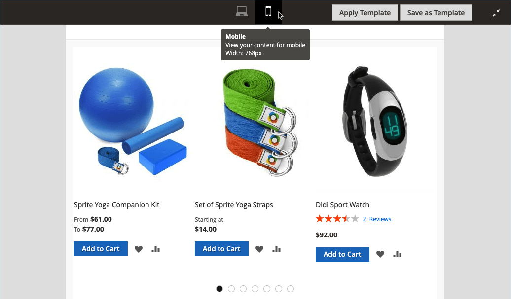

# [!DNL Page Builder] Workspace

Wenn [[!DNL Page Builder] aktiviert ist](setup.md), werden der Abschnitt _[!UICONTROL Content]_und der Inhaltserstellungsprozess geändert, um die erweiterten [!DNL Page Builder]-Tools für CMS [pages](../content-design/page-add.md), [product](../catalog/product-content.md) und [category](../catalog/categories-content-settings.md) Seiten, [blocks](../content-design/block-add.md) und [dynamische Blöcke](../content-design/dynamic-blocks.md) zu nutzen. Dieser Abschnitt enthält ein Feld für die_ Inhaltsüberschrift _, eine Vorschau des Inhalts und einen einfachen Zugriff auf den Arbeitsbereich für den Vollbildmodus [!DNL Page Builder].

![Inhaltsabschnitt mit [!DNL Page Builder] Vorschau](./assets/pb-content-preview.png){width="700" zoomable="yes"}

## Inhaltsüberschrift

Da Suchmaschinen nach Überschriften der Stufe 1 (H1) suchen, ist das Hinzufügen einer Überschrift der Stufe 1 eine einfache Möglichkeit, sicherzustellen, dass die Seite korrekt indiziert ist.

>[!NOTE]
>
>Das Feld _[!UICONTROL Content Heading]_, das oben auf der Seite angezeigt wird, ist ein Legacy-Feld, das Inhalte unterstützt, die mit früheren [!DNL Commerce]-Versionen erstellt wurden. Sie ist jedoch nicht Teil von [!DNL Page Builder]. Der [!UICONTROL Content Heading] wird entsprechend dem Stylesheet, das dem aktuellen Design zugeordnet ist, als H1-Überschrift formatiert. Er befindet sich direkt über dem aktiven Inhaltsbereich, der durch die [!DNL Page Builder] -Phase definiert wird.

Damit Sie die Positionierung und das Format von Überschriften aller Ebenen optimal steuern können, sollten Sie das Feld _[!UICONTROL Content Heading]_leer lassen und den Inhaltstyp [!DNL Page Builder] [Überschrift](heading.md) verwenden.

{width="700" zoomable="yes"}

## Vorschau

Wenn Sie den Abschnitt _[!UICONTROL Content]_erweitern und bereits vorhandener Inhalt mit [!DNL Page Builder] erstellt wurde, wird eine Vorschau des Inhalts so angezeigt, wie er auf einer Seite angezeigt würde. Klicken Sie auf &quot;**[!UICONTROL Edit with Page Builder]**&quot;oder in der Inhaltsvorschau, um den Arbeitsbereich &quot;[!DNL Page Builder]&quot;zu öffnen, wo Sie erforderliche Aktualisierungen vornehmen können.

{width="500" zoomable="yes"}

>[!NOTE]
>
>Für Produkt- und Kategorieformulare ist diese Inhaltsvorschau standardmäßig aktiviert, kann jedoch deaktiviert werden. Wenn die Leistung durch das Laden der Vorschau beeinträchtigt wird, können Sie die Vorschau in den Einstellungen für die [Konfiguration des Content Managements](../configuration-reference/general/content-management.md#advanced-content-tools) deaktivieren.

## Staging

Wenn Sie den Arbeitsbereich &quot;[!DNL Page Builder]&quot;über die Vorschau öffnen, ist die Bühne der primäre Arbeitsbereich, in dem Sie Inhalte erstellen und formatieren und sogar schnelle Bearbeitungen an Live-Inhalten vornehmen können. Die Bühne ist anfangs leer, da die Entwurfsoberfläche zur Verfügung steht, über die Sie Zeilen, Spalten und Registerkarten aus dem linken Bereich ziehen können.

>[!NOTE]
>
>Ab Version 2.4.1 ist die Inhaltsbearbeitung jetzt nur noch für alle Bereiche im Vollbildmodus, die von [!DNL Page Builder] gesteuert werden - CMS-Seiten, Produkt- und Kategorieseiten, Blöcke und dynamische Blöcke. Die Bearbeitung im Vollbildmodus konzentriert sich auf Ihren Inhalt und bietet eine Ansicht, die dem Benutzererlebnis auf der Storefront besser entspricht.

{width="600" zoomable="yes"}

{{$include /help/_includes/page-builder-save-timeout.md}}

## Viewports

Ein _Viewport_ ist der sichtbare Bereich einer Webseite, den ein Benutzer sieht. Im Designmodus für den Vollbildmodus werden die Viewport-Schaltflächen oberhalb der [!DNL Page Builder]-Bühne angezeigt, um Ihnen den Inhalt anzuzeigen, sobald der Site-Benutzer ihn auf der Storefront sieht.

{width="500" zoomable="yes"}

[!DNL Page Builder] definiert auch Haltepunkte für Viewports. Breakpoints definieren Mindest- und Höchstbreiten, innerhalb derer bestimmte Stile angewendet werden. Die [!DNL Page Builder] Viewports bieten die folgenden Inhaltshaltepunkte:

- **Desktop-Breakpoint**—`min-width: 1024px`. Dieser Breakpoint wendet Stile an, die für Darstellungsfeldbreiten mit einer Größe von 1024 Pixel und mehr definiert sind.
- **Mobile Haltepunkte**—`max-width: 768px, min-width: 640px`. Diese Haltepunkte wenden Stile an, die für Darstellungsfeldbreiten zwischen 768 Pixel und 640 Pixel definiert sind.

[!DNL Page Builder] Viewports bieten zwei Funktionen: **_Inhaltsvorschau_** und **_Breakpoint-Einstellungen_**.

### Inhaltsvorschau

Standardmäßig bietet [!DNL Page Builder] zwei Viewport-Vorschauen:

- **Desktop** - Zeigt die Inhaltsvorschau ohne vordefinierte Breite an. Desktop-definierte Stile (mit einer Breakpoint-Mindestbreite von 1024 Pixel) werden weiterhin auf die Seite angewendet. Die Breite des Desktop-Viewports wird jedoch durch Einstellungen für Container-Inhaltstypen wie Zeilen definiert. Wenn Sie den Desktop-Viewport auswählen, wird angezeigt, wie der Inhalt auf der Storefront formatiert wird, wenn die Browser-Seitenbreite 1024 Pixel und mehr beträgt.

  {width="500" zoomable="yes"}

- **Mobil** - Zeigt die Inhaltsvorschau mit einer vordefinierten Breite von 768 Pixel an. Im Gegensatz zum Desktop-Viewport zeigt der mobile Viewport Ihren Seiteninhalt mit einer Breite von 768 Pixel zusammen mit den Stilen an, die für die Breakpoint-Breiten von 768 Pixel (Maximum) und 640 Pixel (Minimum) definiert sind.

  {width="500" zoomable="yes"}

### Breakpoint-Einstellungen

Die Viewport-Schaltflächen bieten außerdem die Möglichkeit, verschiedene Breakpoint-Stile auf Inhaltstypen anzuwenden, die auf dem ausgewählten Viewport basieren. Standardmäßig bietet [!DNL Page Builder] Breakpoint-Einstellungen für die _[!UICONTROL Minimum Height]_-Felder von Zeilen, Spalten, Registerkarten, Registerkartenelementen, Bannern, Reglern und Folien. Wenn Sie den mobilen Viewport auswählen und dann den Editor für einen dieser Inhaltstypen öffnen, können Sie Feldwerte eingeben, die für die Mobile Viewport-Haltepunkte spezifisch sind. Inhaltsfelder, die bestimmte Breakpoint-Einstellungen ermöglichen, zeigen ein Symbol rechts neben dem Feld an, ähnlich wie im folgenden Beispiel für eine Zeile:

{width="400"}

## Bedienfeld

Das Bedienfeld &quot;[!DNL Page Builder]&quot; befindet sich links neben der Bühne und enthält Inhaltstypen, die in die Bühne gezogen werden können. Ein Container, der für den Inhaltstyp spezifisch ist, wird dann mit einer Toolbox mit Optionen angezeigt. Inhaltstypen sind im Bereich wie folgt organisiert:

### Layout

Der Abschnitt &quot;_[!UICONTROL Layout]_&quot;im Bedienfeld &quot;[!DNL Page Builder]&quot;wird verwendet, um der Bühne Zeilen, Spalten oder Registerkarten hinzuzufügen. Wenn Sie einen Inhaltstyp aus dem Bedienfeld auf die Bühne ziehen, wird ein Container mit einer Toolbox von Optionen angezeigt, die für den Inhaltstyp spezifisch sind.

Standardmäßig ist die [!DNL Page Builder] -Phase leer. Wenn Sie Layout-Inhaltstypen aus dem Bedienfeld auf die Bühne ziehen, können Sie sie über, unter oder in andere Layout-Container auf der Seite platzieren. Zeilen können nur direkt zur Bühne hinzugefügt werden.

![[!DNL Page Builder] Bedienfeld mit Layout-Inhaltstypen und Bühne](./assets/pb-stage-toolbox.png){width="600" zoomable="yes"}

| Layout-Inhaltstyp | Beschreibung |
| ------------------- |------------ |
| [Zeile](row.md) | Eine neue Zeile kann nur vom Bedienfeld auf die Bühne gezogen und entweder über oder unter einer anderen Zeile, Registerkarte oder Spaltengruppe positioniert werden. Sie können auch die Option Duplizieren verwenden, um eine Kopie einer vorhandenen Zeile zu erstellen. |
| [Column](column.md) | Eine Spalte kann vom Bedienfeld in die Bühne oder in Zeilen und Registerkarten gezogen werden. Die maximale Anzahl der Spalten, die hinzugefügt werden können, wird durch die Anzahl der Rasterdivisionen bestimmt, die in der [Konfiguration](setup.md) angegeben sind. |
| [Registerkarten](tabs.md) | Eine einzelne Registerkarte kann vom Bedienfeld in die Bühne oder in Zeilen und Spalten gezogen werden. Zusätzliche Registerkarten können über die Toolbox hinzugefügt werden. |

{style="table-layout:auto"}

### Elemente

Verwenden Sie den Abschnitt &quot;_[!UICONTROL Elements]_&quot;des Bereichs &quot;[!DNL Page Builder]&quot;, um Text, Überschriften, Schaltflächen, Trennlinien und HTML-Code zu einem Layout-Container auf der [[!DNL Page Builder] Bühne](workspace.md#stage) hinzuzufügen. Wenn Sie einen Inhaltstyp aus dem Bedienfeld in eine Zeile oder Spalte oder in eine auf der Bühne festgelegte Registerkarte ziehen, wird ein Container angezeigt. Verwenden Sie die Inhaltstyp-Toolbox, um auf die für den Typ spezifischen Einstellungen zuzugreifen.

![[!DNL Page Builder] Bedienfeld mit Elementinhaltstypen](./assets/pb-elements.png){width="600" zoomable="yes"}

| Elementinhaltstyp | Beschreibung |
| -------------------- | ----------- |
| [Text](text.md) | Fügt einen Textcontainer und Editor zur Bühne hinzu. |
| [Überschrift](heading.md) | Fügt der Bühne einen Überschriftencontainer hinzu. |
| [Schaltflächen](buttons.md) | Fügt einen Container für eine einzelne Schaltfläche oder einen Satz von Schaltflächen zur Bühne hinzu. |
| [Divider](divider.md) | Fügt der Bühne einen Container für einen Divider hinzu. |
| [HTML-Code](html-code.md) | Fügt der Bühne einen Container für HTML-Code hinzu. |

{style="table-layout:auto"}

### Medien

Verwenden Sie den Abschnitt &quot;_[!UICONTROL Media]_&quot;des Bereichs &quot;[!DNL Page Builder]&quot;, um Bilder, Videos, Banner, Schieberegler und [!DNL Google Maps] zu jedem Layout-Container auf der [[!DNL Page Builder] Bühne](workspace.md#stage) hinzuzufügen. Wenn ein Medien-Content-Typ aus dem Bedienfeld auf die Bühne gezogen wird, wird ein Container mit einer Toolbox von Optionen angezeigt, die für den Inhaltstyp spezifisch sind.

![[!DNL Page Builder] Bedienfeld mit Medientypen](./assets/pb-media-content-types.png){width="600" zoomable="yes"}

| Medien-Content-Typ | Beschreibung |
| ------------------- | ------------------------------------------ |
| [Bild](image.md) | Fügt der Bühne einen Bild-Container hinzu. |
| [Video](video.md) | Fügt einen Video-Container zur Bühne hinzu. |
| [Banner](banner.md) | Fügt der Bühne einen Banner-Container hinzu. |
| [Regler](slider.md) | Fügt der Bühne einen Regler-Container hinzu. |
| [Karte](map.md) | Fügt der Bühne einen [!DNL Google Maps] -Container hinzu. |

{style="table-layout:auto"}

### Inhalt hinzufügen

Verwenden Sie den Abschnitt _[!UICONTROL Add Content]_des Bereichs [!DNL Page Builder] , um vorhandenen Inhalt zur [[!DNL Page Builder] Bühne](workspace.md#stage) hinzuzufügen. Wenn Sie einen Medientyp aus dem Bedienfeld auf die Bühne ziehen, wird ein Container angezeigt. Verwenden Sie die Inhaltstyp-Toolbox, um auf die für den Typ spezifischen_ Einstellungen _zuzugreifen.

Bedienfeld ![[!DNL Page Builder] mit Typ &quot;Inhalt hinzufügen&quot;](./assets/pb-add-content.png){width="600" zoomable="yes"}

| Inhaltstyp | Beschreibung |
| ---------------------------------------------------------------- | -------------------------------------------- |
| [Block](block.md) | Fügt einen vorhandenen Block zur Bühne hinzu. |
| [Dynamischer Block](dynamic-block.md) | Fügt einen vorhandenen dynamischen Block zur Bühne hinzu. |
| [Produkte](products.md) | Fügt der Bühne eine Liste von Produkten hinzu. |
|  [Produkt-Recommendations](recommendations.md) | Fügt der Bühne eine Empfehlungseinheit hinzu. |

{style="table-layout:auto"}

## Toolbox

Jeder Inhaltscontainer auf der Bühne verfügt über eine Toolbox mit Optionen. Die Optionen variieren je nach Inhaltstyp, umfassen jedoch in der Regel Verschieben, Einstellungen, Ausblenden/Anzeigen, Duplizieren und Entfernen.

### Werkzeugkasten anzeigen

Bewegen Sie den Mauszeiger über den Container, um die Toolbox anzuzeigen und eine Option auszuwählen.

{width="600" zoomable="yes"}

### Toolbox-Optionen

| Option | Symbol | Beschreibung |
| --------- | ---------------------------------------- | ------------ |
| Verschieben | {width="25"} | Verschiebt den aktuellen Inhalts-Container an eine andere Position auf der Bühne. |
| Hinzufügen | {width="25"} | Fügt untergeordnete Elemente wie eine Schaltfläche, Folie oder Registerkarte hinzu. |
| (Titel) |           | Gibt den Container-Inhaltstyp an. |
| Einstellungen | {width="25"} | Öffnet die Eigenschaften des Inhaltscontainers im Bearbeitungsmodus. |
| Ausblenden | {width="25"} | Blendet den aktuellen Inhaltscontainer aus. |
| Anzeigen | {width="25"} | Zeigt den aktuellen Inhaltscontainer an. |
| Duplizieren | {width="25"} | Kopiert den aktuellen Inhalts-Container. |
| Entfernen | {width="25"} | Löscht den aktuellen Inhalts-Container aus der Bühne. |

{style="table-layout:auto"}

{{$include /help/_includes/page-builder-hidden-element-note.md}}
