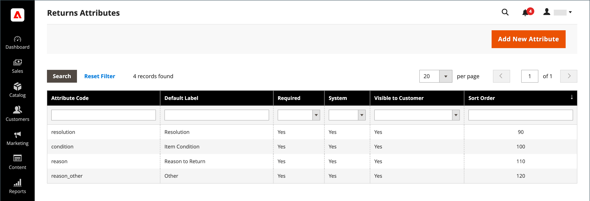
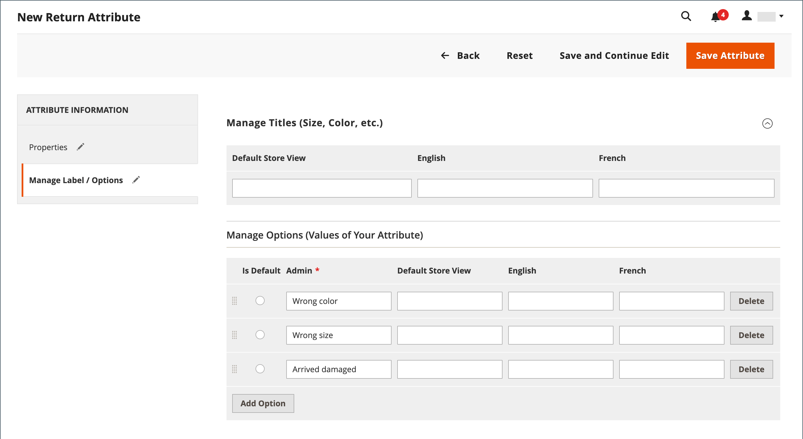

# Gibt das Attribut zurück

{{ee-feature}}

Die Rückgabeattribute werden verwendet, um Informationen zu speichern, die während des Rückgabevorgangs des Produkts benötigt werden. Zu den Standardattributen gehören die Bedingung des zurückgegebenen Produkts, der Grund für die Rückgabe und ein Feld, das angibt, wie die Rückgabe aufgelöst wurde. Der Prozess zum Erstellen eines Rückgabeattributs ähnelt dem Erstellen eines [Kundenattributs](../customers/attribute-properties.md).

{width="700" zoomable="yes"}

## Erstellen eines Rückgabeattributs

1. Navigieren Sie in _Admin_-Seitenleiste zu **[!UICONTROL Stores]** > _[!UICONTROL Attributes]_>**[!UICONTROL Returns]**.

1. Klicken Sie oben rechts auf **[!UICONTROL Add New Attribute]**.

   {width="600" zoomable="yes"}

### Definieren der Eigenschaften

1. Um das Attribut während der Dateneingabe zu identifizieren, legen Sie die **[!UICONTROL Default Label]** fest.

1. Geben Sie **[!UICONTROL Attribute Code]** einen Code ein, der das Attribut innerhalb des Systems identifiziert.

1. Um den Typ des Eingabedialogs zu bestimmen, der für die Dateneingabe verwendet wird, legen Sie **[!UICONTROL Input Type]** auf einen der folgenden Werte fest:

   - `Text Field`
   - `Text Area`
   - `Dropdown`
   - `Yes/No`
   - `File`
   - `Image File`

1. Um das Feld zu einem erforderlichen Element zu machen, setzen Sie **[!UICONTROL Values Required]** auf `Yes`.

1. Um dem Feld einen Anfangswert zuzuweisen, geben Sie einen **[!UICONTROL Default Value]** ein.

1. Legen Sie **[!UICONTROL Input Validation]** auf eine der folgenden Einstellungen fest, um die Genauigkeit der in das Feld eingegebenen Daten vor dem Speichern des Datensatzes zu überprüfen:

   - `None`
   - `Alphanumeric`
   - `Alphanumeric with Space`
   - `Numeric Only`
   - `Alpha Only`
   - `URL`
   - `Email`

1. Geben Sie für die Eingabetypen `Text Field` und `Text Area` den **[!UICONTROL Minimum Text Length]** und die **[!UICONTROL Maximum Text Length]** ein.

1. Um einen Vorverarbeitungsfilter anzuwenden, legen Sie **[!UICONTROL Input/Output Filter]** auf einen der folgenden Werte fest:

   - `None`
   - `Strip HTML Tags`
   - `Escape  HTML Entities`

1. Um das Attribut für Kunden sichtbar zu machen, legen Sie im Abschnitt _[!UICONTROL Storefront Properties]_&#x200B;den Wert **[!UICONTROL Show on Storefront]**&#x200B;auf `Yes` fest.

1. (Optional) Geben Sie **[!UICONTROL Sort Order]** eine Zahl ein, um zu bestimmen, wo dieses Attribut relativ zu den anderen im selben Teil der Seite angezeigt wird. (`0` = First, `1` = Second, `2` = Third usw.)

### Titel/Optionen verwalten

1. Wählen Sie im linken Bedienfeld **[!UICONTROL Manage Labels/Options]** aus.

1. Geben Sie im Abschnitt **[!UICONTROL Manage Titles (Size, Color, etc.)]** den Titel für jede Shop-Ansicht ein.

   {width="600" zoomable="yes"}

1. Wenn der **[!UICONTROL Input Type]** für das Attribut `Dropdown` ist, verwalten Sie die Optionen im Abschnitt **[!UICONTROL Manage Options (Values of Your Attribute)]** .

   - Um eine Option hinzuzufügen, klicken Sie auf **[!UICONTROL Add Option]** und geben Sie den Titel für „Admin“ und jede Shop-Ansicht ein.
   - Um eine Option als Standard festzulegen, wählen Sie **[!UICONTROL Is Default]**.
   - Um eine Option zu entfernen, klicken Sie auf **[!UICONTROL Delete]**.

1. Um Änderungen zu speichern, klicken Sie auf **[!UICONTROL Save Attribute]**.
