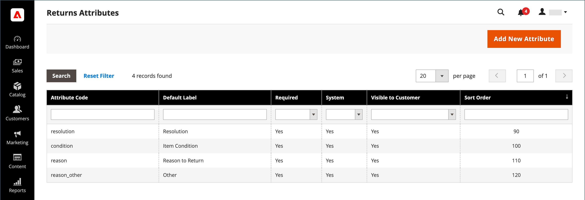
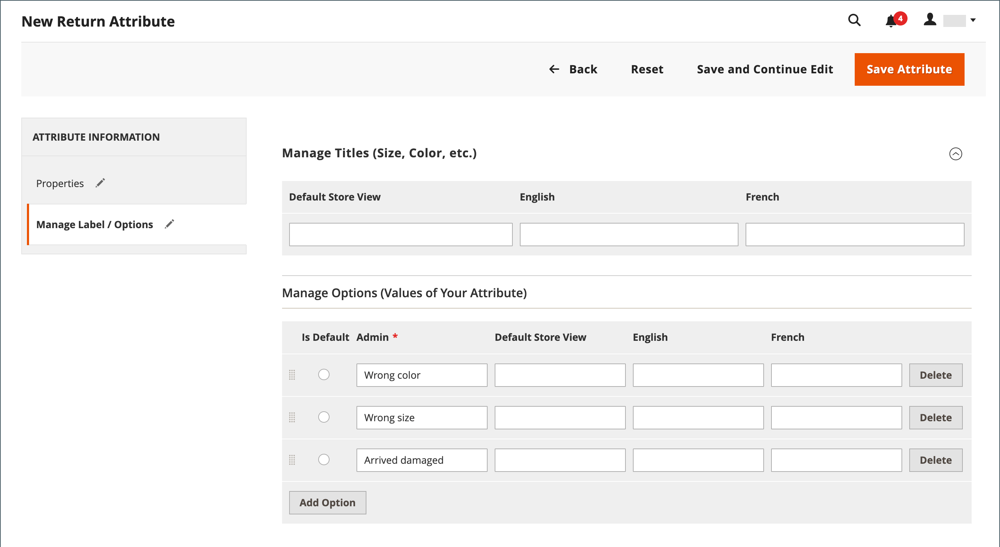

# Gibt das Attribut zurück

{{ee-feature}}

Die Rückgabeattribute werden verwendet, um Informationen zu speichern, die während des Rückgabevorgangs des Produkts benötigt werden. Zu den Standardattributen gehören die Bedingung des zurückgegebenen Produkts, der Grund für die Rückgabe und ein Feld, das angibt, wie die Rückgabe aufgelöst wurde. Der Prozess zum Erstellen eines Rückgabeattributs ähnelt dem Erstellen einer [Kundenattribut](../customers/attribute-properties.md).

{width="700" zoomable="yes"}

## Rückgabeattribut erstellen

1. Im _Admin_ Seitenleiste, navigieren Sie zu **[!UICONTROL Stores]** > _[!UICONTROL Attributes]_>**[!UICONTROL Returns]**.

1. Klicken Sie oben rechts auf **[!UICONTROL Add New Attribute]**.

   {width="600" zoomable="yes"}

### Eigenschaften definieren

1. Um das Attribut während der Dateneingabe zu identifizieren, legen Sie die **[!UICONTROL Default Label]**.

1. Für **[!UICONTROL Attribute Code]** eingeben, geben Sie einen Code ein, der das Attribut im System identifiziert.

1. Um den Typ des Eingabeditors zu bestimmen, der für die Dateneingabe verwendet wird, legen Sie **[!UICONTROL Input Type]** auf einen der folgenden Werte zu:

   - `Text Field`
   - `Text Area`
   - `Dropdown`
   - `Yes/No`
   - `File`
   - `Image File`

1. Um das Feld zu einem erforderlichen Element zu machen, legen Sie **[!UICONTROL Values Required]** nach `Yes`.

1. Um dem Feld einen Anfangswert zuzuweisen, geben Sie einen **[!UICONTROL Default Value]**.

1. Um die in das Feld eingegebenen Daten auf Genauigkeit zu überprüfen, bevor der Datensatz gespeichert wird, legen Sie **[!UICONTROL Input Validation]** auf einen der folgenden Werte zu:

   - `None`
   - `Alphanumeric`
   - `Alphanumeric with Space`
   - `Numeric Only`
   - `Alpha Only`
   - `URL`
   - `Email`

1. Für `Text Field` und `Text Area` Eingabetypen, geben Sie die **[!UICONTROL Minimum Text Length]** und **[!UICONTROL Maximum Text Length]**.

1. Um einen Vorverarbeitungsfilter anzuwenden, legen Sie **[!UICONTROL Input/Output Filter]** auf einen der folgenden Werte zu:

   - `None`
   - `Strip HTML Tags`
   - `Escape  HTML Entities`

1. Um das Attribut für Kunden sichtbar zu machen, legen Sie **[!UICONTROL Show on Storefront]** nach `Yes` im _[!UICONTROL Storefront Properties]_Abschnitt.

1. (Optional) Für **[!UICONTROL Sort Order]** geben Sie eine Zahl ein, um zu bestimmen, wo dieses Attribut relativ zu den anderen im selben Teil der Seite angezeigt wird. (`0` = first, `1` = Sekunde, `2` = drittes Element usw.)

### Verwalten der Bezeichnungen/Optionen

1. Wählen Sie im linken Bereich die Option **[!UICONTROL Manage Labels/Options]**.

1. Im **[!UICONTROL Manage Titles (Size, Color, etc.)]** geben Sie den Titel für jede Store-Ansicht ein.

   {width="600" zoomable="yes"}

1. Wenn die Variable **[!UICONTROL Input Type]** für das Attribut `Dropdown`verwalten Sie die Optionen in der **[!UICONTROL Manage Options (Values of Your Attribute)]** Abschnitt.

   - Um eine Option hinzuzufügen, klicken Sie auf **[!UICONTROL Add Option]** und geben Sie den Titel für Admin und jede Store-Ansicht ein.
   - Um eine Option als Standard festzulegen, wählen Sie **[!UICONTROL Is Default]**.
   - Klicken Sie zum Entfernen einer Option auf **[!UICONTROL Delete]**.

1. Klicken Sie zum Speichern der Änderungen auf **[!UICONTROL Save Attribute]**.
