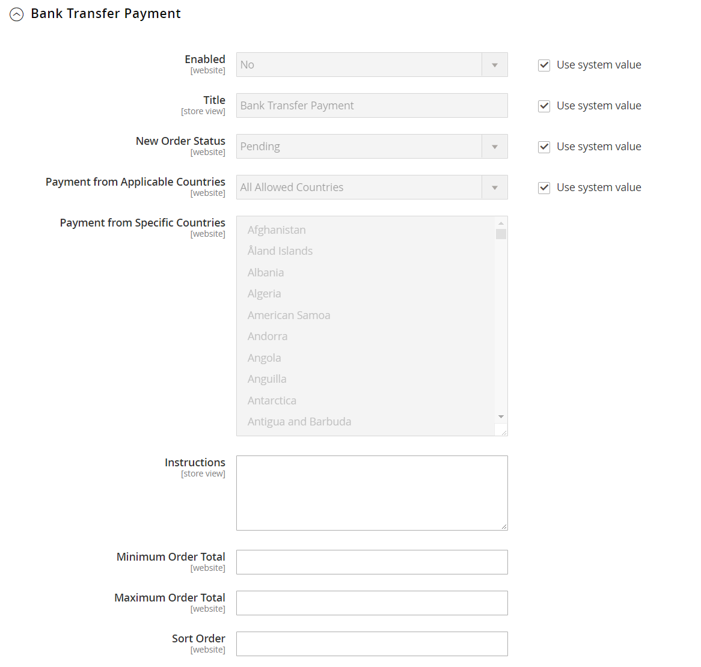

# Banküberweisungen

Adobe Commerce und Magento Open Source ermöglichen es Ihnen, Zahlungen zu akzeptieren, die von einem Bankkonto eines Kunden überwiesen und auf Ihr Händlerkonto eingezahlt werden.

**_So konfigurieren Sie Banküberweisungen:_**

1. Navigieren Sie in _Admin_-Seitenleiste zu **[!UICONTROL Stores]** > _[!UICONTROL Settings]_>**[!UICONTROL Configuration]**.

1. Erweitern Sie im linken Bereich **[!UICONTROL Sales]** und wählen Sie **[!UICONTROL Payment Methods]**.

1. Erweitern _unter „Andere_&quot; den  im **[!UICONTROL Bank Transfer Payment]**.

   {width="600" zoomable="yes"}

   >[!NOTE]
   >
   >Deaktivieren Sie bei Bedarf zunächst das Kontrollkästchen **[!UICONTROL Use system value]** , um diese Einstellungen zu ändern.

1. Um Banküberweisungen zu aktivieren, setzen Sie **[!UICONTROL Enabled]** auf `Yes`.

1. Geben Sie **[!UICONTROL Title]** einen Titel ein, der die Zahlungsmethode der Banküberweisung während des Checkouts angibt.

1. Setzen Sie **[!UICONTROL New Order Status]** auf `Pending`, bis die Zahlung autorisiert ist.

1. Legen Sie **[!UICONTROL Payment from Applicable Countries]** auf eine der folgenden Einstellungen fest:

   - `All Allowed Countries` - Kunden aus allen [Ländern](../getting-started/store-details.md#country-options) die in Ihrer Store-Konfiguration angegeben sind, können diese Zahlungsmethode verwenden.

   - `Specific Countries` - Nachdem Sie diese Option ausgewählt haben, wird die _[!UICONTROL Payment from Specific Countries]_&#x200B;angezeigt. Zur Auswahl mehrerer Länder halten Sie die Strg-Taste (PC) bzw. die Befehlstaste (Mac) gedrückt und klicken auf die einzelnen Optionen.

1. Geben Sie die **[!UICONTROL Instructions]** ein, die Ihre Kunden befolgen müssen, um eine Banküberweisung einzurichten.

   Je nach Land, in dem sich Ihre Bank befindet, und den Anforderungen der Bank können Sie die folgenden Informationen einschließen:

   - Name des Bankkontos
   - Bankkontonummer
   - Bankleitzahl
   - Name der Bank
   - Bankadresse

1. Legen Sie **[!UICONTROL Minimum Order Total]** und **[!UICONTROL Maximum Order Total]** auf die Beträge fest, die für die Verwendung dieser Zahlungsmethode erforderlich sind.

   >[!NOTE]
   >
   >Eine Bestellung ist dann geeignet, wenn die Summe zwischen den minimalen oder maximalen Gesamtwerten liegt oder genau mit diesen übereinstimmt.

1. Geben Sie **[!UICONTROL Sort Order]** eine Zahl ein, die die Position dieses Artikels in der Liste der Zahlungsmethoden bestimmt, die beim Checkout angezeigt wird.

   Diese Zahl steht im Verhältnis zu den anderen Zahlungsmethoden. (`0` = First, `1` = Second, `2` = Third usw.)

1. Klicken Sie abschließend auf **[!UICONTROL Save Config]**.
