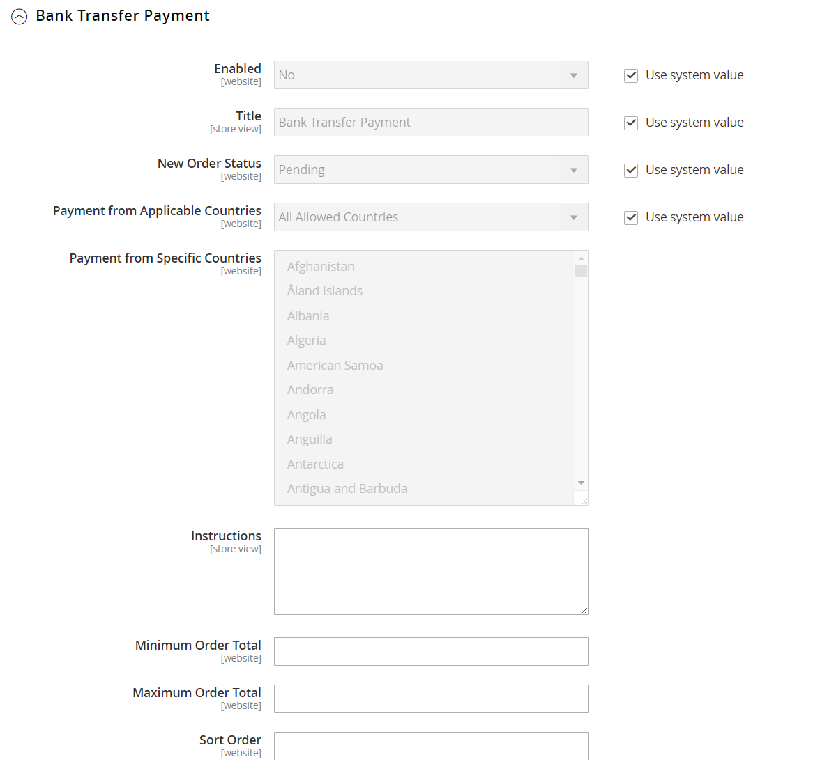

# Banküberweisungen

Mit Adobe Commerce und Magento Open Source können Sie Zahlungen akzeptieren, die von einem Kundenkonto überwiesen und auf Ihrem Händlerkonto eingezahlt werden.

**_So konfigurieren Sie Banküberweisungen:_**

1. Im _Admin_ Seitenleiste, navigieren Sie zu **[!UICONTROL Stores]** > _[!UICONTROL Settings]_>**[!UICONTROL Configuration]**.

1. Erweitern Sie im linken Bereich **[!UICONTROL Sales]** und wählen **[!UICONTROL Payment Methods]**.

1. under _Andere Zahlungsmethoden_, erweitern  die **[!UICONTROL Bank Transfer Payment]** Abschnitt.

   {width="600" zoomable="yes"}

   >[!NOTE]
   >
   >Bei Bedarf muss zunächst die **[!UICONTROL Use system value]** aktivieren, um diese Einstellungen zu ändern.

1. Um Banküberweisungen zu aktivieren, legen Sie **[!UICONTROL Enabled]** nach `Yes`.

1. Für **[!UICONTROL Title]**, geben Sie einen Titel ein, der die Zahlungsmethode der Banküberweisung beim Checkout angibt.

1. Satz **[!UICONTROL New Order Status]** nach `Pending` bis die Zahlung genehmigt ist.

1. Satz **[!UICONTROL Payment from Applicable Countries]** auf einen der folgenden Werte zu:

   - `All Allowed Countries` - Kunden von allen [Länder](../getting-started/store-details.md#country-options) Diese Zahlungsmethode kann in Ihrer Store-Konfiguration verwendet werden.

   - `Specific Countries` - Wenn Sie diese Option ausgewählt haben, wird die _[!UICONTROL Payment from Specific Countries]_angezeigt. Um mehrere Länder auszuwählen, halten Sie die Strg-Taste (PC) oder die Befehlstaste (Mac) gedrückt und klicken Sie auf jede Option.

1. Geben Sie die **[!UICONTROL Instructions]** dass Ihre Kunden folgen müssen, um eine Banküberweisung einzurichten.

   Je nach dem Land, in dem Ihre Bank ansässig ist, und den Anforderungen der Bank können Sie die folgenden Informationen angeben:

   - Name des Bankkontos
   - Kontonummer
   - Bank-Routing-Code
   - Name der Bank
   - Zweigstelle

1. Satz **[!UICONTROL Minimum Order Total]** und **[!UICONTROL Maximum Order Total]** auf die Beträge, die für die Verwendung dieser Zahlungsmethode erforderlich sind.

   >[!NOTE]
   >
   >Eine Bestellung qualifiziert sich, wenn der Gesamtwert zwischen den minimalen oder maximalen Gesamtwerten liegt oder genau damit übereinstimmt.

1. Für **[!UICONTROL Sort Order]** eingeben, geben Sie eine Zahl ein, die die Position dieses Elements in der Liste der Zahlungsmethoden bestimmt, die beim Checkout angezeigt werden.

   Diese Zahl ist relativ zu den anderen Zahlungsmethoden. (`0` = first, `1` = Sekunde, `2` = drittes Element usw.)

1. Wenn Sie fertig sind, klicken Sie auf **[!UICONTROL Save Config]**.
