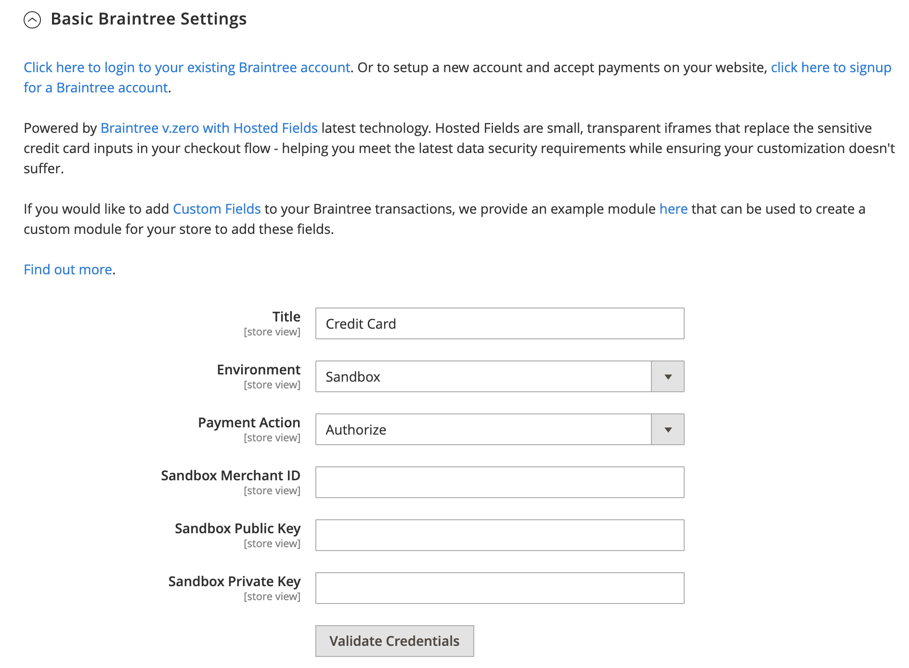

# Braintree

Braintree bietet ein vollständig anpassbares Checkout-Erlebnis mit Betrugserkennung und PayPal-Integration. Es unterstützt [!DNL Apple Pay], [!DNL Google Pay], ACH, Venmo und lokale Zahlungsmethoden. Braintree reduziert den Aufwand für die PCI-Compliance für Händler, da die Transaktion auf dem Braintree-System stattfindet. Die Braintree Payments-Integration wird von [GENE Commerce](https://www.gene.co.uk/gene-braintree-payments/) entwickelt.

>[!NOTE]
>
>Wenn Sie ein Upgrade auf 2.4.x von einer früheren Version von Adobe Commerce durchführen oder Magento Open Source mit der installierten Braintree-Erweiterung von Commerce Marketplace durchführen, lesen Sie die [2.4](#24-upgrade-notes)Aktualisierungshinweise am Ende dieser Seite.

## Schritt 1: Braintree-Anmeldedaten abrufen

Wechseln Sie zu [Braintree Payments][1] und melden Sie sich für ein Konto an.

## Schritt 2: Abschließen der Grundeinstellungen

1. Navigieren Sie in _Admin_-Seitenleiste zu **[!UICONTROL Stores]** > _[!UICONTROL Settings]_>**[!UICONTROL Configuration]**.

1. Erweitern Sie im linken Bereich **[!UICONTROL Sales]** und wählen Sie **[!UICONTROL Payment Methods]**.

   - Wenn Ihre Commerce-Installation über mehrere Websites, Stores oder Ansichten verfügt, wählen Sie oben links die **[!UICONTROL Store View]** aus, für die die Konfiguration gilt.

   - Stellen Sie im Abschnitt _[!UICONTROL Merchant Location]_sicher, dass **[!UICONTROL Merchant Country]**auf den Standort Ihres Unternehmens eingestellt ist.

1. Klicken Sie unter _[!UICONTROL Recommended Solutions]_im Abschnitt_[!UICONTROL Braintree Payments] ([GENE Commerce](https://www.gene.co.uk/gene-braintree-payments/) v4.6.1 - [Versionshinweise](https://support.gene.co.uk/support/solutions/articles/35000228529)_auf **[!UICONTROL Configure]**.

   {width="600" zoomable="yes"}

1. Geben Sie **[!UICONTROL Title]** einen Titel ein, der das Braintree als Zahlungsoption beim Checkout kennzeichnet.

1. Aktuellen **[!UICONTROL Environment]** für Braintree-Transaktionen auf `Sandbox` oder `Production` einstellen

   Verwenden Sie beim Testen der Konfiguration in einer Sandbox nur [Kreditkartennummern][2] die vom Braintree empfohlen werden. Wenn Sie bereit sind, mit Braintree zur Produktion zu wechseln, legen Sie **[!UICONTROL Environment]** auf `Production` fest.

   {width="600" zoomable="yes"}

1. Legen Sie **[!UICONTROL Payment Action]** auf eine der folgenden Einstellungen fest:

   - `Authorize Only` - Genehmigt den Kauf und legt die Mittel fest. Der Betrag wird erst dann vom Bankkonto des Kunden abgehoben, wenn der Verkauf vom Händler _eingezogen_.
   - `Intent Sale` - Der Betrag des Kaufs wird autorisiert und sofort vom Konto des Kunden zurückgezogen. **_Hinweis:_** Dieser Wert war _Authorize and Capture_ in 2.3.x und früheren Versionen.|

1. Geben Sie die **[!UICONTROL Sandbox Merchant ID / Merchant ID]** aus Ihrem Braintree-Konto ein.

1. Geben Sie die folgenden Anmeldeinformationen von Ihrem Braintree-Konto ein:

   - **[!UICONTROL Sandbox Public Key / Public Key]**
   - **[!UICONTROL Sandbox Private Key / Private Key]**

   >[!NOTE]
   >
   >Es gibt separate Felder für beide **(Sandbox- und Produktionsumgebung** und die anderen Felder werden basierend auf der ausgewählten Umgebung gerendert.

1. Klicken Sie vor dem Speichern der Konfiguration auf **[!UICONTROL Validate Credentials]** , um Ihre Anmeldeinformationen zu überprüfen.

1. Legen Sie **[!UICONTROL Enable Card Payments]** auf `Yes` fest.

   {width="600" zoomable="yes"}

   Wenn Sie Kundeninformationen sicher speichern möchten, sodass Kunden sie nicht bei jedem Kauf erneut eingeben müssen, setzen Sie **[!UICONTROL Enable Vault for Card Payments]** auf `Yes`.

## Schritt 3: Erweiterte Einstellungen abschließen

1. Erweitern Sie  den Abschnitt **[!UICONTROL Advanced Braintree Settings]** .

   {width="550" zoomable="yes"}

1. Geben Sie **[!UICONTROL Vault Title]** einen beschreibenden Titel als Referenz ein, der den Tresor angibt, in dem Ihre Kundenkarteninformationen gespeichert sind.

1. Geben Sie die **[!UICONTROL Merchant Account ID]** aus Ihrem Braintree-Konto ein.

   Wenn Sie das zu verwendende Händlerkonto nicht angeben, verarbeitet Braintree die Transaktion mit Ihrem standardmäßigen Händlerkonto.

1. Um einen schnelleren Checkout mit Express-Zahlungsoptionen zu Beginn des Checkout-Prozesses, einschließlich PayPal, PayLater, Apple Pay und Google Pay, zu ermöglichen, setzen Sie **[!UICONTROL Enable Checkout Express Payments]** auf `Yes`.

1. Wenn Sie verhindern möchten, dass die Transaktion zur Auswertung im Rahmen der erweiterten Betrugs-Tools-Prüfungen an Bestellungen gesendet wird, die über den Administrator aufgegeben wurden, setzen Sie **[!UICONTROL Skip Fraud Checks on Admin Orders]** auf `Yes`.

1. Legen Sie die **[!UICONTROL Bypass Fraud Protection Threshold]** so fest, dass die `Advanced Fraud Protection` umgangen werden, wenn der Schwellenwert erreicht oder überschritten wird.

   Wenn Sie dieses Feld leer lassen, wird diese Option deaktiviert.

1. Wenn das System eine Protokolldatei mit Interaktionen zwischen Ihrem Store und Braintree speichern soll, setzen Sie **[!UICONTROL Debug]** auf `Yes`.

1. Wenn Kunden den dreistelligen Sicherheitscode auf der Rückseite einer Kreditkarte bereitstellen müssen, setzen Sie **[!UICONTROL CVV Verification]** auf `Yes`.

   Wenn Sie die CVV-Verifizierung verwenden, stellen Sie sicher, dass Sie AVS und/oder CVV im _Einstellungen/Verarbeitung_ Ihres Braintree-Kontos aktivieren.

1. Um die Artikel im Warenkorb für alle Zahlungsmethoden zu senden, setzen Sie **[!UICONTROL Send Card Line Items]** auf `Yes`.

1. Wählen Sie **[!UICONTROL Credit Card Types]** jede Kreditkarte aus, die von Ihrem Geschäft als Zahlung per Braintree akzeptiert wird.

   Zur Auswahl mehrerer Kartentypen halten Sie die Strg -Taste (PC) bzw. die Befehlstaste (Mac) gedrückt und klicken auf die einzelnen Optionen.

1. Geben Sie **[!UICONTROL Sort Order]** eine Zahl ein, um die Reihenfolge zu bestimmen, in der die Braintree beim Checkout mit anderen Zahlungsmethoden aufgelistet wird.

## Schritt 4: Braintree-Webhook-Einstellungen abschließen

{width="600" zoomable="yes"}

1. Legen Sie **[!UICONTROL Enable Webhook]** auf `Yes` fest, um die Webhook-Funktion für den Schutz vor Betrug, ACH-Zahlungen und lokale Zahlungsmethoden zu aktivieren.

1. Kopieren Sie die URL in das **[!UICONTROL Fraud Protection URL]** Feld und fügen Sie sie Ihrem Braintree-Konto als _[!UICONTROL Webhook Destination URL]_hinzu.

   >[!IMPORTANT]
   >
   >Diese URL muss sicher und öffentlich zugänglich sein.

1. Legen Sie das Feld **[!UICONTROL Fraud Protection Approve Order Status]** fest, um zu bestimmen, wann der Betrugsschutz vom Braintree genehmigt wird.

   Der ausgewählte Bestellstatus wird der Commerce-Bestellung zugewiesen.

1. Legen Sie das Feld **[!UICONTROL Fraud Protection Reject Order Status]** fest, um zu bestimmen, wann der Betrugsschutz durch Braintree abgelehnt wird.

   Der ausgewählte Bestellstatus wird der Commerce-Bestellung zugewiesen.

## Schritt 5: Länderspezifische Einstellungen abschließen

1. Legen Sie **[!UICONTROL Payment from Applicable Countries]** auf eine der folgenden Einstellungen fest:

   - `All Allowed Countries` - Kunden aus allen [Ländern](../getting-started/store-details.md#country-options) die in Ihrer Store-Konfiguration angegeben sind, können diese Zahlungsmethode verwenden.
   - `Specific Countries` - Nach Auswahl dieser Option wird die _[!UICONTROL Payment from Specific Countries]_angezeigt. Halten Sie die Strg-Taste (PC) oder die Befehlstaste (Mac) gedrückt und wählen Sie jedes Land in der Liste aus, in dem Kunden in Ihrem Geschäft Einkäufe tätigen können.

   {width="600" zoomable="yes"}

1. Einrichten von **[!UICONTROL Country Specific Credit Card Types]**:

   - Klicken Sie auf **[!UICONTROL Add]**.

   - Legen Sie die **[!UICONTROL Country]** fest und wählen Sie jede **[!UICONTROL Allowed Credit Card Type]** aus.

   - Wiederholen Sie dies, um die Kreditkarten zu identifizieren, die von jedem Land akzeptiert werden.

## Schritt 6: ACH durch Braintree-Einstellungen vervollständigen

{width="600" zoomable="yes"}

1. Um ACH als Zahlungsoption mit Braintree einzubeziehen, setzen Sie **[!UICONTROL Enable ACH Direct Debit]** auf `Yes`.

1. Kunden können ihre Einmalzahlung per ACH-Lastschrift tresoren und für die zukünftige Verwendung speichern. Nach dem Tresor können Kundinnen und Kunden JEDES Lastschriftverfahren wiederverwenden, ohne ihre Zahlungsinformationen erneut eingeben oder authentifizieren zu müssen, wenn dies auf `Yes` festgelegt **[!UICONTROL Enable Vault for ACH Direct Debit]**.

1. Geben Sie **[!UICONTROL Sort Order]** eine Zahl ein, um die Reihenfolge zu bestimmen, in der die Zahlungsoption &quot;Braintree ACH“ angezeigt wird, wenn sie während des Checkouts mit anderen Zahlungsoptionen aufgelistet wird.

## Schritt 7: [!UICONTROL Apple Pay] durch Braintree-Einstellungen abschließen

{width="600" zoomable="yes"}

1. Um [!DNL Apple Pay] als Zahlungsoption mit Braintree einzubeziehen, setzen Sie **[!UICONTROL Enable ApplePay through Braintree]** auf `Yes`.

   Stellen Sie sicher[ dass Sie zuerst Ihren Domain](https://developer.paypal.com/braintree/docs/guides/apple-pay/configuration/javascript/v3)Namen in Ihrem Braintree-Konto überprüfen.

1. Wenn Sie Kundeninformationen sicher speichern möchten, sodass Kunden sie nicht bei jedem Kauf mit Apple Pay erneut eingeben müssen, setzen Sie **[!UICONTROL Enable Vault for ApplePay]** auf `Yes`.

1. Legen Sie **[!UICONTROL Payment Action]** auf eine der folgenden Einstellungen fest:

   - `Authorize Only` - Genehmigt den Kauf und legt die Mittel fest. Der Betrag wird erst dann vom Bankkonto des Kunden abgehoben, wenn der Verkauf vom Händler _eingezogen_.
   - `Intent Sale` - Der Betrag des Kaufs wird autorisiert und sofort vom Konto des Kunden zurückgezogen.

1. Geben Sie **[!UICONTROL Merchant Name]** Text ein, der die Beschriftung angibt, die den Kunden im Dialogfeld „Bezahlen“ in Apple angezeigt wird.

1. Geben Sie **[!UICONTROL Sort Order]** eine Zahl ein, um die Reihenfolge zu bestimmen, in der [!DNL Apple Pay] Zahlungsoption angezeigt wird, wenn sie während des Checkouts mit anderen Zahlungsoptionen aufgelistet wird.

## Schritt 8: Einstellungen für lokale Zahlungsmethoden vervollständigen

1. Um lokale Zahlungsmethoden als Zahlungsoption mit Braintree einzubeziehen, setzen Sie **[!UICONTROL Enable Local Payment Methods]** auf `Yes`.

1. Geben Sie **[!UICONTROL Title]** den Text ein, der für die Beschriftung verwendet werden soll, die im Abschnitt Zahlungsmethode beim Checkout angezeigt wird (Standardwert: `Local Payments`).

1. Geben Sie **[!UICONTROL Fallback Button Text]** den Text ein, der für die Schaltfläche verwendet werden soll, die auf der Fallback-Braintree-Seite angezeigt wird, um den Kunden zurück zur Website zu bringen (z. B. `Complete Checkout`).

1. Geben Sie **[!UICONTROL Redirect on Fail]** die URL ein, zu der Kunden umgeleitet werden sollen, wenn Transaktionen der lokalen Zahlungsmethode storniert werden, fehlschlagen oder auf Fehler stoßen. Es sollte die Checkout-Zahlungsseite sein (z. B. `https://www.domain.com/checkout#payment`).

1. Wählen Sie **[!UICONTROL Allowed Payment Methods]** die zu aktivierende lokale Zahlungsmethode aus.

   Optionen: `Bancontact` / `EPS` / `giropay` / `iDeal` / `Klarna Pay Now` / `SOFORT` / `MyBank` / `P24` / `SEPA/ELV Direct Debit` (noch nicht unterstützt)

   {width="600" zoomable="yes"}

   >[!NOTE]
   >
   >Die gebündelte Braintree-Erweiterung unterstützt nicht alle in der Entwicklerdokumentation zu [Braintree aufgeführten lokalen ](https://developer.paypal.com/braintree/docs/guides/local-payment-methods/overview). Weitere lokale Zahlungsmethoden werden derzeit entwickelt, um in zukünftigen Versionen unterstützt zu werden.

1. Geben Sie **[!UICONTROL Sort Order]** eine Zahl ein, um die Reihenfolge zu bestimmen, in der die lokale Zahlungsmethode angezeigt wird, wenn sie während des Checkouts mit anderen Zahlungsoptionen aufgelistet wird.

## 9. Schritt: [!DNL Google Pay] durch Braintree-Einstellungen abschließen

{width="600" zoomable="yes"}

1. Um [!DNL Google Pay] als Zahlungsoption mit Braintree einzubeziehen, setzen Sie **[!UICONTROL Enable GooglePay Through Braintree]** auf `Yes`.

1. Wenn Sie Kundeninformationen sicher speichern möchten, sodass Kunden sie nicht bei jedem Kauf mit Google Pay erneut eingeben müssen, setzen Sie **[!UICONTROL Enable Vault for GooglePay]** auf `Yes`.

1. Legen Sie **[!UICONTROL Payment Action]** auf eine der folgenden Einstellungen fest:

   - `Authorize Only` - Genehmigt den Kauf und legt die Mittel fest. Der Betrag wird erst dann vom Bankkonto des Kunden abgehoben, wenn der Verkauf vom Händler _eingezogen_.
   - `Intent Sale` - Der Betrag des Kaufs wird autorisiert und sofort vom Konto des Kunden zurückgezogen.

1. Legen Sie **[!UICONTROL Button Color]** fest, um die Farbe der [!DNL Google Pay]-Schaltfläche zu bestimmen: `White` oder `Black`

1. Geben Sie **[!UICONTROL Merchant ID]** Ihre MerchantID ein (bereitgestellt von Google).

1. Wählen Sie **[!UICONTROL Accepted Cards]** den Kartentyp aus, den ein Kunde verwenden kann, um mit [!DNL Google Pay] eine Bestellung aufzugeben.

   Optionen: `Visa` / `MasterCard` / `AMEX` / `Discover` / `JCB`

1. Geben Sie **[!UICONTROL Sort Order]** eine Zahl ein, um die Reihenfolge zu bestimmen, in der die [!DNL Google Pay] angezeigt wird, wenn sie während des Checkouts mit anderen Zahlungsoptionen aufgelistet wird.

## Schritt 10: Vervollständigen Sie die Venmo durch Braintree-Einstellungen

1. Um Venmo als Zahlungsoption mit Braintree einzubeziehen, setzen Sie **[!UICONTROL Enable Venmo through Braintree]** auf `Yes`.

1. Legen Sie **[!UICONTROL Enable Vault for Venmo]** auf `Yes` fest, um die Verwendung eines sicheren Tresors zum Speichern des Venmo-Kontos von Kunden zu ermöglichen, sodass sich Kunden für zukünftige Transaktionen nicht erneut bei ihrem Venmo-Konto anmelden müssen.

   {width="600" zoomable="yes"}

1. Legen Sie **[!UICONTROL Payment Action]** auf eine der folgenden Einstellungen fest:

   - `Authorize Only` - Genehmigt den Kauf und legt die Mittel fest. Der Betrag wird erst dann vom Bankkonto des Kunden abgehoben, wenn der Verkauf vom Händler _eingezogen_.
   - `Intent Sale` - Der Betrag des Kaufs wird autorisiert und sofort vom Konto des Kunden zurückgezogen.

1. Geben Sie **[!UICONTROL Sort Order]** eine Zahl ein, um die Reihenfolge zu bestimmen, in der Venmo angezeigt wird, wenn es mit anderen Zahlungsoptionen während des Checkouts aufgelistet wird.

## Schritt 11: Vervollständigen Sie die PayPal-Braintree-Einstellungen

{width="550" zoomable="yes"}

1. Um PayPal als Zahlungsoption mit Braintree einzubeziehen, setzen Sie **[!UICONTROL Enable PayPal through Braintree]** auf `Yes`.

1. Geben Sie Ihre PayPal-Zahlungsmethode per Braintree an:

   >[!NOTE]
   >
   >**[!DNL PayPal Credit]** oder **[!DNL PayPal PayLater]** können aktiviert werden. Beide Methoden können nicht gleichzeitig aktiviert werden.

   - Um [!DNL PayPal Credit] als Zahlungsoption mit Braintree einzubeziehen, setzen Sie **[!UICONTROL Enable PayPal Credit through Braintree]** auf `Yes`.

     Wenn **Enable PayPal through Braintree** auf `Yes` gesetzt ist, wird nur dieses Feld angezeigt.

     >[!NOTE]
     >
     >PayPal-Guthaben ist nur in den Vereinigten Staaten und Großbritannien verfügbar. PayPal-Guthaben ist deaktiviert, wenn der ausgewählte Wert für das Feld _[!UICONTROL Merchant Country]_nicht `US` oder `UK` ist.

   - Um [!DNL PayPal PayLater] als Zahlungsoption mit Braintree einzubeziehen, setzen Sie **[!UICONTROL Enable PayPal PayLater through Braintree]** auf `Yes`.

     Wenn **[!UICONTROL Enable PayPal PayLater through Braintree]** auf `Yes` gesetzt ist, wird nur dieses Feld angezeigt.

     Sie können auf Ihrer Site PayLater-Nachrichten für Angebote anzeigen, z. B. _Pay in 3_, mit denen Kunden mit drei zinslosen monatlichen Zahlungen bezahlen können. Die Braintree-Integration kann Nachrichten auf Ihrer Site anzeigen, um diese Funktion zu bewerben. Sie können keine PayLater-Angebote mit anderen Inhalten, Marketing oder Materialien bewerben.

1. Geben Sie **[!UICONTROL Title]** einen Titel ein, der die Option Braintree-Zahlung per PayPal beim Checkout identifiziert.

1. Legen Sie **[!UICONTROL Vault Enabled]** auf `Yes` fest, um die Verwendung eines sicheren Tresors zum Speichern des PayPal-Kontos von Kunden zu ermöglichen. Ein Tresor-PayPal-Konto kann für zukünftige Transaktionen verwendet werden, was die Anzahl der Schritte für Kunden reduziert.

1. Setzen Sie **[!UICONTROL Send Cart Line Items for PayPal]** auf `Yes`, um die Einzelposten (Bestellgegenstände) zusammen mit Geschenkgutscheinen, Geschenkverpackungen für Artikel, Geschenkverpackungen für Bestellung, Warenkredit, Versand und Steuern als Einzelposten an PayPal zu senden.

1. Geben Sie **[!UICONTROL Sort Order]** eine Zahl ein, um die Reihenfolge zu bestimmen, in der die Zahlungsoption Braintree PayPal angezeigt wird, wenn sie während des Checkouts mit anderen Zahlungsoptionen aufgelistet wird.

1. Um Ihren Händlernamen anders anzuzeigen als in Ihrer [Store-Konfiguration](../getting-started/store-details.md#store-information), geben Sie den Namen so in das Feld **[!UICONTROL Override Merchant Name]** ein, wie er angezeigt werden soll.

1. Legen Sie **[!UICONTROL Payment Action]** auf eine der folgenden Einstellungen fest:

   - `Authorize Only` - Genehmigt den Kauf und legt die Mittel fest. Der Betrag wird erst dann vom Bankkonto des Kunden abgehoben, wenn der Verkauf vom Händler _eingezogen_.
   - `Authorize and Capture` - Der Betrag des Kaufs wird autorisiert und sofort vom Konto des Kunden zurückgezogen.

1. Legen Sie **[!UICONTROL Payment from Applicable Countries]** für Braintree-Transaktionen, die von PayPal verarbeitet werden, auf eine der folgenden Einstellungen fest:

   - `All Allowed Countries` - Kunden aus allen [Ländern](../getting-started/store-details.md#country-options) die in Ihrer Store-Konfiguration angegeben sind, können diese Zahlungsmethode verwenden.
   - `Specific Countries` - Nach Auswahl dieser Option wird die _[!UICONTROL Payment from Specific Countries]_angezeigt. Halten Sie die Strg-Taste (PC) oder die Befehlstaste (Mac) gedrückt und wählen Sie jedes Land in der Liste aus, in dem Kunden in Ihrem Geschäft Einkäufe tätigen können.

1. Um von Kunden die Angabe einer Rechnungsadresse zu verlangen, setzen Sie **[!UICONTROL Require Customer's Billing Address]** auf `Yes`.

   >[!NOTE]
   >
   >Diese Funktion muss vom technischen Support von PayPal für Ihr Konto aktiviert werden.

1. Um eine Protokolldatei der Interaktionen zwischen Ihrem Shop und PayPal über Braintree zu speichern, setzen Sie **[!UICONTROL Debug]** auf `Yes`.

1. Um die PayPal-Schaltfläche sowohl auf der Seite mit dem Mini-Warenkorb als auch dem Warenkorb anzuzeigen, setzen Sie **[!UICONTROL Display on Shopping Cart]** auf `Yes`.

## Schritt 12: Festlegen der Stileinstellungen

1. Wählen Sie **[!UICONTROL Location]**, wo PayPal-Schaltflächen und -Nachrichten gerendert werden sollen: `Mini-Cart and Cart Page`, `Checkout Page` oder `Product Page`

   {width="600" zoomable="yes"}

### [!UICONTROL Mini-Cart and Cart Page]

Die Optionen und Einstellungen in diesem Abschnitt variieren je nach der Einstellung im Feld _[!UICONTROL Location]_.

1. **[!UICONTROL PayPal Button Type]** auf einen von drei Schaltflächentypen eingestellt: `PayPal Button` / `PayPal Pay Later Button` / `PayPal Credit Button`

**[!UICONTROL PayPal Button]**

Die Optionen und Einstellungen in diesem Abschnitt variieren je nach dem im Feld _[!UICONTROL PayPal Button Type]_ausgewählten Schaltflächentyp.

1. Um die PayPal-Schaltfläche auf der Storefront am ausgewählten Ort anzuzeigen, setzen Sie **[!UICONTROL Show PayPal Button]** auf `Yes`.

1. Wählen Sie **[!UICONTROL Button Label]** die Beschriftung der PayPal-Schaltfläche aus: `Paypal`, `Checkout`, `Buynow` oder `Pay`

1. Wählen Sie **[!UICONTROL Color]** die Farbe der PayPal-Schaltfläche: `Blue`, `Black`, `Gold` oder `Silver`

1. Wählen Sie **[!UICONTROL Shape]** die PayPal-Button-Form aus: `Pill` oder `Rectangle`

1. Wählen Sie **[!UICONTROL Size (Deprecated)]** die Größe der PayPal-Schaltfläche: `Medium`, `Large` oder `Responsive`

>[!NOTE]
>
>Das **[!DNL Size(Deprecated)]** Konfigurationsfeld ist veraltet und wird nicht zur Gestaltung der PayPal-Schaltflächen verwendet.

**[!UICONTROL PayLater Messaging]**

1. Um [!DNL PayLater] Nachrichten in der Storefront am ausgewählten Speicherort anzuzeigen, setzen Sie **[!UICONTROL Show PayLater Messaging]** auf `Yes`.

   Diese Nachricht umfasst die Anzeige [!DNL PayLater] Nachrichten für verfügbare Angebote (es [ Einschränkungen ](https://developer.paypal.com/docs/checkout/pay-later/us/)).

1. Wählen Sie **[!UICONTROL Message Layout]** das [!DNL PayLater] Nachrichten-Layout aus: `Text` oder `Flex`

1. Wählen Sie **[!UICONTROL Logo]** den PayPal-Logotyp aus: `Inline`, `Primary`, `Alternative` oder `None`

1. Wählen Sie **[!UICONTROL Logo Position]** die Position des PayPal-Logos aus: `Left`, `Right` oder `Top`

1. Wählen Sie **[!UICONTROL Text Color]** die Textfarbe der [!DNL PayLater] aus: `Black`, `White`, `Monochrome` oder `Grayscale`

Wenn diese Optionen festgelegt sind, können Sie die Vorschau der PayPal-Schaltflächen und PayLater-Nachrichten sehen. Es gibt Steuerelemente, mit denen Sie die Einstellungen anwenden oder die Werte zurücksetzen können:

- Um die ausgewählten Stileinstellungen für Schaltflächen und PayLater-Messaging zu speichern und sie auf die aktuelle Position und den aktuellen Schaltflächentyp anzuwenden, klicken Sie auf **[!UICONTROL Apply]**.

- Um die ausgewählten Stileinstellungen für Schaltflächen und PayLater-Messaging-Werte zu speichern und sie auf alle Schaltflächentypen und Standorte anzuwenden, klicken Sie auf **[!UICONTROL Apply to All Buttons]**.

- Um die Stileinstellungen auf die empfohlenen Standardwerte für Schaltflächen und PayLater-Messaging zurückzusetzen und sie auf alle Schaltflächentypen und Standorte anzuwenden, klicken Sie auf **[!UICONTROL Reset to Recommended Defaults]**.

## Schritt 13: 3D-Verifizierungseinstellungen abschließen

1. Wenn Sie einen Überprüfungsschritt für Kunden hinzufügen möchten, die Kreditkarten verwenden, die in einem Verifizierungsprogramm registriert sind (z. B. _Verified by VISA_), setzen Sie **[!UICONTROL 3D Secure Verification]** auf `Yes`.

   Während des Vorgangs wird der Transaktionsbetrag, der zur Überprüfung übermittelt wird, mit dem Betrag verglichen, der zur Autorisierung gesendet wird.

2. Um die 3D-Sicherheitsanfrage für alle Transaktionen immer herauszufordern, setzen Sie **[!UICONTROL Always request 3DS]** auf `Yes`.

3. Geben Sie **[!UICONTROL Threshold Amount]** den Mindestbestellbetrag ein, der für den Trigger der 3D-Verifizierung erforderlich ist.

4. Legen Sie **[!UICONTROL Verify for Applicable Countries]** auf eine der folgenden Einstellungen fest:

   - `All Allowed Countries` - Kunden aus allen [Ländern](../getting-started/store-details.md#country-options) die in Ihrer Store-Konfiguration angegeben sind, können diese Zahlungsmethode verwenden.
   - `Specific Countries` - Nach Auswahl dieser Option wird die _[!UICONTROL Verify for Specific Countries]_angezeigt. Halten Sie die Strg-Taste (PC) oder die Befehlstaste (Mac) gedrückt und wählen Sie jedes Land in der Liste aus, in dem Kunden in Ihrem Geschäft Einkäufe tätigen können.

   {width="600" zoomable="yes"}

## Schritt 14: Dynamische Braintree-Deskriptoren einrichten

Die folgenden Deskriptoren werden verwendet, um Käufe auf Kunden-Kreditkartenauszügen zu identifizieren. Sie können die Anzahl der Rückbelastungen reduzieren, indem Sie das Unternehmen, das mit jedem Kauf verbunden ist, eindeutig identifizieren. Wenn dynamische Deskriptoren für Ihr Konto nicht aktiviert sind, wenden Sie sich an den Braintree-Support.

{width="600" zoomable="yes"}

1. Geben Sie den dynamischen Deskriptor für **[!UICONTROL Name]**, **[!UICONTROL Phone]** und **[!UICONTROL URL]** gemäß den folgenden Richtlinien ein:

   - **[!UICONTROL Name]** - Der Namensdeskriptor besteht aus zwei Teilen, die durch ein Sternchen (*) getrennt sind. Beispiel:

     `company*myproduct`

     Der erste Teil des Deskriptors identifiziert das Unternehmen oder die DBA, und der zweite Teil identifiziert das Produkt. Die Länge der `company` und `product` Teile des Deskriptors kann auf folgende Weise für eine kombinierte Länge von bis zu 22 Zeichen zugeordnet werden.

     **_Zeichen im Namensdeskriptor_**

     _Option 1:_ `Company` muss drei Zeichen lang sein, `Product` kann bis zu 18 Zeichen lang sein

     _Option 2:_ `Company` muss sieben Zeichen lang sein, `Product` kann bis zu 14 Zeichen lang sein

     _Option 3_: `Company` muss 12 Zeichen lang sein, `Product` kann bis zu neun Zeichen lang sein

   - **[!UICONTROL Phone]** - Der Telefondeskriptor muss 10 bis 14 Zeichen lang sein und darf nur Zahlen, Bindestriche, Klammern und Punkte enthalten. Beispiel:

     `9999999999`

     `(999) 999-9999`

     `999.999.9999`

   - **[!UICONTROL URL]** - Der URL-Deskriptor stellt Ihren Domain-Namen dar und kann bis zu 13 Zeichen lang sein. Beispiel:

     `company.com`

1. Wenn die Braintree-Konfiguration abgeschlossen ist, klicken Sie auf **[!UICONTROL Save Config]**.

## 2.4 Aktualisierungshinweise

Ab Adobe Commerce und Magento Open Source 2.4.0 ist die Braintree-Erweiterung in der Version enthalten. Wenn Sie von einer Version vor 2.4.0, in der die Marketplace-Braintree-Erweiterung installiert ist, auf Commerce 2.4.x migrieren, müssen Sie diese Erweiterung (`paypal/module-braintree` oder `gene/module-braintree`) deinstallieren und alle Code-Anpassungen aktualisieren, um den `PayPal_Braintree`-Namespace anstelle von `Magento_Braintree` zu verwenden. Konfigurationseinstellungen aus der gebündelten Haupterweiterung für Commerce Braintree Payments und der auf Commerce Marketplace verteilten Erweiterung bleiben bestehen und Zahlungen, die mit diesen Vorgängerversionen platziert wurden, können weiterhin wie gewohnt erfasst, storniert oder erstattet werden.

[1]: https://www.braintreepayments.com/
[2]: https://developers.braintreepayments.com/reference/general/testing/php
