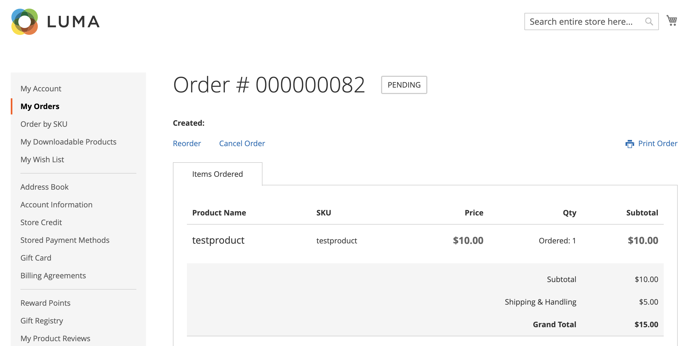

# Auftrag stornieren zulassen

Wenn diese Option aktiviert ist, können Sie eine Bestellung direkt über das Konto des Kunden stornieren. Abbrechen ist standardmäßig deaktiviert.

## Kriterien für die Stornierung, die für eine Bestellung aktiviert werden sollen

- Die _„Bestellung stornieren_ muss aktiviert sein.

- Wenn sich die Bestellung im Status `Hold`, `Canceled`, `Complete` oder `Closed` befindet, ist die Option Abbrechen in der Storefront deaktiviert.

- Wenn ein Artikel in der Bestellung versendet wurde, ist die Option „Abbrechen“ in der Storefront deaktiviert.

- Wenn ein Artikel bezahlt wurde, ist die Stornierungsoption aktiviert und die Rückerstattung wird für diesen Artikel erstellt.

- Wenn sich die Bestellung im Status `Pending` oder `Processing` befindet, wird die Option Abbrechen in der Storefront aktiviert.

## Konfigurieren Sie so, dass Kunden Stornierungen zulassen und die Stornierungsgründe anpassen können

1. Navigieren Sie in _Admin_-Seitenleiste zu **[!UICONTROL Stores]** > _[!UICONTROL Settings]_>**[!UICONTROL Configuration]**.

1. Erweitern Sie im linken Bereich **[!UICONTROL Sales]** und wählen Sie **[!UICONTROL Sales]** aus.

1. Erweitern Sie  den Abschnitt **[!UICONTROL Order cancellation]** .

   {width="600" zoomable="yes"}

1. Legen Sie **[!UICONTROL Order cancellation through GraphQL]** auf `Yes` fest.

   Mit dieser Einstellung wird die Funktion zum Abbrechen für das Kundenkonto in der Storefront aktiviert.

1. In der **[!UICONTROL Order Order cancellation reasons]** können Sie einen beliebigen Abbruchsgrund hinzufügen, löschen oder ändern.

   Mit dieser Einstellung werden Stornierungsgründe dem Kunden in der Storefront angezeigt, wenn er eine Bestellung storniert.
Stellen Sie sicher, dass Sie mindestens einen Grund angegeben haben.

1. Klicken Sie auf **[!UICONTROL Save Config]**.

## Aus der Storefront abbrechen

Ein Kunde kann die Abbruchfunktion für eine bestimmte Bestellung von drei Seiten aus starten:

- _Meine Bestellungen_ Seite

- _Bestellansicht_ Seite

- _Mein Konto_ Seite

### Meine Bestellungen

Die Schaltfläche _Bestellung abbrechen_ wird auf der Seite Meine Bestellungen angezeigt, wenn die Bestellung storniert werden kann.

{width="700" zoomable="yes"}

### Seite „Bestellansicht“

Die Schaltfläche _Bestellung abbrechen_ wird auf der Seite Bestellung anzeigen angezeigt, wenn die Bestellung storniert werden kann.

{width="700" zoomable="yes"}

### Mein Konto

Die Schaltfläche _Bestellung abbrechen_ wird im Abschnitt Letzte Bestellungen auf der Seite Mein Konto angezeigt, wenn die Bestellung storniert werden kann.

{width="700" zoomable="yes"}
