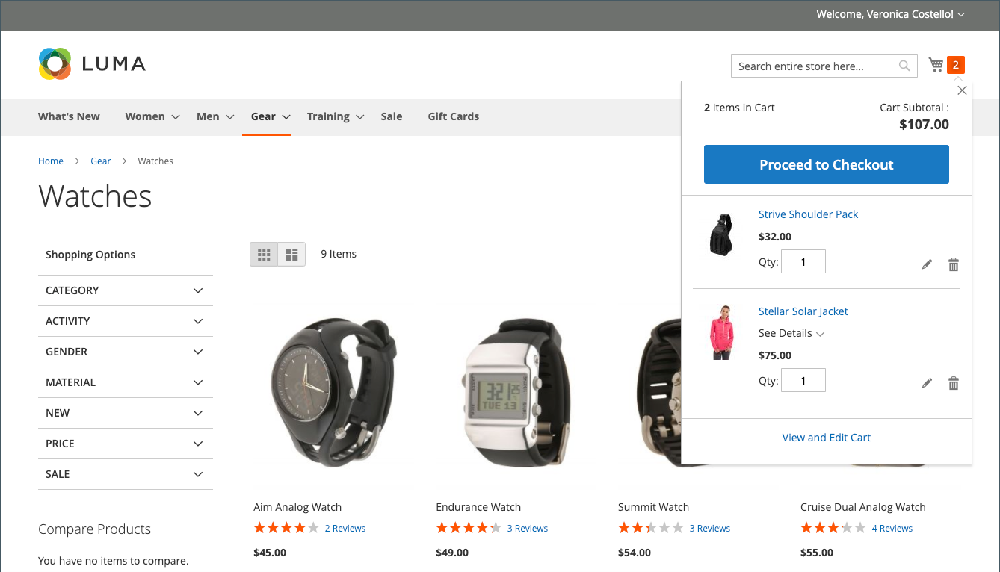

# Warenkorbkonfiguration

Die Warenkorbkonfiguration bestimmt, wie der Warenkorb für Ihre Store-Kunden funktioniert, einschließlich der Umleitung des Kunden zur Warenkorbseite und der Verwendung von Bildern für Produktminiaturansichten. Sie können auch eine Bestellung verlangen, um einen Mindestbetrag zu erreichen, bevor der Checkout-Prozess beginnt, die Anzahl der Tage angeben, für die die angegebenen Preise gültig bleiben, und die Reihenfolge der Artikel im _Bestellsummen_ Abschnitt.

[**Mini-Warenkorb**](#mini-cart) - Konfigurieren Sie diese Option, um festzustellen, ob der Warenkorblink/-symbol die Anzahl der verschiedenen Produkte (oder SKUs) im Warenkorb oder die Gesamtmenge aller Artikel anzeigt.

[**Mini-Warenkorb-Link**](#configure-the-cart-link) - Konfigurieren Sie diese Option, um festzustellen, ob der Mini-Warenkorb angezeigt wird, wenn ein Kunde auf die Anzahl der Artikel im Warenkorbsymbol oben auf einer Store-Seite klickt.

[**Zum Warenkorb umleiten**](#redirect-to-cart)- Konfigurieren Sie diese Option, um festzustellen, ob die Warenkorbseite immer dann angezeigt wird, wenn ein Artikel zum Warenkorb hinzugefügt wird, oder nur, wenn ein Kunde beschließt, zur Seite zu wechseln.

[**Anführungslebensdauer**](#quote-lifetime) - Konfigurieren Sie diese Option, um anzugeben, wie lange ein Preis gültig ist.

[**Mindestauftragsbetrag**](#minimum-order-amount) - Konfigurieren Sie diese Optionen, um einen Mindestbetrag festzulegen, nachdem Rabatte angewendet wurden, die Bestellteilsummen zu erfüllen sind und die im Warenkorb angezeigten Nachrichten angezeigt werden.

[**Mindestauftragsmenge**](#minimum-order-quantity) - Konfigurieren Sie diese Optionen, um eine Mindestanzahl von Elementen anzugeben, die für die Bestellung erforderlich sind.

[**Warenkorb-Miniaturansichten**](#cart-thumbnails)  - Konfigurieren Sie die Optionen für die Miniaturansicht des Warenkorbs, um die im Warenkorb angezeigten Miniaturansichten für gruppierte oder konfigurierbare Produkte zu bestimmen.

[**Geschenkoptionen**](#gift-options) - Konfigurieren Sie die Geschenkoptionen, um festzustellen, ob Kunden Geschenkgutschriften oder Grußkarten hinzufügen können und ob Geschenkverpackungsoptionen verfügbar sind.

>[!NOTE]
>
>Informationen zum Konfigurieren des Checkout-Prozesses finden Sie unter [Checkout-Optionen](checkout-process.md).

## Mini-Warenkorb

Die _Mini-Warenkorb_ zeigt eine Zusammenfassung der Artikel im Warenkorb an. Sie ist standardmäßig aktiviert und wird angezeigt, wenn Sie oben auf der Seite auf den Link Warenkorb klicken.
Der Link kann so konfiguriert werden, dass die Anzahl der verschiedenen Produkte (oder SKUs) im Warenkorb oder die Gesamtmenge aller Artikel angezeigt wird.

{width="700" zoomable="yes"}

>[!NOTE]
>
>Für _registriert_ -Kunde, kann es vorkommen, dass der Mini-Warenkorb nicht automatisch über mehrere Geräte und Browser hinweg synchronisiert wird. Um in solchen Fällen den Mini-Warenkorb zu synchronisieren, kann der Kunde einfach die [Warenkorb](cart.md) auf dem Gerät oder Browser.

### Konfigurieren des Mini-Warenkorbs

1. Im _Admin_ Seitenleiste, navigieren Sie zu **[!UICONTROL Stores]** > _[!UICONTROL Settings]_>**[!UICONTROL Configuration]**.

1. Erweitern Sie im linken Bereich **[!UICONTROL Sales]** und wählen **[!UICONTROL Checkout]**.

1. Erweitern  die _[!UICONTROL Mini Cart]_Abschnitt.

   {width="600" zoomable="yes"}

1. Wenn die Einstellung für eine bestimmte Store-Ansicht gilt, [Auswählen der Store-Ansicht](../configuration-reference/scope-change.md#set-the-scope) wo die Konfiguration gilt.

   Klicken Sie bei Aufforderung auf **[!UICONTROL OK]** , um fortzufahren.

1. Satz **[!UICONTROL Display Mini Cart]** auf einen der folgenden Werte zu:

   - `Yes` - Zeigt den Mini-Warenkorb auf Store-Seiten an. Das Erscheinungsbild der Seitenleiste hängt vom Design ab.
   - `No` - Deaktiviert die Anzeige des Mini-Warenkorbs auf Store-Seiten.

1. Wenn die Anzeige aktiviert ist, aktualisieren Sie die anderen Optionen, um die Anzeige zu konfigurieren:

   - Für **[!UICONTROL Number of Items to Display Scrollbar]** Geben Sie die Anzahl der Elemente ein, die in der Seitenleiste angezeigt werden können, bevor die Bildlaufleiste ausgelöst wird.
   - Für **[!UICONTROL Maximum Display Recently Added Item(s)]**, geben Sie die maximale Anzahl der kürzlich hinzugefügten Artikel ein, die Sie im Mini-Warenkorb anzeigen möchten.

1. Klicken **[!UICONTROL Save Config]**.

### Warenkorb-Link konfigurieren

1. Im _Admin_ Seitenleiste, **[!UICONTROL Stores]** > _[!UICONTROL Settings]_>**[!UICONTROL Configuration]**.

1. Erweitern Sie im linken Bereich **[!UICONTROL Sales]** und wählen **[!UICONTROL Checkout]**.

1. Erweitern  die **[!UICONTROL My Cart Link]** Abschnitt.

1. Satz **[!UICONTROL Display Cart Summary]** zu einer der folgenden Einstellungen hinzufügen:

   - `Display item quantities` - Diese Einstellung zeigt die Gesamtanzahl der Produkte im Warenkorb an und fügt die Mengen für jedes Produkt hinzu.
   - `Display number of items in cart` - Diese Einstellung zeigt die Anzahl der Artikel im Warenkorb an, unabhängig von der Menge.

   {width="600" zoomable="yes"}

1. Klicken **[!UICONTROL Save Config]**.

## Zum Warenkorb umleiten

Die Warenkorbseite kann so konfiguriert werden, dass sie immer dann angezeigt wird, wenn ein Artikel zum Warenkorb hinzugefügt wird, oder nur, wenn Kunden sich dafür entscheiden, zur Seite zu gehen. Die grundlegenden Informationen zu den Artikeln, die sich derzeit im Warenkorb befinden, finden Sie immer im [Mini-Warenkorb](#mini-cart). Die Entscheidung besteht darin, die Vorteile eines weiteren Einkaufs zwischen den Kunden und dem Vorteil einer Ermutigung der Kunden zum Checkout auszugleichen. Es könnte eine einfache Frage persönlicher Präferenz sein. Wenn Sie sie jedoch mit Zahlen sichern möchten, können Sie einen A/B-Test durchführen, um zu sehen, welcher Ansatz zu einer höheren Konversionsrate führt.

**_So konfigurieren Sie, wann der Warenkorb angezeigt wird:_**

1. Im _Admin_ Seitenleiste, navigieren Sie zu **[!UICONTROL Stores]** > _[!UICONTROL Settings]_>**[!UICONTROL Configuration]**.

1. Erweitern Sie im linken Bereich **[!UICONTROL Sales]** und wählen **[!UICONTROL Checkout]**.

1. Erweitern  die **[!UICONTROL Shopping Cart]** Abschnitt.

   {width="600" zoomable="yes"}

1. Wenn die Einstellung für eine bestimmte Store-Ansicht gilt, [Auswählen der Store-Ansicht](../configuration-reference/scope-change.md#set-the-scope) wo die Konfiguration gilt.

   Klicken Sie bei Aufforderung auf **[!UICONTROL OK]** , um fortzufahren.

1. Satz **[!UICONTROL After Adding a Product Redirect to Shopping Cart]** auf einen der folgenden Werte zu:

   - `Yes` - Zeigt die Warenkorbseite unmittelbar nach dem Hinzufügen eines Produkts zum Warenkorb an.
   - `No` - Deaktiviert die Umleitung zum Warenkorb nach einer Produktaktualisierung zum Warenkorb.

1. Klicken **[!UICONTROL Save Config]**.

## Anführungslebensdauer

Mit der Installation und Aktivierung von B2B für Adobe Commerce können Sie Unterstützung für die _Anführungszeichen_ Funktion. Diese Funktion ermöglicht es autorisierten Käufern, den Preisverhandelungsprozess einzuleiten, indem sie eine Anfrage vom Warenkorb einreichen. Die _Anführungszeichen_ grid listet jedes erhaltene Angebot auf und pflegt einen Verlauf der Kommunikation zwischen Käufer und Verkäufer. Weitere Informationen zu den B2B-Funktionen finden Sie unter [Verhandlungsanführungszeichen](../b2b/quotes.md) im _B2B für Adobe Commerce-Benutzerhandbuch_.

Sie können feststellen, wie lange ein Preis gültig ist, indem Sie die Lebensdauer des Warenkorbangebots in der Konfiguration festlegen. Wenn beispielsweise ein Käufer einen Warenkorb nach mehreren Tagen unbeaufsichtigt lässt, ist der Anführungspreis für einige Artikel möglicherweise nicht mehr derselbe. Standardmäßig ist die Anführungszeitdauer auf 30 Tage eingestellt.

**_So konfigurieren Sie die Lebensdauer des Zitats:_**

1. Im _Admin_ Seitenleiste, navigieren Sie zu **[!UICONTROL Stores]** > _[!UICONTROL Settings]_>**[!UICONTROL Configuration]**.

1. Erweitern Sie im linken Bereich **[!UICONTROL Sales]** und wählen **[!UICONTROL Checkout]**.

1. Erweitern  die **[!UICONTROL Shopping Cart]** Abschnitt.

   {width="600" zoomable="yes"}

1. Wenn die Einstellung für eine bestimmte Store-Ansicht gilt, [Auswählen der Store-Ansicht](../configuration-reference/scope-change.md#set-the-scope) wo die Konfiguration gilt.

   Klicken Sie bei Aufforderung auf **[!UICONTROL OK]** , um fortzufahren.

1. Für **[!UICONTROL Quote Lifetime (days)]** geben Sie die Anzahl der Tage an, für die ein notierter Preis gültig bleibt.

1. Klicken **[!UICONTROL Save Config]**.

## Mindestauftragsbetrag

Mit der Konfiguration können Sie einen Mindestbetrag festlegen, um nach Anwendung von Rabatten die Bestellteilsummen zu erfüllen. An mehrere Adressen versandte Bestellungen können zur Erfüllung des Mindestbestellbetrags pro Adresse erforderlich sein. Die Schaltfläche Auschecken wird erst verfügbar, nachdem der Mindestbestellbetrag erreicht wurde.

{width="700" zoomable="yes"}

**_So konfigurieren Sie einen Mindestbestellbetrag:_**

1. Im _Admin_ Seitenleiste, navigieren Sie zu **[!UICONTROL Stores]** > _[!UICONTROL Settings]_>**[!UICONTROL Configuration]**.

1. Erweitern Sie im linken Bereich **[!UICONTROL Sales]** und wählen **[!UICONTROL Sales]** darunter.

1. Erweitern  die **[!UICONTROL Minimum Order Amount]** Abschnitt.

   {width="600" zoomable="yes"}

1. Um einen Mindestbestellbetrag zu verlangen, legen Sie **[!UICONTROL Enable]** nach `Yes`.

1. Wenn die Mindestreihenfolge aktiviert ist, legen Sie die folgenden Optionen zum Konfigurieren der Anforderung fest:

   - Geben Sie die **[!UICONTROL Minimum Amount]** die für die Zwischensumme erforderlich ist, nachdem Rabatte angewendet wurden.

   - Satz **[!UICONTROL Include Discount Amount]** auf einen der folgenden Werte zu:

      - `Yes` - Setzt voraus, dass die Zwischensumme den Mindestbetrag mit allen Rabatten erfüllt. Wenn der Warenkorb ein Beispiel für einen Mindestbetrag von 50 USD enthält und ein Top-60-Wert von 60 USD mit einem angewendeten Rabatt von 25 % angewendet wird, beträgt die resultierende Zwischensumme 45 USD, und der Warenkorb würde nicht das Minimum erreichen.
      - `No` - Erfordert, dass die Zwischensumme den Mindestbetrag ohne Rabatte erfüllt.

   - Satz **[!UICONTROL Include Tax to Amount]** auf einen der folgenden Werte zu:

      - `Yes` - Erfordert, dass die Zwischensumme den Mindestbetrag mit der Steuer erfüllt.
      - `No` - Erfordert die Erfüllung des Mindestbetrags ohne Steuern durch die Zwischensumme.

1. Passen Sie optional die Einstellungen für die Mindestbestellmenge an Nachricht an:

   - Für **[!UICONTROL Description Message]** Geben Sie den Text ein, den Sie verwenden möchten, um die Nachricht anzupassen, die oben im Warenkorb angezeigt wird, wenn die Zwischensumme nicht den Mindestwert erreicht.

   - Für **[!UICONTROL Error to Show in Shopping Cart]** Geben Sie den Text ein, den Sie verwenden möchten, um die Fehlermeldung zum Warenkorb anzupassen.

   Lassen Sie die Felder der Nachrichtenbeschreibung leer, um die Standardmeldungen zu verwenden.

1. Konfigurieren Sie bei Bedarf die Mindestbestellmenge für Bestellungen mit mehreren Adressen:

   - Um zu verlangen, dass jede Adresse in einer Bestellung mit mehreren Adressen den Mindestbestellbetrag erfüllt, setzen Sie **[!UICONTROL Validate Each Address Separately in Multi-address Checkout]** nach `Yes`.

   - Passen Sie optional die Einstellungen für die Mindestbestellmenge an Nachricht an:

      - **[!UICONTROL Multi-address Description Message]** - Geben Sie den Text ein, den Sie verwenden möchten, um die Nachricht anzupassen, die oben im Warenkorb für Bestellungen mit mehreren Adressen angezeigt wird, die nicht das Minimum erreichen.

      - **[!UICONTROL Multi-address Error to Show in Shopping Cart]** - Geben Sie den Text ein, den Sie verwenden möchten, um die Fehlermeldung zum Warenkorb für Bestellungen mit mehreren Adressen anzupassen, die nicht die Mindestanforderungen erfüllen, und geben Sie den Text in das Feld ein.

     Lassen Sie die Felder der Nachrichtenbeschreibung leer, um die Standardmeldungen zu verwenden.

1. Klicken **[!UICONTROL Save Config]**.

## Mindestauftragsmenge

Sie können die für eine Bestellung zulässige Mindestmenge festlegen. Die Mindestmenge kann auch entsprechend der jeweiligen Kundengruppe konfiguriert werden.

1. Navigieren Sie zu **[!UICONTROL Stores]** > _[!UICONTROL Settings]_>**[!UICONTROL Configuration]**.

1. Erweitern Sie im linken Bereich **[!UICONTROL Catalog]** und wählen **[!UICONTROL Inventory]**.

1. Erweitern  die **[!UICONTROL Product Stock Options]** Abschnitt.

   {width="600" zoomable="yes"}

1. Für **[!UICONTROL Minimum Qty Allowed in Shopping Cart]**, legen Sie die Mindestmenge des Produkts für eine Bestellung fest.

   Falls erforderlich, löschen Sie die **[!UICONTROL Use system value]** aktivieren, um diese Einstellungen zu ändern.

   - Ändern Sie die **[!UICONTROL Customer Group]** auf eine bestimmte Gruppe festzulegen, geben Sie die **[!UICONTROL Minimum Qty]** für diese Gruppe. Um eine weitere Gruppe und Mengenbegrenzung hinzuzufügen, klicken Sie auf **[!UICONTROL Add Minimum Qty]**.

   - Um für alle Kunden dieselbe Mindestmengenbegrenzung festzulegen, halten Sie die Variable `ALL GROUPS` und geben Sie die **[!UICONTROL Minimum Qty]**.

1. Klicken **[!UICONTROL Save Config]**.

   {width="700" zoomable="yes"}

## Warenkorb-Miniaturansichten

 (Nur Adobe Commerce)

Die im Warenkorb angezeigten Miniaturansichten geben Kunden einen schnellen Überblick über die Artikel, die sie kaufen werden. Bei Produkten mit mehreren Optionen stimmt das Bild jedoch möglicherweise nicht mit der Variante des Produkts überein, das sich im Warenkorb befindet. Wenn der Kunde einen Artikel in einer bestimmten Farbe kauft, sollte idealerweise die Miniaturansicht im Warenkorb übereinstimmen.

Das Miniaturbild für gruppierte und konfigurierbare Produkte kann so eingestellt werden, dass es das Bild aus dem &quot;übergeordneten&quot;Produkt oder aus der Produktvariante anzeigt.

{width="700" zoomable="yes"}

**_So konfigurieren Sie Warenkorbminiaturansichten:_**

1. Im _Admin_ Seitenleiste, navigieren Sie zu **[!UICONTROL Stores]** > _[!UICONTROL Settings]_>**[!UICONTROL Configuration]**.

1. Erweitern Sie im linken Bereich **[!UICONTROL Sales]** und wählen **[!UICONTROL Checkout]**.

1. Erweitern  die **[!UICONTROL Shopping Cart]** Abschnitt.

   {width="600" zoomable="yes"}

1. Satz **[!UICONTROL Grouped Product Image]** , um die Miniaturansicht zu bestimmen, die im Warenkorb für [gruppierte Produkte](../catalog/product-create-grouped.md):

   - `Product Thumbnail Itself` - Verwendet die der Produktvariante zugewiesene Miniaturansicht, die dem Warenkorb hinzugefügt wird.
   - `Parent Product Thumbnail` - Verwendet die dem übergeordneten Produkt zugewiesene Miniaturansicht.

1. Satz **[!UICONTROL Configurable Product Image]** , um die Miniaturansicht zu bestimmen, die im Warenkorb für [konfigurierbare Produkte](../catalog/product-create-configurable.md):

   - `Product Thumbnail Itself` - Verwendet die der Produktvariante zugewiesene Miniaturansicht, die dem Warenkorb hinzugefügt wird.
   - `Parent Product Thumbnail` - Verwendet die dem übergeordneten Produkt zugewiesene Miniaturansicht.

1. Klicken **[!UICONTROL Save Config]**.

## Geschenkoptionen

Die Auswahl der verfügbaren Geschenkoptionen wird im Warenkorb angezeigt, bevor der Checkout-Prozess beginnt. Die Konfiguration der Geschenkoptionen bestimmt, ob Kunden Geschenkgutschriften oder Grußkarten hinzufügen können und ob Geschenkverpackungsoptionen verfügbar sind. Jeder Artikel in der Bestellung kann eine separate Nachricht und Geschenkverpackung haben. Bei Anwendung auf die gesamte Bestellung können Kunden auch einen Geschenkgutschein und eine Grußkarte hinzufügen.

{width="700" zoomable="yes"}

Die Konfiguration der Geschenkoptionen gilt für die gesamte Website, kann jedoch auf Produktebene überschrieben werden.

### Geschenkoptionen aktivieren

1. Im _Admin_ Seitenleiste, navigieren Sie zu **[!UICONTROL Stores]** > _[!UICONTROL Settings]_>**[!UICONTROL Configuration]**.

1. Erweitern Sie im linken Bereich **[!UICONTROL Sales]** und wählen **[!UICONTROL Sales]** darunter.

1. Erweitern  **[!UICONTROL Gift Options]** auf der Seite.

   {width="600" zoomable="yes"}

1. Legen Sie die Optionen für die Geschenkgutschrift entsprechend Ihrer Voreinstellung fest:

   - Für **[!UICONTROL Allow Gift Messages on Order Level]** auswählen `Yes` um eine einzelne Geschenknachricht für die gesamte Bestellung zu aktivieren.
   - Für **[!UICONTROL Allow Gift Messages for Order Items]** auswählen `Yes` , um das Hinzufügen von separaten Geschenknachrichten für einzelne Artikel im Warenkorb für Kunden zu ermöglichen.

1.  (Nur Adobe Commerce) Legen Sie die Geschenkverpackungsoptionen nach Ihren Wünschen fest:

   - Für **[!UICONTROL Allow Gift Wrapping on Order Level]** auswählen `Yes` um eine einzelne Geschenkverpackung für die gesamte Bestellung zu aktivieren.
   - Für **[!UICONTROL Allow Gift Wrapping for Order Items]** auswählen `Yes` , um das individuelle Hinzufügen der Geschenkverpackung zu jedem Artikel im Warenkorb zu aktivieren.

   Sie können auch verschiedene [Geschenkentwürfe](#gift-wrap) , damit die Kunden die Verpackung wählen können.

1.  (Nur Adobe Commerce) Um Kunden eine Option für einen Geschenkgutschein bereitzustellen, legen Sie **[!UICONTROL Allow Gift Receipt]** nach `Yes`.

1.  (Nur Adobe Commerce) Um Kunden die Möglichkeit zu geben, eine gedruckte Karte einzuschließen, legen Sie **[!UICONTROL Allow Printed Card]** nach `Yes`.

1.  (Nur Adobe Commerce) Geben Sie die **[!UICONTROL Default Price for Printed Card]**.

1. Klicken **[!UICONTROL Save Config]**.

### Geschenkpackung

 (Nur Adobe Commerce)

Geschenkverpackungen sind für alle Produkte erhältlich, die versandfähig sind, und können für einzelne Artikel oder für die gesamte Bestellung angeboten werden. Sie können für jedes Geschenkverpackungsdesign einen separaten Preis berechnen und ein Miniaturbild für jedes Design hochladen, das als Option für ein Produkt im Warenkorb angezeigt wird. Wenn ein Kunde auf die Miniaturansicht der Geschenkpackung klickt, wird ein Bild in voller Größe angezeigt. Während des Checkout-Reviews wird die Geschenkverpackung mit der anderen [Checkout-Summen](checkout-totals-sort-order.md) im _Bestellübersicht_ Abschnitt.

Das Geschenkverpackungsbild sollte ein Muster sein, das das Wiederholungsmuster anzeigt, und kann auch eine Probe des zu verwendenden Band enthalten. Sie können entweder das Papier scannen oder ein Foto eines eingepackten Packages machen. Das hochgeladene Bild kann ein GIF-, JPG- oder PNG-Bild sein und sollte quadratisch sein. Im folgenden Beispiel beträgt das hochgeladene Geschenkverpackungsbild 230 x 230 Pixel.

{width="700" zoomable="yes"}

#### Hinzufügen eines Geschenkverpackungsdesigns

1. Im _Admin_ Seitenleiste, navigieren Sie zu **[!UICONTROL Stores]** > _[!UICONTROL Other Settings]_>**[!UICONTROL Gift Wrapping]**.

   {width="700" zoomable="yes"}

1. Klicken Sie oben rechts auf **[!UICONTROL Add Gift Wrapping]**.

1. Geben Sie den Namen für die **[!UICONTROL Gift Wrapping Design]** angezeigt, die während des Kassengangs angezeigt werden.

   Bei Bedarf können Sie die **[!UICONTROL Scope]** und konfigurieren Sie für jede Store-Ansicht einen anderen Namen.

1. Wählen Sie die **[!UICONTROL Websites]** wo das Geschenkverpackungsdesign verfügbar ist.

1. Satz **[!UICONTROL Status]** nach `Enabled`.

   Wenn Sie eine saisonale Wrapping-Option haben, können Sie diese auf `Disabled` , wenn die Option nicht verfügbar sein soll.

1. Geben Sie die **[!UICONTROL Price]** des Geschenkverpackungsdesigns.

   Diese Einstellung kann durch den auf der Produktebene festgelegten Geschenkverpackungspreis überschrieben werden.

   {width="600" zoomable="yes"}

1. So laden Sie eine Miniaturansicht hoch **[!UICONTROL Image]** der Geschenkverpackung, klicken Sie auf **[!UICONTROL Choose File]** und wählen Sie die aus Ihrem Verzeichnis hochzuladende Datei aus.

   Eine Miniaturansicht des Bildes wird im _[!UICONTROL Gift Wrapping Information]_nachdem der Datensatz gespeichert wurde.

1. Klicken **[!UICONTROL Save]**.

#### Design einer Geschenkpackung bearbeiten

1. Im _Admin_ Seitenleiste, navigieren Sie zu **[!UICONTROL Stores]** > _[!UICONTROL Other Settings]_>**[!UICONTROL Gift Wrapping]**.

1. Finden Sie den Eintrag der Geschenkverpackung in der Liste.

1. Im _Aktion_ Spalte, klicken **[!UICONTROL Edit]**.

   {width="600" zoomable="yes"}

1. Nehmen Sie die erforderlichen Änderungen vor.

1. Klicken **[!UICONTROL Save]**.

#### Löschen von Geschenkverpackungsdesigns

Mit dem _Geschenkverpackung_ Öffnen Sie das Raster und verwenden Sie eine dieser Methoden, um Wrap-Designs zu löschen.

**_Methode 1: Löschen eines einzelnen Geschenkverpackungsdesigns_**

1. Öffnen Sie das Geschenkpapier im Bearbeitungsmodus.

1. Klicken Sie oben im Arbeitsbereich auf **[!UICONTROL Delete]**.

1. Klicken Sie bei Aufforderung auf **[!UICONTROL OK]** zur Bestätigung.

**_Methode 2: Löschen mehrerer Geschenkverpackungsentwürfe_**

1. Im _Geschenkverpackung_ Markieren Sie das Kontrollkästchen jedes Geschenkverpackungsdesigns, das Sie löschen möchten.

1. Legen Sie die **[!UICONTROL Actions]** Kontrolle an `Delete`.

1. Klicken **[!UICONTROL Submit]**.

### Steuern auf Geschenkoptionen

 (Nur Adobe Commerce)

Die Preise für Geschenkverpackungen und gedruckte Geschenkkarten können so konfiguriert werden, dass sie Steuern einschließen oder ausschließen oder beide Optionen anzeigen. Sie können für diese Elemente auch eine Steuerklasse festlegen, entweder auf globaler oder auf Website-Ebene.

**_So konfigurieren Sie die Steuern für Geschenkoptionen:_**

1. Im _Admin_ Seitenleiste, navigieren Sie zu **[!UICONTROL Stores]** > _[!UICONTROL Settings]_>**[!UICONTROL Configuration]**.

1. Erweitern Sie im linken Bereich **[!UICONTROL Sales]** und wählen **[!UICONTROL Tax]**.

1. Erweitern  die **[!UICONTROL Tax Classes]** Abschnitt.

   {width="600" zoomable="yes"}

1. Satz **[!UICONTROL Tax Class for Gift Options]** auf die anwendbare Steuerklasse.

1. Erweitern  die **[!UICONTROL Orders, Invoices, Credit Memos Display Settings]** Abschnitt.

   {width="600" zoomable="yes"}

1. Satz **[!UICONTROL Display Gift Wrapping Prices]** auf einen der folgenden Werte zu:

   - `Excluding Tax`
   - `Including Tax`
   - `Including and Excluding Tax`

1. Satz **[!UICONTROL Display Printed Card Prices]** auf einen der folgenden Werte zu:

   - `Excluding Tax`
   - `Including Tax`
   - `Including and Excluding Tax`

1. Klicken **[!UICONTROL Save Config]**.
