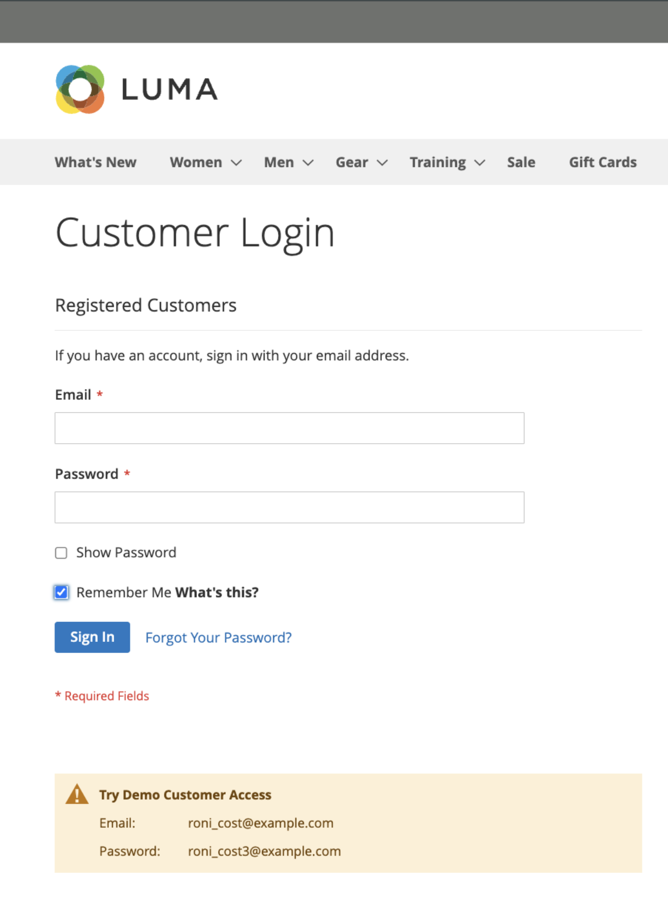

# Warenkorbpersistenz

Eine persistente Warenkorb speichert einen Verweis auf die Konto des Kunden auf der aktuellen Device und stellt so sicher, dass Warenkorb Inhalte zugänglich bleiben, wenn die angemeldete Sitzung abläuft.

Wenn ein Kunde _erinnert_ bleibt der Inhalt seines Warenkorbs auf dem aktuellen Gerät verfügbar, wenn die angemeldete Sitzung abläuft. Nach Ablauf der Sitzung wird über die persistente Warenkorb Sitzung auf die Warenkorb des Kunden zugegriffen. Wenn sich derselbe Kunde bei einer anderen Device oder Browser anmeldet und seiner Warenkorb etwas hinzufügt und dann mit einer aktiven persistenten Sitzung zum Device zurückkehrt, wird sein Warenkorb mit den hinzugefügten Elementen aktualisiert.

Die Verwendung eines persistenten Warenkorb kann die Anzahl der abgebrochenen Warenkörbe reduzieren und den Umsatz steigern. Die beständige Warenkorb **gibt zu** keinem Zeitpunkt vertrauliche Konto Informationen preis.

Um die Verwendung der Warenkorb Persistenz für Ihre Site oder in bestimmten Geschäft Ansichten zu managen, können [Sie Einstellungen für persistente Warenkorb](#configure-a-persistent-cart) konfigurieren. Weitere Informationen dazu, wie sich diese Einstellungen auf die Erstkäufer Erlebnis in Ihrer Storefront auswirken, finden Sie unter [Persistente Warenkorb arbeitsablauf](#persistent-cart-workflow).

>[!NOTE]
>
>Die Funktion für persistente Warenkorb ist nur für registrierte und angemeldete Kunden verfügbar. Gastkäufer können die Funktion für beständige Warenkorb nicht verwenden.

## Workflow für persistenten Warenkorb

Wenn der persistente Warenkorb [aktiviert](#configure-a-persistent-cart) ist, hängt der Workflow von Folgendem ab:

- Die Werte der _[!UICONTROL Enable Remember Me]_- und&#x200B;_[!UICONTROL Clear Persistence on Log Out]_
- Die Entscheidung des Kunden, das Kontrollkästchen _[!UICONTROL Remember Me]_&#x200B;zu aktivieren oder zu deaktivieren
- Wenn das persistente Cookie gelöscht wird

Wenn die Kundensitzung abläuft, wird unter folgenden Bedingungen ein `Not Jane Smith?` Link in der Kopfzeile der Seite angezeigt:
- Der angemeldete Kunde hat die Option _[!UICONTROL Remember Me]_&#x200B;ausgewählt und ein persistentes Cookie wird angewendet
- Der Kunde meldet sich ab, wenn das System mit _[!UICONTROL Clear Persistence on Sign Out]_&#x200B;auf `No` konfiguriert ist.

Das System speichert die Warenkorbinhalte auf dem aktuellen Gerät, auch wenn die angemeldete Sitzung abläuft. Über den `Not Jane Smith?` Link kann der Kunde die persistente Sitzung beenden und als Gast arbeiten bzw. sich als anderer oder derselbe Kunde anmelden.

Wenn der Kunde beim Anmelden das Kontrollkästchen _[!UICONTROL Remember Me]_&#x200B;aktiviert hat, erstellt und verwaltet Ihr Store ein separates persistentes Cookie. Dieses Cookie hilft, den Warenkorb des Kunden auch dann zugänglich zu halten, wenn er den Browser schließt oder zu einer anderen Site navigiert und seine angemeldete Sitzung abläuft.

Wenn derselbe Kunde Ihre Geschäft mit mehreren Browsern besucht, während er angemeldet ist oder während eine persistente Sitzung aktiv ist, werden die Änderungen, die der Kunde auf einer Browser an der Warenkorb Inhalte vornimmt, in anderen Browsern widergespiegelt, wenn die Seite aktualisiert wird.

>[!NOTE]
>
>Um eine Warenkorb Synchronisation über mehrere Geräte oder Browser hinweg zu gewährleisten, müssen sich Kunden bei jeder neuen Device anmelden, die sie zum Einkaufen verwenden. Bei angemeldeten Kunden wird der Inhalt der Warenkorb über mehrere Geräte und Browser hinweg synchronisiert, solange sie unter derselben Konto angemeldet sind, unabhängig von der Konfiguration des beständigen Warenkorbs.

### Verhalten des Kontrollkästchens „Angaben speichern“

Kunden können das Kontrollkästchen _[!UICONTROL Remember Me]_&#x200B;auf der Anmeldeseite, im Authentifizierungs-Popup, bei der Anmeldung zum Checkout oder bei der Erstellung eines neuen Kontos aktivieren, um den Inhalt des Warenkorbs auf dem aktuellen Gerät verfügbar zu halten, wenn die angemeldete Sitzung abläuft.

| Mich erinnern? | Ergebnis |
| ------------ |  ------ |
| Ausgewählt | Erstellt eine persistentes Cookie und sorgt dafür, dass der Inhalt der Warenkorb auf der aktuellen Device verfügbar bleibt, wenn die Kundensitzung Log-in abläuft. |
| Nicht ausgewählt | Es wird keine persistentes Cookie erstellt, und die Inhalte der Warenkorb bleibt nicht auf der aktuellen Device verfügbar, wenn die Log-in Sitzung abläuft. Beachten Sie, dass die Warenkorb Inhalte weiterhin im Konto des Kunden gespeichert und bei der nächsten Anmeldung des Kunden neu geladen wird. |

{style="table-layout:auto"}

{width="600" zoomable="yes"}
{width="600" zoomable="yes"}
{width="600" zoomable="yes"}

### Persistenz für Abmeldeverhalten löschen

Wenn sich der Kunde anmeldet oder sich mit der ausgewählten Option _Angaben speichern_ registriert, bestimmt die Konfiguration der Option _Persistenz beim Abmelden löschen_ das Verhalten des persistenten Warenkorbs.

|  | Löschen der Persistenz beim Abmelden mit der Einstellung „Ja“ | Persistenz bei auf „Nein“ festgelegter Abmeldung löschen |
| ------ | ------ | ------ |
| _Erinnert_ Kunde meldet sich ab | Löscht sowohl Sitzungs- als auch persistente Cookies, sodass der Warenkorbinhalt auf dem aktuellen Gerät ausgeblendet wird, bis sich derselbe Kunde wieder anmeldet. | Löscht das Sitzungs-Cookie, aber das persistente Cookie bleibt in Kraft. Der Warenkorbinhalt bleibt auf dem aktuellen Gerät verfügbar. |
| _Erinnert_ Kunde meldet sich nicht ab, aber das Sitzungs-Cookie läuft ab | Das persistente Cookie bleibt in Kraft und der Warenkorbinhalt ist vom aktuellen Gerät aus zugänglich. | Die persistentes Cookie bleibt in Kraft, und auf die Warenkorb Inhalte kann von der aktuellen Device zugegriffen werden. |

### Beispiel für eine offene Sitzung auf einem gemeinsam genutzten Computer

Jane beendet ihre Weihnachtseinkäufe als _eingeloggte Remembered-Kundin_ . Sie fügt ein Geschenk für John in ihren Warenkorb und etwas für ihre Mutter. Anschließend geht sie für einen Snack in die Küche und ihre Anmeldesitzung läuft ab.

John setzt sich an den Computer, um schnell einzukaufen, während Jane in der Küche ist. Ohne den `Not Jane Smith?`-Link oben auf der Seite zu bemerken, findet John ein schönes Geschenk für Jane und fügt es zum Warenkorb hinzu. Wenn er auscheckt, bemerkt er, dass die Versand- und Rechnungsadressen vorausgefüllt sind und denkt, dass er angemeldet ist. John hat es so eilig, dass er die zusätzlichen Gegenstände während der _Order prüfen_ nicht bemerkt und die bestellen einreicht. Janes Warenkorb ist jetzt leer, und John kaufte alle Geschenke.

## Konfigurieren eines persistenten Warenkorbs

Bei der Einrichtung eines persistenten Warenkorbs können Sie die Lebensdauer der Cookies und die Optionen angeben, die Sie für verschiedene Kundenaktivitäten zur Verfügung stellen möchten.

Um den persistenten Warenkorb zu verwenden, muss der Browser des Kunden so eingestellt sein, dass Cookies erlaubt sind. Es gibt zwei Arten von Cookies, die für Warenkorboperationen verwendet werden:

- **Sitzungs-**: Ein kurzfristiges Sitzungs-Cookie ist während eines einzelnen Besuchs Ihrer Site vorhanden. Dieses Cookie läuft ab, wenn sich der Kunde abmeldet, oder wenn die Sitzung abläuft.

- **Persistentes Cookie** - Ein langfristiges, persistentes Cookie ist auch nach dem Ende der angemeldeten Sitzung weiterhin vorhanden. Dieses Cookie stellt sicher, dass der Inhalt des Warenkorbs eines Kunden verfügbar bleibt, wenn sich der Kunde abmeldet oder die Sitzung abläuft.

Weitere Informationen darüber, wie sich diese Konfigurationseinstellungen auf den Kunden-Workflow auswirken, finden Sie unter [Workflow für den Warenkorb](#persistent-cart-workflow).

{{$include /help/_includes/persistent-cart-configuration.md}}
