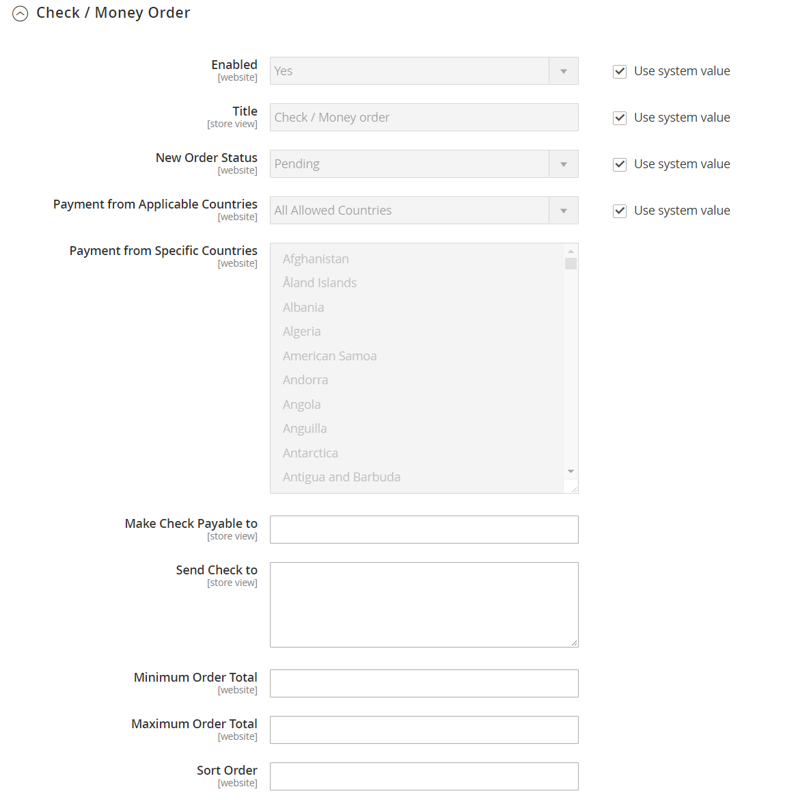

# Schecks und Zahlungsanweisungen

Mit Adobe Commerce und Magento Open Source können Sie Zahlungen per Scheck oder Zahlungsanweisung akzeptieren. Die Zahlungsmethode _Scheck /_) ist für Ihren Shop standardmäßig aktiviert. Sie können Schecks und Zahlungsanweisungen nur aus bestimmten Ländern annehmen und die Konfiguration mit Mindest- und Höchstauftragssummen optimieren.

**_So konfigurieren Sie die Zahlung per Scheck oder Zahlungsanweisung:_**

1. Navigieren Sie in _Admin_-Seitenleiste zu **[!UICONTROL Stores]** > _[!UICONTROL Settings]_>**[!UICONTROL Configuration]**.

1. Erweitern Sie im linken Bereich **[!UICONTROL Sales]** und wählen Sie **[!UICONTROL Payment Methods]**.

1. Erweitern Sie unter _[!UICONTROL Other Payment Methods]_ den Abschnitt **[!UICONTROL Check / Money Order]**.

   {width="600" zoomable="yes"}

   Eine ausführliche Beschreibung jeder dieser Konfigurationseinstellungen finden Sie unter [Scheck/](../configuration-reference/sales/payment-methods.md#check--money-order) im _Konfigurationsreferenzhandbuch_.

   >[!NOTE]
   >
   >Deaktivieren Sie bei Bedarf zunächst das Kontrollkästchen **[!UICONTROL Use system value]** , um diese Einstellungen zu ändern.

1. Um die Zahlung per Scheck oder Zahlungsanweisung zu akzeptieren, setzen Sie **[!UICONTROL Enabled]** auf `Yes`.

1. Geben Sie **[!UICONTROL Title]** einen Titel ein, der die Zahlungsmethode Scheck/Geldanweisung während des Checkouts angibt.

1. Wenn Bestellungen in der Regel auf die Genehmigung warten, akzeptieren Sie die **[!UICONTROL New Order Status]** als `Pending"`, bis sie genehmigt wird.

   Wenn Sie es vorziehen, können Sie den `Processing`- oder `Suspected Fraud` für neue Bestellungen mit dieser Zahlungsmethode verwenden.

1. Legen Sie **[!UICONTROL Payment from Applicable Countries]** auf eine der folgenden Einstellungen fest:

   - `All Allowed Countries` - Kunden aus allen [Ländern](../getting-started/store-details.md#country-options) die in Ihrer Store-Konfiguration angegeben sind, können diese Zahlungsmethode verwenden.
   - `Specific Countries` - Nachdem Sie diese Option ausgewählt haben, wird die _[!UICONTROL Payment from Specific Countries]_angezeigt. Zur Auswahl mehrerer Länder halten Sie die Strg-Taste (PC) bzw. die Befehlstaste (Mac) gedrückt und klicken auf die einzelnen Optionen.

1. Geben Sie **[!UICONTROL Make Check Payable To]** den Namen der Partei ein, an die der Scheck auszustellen ist.

1. Geben Sie **[!UICONTROL Send Check To]** die Straße oder das Postfach ein, an die bzw. das die Schecks gesendet werden.

1. Legen Sie **[!UICONTROL Minimum Order Total]** und **[!UICONTROL Maximum Order Total]** auf die Bestellbeträge fest, die für diese Zahlungsmethode erforderlich sind.

   >[!NOTE]
   >
   >Eine Bestellung ist dann geeignet, wenn die Summe zwischen den minimalen oder maximalen Gesamtwerten liegt oder genau mit diesen übereinstimmt.

1. Geben Sie **[!UICONTROL Sort Order]** eine Zahl ein, die die Position dieses Artikels in der Liste der Zahlungsmethoden bestimmt, die beim Checkout angezeigt wird.

   Diese Zahl steht im Verhältnis zu den anderen Zahlungsmethoden. (`0` = First, `1` = Second, `2` = Third usw.)

1. Klicken Sie abschließend auf **[!UICONTROL Save Config]**.
