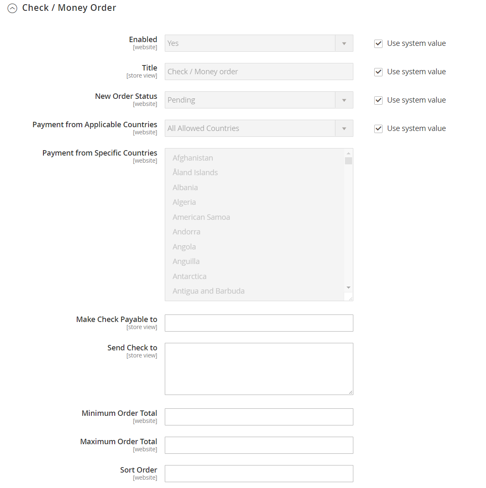

# Schecks und Geldaufträge

Mit Adobe Commerce und Magento Open Source können Sie Zahlungen per Scheck oder per Überweisung annehmen. Die Zahlungsmethode _Check / Money Order_ für Ihren Store ist standardmäßig aktiviert. Sie können Schecks und Geldbestellungen nur aus bestimmten Ländern akzeptieren und die Konfiguration mit Mindest- und Höchstbestellsummen anpassen.

**_So konfigurieren Sie die Zahlung durch Scheck oder Geldauftrag:_**

1. Wechseln Sie in der Seitenleiste _Admin_ zu **[!UICONTROL Stores]** > _[!UICONTROL Settings]_>**[!UICONTROL Configuration]**.

1. Erweitern Sie im linken Bereich den Wert **[!UICONTROL Sales]** und wählen Sie **[!UICONTROL Payment Methods]** aus.

1. Erweitern Sie unter _[!UICONTROL Other Payment Methods]_den Abschnitt  um den Abschnitt **[!UICONTROL Check / Money Order]**.

   {width="600" zoomable="yes"}

   Eine ausführliche Beschreibung der einzelnen Konfigurationseinstellungen finden Sie unter [Überprüfen / Money Order](../configuration-reference/sales/payment-methods.md#check--money-order) im _Konfigurationshandbuch_.

   >[!NOTE]
   >
   >Deaktivieren Sie bei Bedarf zunächst das Kontrollkästchen **[!UICONTROL Use system value]** , um diese Einstellungen zu ändern.

1. Um die Zahlung per Scheck oder Geldauftrag zu akzeptieren, setzen Sie **[!UICONTROL Enabled]** auf `Yes`.

1. Geben Sie für **[!UICONTROL Title]** einen Titel ein, der die Zahlungsmethode für Scheck-/Geldbestellungen während des Checkouts angibt.

1. Wenn Bestellungen in der Regel auf die Genehmigung warten, akzeptieren Sie den Standardwert **[!UICONTROL New Order Status]** als `Pending"`, bis er genehmigt wurde.

   Wenn Sie es bevorzugen, können Sie den Status `Processing` oder `Suspected Fraud` für neue Bestellungen mit dieser Zahlungsmethode verwenden.

1. Setzen Sie **[!UICONTROL Payment from Applicable Countries]** auf einen der folgenden Werte:

   - `All Allowed Countries` - Kunden aus allen in Ihrer Store-Konfiguration angegebenen [Ländern](../getting-started/store-details.md#country-options) können diese Zahlungsmethode verwenden.
   - `Specific Countries` - Nachdem Sie diese Option ausgewählt haben, wird die Liste _[!UICONTROL Payment from Specific Countries]_angezeigt. Um mehrere Länder auszuwählen, halten Sie die Strg-Taste (PC) oder die Befehlstaste (Mac) gedrückt und klicken Sie auf jede Option.

1. Geben Sie für **[!UICONTROL Make Check Payable To]** den Namen der Partei ein, an die die Scheck zu zahlen ist.

1. Geben Sie für &quot;**[!UICONTROL Send Check To]**&quot;die Straße oder das Postfach ein, an das die Schecks versandt werden.

1. Setzen Sie **[!UICONTROL Minimum Order Total]** und **[!UICONTROL Maximum Order Total]** auf die Bestellbeträge, die erforderlich sind, um für diese Zahlungsmethode qualifiziert zu sein.

   >[!NOTE]
   >
   >Eine Bestellung qualifiziert sich, wenn der Gesamtwert zwischen den minimalen oder maximalen Gesamtwerten liegt oder genau damit übereinstimmt.

1. Geben Sie für **[!UICONTROL Sort Order]** eine Zahl ein, die die Position dieses Elements in der Liste der Zahlungsmethoden bestimmt, die beim Checkout angezeigt werden.

   Diese Zahl ist relativ zu den anderen Zahlungsmethoden. (`0` = first, `1` = second, `2` = third usw.)

1. Klicken Sie nach Abschluss des Vorgangs auf **[!UICONTROL Save Config]**.
