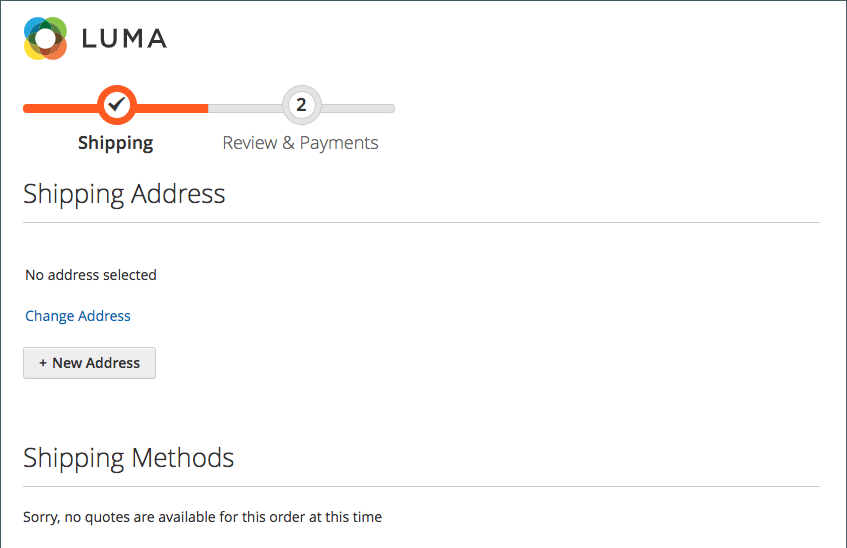

# Adresssuche an der Kasse

{{ee-feature}}

Ihre Kunden können viele gespeicherte Adressen und Informationen in ihrem Adressbuch haben, insbesondere regelmäßige, wiederkehrende Kunden oder Unternehmen, die mehrere Bestellungen und Versandorte eingeben. Das Anzeigen vieler Adressen kann das Laden und Laden des Checkouts erheblich verlangsamen und zu einem negativen Einkaufserlebnis führen. Es wird empfohlen, die Adresssuche für Ihre Website zu aktivieren und zu konfigurieren, um die Reaktionsgeschwindigkeit des Checkouts zu erhöhen.

>[!NOTE]
>
>Die Adresssuche ist standardmäßig nicht aktiviert. Sie können diese Funktion so konfigurieren, dass sie die Funktionalität auf Ihrer Site enthält.

Wenn diese Funktion aktiviert ist und die Anzahl der gespeicherten Adressen des Kunden das konfigurierte Limit erreicht oder überschreitet, wird in den Schritten _Versand_ und _Überprüfen und Zahlungen_ nur eine Adresse angezeigt (der Standard). Der Kunde kann die ausgewählte Adresse ändern, indem er auf **Adresse ändern** klickt und dann nach der richtigen Adresse nach Stadt, Bundesland, Straße oder Postleitzahl sucht. Diese Funktion unterstützt auch die Adressauswahl für den Checkout der Geschenkregistrierung.

{width="700" zoomable="yes"}

Wenn der Kunde keine standardmäßige Versandadresse hat, wird auf der Seite _Versand_ angezeigt _Keine Adresse ausgewählt_. In diesem Fall muss der Kunde auf **Adresse ändern** klicken, um eine gespeicherte Adresse auszuwählen, oder auf **Neue Adresse** klicken, um eine Adresse hinzuzufügen und auszuwählen, bevor der Checkout fortgesetzt wird. Wenn der Kunde keine standardmäßige Rechnungsadresse hat, wird auf der Seite _Überprüfen und Zahlungen_ die für den Versand ausgewählte Adresse zusammen mit der Option _Adresse ändern_ angezeigt.

{width="600" zoomable="yes"}

## Gesperrte Adresse für Anführungszeichen suchen

 (nur in Adobe Commerce B2B verfügbar)

Die Aktivierung der Adresssuche wirkt sich auch auf den Checkout für Bestellungen aus, die aus Angeboten erstellt werden, bei denen die Anzahl der gespeicherten Adressen des Kunden das konfigurierte Limit erreicht oder überschreitet. Wenn das Angebot abgeschlossen ist und der Kunde zur Kasse wechselt, wird nur die ausgewählte Lieferadresse angezeigt. Auf der Seite wird außerdem eine Meldung angezeigt, dass die Lieferadresse gesperrt ist und nur im Angebot geändert werden kann.

{width="600" zoomable="yes"}

## Adresssuche aktivieren

1. Navigieren Sie in _Admin_-Seitenleiste zu **[!UICONTROL Stores]** > _[!UICONTROL Settings]_>**[!UICONTROL Configuration]**.

1. Erweitern Sie im linken Bereich **[!UICONTROL Sales]** und wählen Sie **[!UICONTROL Checkout]**.

1. Erweitern Sie  den Abschnitt **[!UICONTROL Checkout Options]** .

   {width="700" zoomable="yes"}

   Eine ausführliche Beschreibung jeder dieser Konfigurationseinstellungen finden Sie unter [Checkout-Optionen](../configuration-reference/sales/checkout.md#checkout-options) im _Konfigurationsreferenzhandbuch_.

1. Legen Sie **[!UICONTROL Enable Address Search]** auf `Yes` fest.

1. Um den Schwellenwert für die Einbeziehung der Adresssuchfunktion festzulegen, stellen Sie die Option **[!UICONTROL Number of Customer Addresses Limit]** ein.

   Deaktivieren Sie bei Bedarf das Kontrollkästchen **[!UICONTROL Use system value]** , um diese Änderung vorzunehmen.

   Wenn die Anzahl der gespeicherten Adressen dieses Limit erreicht oder überschreitet, zeigt die Seite entweder die Standardadresse (wenn der Kunde eine hat) oder _Keine Adresse ausgewählt_ mit der Option _Adresse ändern_ an. Das standardmäßige Limit ist `10`.

1. Klicken Sie auf **[!UICONTROL Save Config]**.
