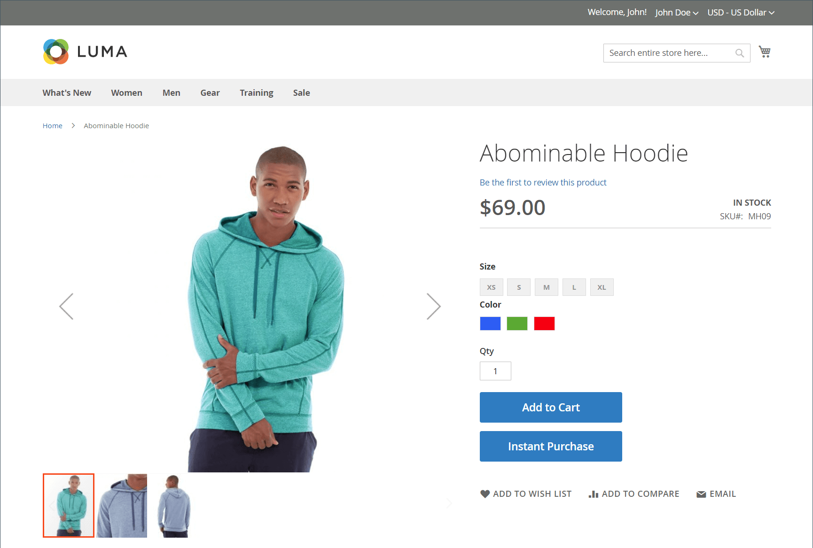

# Sofortkauf

_Sofortiger Kauf_ ermöglicht es Kunden, den Checkout-Prozess mithilfe von Informationen, die in ihrem Konto gespeichert sind, zu beschleunigen. Wenn diese Option aktiviert ist _wird die Schaltfläche_ Sofortkauf“ unter der Schaltfläche _Zum Warenkorb hinzufügen_ auf der Produktseite für Kunden angezeigt, die die Anforderungen erfüllen.

{width="700" zoomable="yes"}

## Kundenanforderungen

- Der Kunde [ bei ](../customers/customer-sign-in.md) Konto angemeldet.

- Das Kundenkonto hat eine [Standard-Rechnungs- und Lieferadresse](../customers/account-dashboard-address-book.md).

- Mindestens eine [Versandmethode](delivery.md) ist für das Land verfügbar, das in der Standard-Versandadresse angegeben ist.

- Für das Kundenkonto ist eine [gespeicherte ](../stores-purchase/stored-payment-methods.md)&quot; mit aktiviertem Tresor verfügbar.

  Die folgenden Zahlungsmethoden können verwendet werden, um einen sicheren Zugriff auf gespeicherte Kreditkarteninformationen zu ermöglichen:

   - [Braintree-Kreditkarten](braintree.md) (Sofortkauf kann nicht mit Braintree-Kreditkarten verwendet werden, wenn 3D Secure aktiviert ist.)
   - [Braintree mit aktiviertem PayPal](braintree.md)
   - [PayPal Payflow Pro](paypal-payflow-pro.md)

## Sofortiger Kauf in der Storefront

1. In der Storefront navigiert der Kunde zur Produktseite des zu kaufenden Artikels.

1. Wählt die erforderlichen Optionen aus und klickt **[!UICONTROL Instant Purchase]**.

   {width="500" zoomable="yes"}

1. Prüft die **[!UICONTROL Instant Purchase Confirmation]** und klickt **[!UICONTROL OK]**, um die Transaktion abzuschließen.

   Eine Bestätigungsmeldung und eine Bestellnummer werden oben auf der Produktseite angezeigt.

## Instant Purchase konfigurieren

### Schritt 1: Konfigurationsseite öffnen

1. Navigieren Sie in _Admin_-Seitenleiste zu **[!UICONTROL Stores]** > _[!UICONTROL Settings]_>**[!UICONTROL Configuration]**.

### Schritt 2: Konfigurieren des Tresors für die Zahlungsmethode

Sie können Instant Purchase mit Braintree oder Payment Services für Adobe Commerce und Magento Open Source verwenden. Das Vaulting muss aktiviert sein, damit ein Käufer die Funktion Sofortkauf verwenden kann.

Erfahren Sie, wie Sie die Zahlungsmethode konfigurieren und Vaulting für Braintree oder Payment Services aktivieren:

- [Braintree](braintree.md)
- [Dokumentation zu Zahlungsdiensten](https://experienceleague.adobe.com/docs/commerce/payment-services/guide-overview.html?lang=de)

### Schritt 3: Sofortigen Kauf aktivieren

1. Wählen Sie im linken Bedienfeld unter dem Abschnitt _[!UICONTROL Sales]_&#x200B;die Option **[!UICONTROL Sales]**&#x200B;aus.

1. Erweitern Sie  den Abschnitt **[!UICONTROL Instant Purchase]** .

1. Wenn diese Änderung für eine bestimmte Store-Ansicht gilt, wählen [die Store-Ansicht](../configuration-reference/scope-change.md#set-the-scope), für die die Konfiguration gilt.

   Wenn Sie dazu aufgefordert werden, klicken Sie auf **[!UICONTROL OK]** , um fortzufahren.

1. Legen Sie **[!UICONTROL Enabled]** auf `Yes` fest.

1. Geben Sie die **[!UICONTROL Button Text]** ein, die auf der Schaltfläche angezeigt werden soll.

   Der Schaltflächentext kann für jede Shop-Ansicht oder Sprache geändert werden. Standardmäßig ist der Schaltflächentext `Instant Purchase`.

   {width="600" zoomable="yes"}

   Eine ausführliche Beschreibung jeder dieser Konfigurationseinstellungen finden Sie unter [Sofortkauf](../configuration-reference/sales/sales.md#instant-purchase) im _Konfigurationshandbuch_.

1. Klicken Sie auf **[!UICONTROL Save Config]**.

1. Wenn Sie aufgefordert werden, den Cache zu aktualisieren, klicken Sie in der Systemmeldung auf **[!UICONTROL Cache Management]** und befolgen Sie die Anweisungen zum Leeren des Cache.
