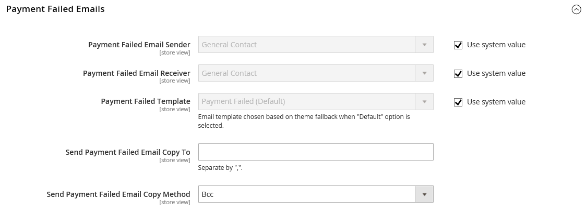

# Benachrichtigung über Zahlungsausfälle

Eine Benachrichtigung wird an den Store-Kontakt oder einen designierten Admin-Benutzer gesendet, wenn die beim Checkout ausgewählte Zahlungsmethode die Transaktion nicht abschließen kann.

## Schritt 1: E-Mail-Vorlage aktualisieren

Stellen Sie sicher, dass Sie die erforderliche E-Mail-Vorlage aktualisiert haben, um Ihre Marke widerzuspiegeln. Eine vollständige Liste der Vorlagen finden Sie unter [E-Mail-Vorlagenliste](../systems/email-templates.md#email-template-list).

## Schritt 2: Konfigurieren der E-Mails für fehlgeschlagene Zahlungen

1. Navigieren Sie in _Admin_-Seitenleiste zu **[!UICONTROL Stores]** > _[!UICONTROL Settings]_>**[!UICONTROL Configuration]**.

1. Erweitern Sie im linken Bereich **[!UICONTROL Sales]** und wählen Sie **[!UICONTROL Checkout]**.

1. Erweitern Sie  den Abschnitt **[!UICONTROL Payment Failed Emails]** .

   {width="600" zoomable="yes"}

1. Optionen für E-Mails mit fehlgeschlagener Zahlung festlegen:

   - Legen Sie **[!UICONTROL Payment Failed Email Sender]** auf den Store-Kontakt fest, der als Absender der Nachricht angezeigt wird.
   - Legen Sie **[!UICONTROL Payment Failed Email Receiver]** auf den Store-Kontakt fest, der Benachrichtigungen über fehlgeschlagene E-Mail-Übertragungen erhalten soll.
   - Legen Sie **[!UICONTROL Payment Failed Template]** auf die Vorlage fest, die für die E-Mail verwendet wird, die gesendet wird, wenn die Zahlungsmethode beim Checkout fehlschlägt.

1. Geben Sie **[!UICONTROL Send Payment Failed Email Copy To]** die E-Mail-Adresse der Person ein, die eine Kopie der Benachrichtigung über fehlgeschlagene Zahlungen erhalten soll.

   Wenn Sie eine Kopie an mehrere Empfänger senden, trennen Sie jede Adresse durch ein Komma.

1. Legen Sie **[!UICONTROL Payment Failed Copy Method]** auf eine der folgenden Einstellungen fest:

   - `Bcc` - Sendet eine _Blinde Höflichkeitskopie_ indem der Empfänger in die Kopfzeile derselben E-Mail eingefügt wird, die an den Kunden gesendet wird. Der BCC-Empfänger ist für den Kunden nicht sichtbar.
   - `Separate Email` - Sendet die Kopie als separate E-Mail.

1. Klicken Sie auf **[!UICONTROL Save Config]**.
