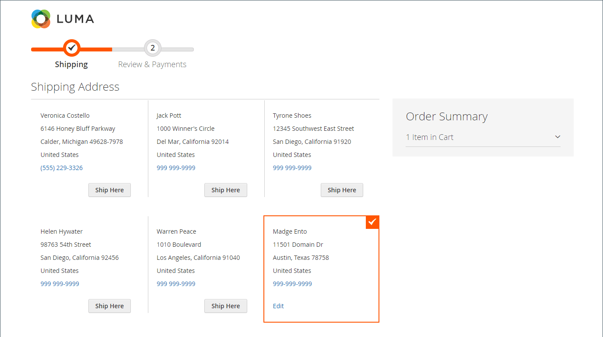

# Checkout-Prozess und Optionen

Wenn der Checkout-Prozess beginnt, wechselt die Transaktion zu einem sicheren, verschlüsselten Kanal. Ein Vorhängeschloss-Symbol wird in der Adressleiste des Browsers angezeigt, und die URL ändert sich von `http` zu `https`.

## Prozess

Das Ziel des Checkout-Prozesses besteht darin, die Informationen zu sammeln, die zum Abschließen der Transaktion erforderlich sind. Die _Checkout_-Seite führt den Kunden durch jeden Schritt des Prozesses. Kunden, die bei ihren Konten angemeldet sind, können den Checkout schnell abschließen, da ein Großteil der Informationen bereits in ihren Konten vorhanden ist. Kunden, die mit einem Unternehmenskonto verknüpft sind, das Bestellungen verwendet, haben einen etwas anderen Workflow.

### Lieferung

Der erste Schritt des Checkout-Prozesses besteht darin, dass der Kunde die Informationen zur Versandadresse ausfüllt und die Versandmethode wählt. Wenn der Kunde über ein Konto verfügt, wird die Lieferadresse automatisch eingegeben, kann aber bei Bedarf geändert werden.

 (nur Adobe Commerce) Das Format der Straßenadresse für den Empfänger und den Absender wird durch die Eigenschaften des [Kundenadressattributs) &#x200B;](../customers/address-attributes.md). Die Eingabevalidierungseinstellung bestimmt die gültigen Zeichen, die in einer Versandadresse verwendet werden können.

Die Fortschrittsleiste oben auf der Seite folgt jedem Schritt des Checkout-Prozesses und die Bestellzusammenfassung zeigt die bisher eingegebenen Informationen an.

{width="600" zoomable="yes"}

#### An andere Adresse versenden

1. Wenn zusätzliche Einträge im Adressbuch vorhanden sind, findet der Kunde die Adresse, an die die Bestellung versendet werden soll.

1. Klicken Sie auf **[!UICONTROL Ship Here]**, um die Adresse auszuwählen.

#### Adresse hinzufügen

1. Am Ende des _[!UICONTROL Shipping Address]_&#x200B;Abschnitts klickt der Kunde auf **[!UICONTROL + New Address]**.

1. Füllen Sie das _[!UICONTROL Shipping Address]_&#x200B;Formular aus.

   Standardmäßig werden der Vor- und Nachname des Kunden zunächst im Formular angezeigt.

   {width="600" zoomable="yes"}

1. Um die neue Adresse im Adressbuch zu speichern, aktiviert der Kunde das Kontrollkästchen am unteren Rand des Formulars.

1. Klicks **[!UICONTROL Save Address]**.

   Die neue Adresse ist jetzt als Versandadresse ausgewählt.

   {width="600" zoomable="yes"}

#### Versandart wählen

1. In der Liste der [Versand](delivery.md)-Methoden wählt der Kunde die Option aus, die er verwenden möchte.

   {width="600" zoomable="yes"}

1. Klicks **[!UICONTROL Next]** zum Fortfahren.

### Überprüfung und Zahlungen - Reguläre Bestellung

Im zweiten Schritt des Checkout-Prozesses wählt der Kunde die [Zahlungsmethode](payments.md) und wendet alle Coupons mit Aktionscodes auf den Kauf an. Alle Informationen können überprüft und bei Bedarf bearbeitet werden. Sofern aktiviert, muss der Kunde den Verkaufsbedingungen zustimmen, bevor er die Bestellung aufgibt.

>[!NOTE]
>
>Obwohl Commerce die Konfiguration mehrerer Gutscheincodes ermöglicht, kann eine Kundin oder ein Kunde nur einen Gutscheincode auf den Warenkorb anwenden. (Weitere Informationen finden Sie [Gutscheincodes](../merchandising-promotions/price-rules-cart-coupon.md).)

{width="700" zoomable="yes"}

### Überprüfen und Zahlungen - Bestellung

 (nur in Adobe Commerce B2B verfügbar)

Wenn ein Kunde mit einem Unternehmen verknüpft ist, das [Bestellungen](../b2b/purchase-order-flow.md) aktiviert hat, werden alle Bestellungen als Bestellungen verarbeitet. Verfügbare Zahlungsmethoden werden durch die Einstellungen des Firmenkontos bestimmt.

1. Der Kunde wählt eine Zahlungsmethode aus.

   Bei Verwendung der _Zahlung auf Konto_-Methode kann das [!UICONTROL Custom Reference Number] Feld verwendet werden, um auf eine Rechnungsnummer zu verweisen.

1. Der Kunde klickt auf **[!UICONTROL Place Purchase Order]**.

   Die Bestellung wird aufgegeben.

Wenn das Unternehmen &quot;[&quot; eingerichtet hat](../b2b/account-dashboard-approval-rules.md) durchläuft die Bestellung den Genehmigungsprozess. Andernfalls wird es sofort verarbeitet.

{width="700" zoomable="yes"}

### Anzahl der in der Bestellübersicht angezeigten Artikel

Admin-Benutzer können die maximale Anzahl der Artikel ändern, die in der Bestellzusammenfassung an der Kasse angezeigt werden, um die Anzeige mit weniger Produkten zu optimieren. Standardmäßig ist dieser Wert auf 10 festgelegt.

{width="700" zoomable="yes"}

1. Navigieren Sie in _Admin_-Seitenleiste zu **[!UICONTROL Stores]** > _[!UICONTROL Settings]_>**[!UICONTROL Configuration]**.

1. Erweitern Sie im linken Bereich **[!UICONTROL Sales]** und wählen Sie **[!UICONTROL Checkout]**.

1. Erweitern Sie  den Abschnitt **[!UICONTROL Checkout Options]** .

1. Geben Sie **[!UICONTROL Maximum Number of Items to Display in Order Summary]** die maximale Anzahl der anzuzeigenden Elemente ein.

1. Klicken Sie auf **[!UICONTROL Save Config]**.

   Mit diesem Update ist die Bestellübersicht, die während des Checkouts angezeigt wird, auf die angegebene Artikelmenge beschränkt.

### Bestellbestätigung

Die Bestellbestätigung wird nach der Bestellung angezeigt. Für registrierte Kunden enthält die Seite die Bestellnummer mit einem Link zum Konto des Kunden und einen Link zum Generieren einer Quittung. Registrierte Kunden werden gebeten, Bestellbestätigungs- und Tracking-Informationen per E-Mail zu erwarten. Die Gäste werden aufgefordert, ein Konto zu erstellen, um die Bestellung zu verfolgen. Registrierte Kunden können eine Quittung generieren, indem sie auf einen Link klicken.

Die Seite zur Bestellbestätigung wird auch als _Erfolgsseite_ bezeichnet und von Analytics-Programmen zur Verfolgung von Konversionen verwendet.

{width="700" zoomable="yes"}

## Checkout-Optionen

Die Checkout-Optionen steuern verschiedene Attribute für die Checkout-Seite, einschließlich des Layouts. Es gibt Optionen, die Sie konfigurieren können, um Einschränkungen für das Auschecken zu definieren, einschließlich des Zulassen eines Gast-Auscheckens und der Durchsetzung einer Vereinbarung mit den allgemeinen Geschäftsbedingungen. Es gibt auch Möglichkeiten, die Anzeige von Informationen während des Checkout-Prozesses zu steuern.

{width="700" zoomable="yes"}

Eine ausführliche Beschreibung jeder dieser Konfigurationseinstellungen finden Sie unter [Checkout-Optionen](../configuration-reference/sales/checkout.md#checkout-options) im _Konfigurationsreferenzhandbuch_.

### Ändern der Checkout-Optionen

1. Navigieren Sie in _Admin_-Seitenleiste zu **[!UICONTROL Stores]** > _[!UICONTROL Settings]_>**[!UICONTROL Configuration]**.
1. Erweitern Sie im linken Bereich **[!UICONTROL Sales]** und wählen Sie **[!UICONTROL Checkout]**.
1. Legen Sie eine der folgenden erforderlichen Optionen fest.
1. Klicken Sie auf **[!UICONTROL Save Config]**.

1. Erweitern Sie  den Abschnitt **[!UICONTROL Checkout Options]** .

1. Wenn die Einstellungen für eine bestimmte Store-Ansicht gelten, wählen [die Store-Ansicht aus](../configuration-reference/scope-change.md#set-the-scope) für die die Konfiguration gilt.

   Wenn Sie dazu aufgefordert werden, klicken Sie auf **[!UICONTROL OK]** , um fortzufahren.

1. Legen Sie die Checkout-Optionen fest.

1. Klicken Sie auf **[!UICONTROL Save Config]**.

### Verfügbare Checkout-Optionen

| Feld | [Umfang](../getting-started/websites-stores-views.md#scope-settings) | Beschreibung |
|--- |--- |--- |
| [!UICONTROL Enable Onepage Checkout] | Shop-Ansicht | Bestimmt, ob [einseitiger Checkout](checkout-one-page.md) das standardmäßige Checkout-Format ist. Optionen: Ja / Nein |
| [!UICONTROL Allow Guest Checkout] | Shop-Ansicht | Legt fest, ob Gäste für ein Konto [&#x200B; Ihrem Geschäft &#x200B;](checkout-guest.md) (Checkout ohne Registrierung) durchlaufen können. Optionen: `Yes` / `No` |
| [!UICONTROL Enable Terms and Conditions] | Shop-Ansicht | Legt fest, ob Kunden vor dem Kauf den [Geschäftsbedingungen](terms-and-conditions.md) des Verkaufs zustimmen müssen. Optionen: `Yes` / `No` |
| [!UICONTROL Display Billing Address On] | Shop-Ansicht | Bestimmt den Speicherort der Rechnungsadresse während des Checkouts. Optionen: `Payment Method` / `Payment Page` |
| [!UICONTROL Maximum Number of Items to Display in Order Summary] | Shop-Ansicht | Legt die maximale Anzahl von Artikeln fest, die während des Checkouts in der Bestellübersicht angezeigt werden können. Der Standardwert lautet `10`. |
| [!UICONTROL Enable Address Search] | Website |  (nur Adobe Commerce) Legt fest, ob Kunden die [Adresssuche](checkout-address-search.md) für _Versand_ und die _Überprüfen und Zahlungen_ verwenden können. Wenn diese Funktion aktiviert ist, können Sie über die _[!UICONTROL Number of Customer Addresses Limit]_&#x200B;die Anzahl der gespeicherten Adressen festlegen, die erforderlich sind, um diese Funktion während des Checkouts zu aktivieren. Optionen: `Yes` / `No` |
| [!UICONTROL Number of Customer Addresses Limit] | Website |  (nur Adobe Commerce) Wenn die Adresssuche **[!UICONTROL Enabled]** ist, bestimmt die Anzahl der gespeicherten Adressen, die erforderlich sind, um diese Funktion während des Checkouts zu aktivieren. Wenn die Anzahl der gespeicherten Adressen des Kunden diese Zahl erreicht oder überschreitet, wird nur die Standardadresse in den Schritten _Versand_ und _Überprüfen und_) gerendert. Der Kunde kann eine Suchfunktion nutzen, um die ausgewählte Adresse zu ändern. Der Standardwert lautet 10. |

{style="table-layout:auto"}
