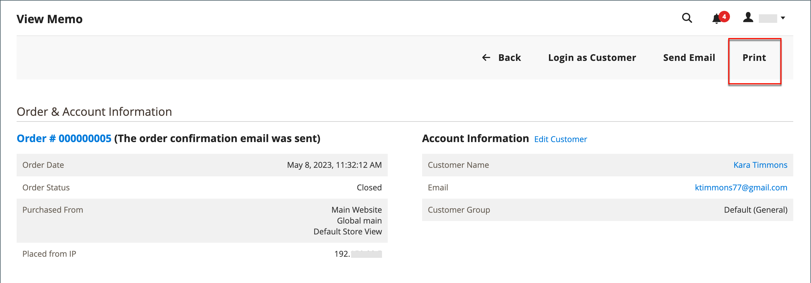
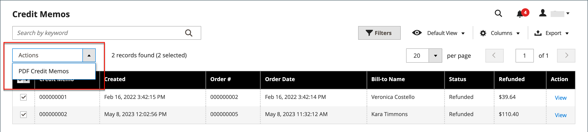

# Gutschrift ausstellen

Bevor eine Gutschrift gedruckt werden kann, muss sie zunächst für eine &quot;[ Bestellung“ generiert ](invoices.md#create-an-invoice). Sie können sowohl online als auch offline Rückerstattungen (teilweise oder vollständig) von einer offenen Gutschrift ausstellen, je nach Zahlungsmethode.

-  (nur Adobe Commerce) Rückerstattungen können für Speichergutschriften angewendet werden.
-  (verfügbar mit Adobe Commerce B2B)-Rückerstattungen können auf Firmenkredite angewendet werden.
- Einkäufe mit Kreditkarte können entweder online oder offline zurückerstattet werden.
- Einkäufe per Scheck oder Zahlungsanweisung müssen offline zurückerstattet werden.

Für jede Gutschrift mit dem Status [Offen](order-status.md) muss eine Rückerstattung fällig sein.

Mit Gutschriften können Sie:

- Den vollen Betrag einer Rechnung zurückerstatten.
- Erstattet einen Teilbetrag einer Rechnung.
- Rückerstattung mehrerer Teilbeträge einer Rechnung.
- Mehrere Rechnungen pro Bestellung zurückerstatten, wobei der Gesamtbetrag der Bestellung nicht überschritten werden darf.
- Erstattet einen Teil der Menge für einen Zeileneintrag, z. B. drei der fünf Hemden in einer Bestellung.

Weitere Informationen [ Sie unter ](invoices.md#create-an-invoice) erstellen.

## Einstellung der Zahlungsaktion

Der Rückerstattungs-Workflow für per Kreditkarte bezahlte Bestellungen wird durch die Einstellung [Zahlungsaktion](../configuration-reference/sales/payment-methods.md#payment-actions) in der Konfiguration für jede verfügbare Zahlungsmethode bestimmt. Rückerstattungen können erst ausgestellt werden, wenn die Transaktion abgewickelt ist.

{width="600" zoomable="yes"}

- Wenn die Zahlungsaktion für Ihre konfigurierte Zahlungsmethode auf `Authorize` festgelegt ist, müssen Sie zunächst die Rechnung vom Administrator generieren, bevor eine Gutschrift erstellt werden kann.
- Wenn die Zahlungsaktion für Ihre konfigurierte Zahlungsmethode auf `Authorize and Capture` gesetzt ist, wurde die Rechnung bereits vom Zahlungsverarbeiter generiert, aber die Mittel sind erst verfügbar, wenn die Transaktion abgewickelt wurde. Diese kurze Wartezeit wird von vielen Zahlungsverarbeitern als Sicherheitsmaßnahme empfohlen und kann in der Regel automatisch abgewickelt werden. Transaktionen können auch manuell von Ihrem Händlerkonto mit dem Zahlungsprozessor abgewickelt werden.
-  (Nur Adobe Commerce) Wenn Sie eine Gutschrift für eine Bestellung erstellen, die Geschenkoptionen enthält, wird die Rückerstattung für die Geschenkverpackung und/oder die gedruckte Karte im Abschnitt „Rückerstattungssummen“ der Gutschrift angezeigt. Um diese Kosten aus dem zu erstattenden Betrag auszuschließen, geben Sie den Betrag als Anpassungsgebühr ein. Wenn mehrere Gutschriften für dieselbe Bestellung ausgestellt werden, erscheint die Rückerstattung für Geschenkoptionen nur in der ersten Gutschrift.

## Erstellen einer Gutschrift

Bestimmen Sie die Art der Rückerstattung, die Sie ausstellen möchten - für einen [Kreditkauf](#issue-a-refund-for-a-credit-purchase) oder für [Scheck oder ](#issue-an-offline-refund-for-check-or-money-order)) und generieren Sie die Gutschrift und stellen Sie eine Rückerstattung aus.

### Rückerstattung für einen Kreditkauf ausstellen

1. Navigieren Sie in der _Admin_-Seitenleiste zu **[!UICONTROL Sales]** > **[!UICONTROL Orders]**.

   {width="700" zoomable="yes"}

1. Suchen Sie die Reihenfolge im Raster und klicken Sie auf **[!UICONTROL View]**.

1. Wenn die Schaltfläche _[!UICONTROL Credit Memo]_in der Schaltflächenleiste sichtbar ist, führen Sie einen der folgenden Schritte aus:

   - Um eine `offline` Rückerstattung zu erhalten, gehen Sie zu Schritt #6.
   - Um eine `online` Rückerstattung zu erhalten, fahren Sie mit Schritt #4 fort.

   Weitere Informationen [ Offline- und Online-Rückerstattungen finden Sie ](credit-memos.md)Gutschriften“.

1. Klicken Sie im linken Bedienfeld auf **[!UICONTROL Invoices]** .

1. Suchen Sie die Rechnung im Raster und klicken Sie auf **[!UICONTROL View]**.

   {width="700" zoomable="yes"}

1. Scrollen Sie nach unten zum Abschnitt **[!UICONTROL Invoice Totals]** der Rechnung, stellen Sie sicher, dass die Rechnung auf `Capture Online` eingestellt ist, und klicken Sie auf **[!UICONTROL Submit Invoice]**.

   {width="600" zoomable="yes"}

   Wenn diese Option nicht verfügbar ist, wurde die Rechnung bereits erstellt. Fahren Sie mit dem nächsten Schritt fort.

1. Klicken Sie oben auf der Rechnung in der Schaltflächenleiste auf **[!UICONTROL Credit Memo]**.

1. Überprüfen Sie die Informationen im Abschnitt **[!UICONTROL Items to Refund]** und gehen Sie gegebenenfalls wie folgt vor:

   - Aktivieren Sie das Kontrollkästchen &quot;**[!UICONTROL Return to Stock]**&quot;, um das Produkt wieder in den Bestand zurückzusetzen.

     Das Produkt wird automatisch auf Lager _, wenn_ Produktaktienoptionen“ auf &quot;`Automatically Return Credit Memo Item to Stock`&quot; eingestellt ist. Bei aktivierter [Inventory management](../inventory-management/enable.md) kehrt der Artikel an die Quelle zurück, die die Sendung gesendet hat.

   - Aktualisieren Sie die **[!UICONTROL Qty to Refund]** und klicken Sie auf **[!UICONTROL Update Qty's]**.

     {width="600" zoomable="yes"}

1. Aktualisieren Sie den Abschnitt **[!UICONTROL Refunds Totals]** wie folgt:

   - Geben Sie **[!UICONTROL Refund Shipping]** einen beliebigen Betrag ein, der von der Versandgebühr erstattet werden soll.

     In diesem Feld wird zunächst der gesamte Versandbetrag aus der Bestellung angezeigt, der für die Rückerstattung verfügbar ist. Es ist gleich dem gesamten Versandbetrag aus der Bestellung, abzüglich des Versandbetrags, der bereits zurückerstattet wurde. Wie die Menge kann die Menge reduziert, aber nicht erhöht werden.

   - Geben Sie **[!UICONTROL Adjustment Refund]** einen Wert ein, der dem Gesamtbetrag hinzugefügt werden soll, der als zusätzliche Rückerstattung erstattet wird und nicht für einen bestimmten Teil der Bestellung gilt (Versand, Artikel oder Steuer). Es kann auch für eine teilweise Rückerstattung mit virtuellem Geld verwendet werden, z. B. eine Geschenkkarte, wenn ein Administrator zuerst eine nicht virtuelle Zahlungsmethode zurückerstatten möchte.

     Der eingegebene Betrag kann den Gesamtbetrag der Erstattung nicht über den gezahlten Betrag hinaus erhöhen.

   - Geben Sie **[!UICONTROL Adjustment Fee]** einen Wert ein, der vom erstatteten Gesamtbetrag abgezogen werden soll.

     Dieser Betrag wird nicht von einem bestimmten Abschnitt der Bestellung abgezogen, wie z. B. Versand, Artikel oder Steuer.

1. Um einen Kommentar hinzuzufügen, geben Sie den Text in das **[!UICONTROL Credit Memo Comments]** ein.

   - Um eine E-Mail-Benachrichtigung an den Kunden zu senden, aktivieren Sie das Kontrollkästchen **[!UICONTROL Email Copy of Credit Memo]** .

1. Klicken Sie auf **[!UICONTROL Update Totals]**.

1. Führen Sie die folgenden Schritte aus, sofern zutreffend:

   -  (nur Adobe Commerce) Aktivieren Sie das Kontrollkästchen &quot;**[!UICONTROL Refund to Store Credit]**&quot;, um den Betrag an das Guthaben des Kunden zurückzuzahlen.

   -  (verfügbar mit Adobe Commerce B2B) Aktivieren Sie das Kontrollkästchen &quot;**[!UICONTROL Refund to Company Credit]**&quot;, um den Betrag auf das Firmenguthaben des Kunden zurückzuerstatten.

   - Um eine Offline-Rückerstattung zu beantragen, klicken Sie auf **[!UICONTROL Refund Offline]**.

   - Um eine Online-Rückerstattung zu beantragen, klicken Sie auf **[!UICONTROL Refund]**.

   -  (verfügbar mit Adobe Commerce B2B) Wenn der Kauf mit Firmenguthaben bezahlt wurde, klicken Sie auf **[!UICONTROL Refund to Company Credit]**.

   Weitere Informationen [ Offline- und Online-Rückerstattungen finden Sie ](credit-memos.md)Gutschriften“.

   {width="600" zoomable="yes"}

### Offline-Rückerstattung für Scheck oder Zahlungsanweisung vornehmen

1. Navigieren Sie in der _Admin_-Seitenleiste zu **[!UICONTROL Sales]** > **[!UICONTROL Orders]**.

1. Suchen Sie die abgeschlossene Bestellung im Raster und öffnen Sie sie, indem Sie auf den **[!UICONTROL View]** Link klicken.

1. Klicken Sie oben auf der Seite in der Schaltflächenleiste auf **[!UICONTROL Invoice]**.

1. Scrollen Sie nach unten zum Seitenende und klicken Sie auf **[!UICONTROL Submit Invoice]**.

1. Klicken Sie oben auf der Rechnung in der Schaltflächenleiste auf **[!UICONTROL Credit Memo]**.

   {width="600" zoomable="yes"}

1. Überprüfen Sie die Informationen im Abschnitt **[!UICONTROL Items to Refund]** und gehen Sie gegebenenfalls wie folgt vor:

   {width="600" zoomable="yes"}

   - Aktivieren Sie das Kontrollkästchen **[!UICONTROL Return to Stock]** , wenn Sie das zurückgegebene Produkt an den Bestand zurückgeben möchten.

     Bei aktiviertem Inventory management wird die Lagermenge an die Quelle zurückgegeben, die die Lieferung versendet hat. Das Produkt wird automatisch auf Lager [, wenn ](../inventory-management/enable.md)Produktaktienoptionen“ auf &quot;`Automatically Return Credit Memo Item to Stock`&quot; eingestellt ist.

   - Aktualisieren Sie die **[!UICONTROL Qty to Refund]** und klicken Sie auf **[!UICONTROL Update Qty's]**.

     Der gutzuschreibende Betrag darf den für die Erstattung verfügbaren Höchstbetrag nicht überschreiten.

1. Aktualisieren Sie den Abschnitt **[!UICONTROL Refunds Totals]** entsprechend:

   - Geben Sie **[!UICONTROL Refund Shipping]** einen beliebigen Betrag ein, der von der Versandgebühr erstattet werden soll.

     In diesem Feld wird zunächst der gesamte Versandbetrag aus der Bestellung angezeigt, der für die Rückerstattung verfügbar ist. Es ist gleich dem gesamten Versandbetrag aus der Bestellung, abzüglich des Versandbetrags, der bereits zurückerstattet wurde. Wie die Menge kann die Menge reduziert, aber nicht erhöht werden.

   - Geben Sie **[!UICONTROL Adjustment Refund]** einen Wert ein, der dem Gesamtbetrag hinzugefügt werden soll, der als zusätzliche Rückerstattung erstattet wird und nicht für einen bestimmten Teil der Bestellung gilt (Versand, Artikel oder Steuer). Es kann auch für eine teilweise Rückerstattung mit virtuellem Geld verwendet werden, z. B. eine Geschenkkarte, wenn ein Administrator zuerst eine nicht virtuelle Zahlungsmethode zurückerstatten möchte.

     Der eingegebene Betrag kann den Gesamtbetrag der Erstattung nicht über den gezahlten Betrag hinaus erhöhen.

   - Geben Sie **[!UICONTROL Adjustment Fee]** einen Wert ein, der vom erstatteten Gesamtbetrag abgezogen werden soll.

     Dieser Betrag wird nicht von einem bestimmten Abschnitt der Bestellung abgezogen, wie z. B. Versand, Artikel oder Steuer.

   - Wenn der Kauf mit Filialguthaben bezahlt wurde, aktivieren Sie das Kontrollkästchen &quot;**[!UICONTROL Refund to Store Credit]**&quot;, um den Betrag dem Kundenkonto gutzuschreiben.

1. Um einen Kommentar hinzuzufügen, geben Sie den Text in das **[!UICONTROL Credit Memo Comments]** ein und gehen Sie folgendermaßen vor:

   - Um eine E-Mail-Benachrichtigung an den Kunden zu senden, aktivieren Sie das Kontrollkästchen **[!UICONTROL Email Copy of Credit Memo]** .

   - Um die in die E-Mail eingegebenen Kommentare einzuschließen, aktivieren Sie das Kontrollkästchen **[!UICONTROL Append Comments]** .

     Der Status einer Gutschriftsbenachrichtigung wird in der abgeschlossenen Gutschrift neben der Gutschriftsnummer angezeigt.

     {width="600" zoomable="yes"}

1. Um den Prozess abzuschließen und die Rückerstattung zu erhalten, klicken Sie auf **[!UICONTROL Refund Offline]**.

## Feldbeschreibungen

### [!UICONTROL Order & Account Information]

| Feld | Beschreibung |
|--- |--- |
| [!UICONTROL Order Number] | Die Bestellnummer wird in der _Bestell- und Kontoinformationen_ angezeigt, gefolgt von einem Hinweis, der angibt, ob die Bestätigungs-E-Mail gesendet wurde. |
| [!UICONTROL Order Date] | Datum und Uhrzeit der Auftragserteilung. |
| [!UICONTROL Order Status] | Gibt den Bestellstatus als `Complete` an. |
| [!UICONTROL Purchased From] | Gibt die Website-, Store- und Store-Ansicht an, in der die Bestellung aufgegeben wurde. |
| [!UICONTROL Placed from IP] | Zeigt die IP-Adresse des Computers an, von dem aus die Bestellung aufgegeben wurde. |

{style="table-layout:auto"}

### [!UICONTROL Account Information]

| Feld | Beschreibung |
|--- |--- |
| [!UICONTROL Customer Name] | Der Name des Kunden oder Käufers, der die Bestellung aufgegeben hat. Der Kundenname ist mit dem Kundenprofil verknüpft. |
| [!UICONTROL Email] | Die E-Mail-Adresse des Kunden oder Käufers. Die E-Mail-Adresse ist mit dem Öffnen einer neuen E-Mail-Nachricht verknüpft. |
| [!UICONTROL Customer Group] | Der Name der Kundengruppe oder des freigegebenen Katalogs, dem der Kunde zugewiesen ist. |
| [!UICONTROL Company Name] |  (verfügbar mit Adobe Commerce B2B) Der Name des Unternehmens, das mit dem Käufer verbunden ist und in dessen Namen die Bestellung aufgegeben wird. Der Firmenname ist mit dem Firmenprofil verknüpft. |

{style="table-layout:auto"}

### [!UICONTROL Address Information]

| Feld | Beschreibung |
|--- |--- |
| [!UICONTROL Billing Address] | Der Name des Kunden oder Käufers, der die Bestellung aufgegeben hat, gefolgt von der Rechnungsadresse, der Telefonnummer und [MwSt](vat.md), falls zutreffend. Die Telefonnummer ist mit der automatischen Anwahl auf einem Mobilgerät verknüpft. |
| [!UICONTROL Shipping Address] | Der Name der Person, an die die Bestellung versendet werden soll, gefolgt von der Lieferadresse und der Telefonnummer. Die Telefonnummer ist mit der automatischen Anwahl auf einem Mobilgerät verknüpft. |

{style="table-layout:auto"}

### [!UICONTROL Payment & Shipping Method]

| Feld | Beschreibung |
|--- |--- |
| [!UICONTROL Payment Information] | Die Zahlungsmethode, die für die Bestellung verwendet werden soll, und die Bestellnummer, falls zutreffend, gefolgt von der Währung, die für die Bestellung verwendet wurde. Wird der Auftrag mit dem Firmenkredit ([) belastet](../b2b/enable-basic-features.md#configure-payment-on-account) wird der dem Konto belastete Betrag angegeben. |
| [!UICONTROL Shipping & Handling Information] | Die zu verwendende Versandmethode und etwaige Bearbeitungsgebühren. |

{style="table-layout:auto"}

### [!UICONTROL Items to Refund]

| Feld | Beschreibung |
|--- |--- |
| [!UICONTROL Product] | Produktname, SKU und Optionen (falls zutreffend). |
| [!UICONTROL Price] | Der Kaufpreis des Artikels. Bei Adobe Commerce B2B spiegelt dieser Wert ggf. alle Rabatte wider, die auf den Artikel aus dem freigegebenen Katalog angewendet wurden. |
| [!UICONTROL Qty] | Die bestellte Menge. |
| [!UICONTROL Return to Stock] | Kontrollkästchen, das angibt, ob das zurückgegebene Element auf Lager zurückgegeben werden soll. |
| [!UICONTROL Qty to Refund] | Gibt die Anzahl der vom Produkt zurückgegebenen Einheiten an. |
| [!UICONTROL Subtotal] | Die Zwischensumme ist der Einkaufspreis multipliziert mit der Menge der zurückgegebenen Produkteinheiten. |
| [!UICONTROL Tax Amount] | Der Steuerbetrag, der auf den zurückgegebenen Artikel als Dezimalwert angewendet wird. |
| [!UICONTROL Tax Percent] | Der Prozentsatz der Steuer, der auf den zurückgegebenen Artikel als Prozentsatz angewendet wurde. |
| [!UICONTROL Discount Amount] | Alle Rabatte, die für den zurückgegebenen Artikel gelten. |
| [!UICONTROL Row Total] | Die Gesamtsumme des Einzelpostens, einschließlich anfallender Steuern, die für die zurückgegebene Produktebene fällig sind, abzüglich Rabatte. |
| _Bestellsumme_ |  |

{style="table-layout:auto"}

### [!UICONTROL Credit Memo Comments]

| Feld | Beschreibung |
|--- |--- |
| [!UICONTROL Comment Text] | Ein Textfeld, in das der Kunde einen Kommentar zur Gutschrift eingeben kann. |

{style="table-layout:auto"}

### [!UICONTROL Refund Totals]

| Feld | Beschreibung |
|--- |--- |
| [!UICONTROL Refund Shipping] | Der zu erstattende Versandbetrag. |
| [!UICONTROL Adjustment Refund] | Ein Betrag, der dem Gesamtbetrag hinzugefügt wird, der als zusätzliche Rückerstattung zurückerstattet wird, die nicht für einen bestimmten Teil der Bestellung gilt, z. B. Versand, Artikel oder Steuer. Der eingegebene Betrag kann den Gesamtbetrag der Erstattung nicht über den gezahlten Betrag hinaus erhöhen. |
| [!UICONTROL Adjustment Fee] | Ein Betrag, der von dem insgesamt zurückerstatteten Betrag abgezogen wird, z. B. eine Gebühr für die Wiederverfügbarkeit oder ein Betrag, der mit Geschenkverpackungen oder Geschenkoptionen in Verbindung steht. |
| [!UICONTROL Grand Total] | Der zu erstattende Gesamtbetrag |
| [!UICONTROL Append Comments] | Kontrollkästchen, das bestimmt, ob Kommentare in der Gutschrift enthalten sind. |
| [!UICONTROL Email Copy of Credit Memo] | Kontrollkästchen, das bestimmt, ob eine Kopie der Gutschrift per E-Mail gesendet wird. |
| [!UICONTROL Refund to Store Credit] | -Kontrollkästchen (nur Adobe Commerce), das bestimmt, ob der Gesamtbetrag zurückerstattet werden soll ([)](../customers/store-credit-using.md). |
| [!UICONTROL Subtotal] |  (verfügbar mit Adobe Commerce B2B) Die Summe aller zurückzuerstattenden Zeileneinträge. |

{style="table-layout:auto"}

### Rückerstattungsschaltflächen

Die für die Bestellung verwendete Zahlungsmethode bestimmt die Rückerstattungsschaltflächen, die für eine Gutschrift verfügbar sind.

| Schaltfläche | Beschreibung |
|--- |--- |
| **[!UICONTROL Refund]** | Wenn der ursprüngliche Kauf per Kreditkarte über ein Zahlungs-Gateway bezahlt wurde, wird der Rückerstattungsbetrag vom Zahlungsverarbeiter verwaltet. Informationen zur Verwaltung von Rückerstattungen finden Sie in der von Ihrem Zahlungsanbieter bereitgestellten Dokumentation. |
| **[!UICONTROL Refund Offline]** | Wenn der ursprüngliche Kauf per Scheck oder Zahlungsanweisung bezahlt wurde, wird die Rückerstattung direkt an den Kunden gezahlt, indem ein Scheck, eine Geschenkkarte oder Bargeld ausgestellt wird, wenn Sie eine Ladenfront aus Backstein und Mörtel haben. Die Gutschrift dient als Nachweis für die Offline-Transaktion. |
| **[!UICONTROL Refund to Company Credit]** |  (verfügbar mit Adobe Commerce B2B) Wenn der Kauf auf Firmenkredite angerechnet wurde, wird die Rückerstattung auf das [Firmenkonto“ ](../b2b/credit-company.md). |

{style="table-layout:auto"}

## Gutschrift drucken

Zum Drucken oder Anzeigen der ausgefüllten Gutschrift muss ein PDF-Lesegerät installiert sein. Sie können [Adobe Reader][1] kostenlos herunterladen.

1. Navigieren Sie in _Admin_-Seitenleiste zu **[!UICONTROL Sales]** > _[!UICONTROL Operations]_>**[!UICONTROL Credit Memos]**.

1. Verwenden Sie eine der folgenden Methoden, um die Gutschrift zu drucken:

### Methode 1: Aktuelle Gutschrift drucken

1. Öffnen Sie im Raster die Gutschrift.

1. Klicken Sie auf **[!UICONTROL Print]**.

   {width="600" zoomable="yes"}

### Methode 2: Mehrere Gutschriften drucken

1. Aktivieren Sie in der Liste das Kontrollkästchen jeder Gutschrift, die Sie drucken möchten.

1. Legen Sie das **[!UICONTROL Actions]** auf `PDF Credit Memos` fest und klicken Sie auf **[!UICONTROL Submit]**.

   {width="600" zoomable="yes"}

1. Führen Sie nach Aufforderung einen der folgenden Schritte aus:

   - Um das Dokument zu speichern, klicken Sie auf **[!UICONTROL Save]** und befolgen Sie die Anweisungen, um die Datei auf Ihrem Computer zu speichern. Öffnen Sie nach Abschluss des Downloads die PDF in Adobe Reader und drucken Sie das Dokument aus.

   - Um das Dokument anzuzeigen, klicken Sie auf **[!UICONTROL Open]**. Die druckfertige PDF-Gutschrift wird in Adobe Reader geöffnet. Von hier aus können Sie die Gutschrift entweder ausdrucken oder auf Ihrem Computer speichern.

[1]: https://www.adobe.com/acrobat/pdf-reader.html "Adobe Reader abrufen"
