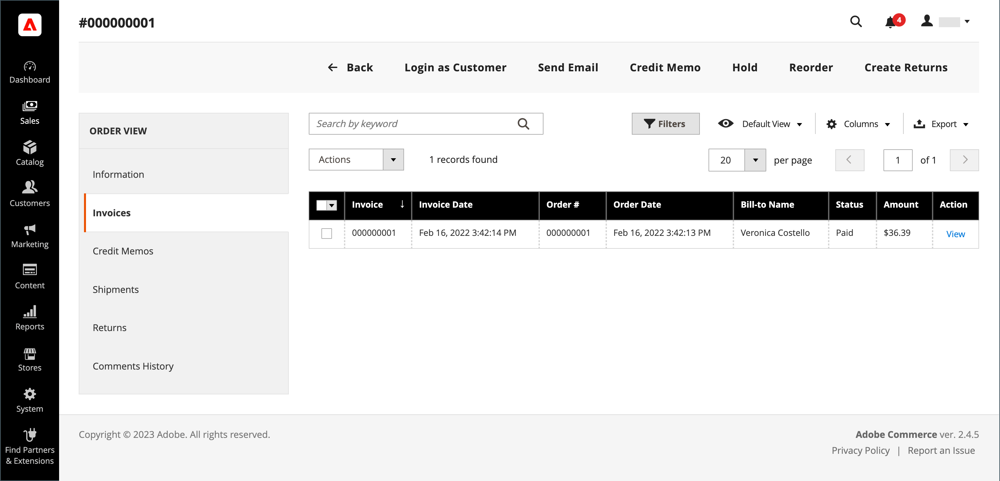

# Ein Kreditmemo ausgeben

Bevor ein Credit Memo gedruckt werden kann, muss es zunächst für eine [fakturierte Bestellung](invoices.md#create-an-invoice) generiert werden. Sie können je nach Zahlungsmethode sowohl Online- als auch Offline-Erstattungen (teilweise oder vollständig) aus einem offenen Kreditmemo ausstellen.

-  (nur Adobe Commerce) Erstattungen können auf die Speicherung von Guthaben angewendet werden.
-  (Verfügbar mit Adobe Commerce B2B) Rückerstattungen können auf Firmenkredite angewendet werden.
- Mit Kreditkarte getätigte Käufe können entweder online oder offline zurückerstattet werden.
- Käufe, die per Scheck oder Geldbestellung getätigt werden, müssen offline zurückerstattet werden.

Jedes Kreditmemo mit dem Status [Öffnung](order-status.md) hat eine ausstehende Rückerstattung.

Mit Kreditkarten können Sie:

- Den vollen Rechnungsbetrag zurückerstatten.
- Erstattung eines Teilbetrags der Rechnung.
- Rückerstattung mehrerer Teilbeträge einer Rechnung.
- Rückerstattung mehrerer Rechnungen pro Bestellung, um den Gesamtbetrag der Bestellung nicht zu überschreiten.
- Erstattet einen Teil der Menge für einen Zeileneintrag, z. B. drei der fünf Hemden in einer Bestellung.

Weitere Informationen finden Sie unter [Erstellen einer Rechnung](invoices.md#create-an-invoice) .

## Einstellung der Zahlungsaktion

Der Erstattungs-Workflow für Bestellungen, die mit Kreditkarte bezahlt werden, wird durch die Einstellung [Zahlungsaktion](../configuration-reference/sales/payment-methods.md#payment-actions) in der Konfiguration für jede verfügbare Zahlungsmethode bestimmt. Rückerstattungen können erst nach Abwicklung der Transaktion ausgegeben werden.

{width="600" zoomable="yes"}

- Wenn die Zahlungsaktion für Ihre konfigurierte Zahlungsmethode auf &quot;`Authorize`&quot;festgelegt ist, müssen Sie zuerst die Rechnung vom Administrator generieren, bevor ein Kreditmemo erstellt werden kann.
- Wenn die Zahlungsaktion für Ihre konfigurierte Zahlungsmethode auf &quot;`Authorize and Capture`&quot; gesetzt ist, wurde die Rechnung bereits vom Zahlungsverarbeiter erstellt, aber die Mittel sind erst verfügbar, wenn die Transaktion abgewickelt wurde. Diese kurze Wartezeit wird von vielen Zahlungsverarbeitern als Sicherheitsmaßnahme empfohlen und kann normalerweise automatisch durchgeführt werden. Transaktionen können auch manuell von Ihrem Händlerkonto beim Zahlungsverarbeiter abgewickelt werden.
-  (Nur Adobe Commerce) Wenn Sie ein Kreditmemo für eine Bestellung erstellen, die Geschenkoptionen enthält, wird die Rückerstattung für die Geschenkverpackung und/oder die gedruckte Karte im Abschnitt Rückerstattungssummen des Kreditkarten-Memos angezeigt. Um diese Kosten von dem zurückzuerstattenden Betrag auszuschließen, geben Sie den Betrag als Anpassungsgebühr an. Wenn mehrere Kreditkarten für dieselbe Bestellung ausgegeben werden, erscheint die Rückerstattung für Geschenkgutscheine nur in der ersten Kreditkarte.

## Erstellen Sie ein Kreditmemo

Bestimmen Sie die Art der Rückerstattung, die Sie vornehmen möchten - für einen [Kreditkauf](#issue-a-refund-for-a-credit-purchase) oder für [Scheck oder Geldauftrag](#issue-an-offline-refund-for-check-or-money-order) - und generieren Sie das Kreditmemo und geben Sie eine Rückerstattung aus.

### Rückerstattung für einen Kreditkauf

1. Wechseln Sie in der Seitenleiste _Admin_ zu **[!UICONTROL Sales]** > **[!UICONTROL Orders]**.

   {width="700" zoomable="yes"}

1. Suchen Sie die Reihenfolge im Raster und klicken Sie auf **[!UICONTROL View]**.

1. Wenn die Schaltfläche _[!UICONTROL Credit Memo]_in der Schaltflächenleiste sichtbar ist, führen Sie einen der folgenden Schritte aus:

   - Um eine `offline` -Rückerstattung zu erhalten, gehen Sie zu Schritt 6.
   - Um eine `online` -Rückerstattung zu erhalten, fahren Sie mit Schritt 4 fort.

   Weitere Informationen zu Offline- und Online-Erstattungen finden Sie unter [Credit Memos](credit-memos.md) .

1. Klicken Sie im linken Bereich auf **[!UICONTROL Invoices]** .

1. Suchen Sie die Rechnung im Raster und klicken Sie auf **[!UICONTROL View]**.

   {width="700" zoomable="yes"}

1. Scrollen Sie nach unten zum Abschnitt **[!UICONTROL Invoice Totals]** der Rechnung, überprüfen Sie, ob die Rechnung auf `Capture Online` festgelegt ist, und klicken Sie auf **[!UICONTROL Submit Invoice]**.

   {width="600" zoomable="yes"}

   Wenn diese Option nicht verfügbar ist, wird die Rechnung bereits erstellt. Fahren Sie mit dem nächsten Schritt fort.

1. Klicken Sie in der Schaltflächenleiste oben auf der Rechnung auf **[!UICONTROL Credit Memo]**.

1. Überprüfen Sie die Informationen im Abschnitt **[!UICONTROL Items to Refund]** und führen Sie gegebenenfalls die folgenden Schritte aus:

   - Um das Produkt wieder in den Bestand zu bringen, aktivieren Sie das Kontrollkästchen **[!UICONTROL Return to Stock]** .

     Das Produkt wird automatisch wieder auf Lager angezeigt, wenn _Produktaktivenoptionen_ auf `Automatically Return Credit Memo Item to Stock` gesetzt ist. Wenn [Inventory management aktiviert ist](../inventory-management/enable.md), kehrt das Element zu der Quelle zurück, die die Sendung gesendet hat.

   - Aktualisieren Sie die **[!UICONTROL Qty to Refund]** und klicken Sie auf **[!UICONTROL Update Qty's]**.

     {width="600" zoomable="yes"}

1. Aktualisieren Sie den Abschnitt **[!UICONTROL Refunds Totals]** wie folgt:

   - Geben Sie für **[!UICONTROL Refund Shipping]** einen Betrag ein, der von der Versandgebühr zurückerstattet werden soll.

     In diesem Feld wird zunächst der gesamte Versandbetrag aus der Bestellung angezeigt, die zur Rückerstattung verfügbar ist. Sie entspricht dem vollen Versandbetrag aus der Bestellung abzüglich des bereits zurückerstatteten Versandbetrags. Wie die Menge kann der Betrag reduziert, aber nicht erhöht werden.

   - Geben Sie für **[!UICONTROL Adjustment Refund]** einen Wert ein, der zum erstatteten Gesamtbetrag hinzugerechnet werden soll, und zwar als zusätzliche Erstattung, die nicht für einen bestimmten Teil der Bestellung gilt (Versand, Artikel oder Steuer). Es kann auch für die teilweise Rückerstattung mit virtuellem Geld, wie eine Geschenkkarte, verwendet werden, wenn ein Administrator eine nicht virtuelle Zahlungsmethode zuerst zurückzahlen möchte.

     Der angegebene Betrag kann die Gesamtrückerstattung nicht über den gezahlten Betrag erhöhen.

   - Geben Sie für &quot;**[!UICONTROL Adjustment Fee]**&quot;einen Wert ein, der von dem erstatteten Gesamtwert abgezogen werden soll.

     Dieser Betrag wird nicht von einem bestimmten Teil der Bestellung abgezogen, z. B. Versand, Artikel oder Steuern.

1. Um einen Kommentar hinzuzufügen, geben Sie den Text in das Feld **[!UICONTROL Credit Memo Comments]** ein.

   - Um eine E-Mail-Benachrichtigung an den Kunden zu senden, aktivieren Sie das Kontrollkästchen **[!UICONTROL Email Copy of Credit Memo]** .

1. Klicken Sie auf **[!UICONTROL Update Totals]**.

1. Führen Sie gegebenenfalls folgende Schritte aus:

   -  (Nur Adobe Commerce) Um den Betrag an das Kundenkonto-Guthaben zurückzuerstatten, aktivieren Sie das Kontrollkästchen **[!UICONTROL Refund to Store Credit]** .

   -  (Verfügbar bei Adobe Commerce B2B) Um den Betrag dem Firmenguthaben des Kunden zurückzuerstatten, aktivieren Sie das Kontrollkästchen **[!UICONTROL Refund to Company Credit]** .

   - Klicken Sie auf **[!UICONTROL Refund Offline]**, um die Offline-Rückerstattung zu beantragen.

   - Um eine Online-Rückerstattung zu erhalten, klicken Sie auf **[!UICONTROL Refund]**.

   -  (Verfügbar bei Adobe Commerce B2B) Wenn der Kauf mit Firmenguthaben bezahlt wurde, klicken Sie auf **[!UICONTROL Refund to Company Credit]**.

   Weitere Informationen zu Offline- und Online-Erstattungen finden Sie unter [Credit Memos](credit-memos.md) .

   {width="600" zoomable="yes"}

### Offline-Rückerstattung für Scheck- oder Geldbestellung

1. Wechseln Sie in der Seitenleiste _Admin_ zu **[!UICONTROL Sales]** > **[!UICONTROL Orders]**.

1. Suchen Sie die abgeschlossene Bestellung im Raster und öffnen Sie sie durch Klicken auf den Link **[!UICONTROL View]** .

1. Klicken Sie in der Schaltflächenleiste oben auf der Seite auf **[!UICONTROL Invoice]**.

1. Scrollen Sie nach unten zum unteren Seitenrand und klicken Sie auf **[!UICONTROL Submit Invoice]**.

1. Klicken Sie in der Schaltflächenleiste oben auf der Rechnung auf **[!UICONTROL Credit Memo]**.

   {width="600" zoomable="yes"}

1. Überprüfen Sie die Informationen im Abschnitt **[!UICONTROL Items to Refund]** und führen Sie gegebenenfalls die folgenden Schritte aus:

   {width="600" zoomable="yes"}

   - Aktivieren Sie das Kontrollkästchen **[!UICONTROL Return to Stock]** , wenn Sie das zurückgegebene Produkt in den Bestand zurückgeben möchten.

     Wenn Inventory management aktiviert ist, wird die Lagerbestandsmenge an die Quelle zurückgegeben, an die die Sendung gesendet wurde. Das Produkt wird automatisch wieder auf Lager angezeigt, wenn [Produktaktivenoptionen](../inventory-management/enable.md) auf `Automatically Return Credit Memo Item to Stock` gesetzt ist.

   - Aktualisieren Sie die **[!UICONTROL Qty to Refund]** und klicken Sie auf **[!UICONTROL Update Qty's]**.

     Der zu erstattende Betrag darf den zur Erstattung verfügbaren Höchstbetrag nicht überschreiten.

1. Aktualisieren Sie den Abschnitt &quot;**[!UICONTROL Refunds Totals]**&quot; wie gewünscht:

   - Geben Sie für **[!UICONTROL Refund Shipping]** einen Betrag ein, der von der Versandgebühr zurückerstattet werden soll.

     In diesem Feld wird zunächst der gesamte Versandbetrag aus der Bestellung angezeigt, die zur Rückerstattung verfügbar ist. Sie entspricht dem vollen Versandbetrag aus der Bestellung abzüglich des bereits zurückerstatteten Versandbetrags. Wie die Menge kann der Betrag reduziert, aber nicht erhöht werden.

   - Geben Sie für **[!UICONTROL Adjustment Refund]** einen Wert ein, der zum erstatteten Gesamtbetrag hinzugerechnet werden soll, und zwar als zusätzliche Erstattung, die nicht für einen bestimmten Teil der Bestellung gilt (Versand, Artikel oder Steuer). Es kann auch für die teilweise Rückerstattung mit virtuellem Geld, wie eine Geschenkkarte, verwendet werden, wenn ein Administrator eine nicht virtuelle Zahlungsmethode zuerst zurückzahlen möchte.

     Der angegebene Betrag kann die Gesamtrückerstattung nicht über den gezahlten Betrag erhöhen.

   - Geben Sie für &quot;**[!UICONTROL Adjustment Fee]**&quot;einen Wert ein, der von dem erstatteten Gesamtwert abgezogen werden soll.

     Dieser Betrag wird nicht von einem bestimmten Teil der Bestellung abgezogen, z. B. Versand, Artikel oder Steuern.

   - Wenn der Kauf mit einem Store-Guthaben beglichen wurde, aktivieren Sie das Kontrollkästchen **[!UICONTROL Refund to Store Credit]** , um den Betrag dem Kundenkonto-Guthaben zuzuordnen.

1. Um einen Kommentar hinzuzufügen, geben Sie den Text in das Feld **[!UICONTROL Credit Memo Comments]** ein und gehen Sie wie folgt vor:

   - Um eine E-Mail-Benachrichtigung an den Kunden zu senden, aktivieren Sie das Kontrollkästchen **[!UICONTROL Email Copy of Credit Memo]** .

   - Um die Kommentare einzuschließen, die Sie in die E-Mail eingegeben haben, aktivieren Sie das Kontrollkästchen **[!UICONTROL Append Comments]** .

     Der Status einer Benachrichtigung über ein Kreditmemo wird im abgeschlossenen Kreditmemo neben der Kreditmemo-Nummer angezeigt.

     {width="600" zoomable="yes"}

1. Um den Vorgang abzuschließen und die Rückerstattung zu erteilen, klicken Sie auf **[!UICONTROL Refund Offline]**.

## Feldbeschreibungen

### [!UICONTROL Order & Account Information]

| Feld | Beschreibung |
|--- |--- |
| [!UICONTROL Order Number] | Die Bestellnummer wird in den _Auftrags- und Kontoinformationen_ angezeigt, gefolgt von einem Hinweis, der angibt, ob die Bestätigungs-E-Mail gesendet wurde. |
| [!UICONTROL Order Date] | Datum und Uhrzeit der Bestellung. |
| [!UICONTROL Order Status] | Gibt den Bestellstatus als `Complete` an. |
| [!UICONTROL Purchased From] | Gibt die Website-, Store- und Store-Ansicht an, in der die Bestellung aufgegeben wurde. |
| [!UICONTROL Placed from IP] | Gibt die IP-Adresse des Computers an, von dem aus die Bestellung aufgegeben wurde. |

{style="table-layout:auto"}

### [!UICONTROL Account Information]

| Feld | Beschreibung |
|--- |--- |
| [!UICONTROL Customer Name] | Der Name des Kunden oder Käufers, der die Bestellung aufgegeben hat. Der Kundenname ist mit dem Kundenprofil verknüpft. |
| [!UICONTROL Email] | Die E-Mail-Adresse des Kunden oder Käufers. Die E-Mail-Adresse ist mit dem Öffnen einer neuen E-Mail verknüpft. |
| [!UICONTROL Customer Group] | Der Name der Kundengruppe oder des freigegebenen Katalogs, der der Kunde zugewiesen ist. |
| [!UICONTROL Company Name] |  (Verfügbar bei Adobe Commerce B2B) Der Name des mit dem Käufer verbundenen Unternehmens, in dessen Namen die Bestellung aufgegeben wird. Der Firmenname ist mit dem Firmenprofil verknüpft. |

{style="table-layout:auto"}

### [!UICONTROL Address Information]

| Feld | Beschreibung |
|--- |--- |
| [!UICONTROL Billing Address] | Der Name des Kunden oder Käufers, der die Bestellung aufgegeben hat, gefolgt von der Rechnungsadresse, der Telefonnummer und gegebenenfalls [VAT](vat.md). Die Telefonnummer ist mit dem automatischen Anruf auf einem Mobilgerät verbunden. |
| [!UICONTROL Shipping Address] | Der Name der Person, der die Bestellung zugestellt werden soll, gefolgt von der Lieferadresse und der Telefonnummer. Die Telefonnummer ist mit dem automatischen Anruf auf einem Mobilgerät verbunden. |

{style="table-layout:auto"}

### [!UICONTROL Payment & Shipping Method]

| Feld | Beschreibung |
|--- |--- |
| [!UICONTROL Payment Information] | Die Zahlungsmethode, die für die Bestellung verwendet wird, und die Bestellnummer, sofern zutreffend, gefolgt von der Währung, die für die Bestellung verwendet wurde. Wenn die Bestellung dem Firmenguthaben unter Verwendung von [Zahlung auf Konto](../b2b/enable-basic-features.md#configure-payment-on-account) belastet wird, wird der dem Konto zugewiesene Betrag angegeben. |
| [!UICONTROL Shipping & Handling Information] | Die zu verwendende Versandmethode und die anwendbare Bearbeitungsgebühr. |

{style="table-layout:auto"}

### [!UICONTROL Items to Refund]

| Feld | Beschreibung |
|--- |--- |
| [!UICONTROL Product] | Produktname, SKU und Optionen (falls zutreffend). |
| [!UICONTROL Price] | Der Kaufpreis des Artikels. Bei Adobe Commerce B2B spiegelt dieser Wert ggf. jeden Rabatt wider, der auf den Artikel aus dem freigegebenen Katalog angewendet wird. |
| [!UICONTROL Qty] | Die bestellte Menge. |
| [!UICONTROL Return to Stock] | Kontrollkästchen, das angibt, ob das zurückgegebene Element auf Lager zurückgegeben werden soll. |
| [!UICONTROL Qty to Refund] | Gibt die Anzahl der vom Produkt zurückgegebenen Einheiten an. |
| [!UICONTROL Subtotal] | Die Zwischensumme ist der Kaufpreis multipliziert mit der Menge der zurückgegebenen Produkteinheiten. |
| [!UICONTROL Tax Amount] | Der Steuerbetrag, der für das zurückgegebene Element als Dezimalwert gilt. |
| [!UICONTROL Tax Percent] | Der Prozentsatz der Steuer, der auf das zurückgegebene Element in Prozent angewendet wird. |
| [!UICONTROL Discount Amount] | Alle Rabatte, die für das zurückgegebene Element gelten. |
| [!UICONTROL Row Total] | Die Zeileneintrag-Summe, einschließlich der anwendbaren Steuern, die für die zurückgegebene Produktebene fällig sind, abzüglich Rabatte. |
| _Bestellsumme_ |  |

{style="table-layout:auto"}

### [!UICONTROL Credit Memo Comments]

| Feld | Beschreibung |
|--- |--- |
| [!UICONTROL Comment Text] | Ein Textfeld, in das der Kunde einen Kommentar zum Kreditmemo eingeben kann. |

{style="table-layout:auto"}

### [!UICONTROL Refund Totals]

| Feld | Beschreibung |
|--- |--- |
| [!UICONTROL Refund Shipping] | Der zu erstattende Versandbetrag. |
| [!UICONTROL Adjustment Refund] | Ein Betrag, der zu dem erstatteten Gesamtbetrag als zusätzliche Erstattung hinzugerechnet wird, die nicht für einen bestimmten Teil der Bestellung gilt, z. B. Versand, Artikel oder Steuern. Der angegebene Betrag kann die Gesamtrückerstattung nicht über den gezahlten Betrag erhöhen. |
| [!UICONTROL Adjustment Fee] | Ein Betrag, der von dem erstatteten Gesamtbetrag abgezogen wird, z. B. eine Wiederaufstockungsgebühr oder ein Betrag, der mit Geschenkverpackungs- oder Geschenkoptionen in Verbindung steht. |
| [!UICONTROL Grand Total] | Gesamtbetrag der zu erstattenden Beihilfe |
| [!UICONTROL Append Comments] | Kontrollkästchen, mit denen bestimmt wird, ob Kommentare in das Kreditmemo aufgenommen werden. |
| [!UICONTROL Email Copy of Credit Memo] | Kontrollkästchen, mit dem bestimmt wird, ob eine Kopie des Guthabens per E-Mail versendet wird. |
| [!UICONTROL Refund to Store Credit] |  (nur Adobe Commerce) Kontrollkästchen, mit denen bestimmt wird, ob die Summe an [Guthaben speichern](../customers/store-credit-using.md) zurückgezahlt werden soll. |
| [!UICONTROL Subtotal] |  (Verfügbar bei Adobe Commerce B2B) Die Gesamtzahl aller zu erstattenden Zeileneinträge. |

{style="table-layout:auto"}

### Erstattungsschaltflächen

Die für die Bestellung verwendete Zahlungsmethode bestimmt die Erstattungsschaltflächen, die für ein Kreditmemo verfügbar sind.

| Schaltfläche | Beschreibung |
|--- |--- |
| **[!UICONTROL Refund]** | Wenn der ursprüngliche Kauf über eine Kreditkarte über ein Zahlungsportal bezahlt wurde, wird der Erstattungsbetrag vom Zahlungsverarbeiter verwaltet. Informationen zur Verwaltung von Erstattungen finden Sie in der von Ihrem Zahlungsdienstleister bereitgestellten Dokumentation. |
| **[!UICONTROL Refund Offline]** | Wenn der ursprüngliche Kauf per Scheck oder Zahlungsanweisung bezahlt wurde, wird die Rückerstattung direkt an den Kunden gezahlt, indem ein Scheck, eine Geschenkkarte oder Bargeld, wenn Sie eine Backsteine und Mörtel Storefront haben. Das Kreditmemo dient als Datensatz der Offline-Transaktion. |
| **[!UICONTROL Refund to Company Credit]** |  (Verfügbar bei Adobe Commerce B2B) Wenn der Kauf dem Firmenguthaben angerechnet wurde, wird die Rückerstattung an das [Firmenkonto](../b2b/credit-company.md) zurückgezahlt. |

{style="table-layout:auto"}

## Ein Kreditdokument drucken

Zum Drucken oder Anzeigen des ausgefüllten Credit Memos muss ein PDF-Reader installiert sein. Sie können [Adobe Reader][1] kostenlos herunterladen.

1. Wechseln Sie in der Seitenleiste _Admin_ zu **[!UICONTROL Sales]** > _[!UICONTROL Operations]_>**[!UICONTROL Credit Memos]**.

1. Verwenden Sie eine der folgenden Methoden, um das Kreditmemo zu drucken:

### Methode 1: Aktuelles Kreditverzeichnis drucken

1. Öffnen Sie im Raster das Kreditmemo.

1. Klicken Sie auf **[!UICONTROL Print]**.

   {width="600" zoomable="yes"}

### Methode 2: Drucken mehrerer Kreditkarten

1. Aktivieren Sie in der Liste das Kontrollkästchen der einzelnen Kreditkarten, die Sie drucken möchten.

1. Setzen Sie das Steuerelement **[!UICONTROL Actions]** auf `PDF Credit Memos` und klicken Sie auf **[!UICONTROL Submit]**.

   {width="600" zoomable="yes"}

1. Führen Sie nach Aufforderung einen der folgenden Schritte aus:

   - Um das Dokument zu speichern, klicken Sie auf **[!UICONTROL Save]** und befolgen Sie die Anweisungen zum Speichern der Datei auf Ihrem Computer. Wenn der Download abgeschlossen ist, öffnen Sie das PDF in Adobe Reader und drucken Sie das Dokument.

   - Um das Dokument anzuzeigen, klicken Sie auf &quot;**[!UICONTROL Open]**&quot;. Das gedruckte PDF-Credit-Memo wird in Adobe Reader geöffnet. Von hier aus können Sie entweder das Credit Memo drucken oder es auf Ihrem Computer speichern.

[1]: https://www.adobe.com/acrobat/pdf-reader.html "Adobe Reader abrufen"
