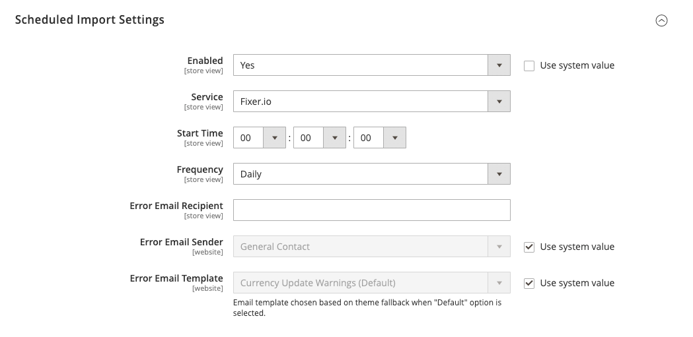

# Währungskonfiguration

Bevor Sie individuelle Währungskurse einrichten, müssen Sie zunächst den Umfang der [Basiswährung](../configuration-reference/general/currency-setup.md). Er ist standardmäßig auf global gesetzt, wodurch die Basiswährungseinstellung auf die gesamte [Store-Hierarchie](../getting-started/websites-stores-views.md). Wenn Sie über eine Multi-Site-Adobe Commerce- oder -Magento Open Source-Installation verfügen, können Sie mehrere Basiswährungen verwalten, indem Sie den Umfang auf Website-Ebene festlegen.

Sie geben auch die Währungen an, die Sie akzeptieren, und welche Währung Sie für die Anzeige von [Preise](../catalog/catalog-price-scope.md) in Ihrem Geschäft. Im folgenden Diagramm wird der Umfang der Basiswährung auf Website-Ebene festgelegt, sodass jede Website eine andere Basiswährung haben kann.

{width="600" zoomable="yes"}

## Schritt 1: Auswählen der akzeptierten Währungen

1. Im _Admin_ Seitenleiste, navigieren Sie zu **[!UICONTROL Stores]** > _[!UICONTROL Settings]_>**[!UICONTROL Configuration]**.

1. Legen Sie in der oberen linken Ecke **[!UICONTROL Scope]** in die Store-Ansicht, in der die Konfiguration gilt.

1. Im linken Bereich unter _Allgemein_ auswählen **[!UICONTROL Currency Setup]**.

1. Erweitern  die **[!UICONTROL Currency Options]** und legen Sie die folgenden Optionen fest:

   - **[!UICONTROL Base Currency]** - Legen Sie auf die Primärwährung fest, die Sie für Online-Transaktionen verwenden.

   - **[!UICONTROL Default Display Currency]** - Stellen Sie auf die Währung ein, die Sie zur Anzeige der Preise in der Store-Ansicht verwenden.

   - **[!UICONTROL Allowed Currencies]** — Wählen Sie alle Währungen aus, die Sie als Zahlung in der Store-Ansicht akzeptieren. Wählen Sie auch Ihre Primärwährung aus.

     Halten Sie bei mehreren Währungen die Strg-Taste (PC) oder die Befehlstaste (Mac) gedrückt und klicken Sie auf jede Option.

   {width="600" zoomable="yes"}

   Eine ausführliche Beschreibung der einzelnen Konfigurationseinstellungen finden Sie unter [Währungsoptionen](../configuration-reference/general/currency-setup.md) im _Konfigurationshandbuch_.

1. Wenn Sie aufgefordert werden, den Cache zu aktualisieren, klicken Sie auf _Schließen_ (  ) in der rechten oberen Ecke der Systemmeldung.

   Sie können [Cache aktualisieren](../systems/cache-management.md) später.

1. Definieren Sie den Umfang der Basiswährung:

   - Erweitern Sie im linken Bereich **[!UICONTROL Catalog]** und wählen **[!UICONTROL Catalog]** darunter.

   - Hinunter scrollen und erweitern  die **[!UICONTROL Price]** Abschnitt. (Dieser Abschnitt wird nur angezeigt, wenn der Bereich auf **[!UICONTROL Store View:]** _Standardkonfiguration_.

   - Satz **[!UICONTROL Catalog Price Scope]** entweder `Global` oder `Website`.

   {width="600" zoomable="yes"}

## Schritt 2: Importverbindung konfigurieren

1. Scrollen Sie nach oben auf der Seite.

1. Erweitern Sie im linken Bereich **[!UICONTROL General]** und wählen **[!UICONTROL Currency Setup]**.

1. Konfigurieren Sie Ihre Währungsdienstverbindung:

   Es gibt drei Dienstoptionen: _[!UICONTROL Fixer.io (legacy)]_,_[!UICONTROL Fixer Api (APILayer)]_, und _[!UICONTROL Currency Converter API]_

   >[!IMPORTANT]
   >
   >Ab Version 2.4.6 wird die [[!DNL Fixer.io]](https://fixer.io/) -Dienst veraltet ist und durch die [[!DNL Fixer API] (APILayer)](https://apilayer.com/marketplace/fixer-api) -Dienst. Es wird dringend empfohlen, ein APILayer-Konto anstelle eines veralteten zu verwenden [!DNL Fixer.io] -Konto.

   - _So stellen Sie eine Verbindung zu [Fixer.io-Dienst](https://fixer.io/):_

      - Erweitern  die **[!UICONTROL Fixer.io]** Abschnitt.

      - Geben Sie Ihren fixer.io ein. **[!UICONTROL API key]**.

      - Für **[!UICONTROL Connection Timeout in Seconds]** geben Sie die Anzahl der Sekunden Inaktivität ein, die zulässig sein sollen, bevor die Verbindung unterbrochen wird.

     {width="600" zoomable="yes"}

   - _So stellen Sie eine Verbindung zu [[!DNL Fixer Api (APILayer)] service](https://apilayer.com/):_

      - Erweitern  die **[!UICONTROL Fixer Api (APILayer)]** Abschnitt.

      - Geben Sie Ihre [!DNL APILayer] **[!UICONTROL API key]**.

      - Für **[!UICONTROL Connection Timeout in Seconds]** geben Sie die Anzahl der Sekunden Inaktivität ein, die zulässig sein sollen, bevor die Verbindung unterbrochen wird.

     {width="600" zoomable="yes"}

   - _So stellen Sie eine Verbindung zu [[!DNL Currency Convertor API] service](https://free.currencyconverterapi.com/):_

      - Erweitern  die **[!UICONTROL Currency Convertor API]** Abschnitt.

      - Geben Sie Ihren Währungsumrechner ein **[!UICONTROL API key]**.

      - Für **[!UICONTROL Connection Timeout in Seconds]** geben Sie die Anzahl der Sekunden Inaktivität ein, die zulässig sein sollen, bevor die Verbindung unterbrochen wird.

     {width="600" zoomable="yes"}

## Schritt 3: Geplante Importeinstellungen konfigurieren

1. Fahren Sie mit der Währungseinrichtung fort, erweitern Sie  die **[!UICONTROL Scheduled Import Settings]** Abschnitt.

   {width="600" zoomable="yes"}

1. Um die Währungssätze automatisch zu aktualisieren, legen Sie **[!UICONTROL Enabled]** nach `Yes`.

1. Legen Sie die Aktualisierungsoptionen fest:

   - **[!UICONTROL Service]** — Festgelegt auf den Ratenanbieter. Der Standardwert ist `Fixer.io (legacy)`.

   - **[!UICONTROL Start Time]** — Stellen Sie auf die Stunde, die Minute und die Sekunde ein, dass die Tarife gemäß dem Zeitplan aktualisiert werden.

   - **[!UICONTROL Frequency]** — Um zu bestimmen, wie oft die Raten aktualisiert werden, legen Sie einen der folgenden Parameter fest:

      - `Daily`
      - `Weekly`
      - `Monthly`

   - **[!UICONTROL Error Email Recipient]** — Geben Sie die E-Mail-Adresse der Person ein, die eine E-Mail-Benachrichtigung erhalten soll, wenn während des Importvorgangs ein Fehler auftritt.

     Um mehrere E-Mail-Adressen einzugeben, trennen Sie diese durch ein Komma.

   - **[!UICONTROL Error Email Sender]** - Auf [Store-Kontakt](../getting-started/store-details.md#store-email-addresses) , der als Absender der Fehlerbenachrichtigung angezeigt wird.

   - **[!UICONTROL Error Email Template]** — Festgelegt auf die für die Fehlerbenachrichtigung verwendete E-Mail-Vorlage.

1. Wenn Sie fertig sind, klicken Sie auf **[!UICONTROL Save Config]**.

1. Wenn Sie aufgefordert werden, den Cache zu aktualisieren, klicken Sie auf die **[!UICONTROL Cache Management]** verknüpfen und den ungültigen Cache aktualisieren.

   {width="600" zoomable="yes"}

## Schritt 4: Währungskurse aktualisieren

Die Währungskurse müssen mit den aktuellen Werten aktualisiert werden, bevor sie in Kraft treten. [Aktualisierung der Tarife](currency-update.md) manuell oder um die Tarife automatisch zu importieren.

## Schritt 5: Währungssymbole anpassen (optional)

Durch die Verwaltung von Währungssymbolen können Sie das mit jeder Währung verknüpfte Symbol anpassen, das in Ihrem Geschäft als Zahlung akzeptiert wird.

{width="600" zoomable="yes"}

1. Im _Admin_ Seitenleiste, navigieren Sie zu **[!UICONTROL Stores]** > _[!UICONTROL Currency]_>**[!UICONTROL Currency Symbols]**.

   Jede für Ihren Store aktivierte Währung wird im _[!UICONTROL Currency]_Liste.

1. Ändern Sie die Listeneinstellungen nach Bedarf:

   - Geben Sie für jede Währung, die Sie verwenden möchten, ein benutzerdefiniertes Symbol ein oder wählen Sie die **[!UICONTROL Use Standard]** für jede Währung.

   - Um das Standardsymbol zu überschreiben, deaktivieren Sie die _[!UICONTROL Use Standard]_und geben Sie das Symbol ein, das Sie verwenden möchten.

   >[!NOTE]
   >
   >Es ist nicht möglich, die Ausrichtung des Währungssymbols von links nach rechts zu ändern.

1. Wenn Sie fertig sind, klicken Sie auf **[!UICONTROL Save Currency Symbols]**.

1. Wenn Sie aufgefordert werden, den Cache zu aktualisieren, klicken Sie auf die **[!UICONTROL Cache Management]** einen ungültigen Cache zu verknüpfen und ihn zu aktualisieren.
