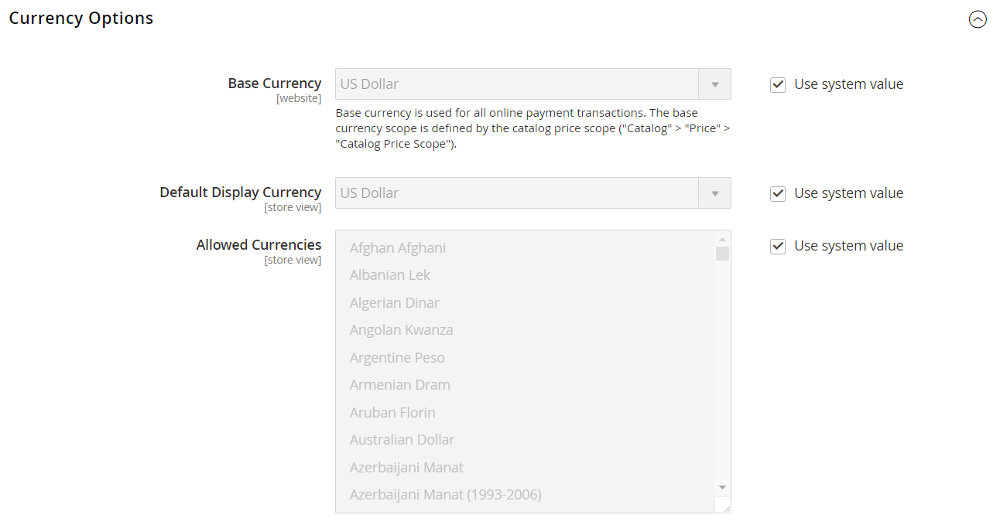
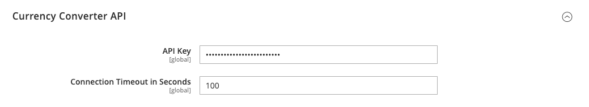

# Währungskonfiguration

Bevor Sie individuelle Währungskurse einrichten, müssen Sie zunächst den Umfang der [Basiswährung](../configuration-reference/general/currency-setup.md) festlegen. Er ist standardmäßig auf global gesetzt, wodurch die Einstellung der Basiswährung auf die gesamte [Store-Hierarchie](../getting-started/websites-stores-views.md) angewendet wird. Wenn Sie über eine Multi-Site-Adobe Commerce- oder -Magento Open Source-Installation verfügen, können Sie mehrere Basiswährungen verwalten, indem Sie den Umfang auf Website-Ebene festlegen.

Sie geben auch die Währungen an, die Sie akzeptieren, und welche Währung Sie für die Anzeige von [Preisen](../catalog/catalog-price-scope.md) in Ihrem Geschäft verwenden möchten. Im folgenden Diagramm wird der Umfang der Basiswährung auf Website-Ebene festgelegt, sodass jede Website eine andere Basiswährung haben kann.

{width="600" zoomable="yes"}

## Schritt 1: Auswählen der akzeptierten Währungen

1. Wechseln Sie in der Seitenleiste _Admin_ zu **[!UICONTROL Stores]** > _[!UICONTROL Settings]_>**[!UICONTROL Configuration]**.

1. Setzen Sie oben links **[!UICONTROL Scope]** auf die Store-Ansicht, für die die Konfiguration gilt.

1. Wählen Sie im linken Bereich unter _Allgemein_ die Option **[!UICONTROL Currency Setup]**.

1. Erweitern Sie den Abschnitt **[!UICONTROL Currency Options]** um  und legen Sie die folgenden Optionen fest:

   - **[!UICONTROL Base Currency]** - Stellen Sie auf die Primärwährung ein, die Sie für Online-Transaktionen verwenden.

   - **[!UICONTROL Default Display Currency]** - Stellen Sie auf die Währung ein, die Sie zur Anzeige der Preise in der Store-Ansicht verwenden.

   - **[!UICONTROL Allowed Currencies]** - Wählen Sie alle Währungen aus, die Sie als Zahlung in der Store-Ansicht akzeptieren. Wählen Sie auch Ihre Primärwährung aus.

     Halten Sie bei mehreren Währungen die Strg-Taste (PC) oder die Befehlstaste (Mac) gedrückt und klicken Sie auf jede Option.

   {width="600" zoomable="yes"}

   Eine ausführliche Beschreibung der einzelnen Konfigurationseinstellungen finden Sie unter [Währungsoptionen](../configuration-reference/general/currency-setup.md) im _Konfigurationshandbuch_.

1. Wenn Sie aufgefordert werden, den Cache zu aktualisieren, klicken Sie oben rechts in der Systemmeldung auf _Schließen_ (  ).

   Sie können den Cache ](../systems/cache-management.md) später [aktualisieren.

1. Definieren Sie den Umfang der Basiswährung:

   - Erweitern Sie im linken Bedienfeld den Wert **[!UICONTROL Catalog]** und wählen Sie unter &quot;**[!UICONTROL Catalog]**&quot;.

   - Scrollen Sie nach unten und erweitern Sie den Abschnitt **[!UICONTROL Price]** um den . (Dieser Abschnitt wird nur angezeigt, wenn der Bereich als **[!UICONTROL Store View:]** _Standardkonfiguration_ festgelegt ist.)

   - Setzen Sie **[!UICONTROL Catalog Price Scope]** auf entweder `Global` oder `Website`.

   {width="600" zoomable="yes"}

## Schritt 2: Importverbindung konfigurieren

1. Scrollen Sie nach oben auf der Seite.

1. Erweitern Sie im linken Bereich den Wert **[!UICONTROL General]** und wählen Sie **[!UICONTROL Currency Setup]** aus.

1. Konfigurieren Sie Ihre Währungsdienstverbindung:

   Es gibt drei Dienstoptionen: _[!UICONTROL Fixer.io (legacy)]_,_[!UICONTROL Fixer Api (APILayer)]_ und _[!UICONTROL Currency Converter API]_

   >[!IMPORTANT]
   >
   >Ab Version 2.4.6 wird der Dienst [[!DNL Fixer.io]](https://fixer.io/) nicht mehr unterstützt und durch den Dienst [[!DNL Fixer API] (APILayer)](https://apilayer.com/marketplace/fixer-api) ersetzt. Es wird dringend empfohlen, ein APILayer-Konto anstelle eines veralteten [!DNL Fixer.io] -Kontos zu verwenden.

   - _So stellen Sie eine Verbindung zum Dienst [fixer.io](https://fixer.io/) her:_

      - Erweitern Sie  im Abschnitt **[!UICONTROL Fixer.io]** .

      - Geben Sie Ihren fixer.io **[!UICONTROL API key]** ein.

      - Geben Sie für &quot;**[!UICONTROL Connection Timeout in Seconds]**&quot;die Anzahl der Sekunden an, die für Inaktivität erforderlich sind, bevor die Verbindung unterbrochen wird.

     {width="600" zoomable="yes"}

   - _So stellen Sie eine Verbindung zum [[!DNL Fixer Api (APILayer)] Dienst](https://apilayer.com/) her:_

      - Erweitern Sie  im Abschnitt **[!UICONTROL Fixer Api (APILayer)]** .

      - Geben Sie Ihren [!DNL APILayer] **[!UICONTROL API key]** ein.

      - Geben Sie für &quot;**[!UICONTROL Connection Timeout in Seconds]**&quot;die Anzahl der Sekunden an, die für Inaktivität erforderlich sind, bevor die Verbindung unterbrochen wird.

     {width="600" zoomable="yes"}

   - _So stellen Sie eine Verbindung zum [[!DNL Currency Convertor API] Dienst](https://free.currencyconverterapi.com/) her:_

      - Erweitern Sie  im Abschnitt **[!UICONTROL Currency Convertor API]** .

      - Geben Sie Ihren Währungsumrechner **[!UICONTROL API key]** ein.

      - Geben Sie für &quot;**[!UICONTROL Connection Timeout in Seconds]**&quot;die Anzahl der Sekunden an, die für Inaktivität erforderlich sind, bevor die Verbindung unterbrochen wird.

     {width="600" zoomable="yes"}

## Schritt 3: Geplante Importeinstellungen konfigurieren

1. Erweitern Sie in Fortführung der Währungseinstellungen den Abschnitt  im Abschnitt **[!UICONTROL Scheduled Import Settings]** .

   {width="600" zoomable="yes"}

1. Um Währungskurse automatisch zu aktualisieren, setzen Sie **[!UICONTROL Enabled]** auf `Yes`.

1. Legen Sie die Aktualisierungsoptionen fest:

   - **[!UICONTROL Service]** - Wird auf den Ratenanbieter gesetzt. Der Standardwert ist `Fixer.io (legacy)`.

   - **[!UICONTROL Start Time]** - Stellen Sie auf die Stunde, Minute und Sekunde ein, in der die Raten gemäß dem Zeitplan aktualisiert werden.

   - **[!UICONTROL Frequency]** - Um zu bestimmen, wie oft die Raten aktualisiert werden, setzen Sie auf einen der folgenden Werte:

      - `Daily`
      - `Weekly`
      - `Monthly`

   - **[!UICONTROL Error Email Recipient]** - Geben Sie die E-Mail-Adresse der Person ein, die eine E-Mail-Benachrichtigung erhalten soll, wenn während des Importvorgangs ein Fehler auftritt.

     Um mehrere E-Mail-Adressen einzugeben, trennen Sie diese durch ein Komma.

   - **[!UICONTROL Error Email Sender]** - Setzen Sie dies auf den [store contact](../getting-started/store-details.md#store-email-addresses) , der als Absender der Fehlerbenachrichtigung angezeigt wird.

   - **[!UICONTROL Error Email Template]** - Legt die für die Fehlerbenachrichtigung verwendete E-Mail-Vorlage fest.

1. Klicken Sie nach Abschluss des Vorgangs auf **[!UICONTROL Save Config]**.

1. Wenn Sie aufgefordert werden, den Cache zu aktualisieren, klicken Sie auf den Link **[!UICONTROL Cache Management]** und aktualisieren Sie den ungültigen Cache.

   {width="600" zoomable="yes"}

## Schritt 4: Währungskurse aktualisieren

Die Währungskurse müssen mit den aktuellen Werten aktualisiert werden, bevor sie in Kraft treten. [Aktualisieren Sie die Raten](currency-update.md) manuell oder importieren Sie die Raten automatisch.

## Schritt 5: Währungssymbole anpassen (optional)

Durch die Verwaltung von Währungssymbolen können Sie das mit jeder Währung verknüpfte Symbol anpassen, das in Ihrem Geschäft als Zahlung akzeptiert wird.

{width="600" zoomable="yes"}

1. Wechseln Sie in der Seitenleiste _Admin_ zu **[!UICONTROL Stores]** > _[!UICONTROL Currency]_>**[!UICONTROL Currency Symbols]**.

   Jede Währung, die für Ihren Store aktiviert ist, wird in der Liste _[!UICONTROL Currency]_angezeigt.

1. Ändern Sie die Listeneinstellungen nach Bedarf:

   - Geben Sie für jede Währung, die Sie verwenden möchten, ein benutzerdefiniertes Symbol ein oder aktivieren Sie das Kontrollkästchen **[!UICONTROL Use Standard]** für jede Währung.

   - Um das Standardsymbol zu überschreiben, deaktivieren Sie das Kontrollkästchen _[!UICONTROL Use Standard]_und geben Sie das Symbol ein, das Sie verwenden möchten.

   >[!NOTE]
   >
   >Es ist nicht möglich, die Ausrichtung des Währungssymbols von links nach rechts zu ändern.

1. Klicken Sie nach Abschluss des Vorgangs auf **[!UICONTROL Save Currency Symbols]**.

1. Wenn Sie aufgefordert werden, den Cache zu aktualisieren, klicken Sie auf den Link **[!UICONTROL Cache Management]** und aktualisieren Sie alle ungültigen Cache-Dateien.
