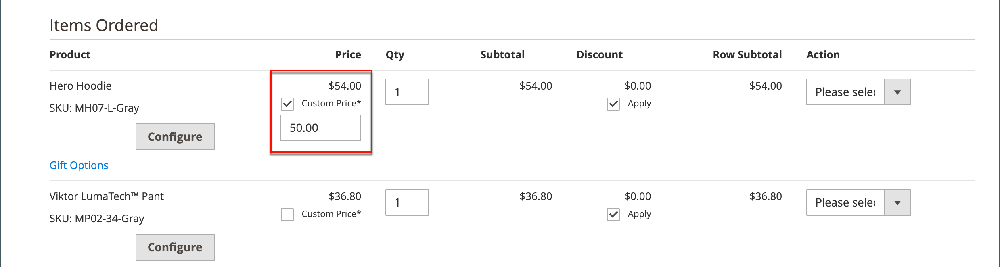

# Bestellung erstellen

Für registrierte Kunden, die Hilfe benötigen, können Sie direkt vom Administrator aus eine ganze Bestellung erstellen. Das _[!UICONTROL Create New Order]_&#x200B;Formular enthält alle Informationen, die für den normalen Checkout-Prozess erforderlich sind, einschließlich Aktivitätszusammenfassungen aus dem Konto-Dashboard des Kunden.

{width="700" zoomable="yes"}

## Schritt 1: Bestellung erstellen

1. Klicken Sie in der _Admin_-Seitenleiste auf **[!UICONTROL Customers]**.

1. Suchen Sie den Kunden im Raster.

1. Klicken Sie in _Spalte_ Aktion **[!UICONTROL Edit]** auf.

1. Klicken Sie in der Kopfzeile des Arbeitsbereichs auf **[!UICONTROL Create Order]**.

   {width="700" zoomable="yes"}

   Sie können auch eine Bestellung im Arbeitsbereich &quot;[&quot; erstellen](orders.md#orders-workspace) indem Sie auf **[!UICONTROL Create New Order]** klicken.

## Schritt 2: Produkte hinzufügen

Wenn Ihr Store mehrere Ansichten hat, wählen Sie die Store-Ansicht, in der die Bestellung platziert werden soll.

### Hinzufügen von Produkten über die [!UICONTROL Customer's Activities] Seitenleiste

Sie können Artikel aus der Wunschliste eines Kunden oder aus kürzlich angesehenen, verglichenen oder bestellten Artikeln in den Warenkorb legen.

1. Erweitern Sie  einen der folgenden Abschnitte:

   - **[!UICONTROL Wish List]**
   - **[!UICONTROL Last Ordered Items]**
   - **[!UICONTROL Products in Comparison List]**
   - **[!UICONTROL Recently Compared Products]**
   - **[!UICONTROL Recently Viewed Products]**

1. Aktivieren Sie die Kontrollkästchen der einzelnen Produkte im linken Bereich.

1. Scrollen Sie nach unten und klicken Sie auf **[!UICONTROL Update Changes]**.

   Der Artikel erscheint im Bestellformular.

   {width="600" zoomable="yes"}

### Produkte aus dem Katalog hinzufügen

1. Klicken Sie auf **[!UICONTROL Add Products]**.

   {width="600" zoomable="yes"}

1. Aktivieren Sie im Raster das Kontrollkästchen jedes Produkts, das zum Warenkorb hinzugefügt werden soll, und geben Sie die zu kaufenden **[!UICONTROL Qty]** ein.

   {width="600" zoomable="yes"}

   >[!NOTE]
   >
   >Das Produktauswahlraster zeigt immer die regulären Basispreise für Produkte, ohne Rabatte und ohne angewendete Warenkorb- oder Gruppenpreisregeln. Der Endproduktpreis wird nur berechnet, wenn das Produkt zu einer Bestellung/einem Warenkorb hinzugefügt wird.

1. Konfigurieren der verfügbaren Produktoptionen:

   - Klicken Sie auf **[!UICONTROL Configure]**.

   - Füllen Sie die Optionen nach Bedarf aus.

   - Klicken Sie auf **[!UICONTROL OK]**.

   - Klicken Sie auf **[!UICONTROL Add Selected Product(s) to Order]** , um den Warenkorb zu aktualisieren.

1. Wenn ein Produkt für „Geschenkoptionen[ konfiguriert ist](../catalog/product-gift-options.md) legen Sie die Optionen nach Bedarf fest.

1. Den Preis eines Artikels überschreiben, falls erforderlich:

   - Aktivieren Sie das Kontrollkästchen **[!UICONTROL Custom Price]** und geben Sie den neuen Preis in das Feld unten ein.

   - Um die Gesamtwerte für den Warenkorb zu aktualisieren, klicken Sie auf **[!UICONTROL Update Items and Quantities]**.

   {width="600" zoomable="yes"}

1. Füllen Sie die folgenden Abschnitte wie für die Bestellung erforderlich aus:

   - [!UICONTROL Order Currency]
   - [!UICONTROL Apply Coupon Codes / Gift Card Code]
   - [!UICONTROL Payment Method]
   - [!UICONTROL Shipping Method]
   - [!UICONTROL Order Comments]
   - [[!UICONTROL [Benutzerdefinierte Sortierattribute]]](../stores-purchase/order-processing.md#custom-order-attributes)

>[!NOTE]
>
>Weitere Informationen zu Zahlungsmethoden[ die diese Funktion unterstützen, wenn die ](https://experienceleague.adobe.com/en/docs/commerce/payment-services/guide-overview) installiert und konfiguriert ist, finden Sie im „Payment Services Guide“.

## Schritt 3: Bestellung übermitteln

Klicken Sie auf **[!UICONTROL Submit Order]**.

Eine Bestätigung wird an den Kunden gesendet und der Kunde kann die Bestelldetails von seinem Konto aus einsehen.
