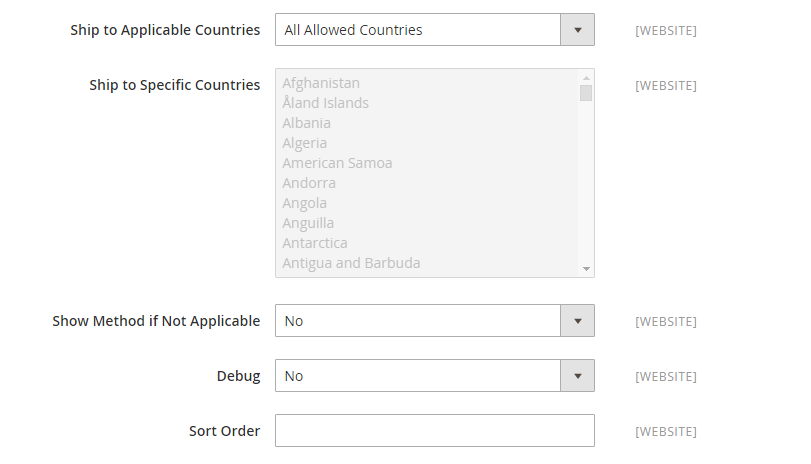

# DHL

DHL bietet integrierte internationale Dienstleistungen und maßgeschneiderte, kundenorientierte Lösungen für die Verwaltung und den Transport von Briefen, Waren und Informationen.

## Schritt 1: DHL aktivieren

1. Navigieren Sie in _Admin_-Seitenleiste zu **[!UICONTROL Stores]** > _[!UICONTROL Settings]_>**[!UICONTROL Configuration]**.

1. Erweitern Sie im linken Bereich **[!UICONTROL Sales]** und wählen Sie **[!UICONTROL Delivery Methods]**.

1. Erweitern Sie  den Abschnitt **[!UICONTROL DHL]** .

   >[!NOTE]
   >
   >Deaktivieren Sie bei Bedarf zunächst das Kontrollkästchen **[!UICONTROL Use system value]** , um die folgenden Einstellungen wie beschrieben zu ändern.

1. Legen Sie **[!UICONTROL Enabled for Checkout]** auf `Yes` fest.

1. Normalerweise können Sie die **[!UICONTROL Gateway URL]** akzeptieren.

   Wenn Ihnen DHL eine alternative URL gegeben hat, geben Sie diesen Wert in dieses Feld ein.

1. Verwenden Sie die von DHL bereitgestellten Anmeldeinformationen, um die folgenden Felder auszufüllen:

   - **[!UICONTROL Access ID]**
   - **[!UICONTROL Password]**
   - **[!UICONTROL Account Number]**

{width="600" zoomable="yes"}

## Schritt 2: Paketbeschreibung und Bearbeitungsgebühr eingeben

1. Wählen Sie in der Liste **[!UICONTROL Content Type]** die Option aus, die den Pakettyp, den Sie versenden, am besten beschreibt:

   - `Documents`
   - `Non documents`

1. Konfigurieren Sie die Bearbeitungsgebührenoptionen entsprechend Ihren Anforderungen.

   Die Bearbeitungsgebühr ist optional und erscheint als zusätzliche Gebühr, die zu den DHL Versandkosten hinzugerechnet wird. Wenn Sie eine Bearbeitungsgebühr einbeziehen möchten, gehen Sie wie folgt vor:

   - Wählen Sie **[!UICONTROL Calculate Handling Fee]** die Methode aus, die Sie zur Berechnung der Bearbeitungsgebühren verwenden möchten:

      - `Fixed`
      - `Percentage`

   - Wählen Sie **[!UICONTROL Handling Applied]** aus, wie die Bearbeitungsgebühren angewendet werden sollen:

      - `Per Order`
      - `Per Package`

   - Geben Sie **[!UICONTROL Handling Fee]** den zu belastenden Betrag auf der Grundlage der Methode ein, die Sie für die Berechnung des Betrags gewählt haben.

     Wenn die Gebühr beispielsweise auf einer festen Gebühr basiert, geben Sie den Betrag als Dezimalzahl ein, z. B. `4.90`. Wenn die Bearbeitungsgebühr jedoch auf einem Prozentsatz der Bestellung basiert, geben Sie den Betrag als Prozentsatz ein. Wenn Sie beispielsweise sechs Prozent der Bestellung berechnen, geben Sie den Wert als `.06` ein.

   - Um die Aufteilung des Gesamtauftragsgewichts zu ermöglichen, um eine genaue Berechnung der Versandkosten zu gewährleisten, setzen Sie **[!UICONTROL Divide Order Weight]** auf `Yes`.

   - Legen Sie die **[!UICONTROL Weight Unit]** des Pakets auf einen der folgenden Werte fest:

      - `Pounds`
      - `Kilograms`

   - Legen Sie die **[!UICONTROL Size]** eines typischen Pakets auf einen der folgenden Werte fest:

      - `Regular`
      - `Specific`

     Wenn Sie &quot;`Specific`&quot; wählen, geben Sie **[!UICONTROL Height]**, **[!UICONTROL Depth]** und **[!UICONTROL Width]** des Pakets in Zentimetern ein.

   {width="600" zoomable="yes"}

## Schritt 3: Zulässige Versandmethoden angeben

1. Wählen Sie **[!UICONTROL Allowed Methods]** jede Methode aus, die Sie Kunden zur Verfügung stellen möchten.

   Zur Auswahl mehrerer Methoden halten Sie die Strg-Taste (PC) bzw. die Befehlstaste (Mac) gedrückt und klicken auf die einzelnen Optionen.

   Um die richtige Liste der Versandmethoden anzuzeigen, müssen Sie zunächst das [Ursprungsland“ ](../configuration-reference/sales/shipping-settings.md).

1. Geben Sie **[!UICONTROL Ready Time]** die Anzahl der Stunden nach dem Einreichen einer Bestellung ein, zu der ein Paket versandbereit ist.

1. Bearbeiten Sie die **[!UICONTROL Displayed Error Message]** nach Bedarf.

   Diese Meldung wird angezeigt, wenn eine ausgewählte Methode nicht verfügbar ist.

1. Wenn Sie eine Option [Kostenloser Versand](shipping-free.md) über DHL bereitstellen möchten, legen Sie die Optionen für den kostenlosen Versand fest.

   - Wählen Sie **[!UICONTROL Free Method]** die Methode, die Sie für den kostenlosen Versand verwenden möchten.

   - **[!UICONTROL Free Shipping Amount Threshold]** festlegen:

     `Enable` - Wenn Sie kostenlosen Versand mit Mindestbestellung anbieten, geben Sie die **[!UICONTROL Minimum Order Amount for Free Shipping]** ein.

     `Disable` - Gilt nicht für kostenlosen DHL-Versand auf alle Bestellungen.

     Diese Einstellung ähnelt der Einstellung für die Standardmethode _Kostenloser Versand_, wird aber im Abschnitt DHL angezeigt, damit die Kunden wissen, welche Methode für ihre Bestellung verwendet wird.

   - Geben Sie **[!UICONTROL Free Shipping Amount Threshold]** den Mindestbetrag für eine Bestellung ein, um sich für den kostenlosen Versand zu qualifizieren.

     {width="600" zoomable="yes"}

## Schritt 4: Bitte die entsprechenden Länder angeben

1. Legen Sie **[!UICONTROL Ship to Applicable Countries]** auf eine der folgenden Einstellungen fest:

   - `All Allowed Countries`
   - `Specific Countries`

   Bei Versand in bestimmte Länder, wählen Sie jedes Land aus der **[!UICONTROL Ship to Specific Countries]**.

1. **[!UICONTROL Show Method if Not Applicable]** festlegen:

   `Yes` - Zeigt DHL als Versandmethode während des Checkouts an, auch wenn dies für die Bestellung nicht zutrifft.

   `No` - Zeigt DHL nur dann als Versandmethode während des Checkouts an, wenn zutreffend.

1. Um eine Protokolldatei mit den Details der DHL-Sendungen aus Ihrem Geschäft zu erstellen, setzen Sie **[!UICONTROL Debug]** auf `Yes`.

1. Geben Sie **[!UICONTROL Sort Order]** eine Zahl ein, um die Reihenfolge zu bestimmen, in der DHL beim Checkout mit anderen Versandmethoden aufgelistet wird.

   `0` = First, `1` = Second, `2` = Third usw.

1. Klicken Sie auf **[!UICONTROL Save Config]**.

   {width="600" zoomable="yes"}
