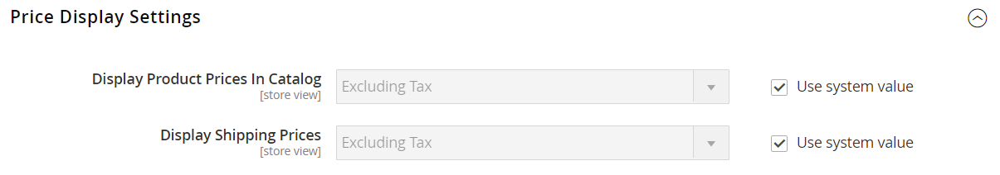
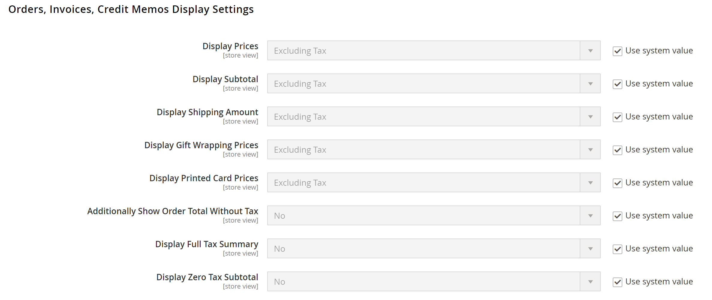

# Einstellungen zur Preisanzeige

Die Einstellungen für die Preisanzeige bestimmen, ob Produkt- und Versandpreise Steuern enthalten oder nicht, oder zeigen zwei Versionen des Preises an, eine mit und die andere ohne Steuern.

Wenn der Produktpreis Steuern enthält, wird die Steuer nur angezeigt, wenn eine Steuerregel vorhanden ist, die mit der steuerlichen Herkunft übereinstimmt, oder wenn eine Kundenadresse mit der Steuerregel übereinstimmt. Zu den Ereignissen, bei denen ein Trigger auftreten kann, gehören die Erstellung eines Kontos, die Anmeldung oder die Erstellung einer Steuer- und Versandschätzung aus dem Warenkorb.

>[!IMPORTANT]
>
>Preise anzuzeigen, die Steuern enthalten oder nicht enthalten, kann für den Kunden verwirrend sein. Um das Auslösen einer Warnmeldung zu vermeiden, lesen Sie die [Richtlinien](international-tax-guidelines.md) für Ihr Land und [empfohlene Einstellungen](taxes.md#warning-messages), um Warnmeldungen zu vermeiden.

{width="600" zoomable="yes"}

Eine ausführliche Beschreibung der einzelnen Konfigurationseinstellungen finden Sie unter [Preisanzeigeeinstellungen](../configuration-reference/sales/tax.md#price-display-settings) im _Konfigurationshandbuch_.

## Preisanzeigeeinstellungen konfigurieren

Wenn die Konfiguration der Berechnung für Steuern, Sätze und Klassen abgeschlossen ist, werden die Steuern gemäß diesen Einstellungen berechnet. Die Anzeige von Steuern im Katalog, im Warenkorb, in Bestellungen, Rechnungen und Gutschriften sollte jedoch auch so konfiguriert werden, dass sie das Kundenerlebnis in der Storefront unterstützt.

Es empfiehlt sich, die Preise mit den zugehörigen Steuern (entweder einschließlich Steuern oder sowohl einschließlich Steuern als auch ohne Steuern) anzuzeigen, damit die Kunden wissen, wie diese Berechnungen angewendet werden, bevor sie eine Bestellung aufgeben.

### Schritt 1: Konfigurieren der Anzeigeeinstellungen für Katalogpreise

1. Navigieren Sie in _Admin_-Seitenleiste zu **[!UICONTROL Stores]** > _[!UICONTROL Settings]_>**[!UICONTROL Configuration]**.

1. Erweitern Sie im linken Bereich **[!UICONTROL Sales]** und wählen Sie **[!UICONTROL Tax]**.

1. Erweitern Sie  den Abschnitt **[!UICONTROL Price Display Settings]** .

1. Wählen Sie **[!UICONTROL Display Product Prices in Catalog]** eine der folgenden Optionen:

   - `Excluding Tax`
   - `Including Tax`
   - `Including and Excluding Tax`

   >[!NOTE]
   >
   >Wenn Sie diese Option auf `Including Tax` setzen, wird die Steuer nur angezeigt, wenn eine Steuerregel vorhanden ist, die mit der Steuerherkunft übereinstimmt, oder wenn eine Kundenadresse vorhanden ist, die mit der Steuerregel übereinstimmt. Zu den Ereignissen, bei denen eine Übereinstimmung Trigger werden kann, gehören die Erstellung von Kundenkonten, die Anmeldung oder die Verwendung des Tools für Steuer- und Versandschätzungen im Warenkorb.

1. Wählen Sie **[!UICONTROL Display Shipping Prices]** eine der folgenden Optionen:

   - `Excluding Tax`
   - `Including Tax`
   - `Including and Excluding Tax`

Wenn Sie sich dafür entscheiden, beide Preise anzuzeigen (mit und ohne Steuer), sieht die Storefront ähnlich wie die folgende aus:

{width="700" zoomable="yes"}

### Schritt 2: Konfigurieren der Anzeigeeinstellungen für den Warenkorb

1. Erweitern Sie  den Abschnitt **[!UICONTROL Shopping Cart Display Settings]** .

   {width="600" zoomable="yes"}

1. Wählen Sie **[!UICONTROL Display Prices]** eine der folgenden Optionen:

   - `Excluding Tax`
   - `Including Tax`
   - `Including and Excluding Tax`

1. Wählen Sie **[!UICONTROL Display Subtotal]** eine der folgenden Optionen:

   - `Excluding Tax`
   - `Including Tax`
   - `Including and Excluding Tax`

1. Wählen Sie **[!UICONTROL Display Shipping Amount]** eine der folgenden Optionen:

   - `Excluding Tax`
   - `Including Tax`
   - `Including and Excluding Tax`

1.  (nur Adobe Commerce) Wählen Sie **[!UICONTROL Display Gift Wrapping Prices]** eine der folgenden Optionen:

   - `Excluding Tax`
   - `Including Tax`
   - `Including and Excluding Tax`

1.  (nur Adobe Commerce) Wählen Sie **[!UICONTROL Display Printed Card Prices]** eine der folgenden Optionen:

   - `Excluding Tax`
   - `Including Tax`
   - `Including and Excluding Tax`

1. Schalten Sie für jede dieser verbleibenden Optionen entsprechend Ihren Anforderungen zu `Yes` oder zu `No` um:

   - **[!UICONTROL Include Tax in Order Total]**
   - **[!UICONTROL Display Full Tax Summary]**
   - **[!UICONTROL Display Zero Tax Subtotal]**

### Schritt 3: Anzeigeeinstellungen für Bestellung, Rechnung und Gutschrift konfigurieren

1. Erweitern Sie  den Abschnitt **[!UICONTROL Orders, Invoices, Credit Memos Display Settings]** .

   {width="600" zoomable="yes"}

1. Wählen Sie **[!UICONTROL Display Prices]** eine der folgenden Optionen:

   - `Excluding Tax`
   - `Including Tax`
   - `Including and Excluding Tax`

1. Wählen Sie **[!UICONTROL Display Subtotal]** eine der folgenden Optionen:

   - `Excluding Tax`
   - `Including Tax`
   - `Including and Excluding Tax`

1. Wählen Sie **[!UICONTROL Display Shipping Amount]** eine der folgenden Optionen:

   - `Excluding Tax`
   - `Including Tax`
   - `Including and Excluding Tax`

1.  (nur Adobe Commerce) Wählen Sie **[!UICONTROL Display Gift Wrapping Prices]** eine der folgenden Optionen:

   - `Excluding Tax`
   - `Including Tax`
   - `Including and Excluding Tax`

1.  (nur Adobe Commerce) Wählen Sie **[!UICONTROL Display Printed Card Prices]** eine der folgenden Optionen:

   - `Excluding Tax`
   - `Including Tax`
   - `Including and Excluding Tax`

1. Schalten Sie für jede dieser verbleibenden Optionen entsprechend Ihren Anforderungen zu `Yes` oder zu `No` um:

   - **[!UICONTROL Include Tax in Order Total]**
   - **[!UICONTROL Display Full Tax Summary]**
   - **[!UICONTROL Display Zero Tax Subtotal]**

1. Klicken Sie abschließend auf **[!UICONTROL Save Config]**.
