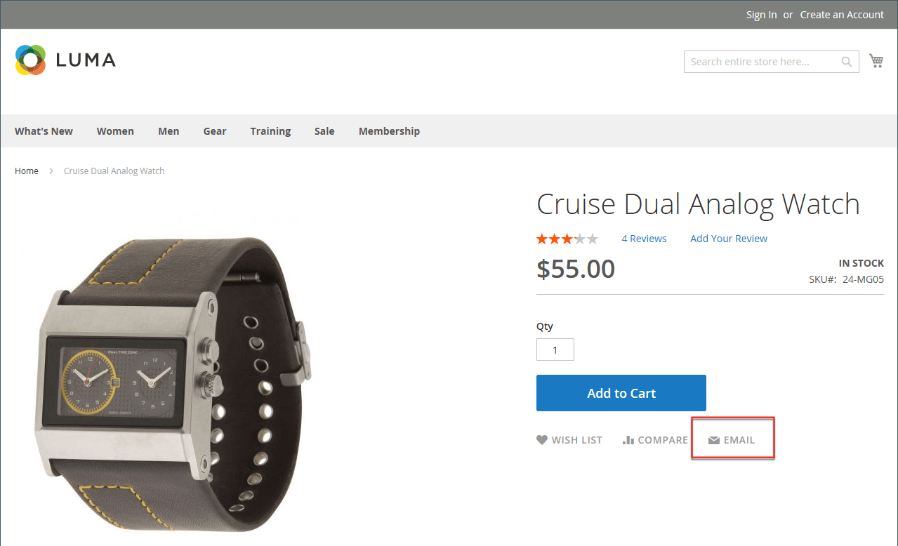

# Freund per E-Mail benachrichtigen

Der E-Mail-Link erleichtert es Ihren Kunden, Links zu Produkten für ihre Freunde freizugeben. Im Demo-Luma-Store wird der E-Mail-Link als Umschlagsymbol angezeigt. Die Nachrichtenvorlage kann für Ihre Stimme und Marke angepasst werden. Um Spamming zu verhindern, können Sie die Anzahl der Empfänger für jede E-Mail und die Anzahl der Produkte, die über einen Zeitraum von einer Stunde geteilt werden können, begrenzen.

{width="700" zoomable="yes"}

## Konfigurieren von email-a-friend

1. Navigieren Sie in _Admin_-Seitenleiste zu **[!UICONTROL Stores]** > _[!UICONTROL Settings]_>**[!UICONTROL Configuration]**.

1. Erweitern Sie im linken Bereich **[!UICONTROL Catalog]** und wählen Sie **[!UICONTROL Email to a Friend]**.

1. Erweitern Sie  den Abschnitt **[!UICONTROL Email Templates]** und legen Sie die Optionen fest:

   {width="600" zoomable="yes"}

   Eine ausführliche Beschreibung jeder dieser Konfigurationseinstellungen finden Sie unter [E-Mail-](../configuration-reference/catalog/email-to-a-friend.md)) im _Konfigurationsreferenzhandbuch_.

   Um die Standardeinstellung eines Felds zu ändern, deaktivieren Sie das Kontrollkästchen **[!UICONTROL Use system value]** , damit das Feld bearbeitet werden kann.

   - Legen Sie **[!UICONTROL Enabled]** auf `Yes` fest.

   - Legen Sie **[!UICONTROL Select Email Template]** auf die Vorlage fest, die Sie als Grundlage für die Nachrichten verwenden möchten.

   - Wenn Sie verlangen möchten, dass nur registrierte Kunden E-Mails an Freunde senden können, setzen Sie **[!UICONTROL Allow for Guests]** auf `No`.

   - Geben Sie **[!UICONTROL Max Recipients]** die maximale Anzahl an Freunden ein, die sich für eine einzelne Nachricht auf der Verteilerliste befinden dürfen.

   - Geben Sie **[!UICONTROL Max Products Sent in 1 Hour]** die maximale Anzahl von Produkten ein, die von einem einzelnen Benutzer mit Freunden über einen Zeitraum von einer Stunde geteilt werden können.

   - Legen Sie **[!UICONTROL Limit Sending By]** auf eine der folgenden Methoden fest, um den Absender von E-Mails zu identifizieren:

     `IP Address` - (Empfohlen) Identifiziert den Absender anhand der IP-Adresse des Computers, der zum Senden der E-Mails verwendet wird.

     `Cookie (unsafe)` - Identifiziert den Absender anhand des Browser-Cookies. Diese Methode ist weniger effektiv, da der Absender das Cookie löschen kann, um das Limit zu umgehen.

1. Klicken Sie abschließend auf **[!UICONTROL Save Config]**.

## E-Mail an einen Freund in der Storefront senden

Wenn diese Funktion konfiguriert ist, führen Store-Kunden diese Schritte aus, um Produktinformationen für Freunde freizugeben.

1. Auf einer Katalogseite klickt der Kunde auf den Link **[!UICONTROL Email]** .

1. Wenn die Funktion nur für registrierte Benutzer konfiguriert ist, führt eine der folgenden Aktionen aus:

   - Melden Sie sich bei Ihrem Kundenkonto an.
   - Meldet sich für ein neues Konto an.

1. Schließt die **[!UICONTROL Message]** ab und gibt die **[!UICONTROL Name]** und **[!UICONTROL Email Address]** der Empfänger ein.

   Bei Bedarf kann der Kunde weitere Empfänger hinzufügen:

   - Klicks **[!UICONTROL Add Invitee]**.

   - Gibt den **[!UICONTROL Name]** und die **[!UICONTROL Email Address]** der zusätzlichen Person an.

     Sie können die Nachricht an so viele zusätzliche Personen senden, wie die Konfiguration zulässt. Sie können die hinzugefügten Einladungen entfernen, indem sie auf den Link **[!DNL Remove]** klicken.

1. Wenn Sie bereit sind, die Nachricht zu senden, klicken Sie auf **[!UICONTROL Send Email]**.

   {width="700" zoomable="yes"}
